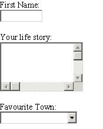
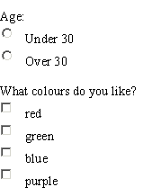
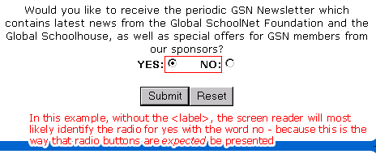
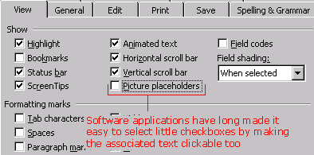
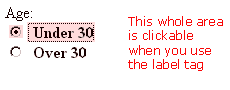
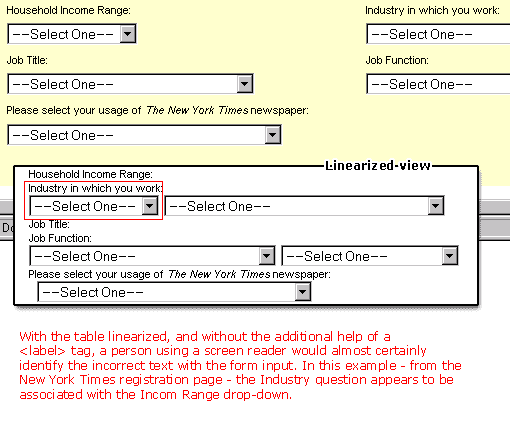
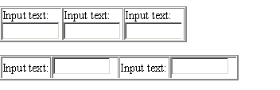
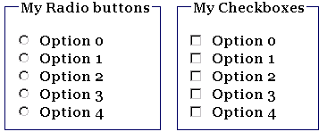

# 构建可访问的在线表单

> 原文：<https://www.sitepoint.com/accessible-online-forms/>

问问那些不得不修复一个充斥着易访问性问题的网站的人，他们遇到的最大问题是表格，其次是表格。这两个主题似乎总是最困难的，但它们不必成为问题。在很大程度上，表单是一个问题，因为额外的可访问性标签对于 Web 设计者来说是不知道的——毕竟，它看起来是对的，看起来是有效的……问题是什么？只有关掉显示器，使用屏幕阅读器，我们健忘的 Web 开发者才能理解这些问题。

在本指南中，我将非常简要地介绍不同表单元素的布局基础，以及一个使表单更加有用的特殊的可访问性标签。然后我会看一些额外的想法，也许你没有意识到，或者不知道是可能的，这将使你的表格变得更有用——对于你所有的观众，有视力的或者其他的。

##### 表单元素的布局

在不知不觉中，许多 Web 开发人员已经在表单布局方面做了正确的事情——不知何故，他们通过反复接触吸收了最佳实践。然而，人们仍然会在一些表单控件上犯错误。这里有一个如何设置表单元素的快速总结。

对于大多数表单输入，与表单控件相关的文本(或标签)应该在控件之前(直接在上方或左侧)。或者，举一些例子:



但是，对于单选按钮和复选框，表单控件放在第一位，如下所示:



这似乎是常识，但是人们经常犯这样的错误，将单选按钮的控件放在文本之后，或者更糟糕的是，放在句子中间。这对于屏幕阅读器来说是非常混乱的，它们希望单选按钮或复选框控件先出现。下图展示了正确填写表单有多困难。



这些单选按钮的布局意味着屏幕阅读器几乎总是选择“是”,而它们真正的意思是“否”

##### 表单的辅助功能标签

如果您已经根据上一节中提到的指导原则布置了表单元素，那么屏幕阅读器可能能够很好地读出每个表单输入的目的。但在大多数情况下，它会很困难，或者它会迫使用户在每次输入时回溯，以了解他们在哪里——以便主动找到前面的文本。这就是为什么`<label>`标签对于使你的表单具有可访问性如此重要。

对于每个表单输入，确保关联的文本周围有一个 label 标记。这个标签应该明确地指向表单输入。

如果您对所有表单元素都这样做，那么您的表单的可访问性级别将会提高 200%。这种差别，就像屏幕阅读器宣布表单输入一样，最好用转录来描述(使用 Jaws 展示的例子，在页面中使用 tab 键)。

使用`<label>`标签:

“编辑:名字”
“编辑:中间名”
“编辑:姓氏”
“编辑:头衔”
“编辑:性别”

如果没有`<label>`标签，听起来可能会像这样:

“编辑”
“编辑”
“编辑”
“编辑”
“编辑”

Jaws 和其他屏幕阅读器可能仍然能够正确地读出输入字段，这取决于您对元素的布局。

那么，如果您从屏幕阅读器中听到这个消息，您会觉得哪个表单更容易填写呢？

注意:用<label>标记的示例表单元素的完整列表可以在本文末尾找到。</label>

##### 更多有用的标签

与大多数 HTML 标签一样，您可以很容易地使用层叠样式表(CSS)将样式应用于`<label>`标签。对标签文本使用加粗的权重可能就足够了，以使其从表单中的其他文本中脱颖而出。然而，你可以为`<label>`使用另一个技巧，让它对视力正常的用户更有吸引力。

一个`<label>`不仅让屏幕阅读器更容易识别输入是什么，它也给视力正常的用户一个更大的区域来点击他们的鼠标。这在使用复选框和单选按钮时特别有用。你不再需要移动你那烦人的鼠标到屏幕上的一个小点来激活控件——现在所有的文字都可以点击了！如果你想一想，大多数软件应用程序多年来都是这样做的。



软件应用程序通过使整个相关文本可点击，使得选择复选框变得更加容易。



现在，您可以使相关的文本在 HTML 表单中可点击。顺便说一句，有一个被称为菲特定律的定律，它指出:

<q>*“获取目标的时间是到目标的距离和目标大小的函数。”*</q>

…这是提高表单可用性(以及可访问性)的一个很好的例子。

然而，如果你使用一个标签，视力正常的用户不知道相关的输入文本是可点击的，那么他们就不会得到这个优势，对不对？嗯，你可以建议他们可以点击一些东西…

```
label {  

font-weight:bold;  

cursor:hand;  

}
```

现在，当用户悬停在一个标签上时，光标变成一个指针，好像在说“哦，哦，点击我，点击我！”，此时用户发现文本可以将焦点设置到该字段。

请注意，使用 cursor:hand 可能意味着您的 CSS 文件无法正确验证。有得有失——你必须问问自己什么更重要。

##### 布局您的表单

对于表单的整体布局，我的最佳建议是保持整洁——在输入内容周围留出一些喘息空间，不要用说明性文本塞满它。如果您必须提供帮助，请巧妙处理(也许可以链接到一个单独的帮助文件，以减少屏幕上的混乱)。

我总是发现，有一个干净的纯色背景颜色的表单可以很好地与文档背景颜色区分开来。它对我说“这是你需要做些事情的地方。”柔和的色调、灰度或类似的颜色效果会很好。

几乎总是，您会选择一个表格来呈现表单输入，以使一切都正确排列。这没有问题，只要您在线化视图中检查您的表(参见本教程末尾的链接部分)。最糟糕的事情是将每个表单输入的文本放在与输入本身分开的单元格中，就像这样:

屏幕阅读器在这方面会有很大困难，文本浏览器如 Lynx 也是如此。建议很简单——把它们放在一起！如果您使用如上所述的表格布局，您将会遇到这种问题:



这是《纽约时报》的注册页面，线性化后效果很差。不过，下面的两个表不会有纽约时报注册页面所显示的问题。在这些示例中，文本将出现在正确的输入字段旁边。然而，如果你正确地使用了`<label>`标签，你应该对屏幕阅读器没有任何问题:



##### 项目的逻辑分组

我们现在稍微离开可访问性领域，进入一般可用性领域。或者，有些人可能会说，进入常识的世界。

人们讨厌填写长表格。人们讨厌阅读大段文字(尤其是在屏幕上)。但是正如您可以在文本块的适当位置插入分段符一样，表单也应该如此。

*   想想你正在收集的所有数据，然后试着把它们分成更小的块
*   将这些数据块分解到表单上明确定义的区域，或者
*   将这些分成不同的表格(记住要清楚地告知用户他们在这个过程中的位置——“第一步，共三步:你的个人信息”)

仅此一点就能带来巨大的不同。但是您可以使用另一个巧妙的技巧——鲜为人知(或者至少很少使用)的`<fieldset>`和`<legend>`标记。

```
<fieldset> lets you bind a group of form controls together visually. In theory, screen readers should also be able to identify this fact, but for the moment, support for fieldset is very limited.

```

```
<legend> is simply a tag that you use alongside (or rather inside) the <fieldset> tag -- to give the group of form controls a heading.

您最有可能使用带有单选按钮或复选框的`<fieldset>`标签，如下所示，但是同样地，您也可以使用`<fieldset>`来对整个数据集合进行分组。

总结

一个表单可以用无数种不同的方式呈现，但是你需要做一些基本的事情来使它具有可访问性。但是像任何事情一样，你可以应用一些特殊的技巧来使你的表单更加清晰、可用和易访问。你可能有自己的想法，一些锦囊妙计。如果有，为什么不分享一下呢！

延伸阅读:

	1.  [HTML 帮助-标签标签](http://www.htmlhelp.com/reference/html40/forms/label.html)
```

*   [费茨定律一览](http://ei.cs.vt.edu/~cs5724/g1/glance.html)*   [W3C 表格线性化电路](https://www.w3.org/WAI/References/Tablin/)*   [如何创建可访问的表单](http://www.webaim.org/howto/forms/)

## 分享这篇文章