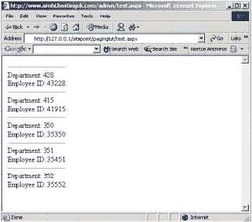
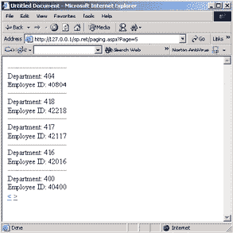

# 用 ASP 分页结果。NET 的页面数据源

> 原文：<https://www.sitepoint.com/asp-nets-pageddatasource/>

**跟 ASP.NET 传呼？你们都知道我在说什么——那些数字，或者谷歌、雅虎！等。在搜索结果的底部。嗯，那是传呼。任何使用过 ASP 的人都会知道它实际上有多讨厌。**

但是对于 ASP.NET，微软已经很好地将分页功能内置到了`DataGrid` Web 控件中！他们真好，是吧？只需将几个简单的属性设置为“true ”,就可以轻松地对任何数据源进行分页…但前提是使用 DataGrid！

但是如果你只需要显示一个链接列表，或者一些图片，会发生什么呢？由于随之而来的大量功能，`DataGrid` 带来了巨大的开销。因此，为了显示信息，轻量级的`Repeater` 或`DataList` Web 控件通常就足够了。

“但是他们缺乏分页支持！”你说。嗯……他们有，他们没有。它们缺乏集成的分页支持，但是使用`PagedDataSource`类，我们可以很容易地将分页能力添加到`DataLists`和`Repeaters`，甚至`RadioButton`、`Checkbox`和`DropDown`列表中！ `PagedDataSource` 封装了`DataGrid`分页工具的所有功能。让我们看看如何！

***先决条件***

对于本文，您应该对 ASP.NET 和 Web 表单有基本的了解。

##### PagedDataSource 类

这个类来自系统。Web.UI.WebControls 命名空间，因此您不必向页面导入任何其他命名空间。

如果您使用过`DataGrid`的分页功能，那么您可能已经熟悉了所有的`PagedDataSource`属性，并且可能跳过这一节。如果没有，下面是我们将介绍的属性:

*   ***PageSize—***该属性取一个整数(默认设置为 10)，定义一页显示多少条记录。
*   ***允许分页—***该属性决定分页是打开还是关闭(布尔值“真”或“假”)。默认情况下，它被设置为“假”。
*   ***current pageindex—***返回/设置当前页码。默认情况下，它返回 0。
*   ***page count—***返回可用页面的总数。
*   ***data source—***该属性的值将是您要分页的数据的来源。
*   ***IsFirstPage-***返回“真”或“假”，具体取决于当前页面是否是系列中的第一页。
*   ***IsLastPage—***同上，但为最后一页。

使用的数据源必须支持索引访问，这意味着我们不能使用`DataAdapter` (SQL 或 OLDB)。我们可以使用的数据源包括`HashTables`和`DataSets`，这两个数据源我们都将看到。

##### 创建实例

您可以创建一个`PagedDataSource`类的实例，就像创建任何其他类的实例一样:

```
Dim pagedData As New PagedDataSource() 

pagedData.DataSource = mockData 

pagedData.AllowPaging = True 

pagedData.PageSize = 5
```

在第一行，我们创建了一个新的 `PageDataSource`对象实例，而在下一行，我们设置了`DataSource`。如果我们将`AllowPaging`设为默认值，结果就不会分页，所以在第三行我们将这个属性设为“`true`”。在最后一行，我们将`PageSize`设为 5。

***数据源***

在上面的例子中，我们将实例的`DataSource` 设置为`mockData`。现在，让我们创建数据源。

对于这个简单的第一个例子，我们将创建一个简单的`HashTable`:

```
Dim mockData As New HashTable() 

Dim IDx As Integer = 0 

Do Until IDx = 500 

   mockData.Add(IDx.toString(), (IDx * 101).toString) 

IDx += 1 

Loop
```

在第一行，我们创建了一个新的`HashTable`实例，并声明了一个整型变量。该变量将用于控制`Do Until... Loop` 语句的计数，并为表创建数据。第 3-6 行显示了在`HashTable`中创建数据的`Do Until... Loop`。

***完整子程序***

好吧，让我们把所有的 ASP.NET 代码放在一起。我们将在它自己的子程序中使用它，而不是在`Page_Load`中。为什么？当然是为了模块化:如果它在自己的子例程中，我们会发现把它转移到另一个页面、放在代码隐藏中或者把它变成一个 Web 控件会更容易。

让我们来看看:

```
Sub doPaging() 

   Dim mockData As New Hash   Dim IDx As Integer = 0 

   Do Until IDx = 500 

      mockData.Add(IDx.toString(), (IDx * 101).toString) 

      IDx += 1 

   Loop 

   Dim pagedData As New PagedDataSource() 

   pagedData.DataSource = mockData 

   pagedData.AllowPaging = True 

   pagedData.PageSize = 5 

   theDataList.DataSource = pagedData 

   theDataList.DataBind() 

End Sub
```

现在我们已经完成了基本的子程序。我们将在此基础上继续努力，但这是我们需要的基本要素。

##### 数据列表

所以我们已经创建了我们的`PagedDataSource`实例和我们的数据源。现在，让我们制作一个`DataList`来显示它！

```
<asp:DataList id="theDataList" runat="server">  

  <ItemTemplate>  

    <hr size="0" />  

    Department: <%# DataBinder.Eval(Container.DataItem,   

    "Key") %><br />  

    Employee ID: <%# DataBinder.Eval(Container.DataItem,   

    "Value") %></a><br />  

  </ItemTemplate>  

</asp:DataList>
```

就是这样！如您所见，我们已经创建了一个简单的`DataList`。

##### 把它放在一起

现在，让我们将代码和`DataList`放在一起创建实际的页面:

```
<%@ Page Language="VB" %>  

<script language="VB" runat="server">  

Sub Page_Load(byVal obj As Object, byVal e As EventArgs)  

   doPaging()  

End Sub  

Sub doPaging()  

      Dim mockData As New HashTable()  

   Dim IDx As Integer = 0  

   Do Until IDx = 500  

      mockData.Add(IDx.toString(), (IDx * 101).toString)  

      IDx += 1  

   Loop  

   Dim pagedData As New PagedDataSource()  

   pagedData.DataSource = mockData  

   pagedData.AllowPaging = True  

   pagedData.PageSize = 5  

   theDataList.DataSource = pagedData  

   theDataList.DataBind()  

End Sub  

</script>  

<!DOCTYPE HTML PUBLIC "-//W3C//DTD HTML 4.01 Transitional//EN">  

<html>  

   <head>  

      <title>Paging Example 1</title>  

   </head>  

   <body>  

      <asp:DataList id="theDataList" runat="server">  

         <ItemTemplate>  

            <hr size="0" />  

            Department: <%# DataBinder.Eval(Container.DataItem,   

            "Key") %><br />  

            Employee ID: <%# DataBinder.Eval(Container.DataItem,  

            "Value") %></a><br />  

         </ItemTemplate>  

      </asp:DataList>  

   </body>  

</html>
```

看看会发生什么？当页面被加载时，运行`Page_Load`子例程，然后检查页面是否被回发。如果没有，则运行`doPaging()`子程序。

我们的页面看起来像什么？跑一跑看看！以下是您可以预期的结果:



##### 实际的分页

如您所见，我们向浏览器发送了 5 个项目。太棒了……但是我们如何寻呼呢？好吧，我们来看看。

首先，我们将创建“下一个”和“上一个”按钮。因此，在`DataList`的下方或上方，添加以下内容:

```
<asp:LinkButton id="btnPrev" Text="&lt;" OnClick="Prev_Click"   

 runat="server" />   

<asp:LinkButton id="btnNext" Text="&gt;" OnClick="Next_Click"   

 runat="server" />
```

这将在你放置代码的地方创建`<` 和 `>`。如果您保存并刷新页面，将显示一条错误消息，指出“`Prev_Click`”不是“`ASP.pageName_aspx`”的成员。没关系，我们会尽快修复此错误。

##### 获取寻呼

到目前为止，我们向页面和下一页/上一页按钮返回了 5 条记录，所以看起来像是分页，但实际上我们仍然不能分页。好吧，我不耐烦的朋友，我们很快就会了！首先，让我们创建分页按钮调用的两个子例程，`Prev_Click`和`Next_Click`。就在我们的`doPaging()` 子例程下面，添加以下代码:

```
Public Sub Prev_Click(ByVal obj As Object, ByVal e As EventArgs)   

   Response.Redirect(Request.CurrentExecutionFilePath    

   & "?Page=" & (pagedData.CurrentPageIndex - 1))   

End Sub   

Public Sub Next_Click(ByVal obj As Object, ByVal e As EventArgs)   

   Response.Redirect(Request.CurrentExecutionFilePath    

   & "?Page=" & (pagedData.CurrentPageIndex + 1))   

End Sub
```

如果添加并保存这段代码，页面实际上会返回一个错误，说:“`Name 'pagedData' is not declared`”。之所以返回这个错误，是因为这个对象只在`doPaging()` 子例程中声明，而我们试图在两个新函数中访问它的一个属性。要修复这个错误，我们要做的是让`PagedDataSource` 对象在页面代码中可用。为了实现这一点，我们只需从 `doPaging()`中删除这一行，并将其放在所有子例程之上:

```
Dim pagedData As New PagedDataSource()
```

完成后，我们的代码看起来像这样:

```
Dim pagedData As New PagedDataSource()   

Sub Page_Load(byVal obj As Object, byVal e As EventArgs)   

   doPaging()   

End Sub   

Sub doPaging()   

   Dim mockData As New HashTable()   

   Dim IDx As Integer = 0   

   Do Until IDx = 500   

      mockData.Add(IDx.toString(), (IDx * 101).toString)   

      IDx += 1   

   Loop   

   pagedData.DataSource = mockData   

   pagedData.AllowPaging = True   

   pagedData.PageSize = 5   

   theDataList.DataSource = pagedData   

   theDataList.DataBind()   

End Sub   

Public Sub Prev_Click(ByVal obj As Object, ByVal e As EventArgs)   

   Response.Redirect(Request.CurrentExecutionFilePath   

   & "?Page=" & (pagedData.CurrentPageIndex - 1))   

End Sub   

Public Sub Next_Click(ByVal obj As Object, ByVal e As EventArgs)   

   Response.Redirect(Request.CurrentExecutionFilePath   

   & "?Page=" & (pagedData.CurrentPageIndex + 1))   

End Sub
```

这两个新函数访问`PagedDataSource`对象的`CurrentPageIndex` ，返回当前页面的索引。`Next_Click`函数给它加 1，然后重定向你的浏览器，把这个值作为一个`Querystring`附加到 URL 上。`Prev_Click`做同样的事情，但是减去 1。

但是…似乎什么都没发生，对吗？好吧，让我们补救一下。下面你会发现`doPaging()` 子程序的修订版。新行以粗体显示:

```
Sub doPaging()   

   Dim mockData As New HashTable()   

   Dim IDx As Integer = 0   

   Do Until IDx = 500   

      mockData.Add(IDx.toString(), (IDx * 101).toString)   

      IDx += 1   

   Loop   

   pagedData.DataSource = mockData   

   pagedData.AllowPaging = True   

   pagedData.PageSize = 5   

   **Try**   

 **pagedData.CurrentPageIndex =**   

**Int32.Parse(Request.QueryString("Page")).ToString()**   

 **Catch ex As Exception**   

 **pagedData.CurrentPageIndex = 0**   

 **End Try**   

 **btnPrev.Visible = ( NOT pagedData.IsFirstPage )**   

 **btnNext.Visible = ( NOT pagedData.IsLastPage )**   

   theDataList.DataSource = pagedData   

   theDataList.DataBind()   

End Sub
```

尝试一下，看看它的页面！

我们使用`Try... Catch`语句解析出`QueryString`提供的页码，并改变`PagedDataSource`对象的 `CurrentPageIndex`。如果它不是一个数字，`Catch` 块将运行并把它设置为 0——使这成为第一页！

下面两行只是让下一个/上一个按钮在适当的时候消失！

```
btnPrev.Visible = ( NOT pagedData.IsFirstPage )   

btnNext.Visible = ( NOT pagedData.IsLastPage )
```

这段代码通过访问`PagedDataSource`对象的`IsFirstPage` 和`IsLastPage`属性来工作，返回一个布尔值。

再简单不过了！下面您可以找到代码生成内容的截图:



##### 真实世界的例子

我们讨论的例子在实际意义上不太擅长显示`PagedDataSource`,所以现在我们将从数据库中提取一些数据来使用它。对于这个例子，我们将使用 Microsoft Northwind SQL Server 数据库。

首先，我们必须从数据库中获取数据。我们将使用 customers 表，因为它有最多的记录。

首先，我们需要导入所需的名称空间:

```
<%@ Page Language="VB" %>    

<%@ Import Namespace="System.Data" %>    

<%@ Import Namespace="System.Data.SQLClient" %>
```

这允许我们访问所有相关的类和对象来访问和处理数据。

说到数据，让我们看看如何检索我们的数据。为了更容易模块化，我们将使用不同的子例程来检索我们的代码:

```
Function getTheData() As DataTable    

   Dim DS As New DataSet()    

   Dim strConnect As New SQLConnection("server=localhost;    

   uid=sa;pwd=;Database=Northwind")    

   Dim objSQLAdapter As New SQLDataAdapter("SELECT     

   companyName, contactName, contactTitle FROM customers", strConnect)    

   objSQLAdapter.Fill(DS, "customers")    

   Return DS.Tables("customers").Copy    

End Function
```

我们启动这个函数，声明我们将返回一个`DataTable`。

```
Function getTheData() As DataTable 
```

在函数的第一行，我们创建了一个新的`DataSet`，它将存储我们将要使用的数据。

```
Dim DS As New DataSet()
```

接下来，我们定义到 Northwind 数据库的连接，并创建实际的`SQLDataAdapter`来返回数据。

```
 Dim strConnect As New SQLConnection("server=localhost;    

   uid=sa;pwd=;Database=Northwind")    

   Dim objSQLAdapter As New SQLDataAdapter("SELECT companyName,     

   contactName, contactTitle FROM customers", strConnect)
```

在函数的下一行，我们用 customers 表中的数据填充数据集，然后在最后一行，我们返回 DataTable 的副本。

```
objSQLAdapter.Fill(DS, "customers")    

Return DS.Tables("customers").Copy
```

这意味着我们已经将数据检索从实际的分页功能中分离出来。因此，如果我们必须更改数据，我们可以在这个函数中完成，而不会影响分页代码！

寻呼码将或多或少与以前相同；我们要做的唯一改变是删除哈希表的代码，并访问我们刚刚讨论过的函数。因此，新代码将如下所示:

```
Sub doPaging()    

 **pagedData.DataSource = getTheData().DefaultView**    

   pagedData.AllowPaging = True    

   pagedData.PageSize = 5    

   Try    

      pagedData.CurrentPageIndex = Int32.Parse    

      (Request.QueryString("Page")).ToString()    

   Catch ex As Exception    

      pagedData.CurrentPageIndex = 0    

   End Try    

   btnPrev.Visible = ( NOT pagedData.IsFirstPage )    

   btnNext.Visible = ( NOT pagedData.IsLastPage )    

   theDataList.DataSource = pagedData    

   theDataList.DataBind()    

End Sub
```

我们编辑的代码行是用粗体显示的，正如您所看到的，我们添加了一个对数据函数的调用。由于该函数返回一个数据表，我们不需要担心其他任何事情。

快到了！我们今天的最后一个任务是创建 Web 表单来显示页面:

```
<form runat="server">     

   <font size="-1" face="Verdana, Arial, Helvetica, sans-     

serif"><asp:label id="pageNumber" runat="server" /></font>     

   <asp:DataList id="theDataList" runat="server">     

      <ItemTemplate>     

         <table border="0" cellpadding="0" cellspacing="0"      

width="500">     

            <tr>     

               <td width="140"><font size="-1" face="Verdana, Arial,      

Helvetica, sans-serif"><strong>Company Name</strong>:</font></td>     

               <td><font size="-1" face="Verdana, Arial, Helvetica,      

sans-serif"><%# DataBinder.Eval(Container.DataItem, "companyName")      

%></font></td>     

            </tr>     

            <tr>     

               <td width="110"><font size="-1" face="Verdana, Arial,     

Helvetica, sans-serif"><strong>Contact Name</strong>:</font></td>     

               <td><font size="-1" face="Verdana, Arial, Helvetica,      

sans-serif"><%# DataBinder.Eval(Container.DataItem, "contactName")      

%></td>     

            </tr>     

            <tr>     

               <td width="110"><font size="-1" face="Verdana, Arial,      

Helvetica, sans-serif"><strong>Contact Title</strong>:</font></td>     

               <td><font size="-1" face="Verdana, Arial, Helvetica,     

sans-serif"><%# DataBinder.Eval(Container.DataItem, "contactTitle")      

%></font></td>     

            </tr>     

         </table>     

      </ItemTemplate>     

      <separatortemplate>     

         <hr color="#0099FF" />     

      </separatortemplate>     

   </asp:DataList>     

   <asp:LinkButton id="btnPrev" Text="&lt;" OnClick="Prev_Click"      

runat="server" />     

   <asp:LinkButton id="btnNext" Text="&gt;" OnClick="Next_Click"      

runat="server" />     

</form>
```

就是这样！我们保持`Page_Load` 子例程和声明`PagedDataSource` 对象的行与之前相同:

```
Dim pagedData As New PagedDataSource     

Sub Page_Load(byVal obj As Object, byVal e As EventArgs)     

   doPaging()     

End Sub
```

向`DataList`添加分页功能就是这么简单。如果你希望上面是一个`Repeater`列表，你所要做的就是用`Repeater`替换 `DataList` 标签。

##### 类似家庭作业的东西

正如我之前所说的，`PagedDataSource`也适用于`RadioButton`、`CheckBox`和`DropDown`列表。尝试一下——我不能 100%确定它会提供什么样的实际功能，但是知道它是很方便的。

你可以用这个物体做很多事情:

*   有页码以及上一页/下一页按钮，
*   有上一个/下一个 10 按钮或
*   跳到结束按钮。

使用`PagedDataSource` 对象可以轻松完成所有这些任务。

您还可以[下载本文中使用的所有代码，放在一个方便的 zip 文件中](http://www.webmasterbase.com/examples/aspnetpds/PagedDataSourceCode.zip)。这些例子是用三种语言编写的:VB.NET、C#和 Jscript.NET。所以每个人都有适合自己的东西！

##### 签署

的。NET Framework 中充满了这样的类，它们旨在使您的生活变得更简单——只需要找到并使用它们。为此，我使用了[。NET 框架 SDK 文档](http://msdn.microsoft.com/library/default.asp?url=/library/en-us/netstart/html/sdkstart.asp)。当你有空闲的时候，浏览一下，看看你还能找到什么有用的课程！

## 分享这篇文章