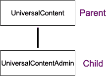
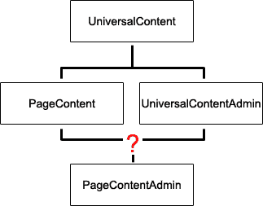
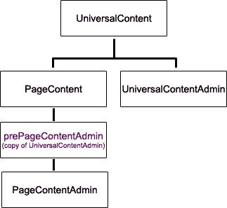

# 在 PHP 中伪造双重继承类

> 原文：<https://www.sitepoint.com/dual-inheritance-classes-php/>

PHP 中的面向对象编码可以在你的项目中节省大量时间，但是目前，PHP 只允许类有一个父类。不幸的是，许多 Internet 类使用双重继承的时机已经成熟——特别是如果您想让一个类服务于您的访问者，而一个子类服务于您的管理员。伪造双重继承并不容易，也没有真正双重继承的所有优点，但我已经完成了大部分工作，所以请满怀信心地继续阅读，这将是一个真正的时间节省者！

我把这个教程分成了几个部分，所以你可以直接进入你想要的部分。这里提到的所有文件都可以在下面找到。如果你“只”用 PHP 编写脚本，对类没有很好的理解，或者看不到这篇文章的要点，请继续阅读。那些已经使用类，但是不知道为什么他们想要一个双重继承类的人，可能应该直接跳到“但是为什么双重继承？”另一方面，如果你已经发现自己希望在 PHP 中有双继承类，那么直接进入“如何伪造它”

##### 文件

下面的档案包含 universalcontent.php，universalcontentadmin.php，pagecontent.php，pagecontentadminpre.php，pagecontentadmin.php，universalupdater.php，他们的文档文件，和一些“演示”文件，以帮助用户找出细节。您将需要所有这些文件来完成教程。

[下载代码存档](http://www.webmasterbase.com/examples/dualinherit/PHPFiles.zip)开始！

##### 为什么 OO？

面向对象编程是一种减少项目时间，让你的工作更有条理的好方法。如果您需要在项目之间重复任何任务，如果您曾经从旧项目中提取代码用于新项目，或者如果您曾经需要编写不仅仅是“一点”代码，那么您真的应该考虑使用面向对象编程来简化您的工作。

类是 PHP 中面向对象编程的主要组成部分(不仅仅是其他语言)。虽然对于您的脚本来说，它们可能看起来有些多余——即使作为一个具有 C++背景的人，我在开始使用 PHP 时由于不使用类而浪费了大量时间——但从长远来看，类将会为您节省大量时间。

那么，什么是真正的类呢？类是变量和与变量交互的函数的集合。它们很容易定义:

```
class myclass  

{ 

  var myclassvariable; 

  var . . . etc. 

  function myfunction (); 

  function . . . etc. 

}
```

现在你有了一个类，你不需要跟踪它的内部工作。每次需要使用时，只需创建一个新实例:

```
myobject = myclass (some_arguments); 

myobject->myfunction (); 
```

关于类的一个伟大的事情是这些代码的小“包”很容易在一个项目内和项目间循环使用。一点远见加上 PHP 极其灵活的变量可以节省您大量的时间。在我自己的编程中，我使用了一个名为 universalcontent 的类。它处理我在项目中可能需要的对任何 MySQL 表的所有基本调用。虽然这个类很简单，但它为我的许多更复杂的类构成了一个构件。

##### 儿童时间

虽然类本身有助于保持你的代码整洁，并帮助你回收一些代码，但子类才是真正的面向对象编程。考虑前面的 universalcontent 类——它本身我可以回收一些代码，但是如果这就是我所完成的全部工作，那么拥有一个只能对网站数据库进行简单查询的类对我自己并没有多大帮助。

子类扩展了父类，这样您就可以创建一个新的、更具体的类。这样，你创建“公分母”父类，然后要么添加新的函数和变量，要么重载，也就是:创建新版本的，旧函数。子类自动拥有父类的所有函数和变量。这就是所谓的单一继承。

我的 universalcontent 类现在有了它的子类*universal content admin*——一个强大的类组合。现在，我不仅可以轻松地为我的访问者访问任何基本的数据库表，还可以几乎不用编码就为该表创建一个管理界面。



这种父子关系允许我重用代码，同时使调试和未来的更改变得容易得多。为什么未来的改变更容易？假设我通过 *universalcontent* 函数管理我所有的数据库连接，并且 *universalcontentadmin* 在访问数据库时专门使用这些函数。如果以后我从 MySQL 转换到其他 SQL 数据库，我只需要修改*的通用内容*。之后，它和它的所有子节点将自动升级以支持新的数据库。

##### 但是为什么要双重继承呢？

那么，为什么会有人想要双重继承呢？最简单的答案是:因为你已经发现了一种情况，你希望两个职业的能力形成一个新职业的基础。在前面几节中，我谈到了我的父 universalcontent 和它的子 universalcontentadmin，它们构成了我与访问者和管理员进行数据库交互的基础。我还有一个类 pagecontent，我用它来访问存储在数据库中的页面内容，并驱动动态菜单。当然还有另外一个类，叫做 pagecontentadmin。它应该在家谱中的什么位置？



理想情况下，它应该是 *pagecontent* 和 *universalcontentadmin* 的子节点，因为它肯定需要访问预先存在的管理代码，并且在较小的程度上，它需要访问一些 pagecontent 函数和常量。

那么，我们有什么选择呢？可惜不多。我们可以将 *universalcontentadmin* 或 *pagecontent* 函数复制并粘贴到我们的新子类中，但是当我们决定使用面向对象编程时，我们试图避免这种情况。另一个选择是简单地改变我们的类的结构——使 *universalcontent* 和 *universalcontentadmin* 成为一个类。这并不是一个特别有吸引力的选择，因为将 *universalcontentadmin* 添加到 *universalcontent* 会使父类的大小增加四倍以上(从而降低服务器的速度),并且不会给网站访问者带来任何好处。单继承在这里真的不太理想。

##### 如何制作

那么，我该如何创建一个 *pagecontentadmin* 类，它实际上有两个父类( *pagecontent* 和 *universalcontentadmin* )？不幸的是，PHP 不允许多重继承，也不允许有策略地将“include”语句放在类括号内——您可以将它们用作函数的一部分，但不能用作类的一部分。其中任何一个都会给我们一个有双亲的解，或者一个非常接近的解。

相反，我被迫创建一个“预类”来将所有函数从 *universalcontentadmin* 放入新类 *pagecontentadmin* 。



这将是一个非常暗淡的地方来结束我们的故事，因为我们几乎没有享受到面向对象编程的任何优势。如果以后我改进了 *universalcontentadmin* ，我将不得不手动修改 *prepagecontentadmin* 类——这个过程不仅会很乏味，而且可能会引入错误，因为我会随意复制并粘贴我能找到的每一个预代码。

不过，令人高兴的是，事情并没有就此结束。通过创建一个新的类 universalupdater，我们可以消除这种方法的大部分缺点。这个类将搜索一个目录及其所有子目录，寻找任何带有适当注释标签的 PHP 文件。然后，它将获取源类(在我的例子中是 *universalcontentadmin* )，修改它，并将该类插入目标文件。 *Universalupdater* 设计为每个文件使用一个源类，每个文件使用一个“目标类”。虽然您可以在同一个文件中包含其他类，但这不会有任何问题，我已经将脚本设计为每个文件只包含一个“活动”类。

使用 universalupdater 的步骤非常简单:

1.  创建父函数并组织您的文件

3.  准备源文件

5.  准备中间文件

7.  创建一个 universalupdater 的实例，调用函数“Execute”。每当更新源类时，都应该重复这一步

9.  使用新创建的中间类作为“双重继承”子类的父类

***一般准备***

不言而喻，在拥有一个双重继承类之前，您需要准备好两个父类。可能需要提到的是，为了使双重继承类有效，您需要确保这些类是兼容的。在我的例子中， *pagecontent* 和 *universalcontent* 是兄弟类(即共享同一个父类 *universalcontent* )。这两个函数不仅没有任何冲突(或者同名函数可能会意外重载)，而且它们还共享相同的基本数据结构。

一旦你有了文件(包括你自己的文件和 *universalupdater* )，你将需要确保你以一种允许 *universalupdater* 有效运行的方式来组织它们。在我自己的系统上，我所有的项目，以及在各个项目之间共享的类，都在“c:htdoc”(Apache 提供的目录)的子目录中。这使得 *universalupdater* 的工作变得非常容易:我只需告诉它更新其父目录和子目录中的任何内容。它会自动扫描我所有的项目和我所有的常规类，寻找需要编辑的文件。

***准备源文件***

准备源文件只需要很少的时间(只需插入注释标签来指示 *universalupdater* 应该在哪里开始和结束复制)。 *universalcontentadmin* 类的相关部分如下所示。universalupdater 需要的两个标签是蓝色的——第一个出现在我定义将在 *universalcontentadmin* 中使用的常量之前，第二个出现在我定义完类之后。我添加了两个绿色的描述。希望不言而喻，它们实际上不会出现在类本身中。

```
<?   

//Class UniversalContentAdmin   

include_once ((isset($phplocation)? $phplocation.'universalcontent.   

php' : 'universalcontent.php'));   

//Replacement Code Starts Here   

if (!defined ('UNIVERSALADMIN_CONSTANTS'))   

{   

  define ('UNIVERSALADMIN_CONSTANTS', 'defined');   

  define ('UCA_NO_VALUE', '@#784pdjas');   

  define ('UCA_BLANK_VALUE', '*^@adfds');   

  define ('UCA_EDIT', 'ucedit');   

  define ('UCA_DUPLICATE', 'ucdup');   

  define ('UCA_DELETE', 'ucdelete');   

  define ('UCA_CONFIRM', 'ucconfirm');   

  define ('UCA_UPDATE_ITEM', 'ucupdate');   

  define ('UCA_DISPLAY_NAME_SPLITTER', '||');   

}   

class universalcontentadmin extends universalcontent   

{   

  var $tableformat;   

  var $comments;   

  var $itemcount;   

  var $defaultpadding;   

  function universalcontentadmin ($paramtablename)   

  .   

  .   

  .   

  **<THE REST OF THE CLASS'S FUNCTIONS>**   

  .   

  .   

  .   

  function ProcessMinorSpecialItem ($variablename, $value, &$warning,    

  &$reporttext)   

  {   

    **<LAST FUNCTION IN THE CLASS>**   

  }   

}   

//Replacement Code Ends Here   

?>
```

***准备中间文件***

创建新的中间类的代码几乎一样简单。您可以将这个中间类包含在与最终类相同的文件中，也可以作为一个单独的文件。在这个例子中，我已经将 pre-class 作为一个单独的文件。这样更容易证明。当最后一个类上面没有一堆东西时，编辑它也更容易，更不用说如果它必须编辑 1000+行 PHP 文件，我的编辑器会开始稍微变慢。由于这是为管理员编写的代码，因此不会经常使用，我不介意服务器是否需要获取一个额外的文件。

这是我运行更新程序之前的中间文件的样子。

```
<?   

//PrePageContentAdmin Class   

//This class extends PageContent with the code from UniversalAdmin.     

//It is maintained automatically by universalupdater.   

include_once ((isset($phplocation)? $phplocation.'pagecontent.php' :    

'pagecontent.php'));   

//parent class= pagecontent   

//child class= prepagecontentadmin   

//source class= universalcontentadmin   

//Replacement Code Starts Here   

//Replacement Code Ends Here   

?>
```

如您所见，这只是一个简单的`include_once` 语句(加载其父语句 *pagecontent* )和一些注释。那么所有的评论是什么？最后五个注释是使 *universalupdater* 类工作所需的全部内容。代码从源类(在本例中是 *universalcontentadmin* )中复制并粘贴到两个替换代码标签之间。完成后， *universalupdater* 将对该类进行两处修改。首先，源文件的类定义将被更改为“`class my_child extends my_parent`”(“`my_child`”和“`my_parent`”分别取自“`//child class`”和“`//source class`”标签)。

第二个变化是，如果源文件有一个构造函数，它将被复制和重命名以匹配子类。“`//source class`”标签让 *universalupdater* 知道给定文件应该使用哪个源文件。如果它与 *universalupdater* 正在使用的文件不匹配，那么将不会进行替换。父类、子类和源类中的等号前面或后面可以有空格，因此“`//child class = prepagecontentadmin`”、“`//child class =prepagecontentadmin`”、“`//child class= prepagecontentadmin`”和“【T4”)都同样有效。

***执行通用更新***

虽然我设计了 *universalupdater* 来允许用户定制它所寻找的标签，但是只要你不需要改变标签名称，执行这个脚本就非常简单。以下是您需要的全部内容:

```
<?     

error_reporting(E_ALL);    

include ('universalupdater.php');    

$update = new universalupdate('my_source_file.php',     

'my_target_directory');    

$update->Execute();    

?>
```

你实际上并不需要`error_reporting` ( `E_ALL`)，但是我喜欢显示所有的警告，这样如果真的出了问题，我就知道了。函数`Execute()`给出了一个简单的进度报告，但是错误报告仍然很有用。

当函数`Execute()` 被调用时， *universalupdater* 将把源文件加载到内存中，然后扫描目标目录，寻找任何包含正确标签的 PHP 文件。如果您的源文件与调用 *universalupdater* 的脚本不在同一个目录中，请确保您也在文件路径名中指定了目录。

如果您对多个源文件使用 *universalupdater* ，或者您需要它对多个目录进行排序，只需用附加的源文件或目标目录创建该类的新实例。

一旦运行了 *universalupdater* ，最初只是注释标签的中间类文件现在显示为:

```
include_once ((isset($phplocation)? $phplocation.'pagecontent.php' :     

'pagecontent.php'));    

//parent class= pagecontent    

//child class= prepagecontentadmin    

//source class = universalcontentadmin    

//Replacement Code Starts Here    

if (!defined ('UNIVERSALADMIN_CONSTANTS'))    

{    

  define ('UNIVERSALADMIN_CONSTANTS', 'defined');    

  define ('UCA_NO_VALUE', '@#784pdjas');    

  define ('UCA_BLANK_VALUE', '*^@adfds');    

  define ('UCA_EDIT', 'ucedit');    

  define ('UCA_DUPLICATE', 'ucdup');    

  define ('UCA_DELETE', 'ucdelete');    

  define ('UCA_CONFIRM', 'ucconfirm');    

  define ('UCA_UPDATE_ITEM', 'ucupdate');    

  define ('UCA_DISPLAY_NAME_SPLITTER', '||');    

}    

class prepagecontentadmin extends pagecontent    

{    

  var $tableformat;    

  var $comments;    

  var $itemcount;    

  var $defaultpadding;    

  function prepagecontentadmin ($paramtablename)    

  .    

  .    

  .    

  <ETC>    

  .    

  .    

  .    

}    

//Replacement Code Ends Here    

?>
```

如您所见，类定义已经从“`class universalcontentadmin extends universalcontent`”更改为“`class prepagecontentadmin extends pagecontent`”。同样，构造函数也被重命名了。

***使用新的中间类***

希望这最后一步是最容易的。在示例中，我的最后一个类是 *pagecontentadmin* 。这是新班级的开始:

```
include_once ((isset($phplocation)? $phplocation.'pagecontentadminpre.php'    

 : 'pagecontentadminpre.php'));    

define ('DEFAULTMODELPAGE', 'blank');    

define ('PCA_SIMPLE_STRUCTURE', 's');    

define ('PCA_SUBDIRECTORY_STRUCTURE', 'd');    

class pagecontentadmin extends prepagecontentadmin    

{    

  var $modelpage;    

  var $directorystructure;     

  function pagecontentadmin ($extrafields = array (''),     

  $paramtablename = 'pages', $modelpage = DEFAULTMODELPAGE,     

  $recordstructure = PCA_SIMPLE_STRUCTURE)    

  .    

  .    

  .    

  <ETC>    

  .     

  .    

  .    

}
```

您可能会注意到，虽然类名是 *prepagecontentadmin* ，但我将文件保存为 pagecontentadminpre.php。虽然有点不一致，但我这样做是为了让类名在英语中有意义，而文件名则允许文件按字母顺序显示 pagecontent.php 和 pagecontentadmin.php。

现在， *pagecontentadmin* 拥有了 *pagecontent* 和 *universalcontentadmin* 的所有函数和常量。当使用 *universalupdater* 时，你需要小心类构造函数。记住 *universalupdater* 会自动使用源文件的类构造函数。您可能需要在最终类中指定一个新的构造函数。

##### 停业清理

简单回顾一下，要使用 *universalupdater* ，请完成以下步骤:

1.  获取文件并创建两个父类。在我的例子中，父类是兄弟类。虽然这不是必需的，但是请记住父类需要相互兼容。
2.  通过向源文件添加开始和结束注释标签来准备源文件(默认情况下，它们是“`//Replacement Code Starts Here`”和“`//Replacement Code Ends Here`”)。
3.  通过向中间文件添加五个注释标签来准备中间文件(默认情况下，必需的标签是:“`//parent class = my_parent`”、“`//child class = my_child`”、“`//source class = my_source`”、“`//Replacement Code Starts Here`和“`//Replacement Code Ends Here`”)。
4.  运行创建 *universalupdater* 实例的脚本，并调用函数 Execute ( `my_source_file`，`my_target_directory`)。
5.  使用新创建的中间类作为最终双重继承类的父类。
6.  任何时候您需要更新源类，只需再次运行 universalupdater，更改将自动应用于所有适当的文件。

这是否完美地复制了双重继承？不。虽然自己复制和粘贴要方便得多，但您仍然需要运行脚本来更新所有的中间类。此外，对于服务器来说，它不像真正的双重继承那样高效。抛开这些不利因素，它确实允许你抚养许多双重继承的孩子，而不用担心他们会过时。

## 分享这篇文章