# 设计项目——获得垃圾

> 原文：<https://www.sitepoint.com/design-project-get-grunge/>

在我上一篇关于[垃圾乐](http://www.webmasterbase.com/article/813/71)的技术文章之后，很明显人们需要一个真实世界的例子来说明垃圾乐到底是什么，以及如何创造垃圾乐。

在我深入肮脏之前，我想澄清三件事。首先，在上周之前，我已经 3 个月没有打开 Photoshop 了。第二，我将从 Photoshop 的角度写这篇文章，但是，只要你的图形应用程序允许图层，调整图层和自定义笔刷，你应该没问题。最后，我不是“垃圾大师”。就学习和经验而言，我更像是一个“新手”。尽管如此，希望我在这里写的东西能让其他人比我在这种情绪化的艺术风格上走得更远。

##### 故事

在我进入“如何”之前，决定“为什么”通常是很重要的。你为什么要创作垃圾音乐？我的理由很简单。我在 SitePoint 论坛参加了一场 [Photoshop 网球比赛，想要在第一轮击败我的竞争对手。](http://www.sitepointforums.com/forumdisplay.php?s=&forumid=93)

至于作品背后的情感，我在寻找真正黑暗和沉思的东西。与其说怪异，不如说“激动人心”。我想让它成为我想挂在墙上的一件作品，但又不想给任何人看，因为我可能会收到评论。你可以说我试图设计一种爱恨关系。

##### 基础知识

好了，现在我们需要认真对待细节。我们的第一步——将真正定义作品如何播放的一步——是弄清楚:

1.  这件作品的尺寸

3.  原色/感觉

我会设计一个更长的图片，因为我讨厌方形的，我会选择一些深色的。我真的在努力创造一些黑色情感的东西。一些让你震惊，但同时又让你想看得更深的东西。我们看看我表现如何，好吗？

对于尺寸，我选择了 300 x 1200 像素，黑色填充(72dpi，因为我是为网页设计这个图片的)。首先，我需要找到一张照片。老实说，我只去三个地方拍照:

*   [www .直观的媒体. net](http://www.intuitivmedia.net)
*   [www.deviantart.com](http://www.deviantart.com)(库存照片)
*   [www.google.com](http://www.google.com)

我在找一张一个看起来沮丧的男人的全身照。我试过 intuitivmedia，但他们没有多少，而且 DA 很慢，所以我去谷歌搜索了一下“站着的人”的图片。在搜索结果的第 7 页，我找到了完美的图像:

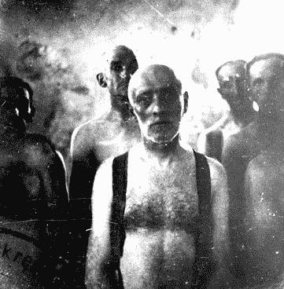

这是一张惊人的照片，因为这是四个人被送进纳粹德国毒气室之前的真实照片。即使在这个早期阶段，我所追求的情感也是显而易见的。

##### 画布

每个艺术家都有一张画布，而我们的画布现在看起来很空很黑。在这第一系列步骤中，我们将简单地导入我们的图像，给它一些边界，然后打开盖子。

我们的第一步是将图像拖到画布上，结果是:

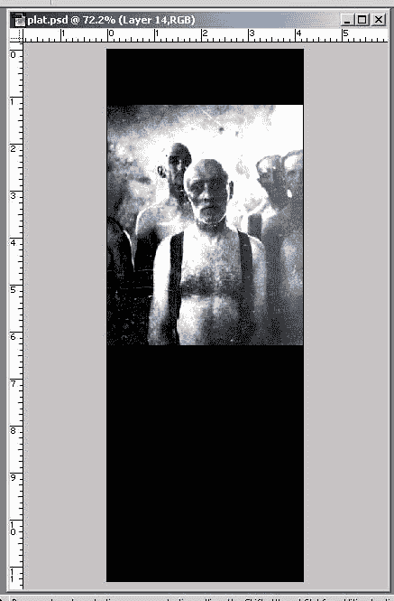

显然，我希望这个人的身体长度基本上填满屏幕，所以我们将图像的大小调整为如下所示:

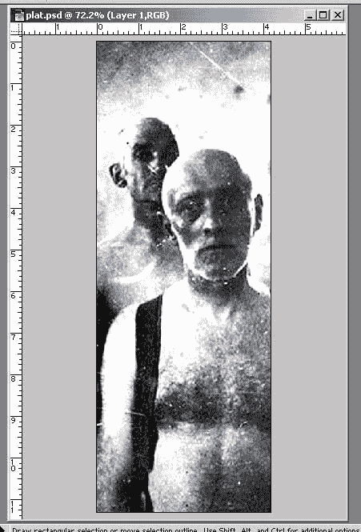

接下来，我们想要移除我们主要角色周围的许多多余的东西，所以我们使用[图层蒙版](http://www.thinkdan.com/tutorials/photoshop/layermasks/index.html )，这样我们就不会丢失任何原始图像(如果我们以后需要它，它仍然可用)。

我已经涂掉了一些无用的东西，这是我们现在有的:

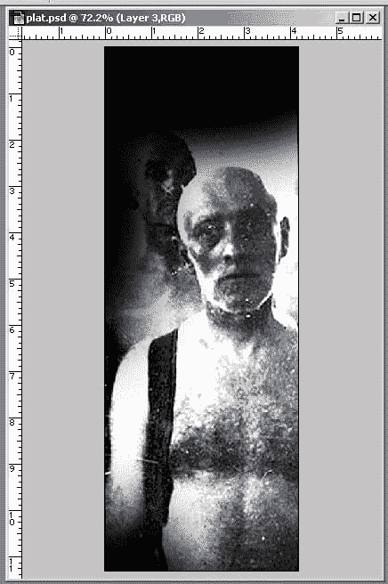

##### 颜色、手感、污垢

我在这一步的主要目标是选择一种颜色，添加一些元素，并开始使图像看起来真的“肮脏”。

在我们开始之前，我有 3 个用于垃圾设计的标准调整层。设置改变了，但是这三个设置的使用给了我很大的控制权。

他们在这里:

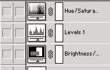

细节如下:

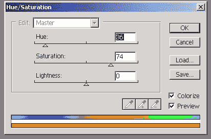

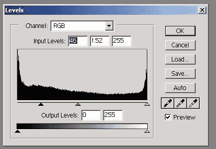

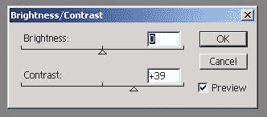

现在，这是我的默认设置的图像:

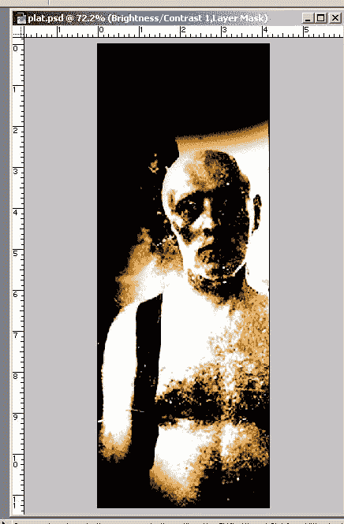

这真的开始像我的目标了！现在是时候来点真正的垃圾纹理了。基本上，为了做到这一点，我通常会从网上下载一个 whol 的笔刷([这里是最好的地方，虽然](http://www.dubtastic.com/resources.shtml))，然后将这些笔刷轻轻涂抹到调色板上，正如我在这里解释的[。](http://www.webmasterbase.com/article/813/71)

在用各种刷子轻轻涂抹之后，我得出了这个效果。显然，对于你的垃圾作品，你会想把你的轻拍集中在你最想强调的地方:

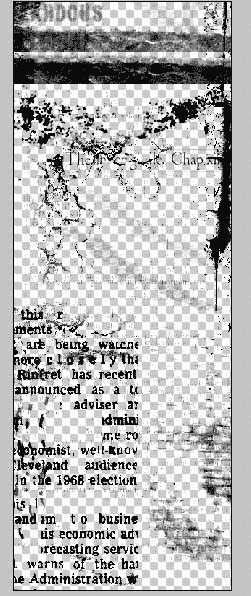

所以我们的图像看起来像这样:

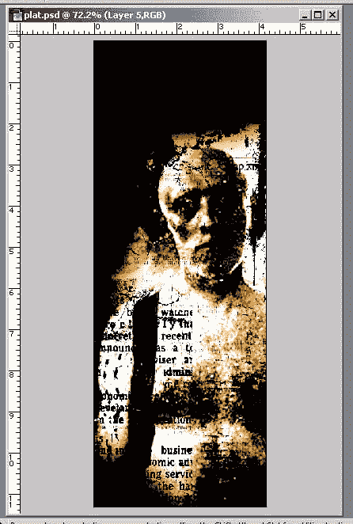

在这一点上，我意识到图像的顶部看起来有点模糊——那里没有发生太多事情。所以我回到我们的原始图像，并采取它的顶部，因为这个空间有很多细节和纹理。这是最上面的部分:

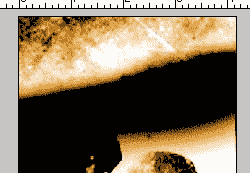

当我打开我的黑色层，并添加更多的 DIB 和 dab，图像开始聚集在一起:

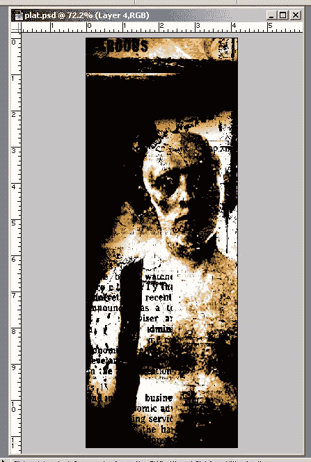

##### 完成图像

好吧，老实说，我不太喜欢图像的右边。我通常不喜欢那些在垃圾衣服的边界上固定的颜色，当我想要一种拉长的感觉时，我最好去掉这种效果。

我们之前下载的一个笔刷(来自[www.dubtastic.com](http://www.dubtastic.com))是一个华丽的“不规则垂直笔画”，看起来像这样:

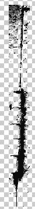

通过将这一笔画旋转一点，并将其放在原笔画旁边，我得到了一个我满意的效果:

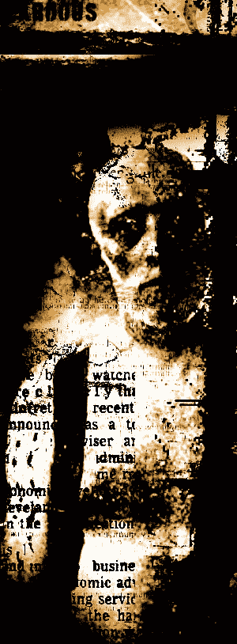

我们将继续在这一点上轻拍，因为它是如此混乱，但接下来我想得到一些烧伤和变暗发生。因为我们的调整层在最上面，所以我们的加深描边是什么颜色，或者它们看起来有多不规则都没有关系。所以，我将只做几个不同的层，基本上看起来像这样(在他们的混合模式变成颜色燃烧之前):

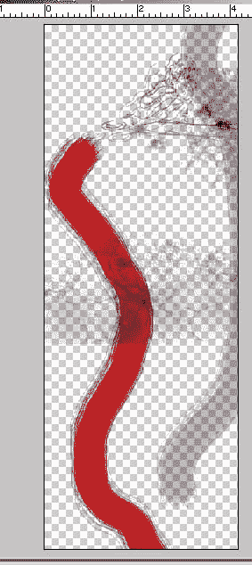

基本上，我有一些是 100%烧伤，其他的是 30-50%烧伤。100%的燃烧实际上会将图像烧成黑色。30-50%的那些将燃烧图像中的任何色调/饱和度的颜色。这是一项伟大的技术，我可能会在这张图片中更多地使用它。

这是打开了加深功能的图像:

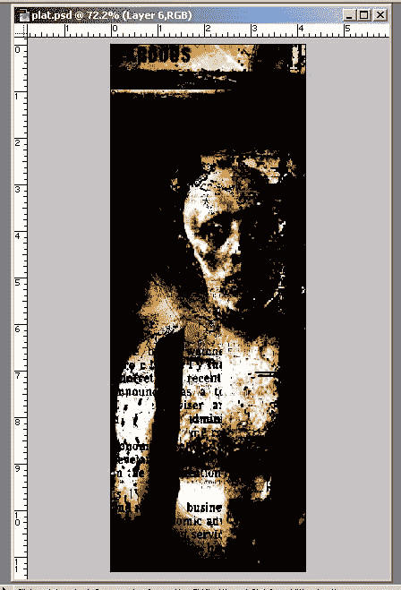

我真的很喜欢这是如何走到一起的:他的眼睛非常令人难忘，这正是我所追求的。

然而，我不喜欢图像的底部，所以我需要把它也烧掉。我发现在垃圾作品中创造随机感觉的一个非常有效的技巧是，拿一张现有的图像，增加对比度/亮度，然后随机选择一种更强烈的颜色来使用。

以下是我使用的图片(这次来自 DeviantArt 的股票部分):

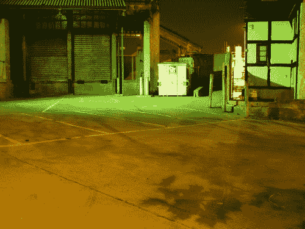

通过将该图像的对比度增加到 100，我们得到一个非常亮的红色区域:

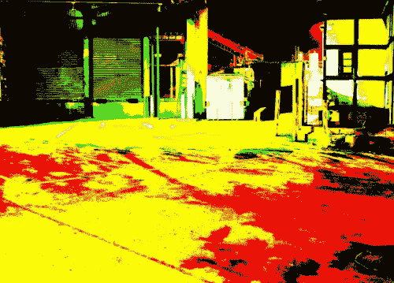

现在，我们简单地选择这个红色区域作为随机过滤模式，选择>颜色范围:

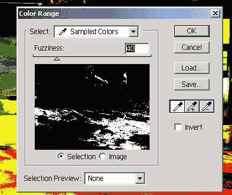

我们现在有一个区域，我们可以用黑色填充，然后烧进我们的主图像，看起来像这样:

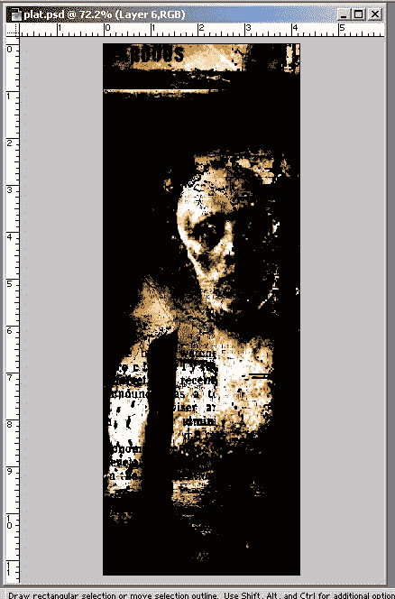

##### 文本，风格，结尾

好了，现在是时候去寻找一些垃圾字体了。我真的很喜欢 [SimSun](http://server2.tacf.org/examples/simsun.ttf ) ，因为它不太厚，但也不是你可能“期望”的那样。衬线字体通常非常适合垃圾作品——衬线越强烈越好(通常艺术家会延长某些关键字母的大写字母，使其更具冲击力，但我没有那么强烈)。

因为我知道这张照片的故事(这也是这张照片如此感人的原因之一)，我想我可以简单地让这张照片成为故事，就像这样:

“四个人走进毒气室……只有一个人回来了”。

我将文本设为白色，放在图片上，看看会发生什么:

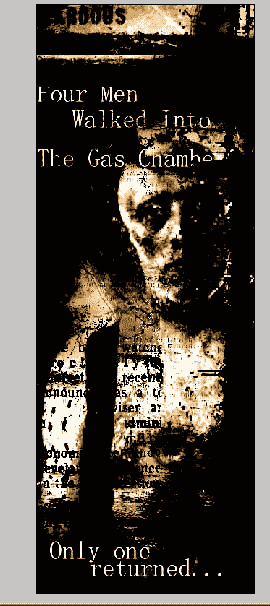

不算太坏。图像仍然需要一些东西，尽管…文本只是坐在那里…

我记得曾见过一个摇滚乐队的图片，在文本行之间有一条随机的线，所以我尝试了一下:

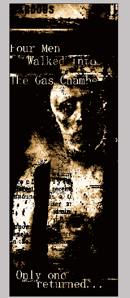

图像就要完成了。不过，我对这篇文章不太满意:它看起来太“新鲜”了。因此，我在文本周围涂抹了更多的黑点，还添加了“行尸走肉”几个字。

这是最终的图像:

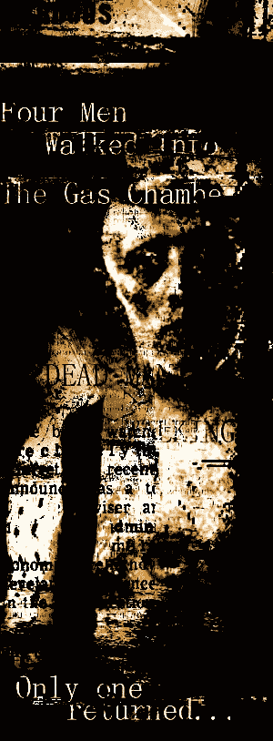

##### 最后的想法

用这张图片工作真的激发了我对设计的新的热爱。我相信一首垃圾音乐应该能激起你的情绪——这不是一件可以轻易进入的事情，它通常是一项相当耗费精力的练习。

垃圾音乐不在于形式上的完美，而在于情感上的完美。通常，情绪是随机的，不可预测的。使用工具来表达自己。我们很想看看你的劳动成果——所以把它们寄给我们吧！

##### 读者垃圾画廊

提交您的作品出现在我们的读者图库中。特别感谢所有贡献者！

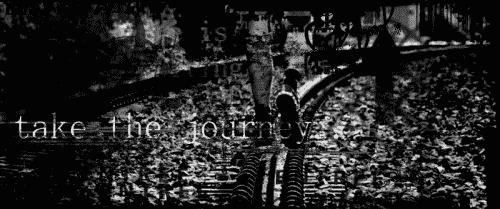
*旅程*作者:宋大卫

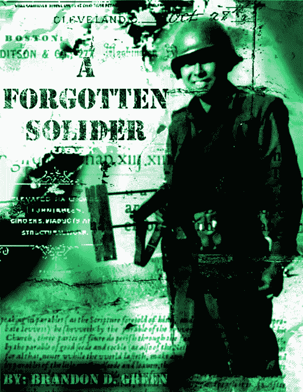
*士兵*作者布兰登·格林

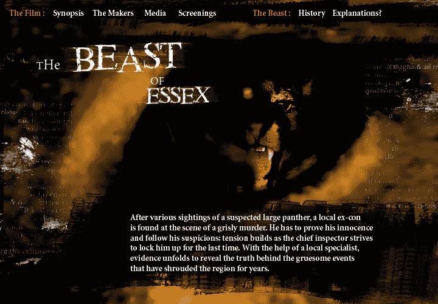
*埃塞克斯的野兽*作者马克·卡特

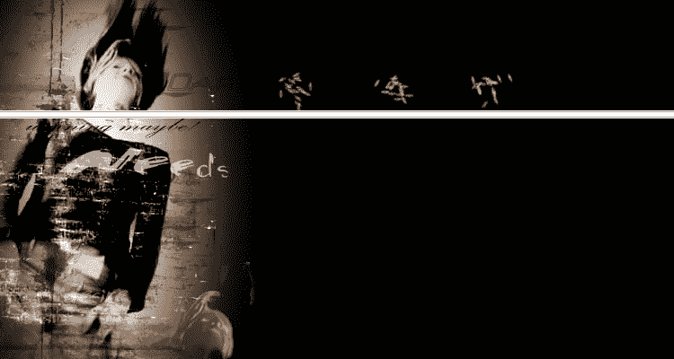
*无标题*迈克尔·奎因著

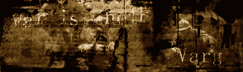
*战争是地狱*斯蒂芬著

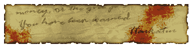
*金钱还是垃圾*哈卡图

## 分享这篇文章