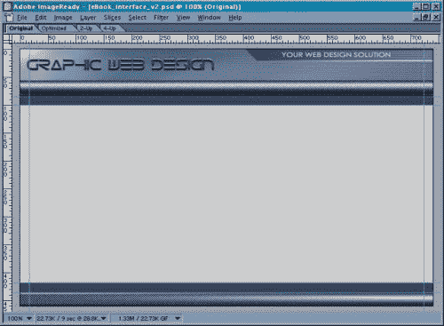

# 用 Photoshop 文章设计一个网站

> 原文：<https://www.sitepoint.com/design-website-photoshop/>

有许多不同的方法来创建网站。虽然有些人可能选择手绘一个概念，然后开始编码 HTML，但其他人可能希望采用更图形化的设计和布局方法。

这种图形化的方法就是我在这里向你们展示的。

所以今天，我将解释当一个新客户雇用我时我所经历的设计过程。作为一个非常视觉化的人，我发现当我设计一个网站时，从图像开始更容易，以下是我遵循的基本步骤:

1.  首先，使用 Photoshop，创建一个图像，模仿你想为你的网站使用的一般布局。
2.  一旦你对图片满意了，你需要把它“切片”用于你的网站模板。在这个过程中，掌握 HTML 的工作知识会有所帮助。你必须知道表格是如何工作的，这样你才能用一种适合表格的方式来分割你的图像。
3.  然后是时候创建由这些片段组成的 HTML 文档了。这将成为你用来创建网站所有页面的模板。

为了更容易地跟随指示，[这里有一个可下载的 Photoshop 图像](http://www.webmasterbase.com/examples/ps-design/eBook_interface.zip)，你可以随意使用、修改或拆除它！

注意:如果你发布这张图片，我所要求的是一个链接到我的网站

我们开始吧！

##### 界面图像创建

***界面设计***

这是整个设计过程中最关键的部分。界面的设计对可用性非常重要。你可能已经听过一千遍了，但是老话是对的:如果你的访问者不能找到你所有的内容，或者他们被你的布局弄糊涂了，他们真的离离开你的网站只有一次点击的距离。

***提前规划***

对于任何新的设计，你必须提前计划。这将使你能够快速轻松地适应任何变化。例如，假设您想在网站上添加另一个部分。你的网站的导航允许这样做吗，还是需要完全的重新设计？如果你属于后一种情况，就要准备好浪费时间和金钱——如果你第一次就很好地设计了你的网站布局，这些资源可以很容易地节省下来。

想象你未来想去哪里是很重要的。网站就像任何其他行业一样:你必须与时俱进。

***布局***

我们将从尺寸为 740×460 像素的图像开始。在这个空间中，我们需要包括标题、导航和内容区域。

下面，你可以看到我在 Photoshop 中创建的布局图像。页面顶部和底部的深蓝色条代表我们的导航位置——例如，如果您有大量内容并且喜欢快速加载页面，这种布局非常有效。

在 Photoshop 中创建图像后，就该准备每个部分了，这样就可以在 HTML 文档中使用它们。让我们把它切开！

##### 切割您的图像

虽然你可以使用任何图形软件来创建你的图像，但我推荐 Photoshop。与这个程序打包在一起的是 ImageReady，你可以用它来为网络保存图像，创建 gif 动画，以及切割 Photoshop 图像。

现在，“切片”意味着我们将获取您的原始页面布局图像，并从中制作更小的单个图像，然后您可以将这些图像插入到 HTML 表格中。

你可以在你的网站上使用大图作为页面，并在你想要链接的区域制作图像地图。这种解决方案的问题是，它将永远需要下载-你的用户不会留下深刻印象！

正如您将在本例中看到的，当您分割一幅大图像时，您可以单独优化每个部分，以使总文件大小更小。同样，在这个例子中，一些切片是重复的，所以您只需要使用其中的一个，这将使文件的总大小变得更小。我为此创建的示例图像只有 26.1k。这对您的意义在于，使用 28.8k 调制解调器的人只需 9 秒钟就可以下载该页面。你开始看到好处了吗？

这是我们在 Photoshop 中准备切片的图像:

如你所见，蓝色线条穿过图像。这些是 Photoshop 允许你简单地拖出标尺区域的指导方针——它们标记了我们将要对图像进行切片的位置。

**Go to page:** [1](https://sitepoint.com/design-website-photoshop) | [2](https://sitepoint.com/design-website-photoshop-2/) | [3](https://sitepoint.com/design-website-photoshop-3/) | [4](https://sitepoint.com/design-website-photoshop-4/)

## 分享这篇文章