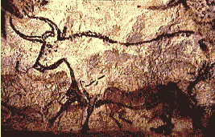

# 辩论——设计没有死！

> 原文：<https://www.sitepoint.com/debate-design-not-dead/>

***欢迎来到另一场 SitePoint 辩论！这一次，两位热情的作者就互联网的一大谜团展开了争论:设计已死吗？别忘了阅读[反对的观点](http://www.webmasterbase.com/article/834)，这样你就能拿定主意……***

设计死了吗？

在这个讨论中，问题是“网页设计死了吗？”为了正确诊断网页设计的现状，我们应该追溯到它的诞生。第一个网站是什么时候？你们中的一些人可能会想到斯坦福直线加速器中心的那些可爱的极客，他们在 11 年前将他们的第一台显示器连到了网上。

好吧，这是个开始，但不是开始。让我们看得更远一些……比如说大约 35000 年前，法国，大约公元前 33000 年，当一些未来的设计师决定在洞穴墙壁上交流他的想法、经验和智慧。

他的所见即所得是一个早期的测试版，页面加载非常慢。用户友好性肯定是一个问题，但至少服务器是稳定的(35，000 年…运行时间如何？).好的，工具随着时间的推移有了一些发展，但是动机丝毫没有改变。

作为一个物种，我们被某些基本特征所定义。除了我们纯粹的生理需求之外，还有一些核心问题，比如交流的需求、彰显个性的需求、归属感的需求、创造和留下遗产的需求。无论这些需求是由爱、恨、同情、贪婪、恐惧、欲望还是推动我们世界前进的众多驱动力所激发的，它们都需要一种表达方式。

设计只不过是用来包含和传达有效沟通的包装。因此，设计不会消亡，除非交流首先消亡。随着互联网和万维网的诞生，这种可能性现在比以往任何时候都更加渺茫。

互联网开启了这个世界有史以来最有效的交流工具，而设计是它的核心。它的工作方式、计算机的交易方式、运行它的软件、它的外观以及它给你的感觉都是基于每天做出的设计决策，并由此产生的。让它成为一个真正令人敬畏的媒介的是，我们每一个使用互联网的人都参与到了正在进行的设计进化中。我们访问的网站，我们购买的商品，我们从谁那里购买，我们创建的网页，我们进行的讨论都是设计过程的一部分。我们仅仅通过使用它来塑造和改变网络——这是一个惊人的概念。

互联网正在改变世界，而设计是使这一切成为可能的核心过程。设计死了吗？还没用完尿布呢。

也许当有人问“设计死了吗”时，他们实际上是在问“有没有可能发布一个网站并从中每周赚 10，000 美元？”过去几年情况发生了变化，这是毫无疑问的，但情况远没有一些人想象的那么糟糕——不，我们不一定要挂职编辑，回到“现实世界”中去做事情。机会才刚刚开始浮出水面，互联网的潜力甚至还没有被发掘出来。

不，我们不能随便建一个网站，让成千上万的客户吵着要雇佣我们，但那又怎么样呢？网页设计工作的真正满足感来自对创作过程的享受；研究和发展必要的洞察力，以预测网络的发展方向；和驱动力，它们塑造了我们利用媒体能力的目标。互联网是一个怪物，每天都在变化和进化。作为设计师，如果我们没有认识到这个事实，那么我们将会停留在对去年“美好时光”的希望上。那么，如果去年行之有效的东西不再可行了呢？太令人兴奋了。

我们，互联网的设计者和开发者，拥有历史上发展最快的实时洞穴壁画的前排座位。不仅如此，我们还积极参与其中——这才刚刚开始！设计死了吗？它甚至还没有开始吃固体食物。

随着新技术的发展，以及更成功地融入我们的日常生活，聪明设计师的机会只会越来越多。但是我们确实需要变得更聪明，我们需要发展我们的技能，我们需要学习保持领先所需的技术。

我们需要了解和理解标准，但也要以真正创新者的精神向前推进，推动我们找到的每一个极限。如果有些东西不行，我们需要找到新的模式和新的观点。这是互联网的本质:它迫使我们选择发展还是停滞。

互联网不会让设计消亡，它需要设计带来的不断变化。我对这些东西如此兴奋，以至于我会诚实地免费做这项工作…如果我不用付账单的话。设计死了吗？它还没开始说话呢。

为了娱乐和利润，以有效和有趣的方式传达思想、想法和灵感的创造性驱动力已有 35，000 多年的历史。我肯定它能挺过“互联网泡沫”。

*别忘了考虑一下[设计已死的可能性！](http://www.webmasterbase.com/article/834)了解对方的观点，这样你就能做出明智的决定……*

## 分享这篇文章