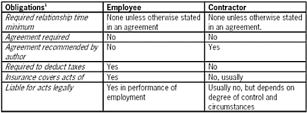

# 雇佣合同——它们对你意味着什么

> 原文：<https://www.sitepoint.com/employment-they-mean/>

提醒读者不要依赖这篇文章作为法律建议，因为它不能代替你所在州的律师咨询。基于管辖权和时间，法律会有所不同和变化。

员工和承包商提出了一系列法律问题，这些问题可能会帮助或伤害电子商务企业。

##### 雇员和承包商的区别

为了确定被企业雇佣的人是承包商还是雇员，法院会考虑多种因素:

*   如果工作在公司场所进行
*   谁提供工具和资源来完成工作
*   谁控制工作和工作产品
*   关系的持续时间
*   所需技能
*   雇佣方是否有权分配额外的项目
*   雇佣方对工作时间和工作时间的自由裁量权
*   付款方式
*   雇佣方在雇佣和支付助理方面的角色
*   该工作是否是雇佣方日常业务的一部分
*   雇佣方是否在经营
*   无论是否提供福利
*   被雇佣方的税务处理

法院将审查事实，权衡上述每一点，以得出结论。阐明相关各方责任的法律协议也有助于决定结果。

##### 方法和义务:雇员与承包商

下面的图表概述了您的企业应该如何对待员工和承包商的一些不同之处。您应该注意到:

*   就业法因州而异，
*   对于为政府处理项目和/或接受政府资助的公司，以下信息可能会有很大差异
*   在你的管辖范围内，你一定要向律师咨询这些问题的建议。

##### 雇员

员工政策用于“随意”雇佣，有时用于补充雇佣协议。随意雇佣与雇佣协议下的雇佣有很大的不同，雇佣协议下你同意雇佣员工一段时间，而他或她也同意在这段时间为你工作。一般来说，雇佣协议不适用于普通员工，因为雇佣者不想被法律约束不得解雇员工或改变他或她的雇佣条款。

***员工政策***

员工政策就员工在工作场所的表现和行为发出通知，并为员工设定统一的待遇和指导。一般来说，让员工在政策声明或其他文件的末尾签名是一个好主意，声明他们已经收到信息，并同意这些信息。在最初的招聘会议上展示这些信息也很重要，以确保其具有法律效力。

当您或您的律师撰写保单时，请确保它们符合您的企业所承担的联邦和州法律义务，并且您的企业将实际履行其义务。这些政策本质上是对员工的保证，即使你没有签署，你也必须遵守。

***保单条款***

您的雇佣政策可能包含以下条款:

**随意录用通知**

该政策应包括一项声明，通知员工雇佣是“随意的”，这意味着你可以解雇他或她，他或她可以随时辞职。该政策还应提醒员工，他或她的职责、晋升或降职、工资、调动和所有雇佣条款都由您决定。

**不当行为通知**

该政策应包括一项声明，对员工可能导致其被解雇的行为进行指导。这些行为通常包括:犯罪行为、在工作中“嗑药”或酗酒、和/或使用公司资源和设备(包括电子邮件和电话)进行骚扰、犯罪、诽谤、政治、个人或性行为。

该政策应包括定义性骚扰、种族骚扰、残疾骚扰和宗教骚扰、如何举报以及公司如何处理举报的声明。考虑到性骚扰索赔的高风险，你肯定想和你所在州的律师谈谈这样的政策。

**对信息保密**

该政策应包括关于机密信息的说明，包括哪些信息被视为“机密”，以及员工应如何处理此类信息。

**工作产品的所有权**

该政策应通知员工，您拥有他们的工作成果，不得用于其他雇主或他们的个人用途。为了使这些陈述有效，需要特定的语言，所以，你可能需要在这里咨询律师。

***更多政策规定***

一些政策还包括以下内容:

**不征集**

有些政策要求员工在特定的一段时间内，无论是在职期间还是离职后，都不得要求其同事离开您的公司。举例来说，如果你想到一群员工可能会离开并开始另一项业务，这一点可能很重要。

**非竞争**

政策有时包括非竞争条款。竞业禁止条款在时间和范围上受州法和判例法的制约。过于宽泛的条款将被法院缩小以符合法律规定。

你应该意识到，过于苛刻的员工协议或政策会被法院改写或否决。然而，对于许多不知道或没有钱聘请律师的雇员来说，这些政策可能是一种有效的威慑。另一方面，考虑到繁琐的员工政策对潜在员工是一个很大的阻碍，你在社区的声誉可能会因此受损。

##### 承包商

对于承包商，你总是希望有一份书面协议。

承包人协议确保承包人了解他或她的义务，双方同意要执行的服务和要支付的金额，并且您的企业拥有工作产品。虽然公司可以合理地选择在没有员工政策的情况下运营，但没有承包商协议是非常不明智的，因为根据法律，承包商拥有他或她自己的工作产品，除非另有书面规定，如版权法所要求的。

***条款***

**服务**

要执行的服务的明确定义，以及工作产品或性能的任何最后期限都很重要。未能明确定义要做什么可能导致各方(即使是善意的)有不同的想法，直到工作完成且公司不满意时才发现这一点。合同中包含的服务细节越多，以后发生误解的风险就越低。此外，请记住，合同中的服务描述是对您将收到的工作产品的合法定义。如果描述含糊不清或缺乏细节，你就有可能在法律上无法获得比合同规定更多的东西

**付款**

该协议应包括一项规定，说明公司将向承包商支付多少费用，以及支付程序。

**关系**

协议中应明确这种关系不是雇主/雇员关系，以便承包商知道他或她不会得到雇员福利。

**不当行为**

您的承包商协议应包含与上述讨论的不适当行为和性骚扰相同类型的限制。

**对信息保密**

该协议应包括关于机密信息的说明，包括哪些信息被视为“机密”，以及承包商应如何处理此类信息。

**工作产品的所有权**

协议应该声明你拥有承包商的工作产品。该条款必须按照版权法要求的语言书写，否则默认为每个人拥有自己创造的东西。

**不征集**

大多数承包商协议都包含一项条款，限制承包商邀请您的员工到其他地方工作。

**非竞争**

一些协议包括承包商不得为公司竞争对手工作的条款。这通常被认为有些麻烦，因为从本质上讲，承包商必须为同一行业的许多方提供服务。

**陈述和保证**

您可能希望协议包括以下或其他保证:

*   承包商将在指定的时间内重新执行有缺陷或不符合要求的服务
*   承包商是美国公民或被授权在美国工作
*   承包商在履行服务时不会侵犯第三方权利
*   承包商履行服务不违反任何其他协议

**赔偿**

承包商协议通常还有一项条款，规定承包商将赔偿公司任何违反保证的行为。赔偿意味着承包商必须向公司支付因其违反保证而产生的任何诉讼费用。

**终止和期限**

最后，承包商协议通常有一个关于承包商将履行服务多长时间以及任何一方如何终止关系的条款。

##### 结论

正确起草的承包商协议和员工政策可以减少您业务中的风险和混乱。

提醒读者不要依赖这篇文章作为法律建议，因为它不能代替你所在州的律师咨询。基于管辖权和时间，法律会有所不同和变化。

## 分享这篇文章