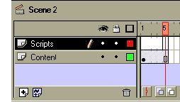
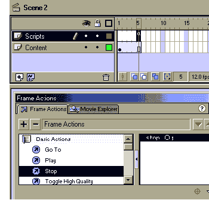
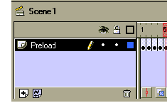
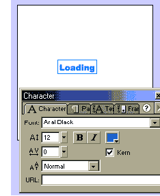
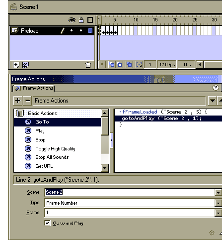
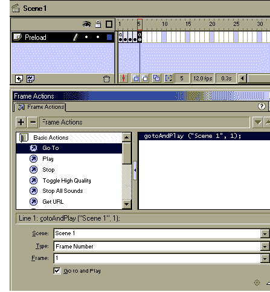

# 使用 Flash 5 优化预加载

> 原文：<https://www.sitepoint.com/optimize-preloading-flash-5/>

Flash 电影以小巧轻便著称。也就是说，当在电影中使用音频和大量导入的图形时，这些压缩文件可以变得如此之大，令人惊讶。

幸运的是，Flash 具有内置的 ActionScript 技术，可以进行优化，以便在播放电影之前预加载电影的每个部分。图形、场景甚至整部电影都可以在电影播放时下载，这可以极大地优化用户在您的网站上的体验。

##### 入门指南

首先，我们将编写一个脚本来播放一个动画，而电影的其余部分将在它开始播放之前预加载。这类似于你在网站上看到的许多“电影正在下载，请稍候…”的动画。

首先，打开一个文件并将其保存为 Simple_Preloader.fla。电影打开时默认只有一个场景。为了让预加载脚本工作，必须添加第二个场景。为此，请选择插入—场景，如下所示。

预加载脚本将被放入场景 1，但在此之前，让我们添加一些内容到场景 2。打开场景二，添加两层:一层叫“脚本”，另一层叫“内容”。使每层有五帧长。

接下来，选择“内容”层，并添加以下文本:这是场景 2。

在 Flash 电影制作中，这是放置主电影的部分。第二场可以是你喜欢的大小和长度。当你完成了 Simple_Preloader，为什么不尝试一下呢——从你写的复杂动画中添加一个场景。

选择“脚本”层。选择第 5 帧并打开 ActionScript 检查器。从基本动作中，在 ActionScript 编辑器窗口上拖动一个“停止”动作。

##### 添加预加载脚本

现在让我们添加预加载脚本本身。打开场景 1。增加一层，称之为“预加载”。使预载层 5 帧长。将每一帧改变成一个“关键帧”(键盘快捷键 F6)，如下所示。将帧转换为关键帧将允许添加脚本和动画。

选择第 1 帧。使用“文本”工具在舞台中央添加单词“加载”。将 Arial 字体设为黑色，大小为 12 磅。

从第一帧复制单词“Loading”并将其粘贴到第 2-5 帧，如下所示。这个词应该出现在每一帧的相同位置。选择第二帧。选择单词“Loading”并双击它，以编辑模式打开它。在单词后面加上一个句号。

接下来，选择第三帧，编辑单词“Loading ”,在单词后面添加两个句点。在第四帧的单词后添加三个句点，在第五帧添加四个句点。现在，当动画播放时，它将显示单词“正在加载”，三个句点将在它之后显示。

现在，选择第一帧。打开 ActionScript 检查器。从基本动作中拖动“如果加载了框架”。选择“场景 2”和“第 5 帧”的设置，如下所示。

该脚本告诉 Flash，它必须预加载场景 2 的第 5 帧之前的所有内容。如果场景 2 中的动画更长，帧数将需要增加。例如，如果您的电影有 550 帧，您需要将帧数更改为 550。所有内容，包括音频、图形和脚本内容，都将预加载此脚本。

拖动“前往”动作的实例。选择场景 2 和帧号 1 的设置。这个动作告诉 Flash 当场景 2 的所有帧都被加载时该做什么。在这种情况下，影片会自动转到并开始播放场景 2 的第 1 帧:

现在，选择第 5 帧。从 ActionScript 检查器拖动“转到”并添加设置场景 1，帧 1。这将导致动画不断重复，直到场景二中的所有内容都已加载，如下所示:

##### 测试时间到了

现在可以测试这部电影了。按 F12 在 Web 浏览器中预览。你会注意到，当场景 2 加载时，动画会不断重复。场景 2 中的内容越多，预加载场景显示的时间就越长。第二场的电影很短。要查看预加载脚本的全部效果，请将一个 MP3 文件导入场景 2。大多数 MP3 文件的大小都超过 1 MB。当你把电影放在网站上时，它将允许你在 MP3 下载时查看预加载脚本。

预加载允许您创建对客户具有相同影响的电影，无论他们是通过拨号调制解调器还是专用高速连接访问互联网。上面的脚本提供了很大的灵活性。为什么不为第一个场景制作一个公司标志动画呢？或者，您可以显示一个简单的 Flash 游戏，甚至是一个简短的演示文稿，概述下载后的主电影中要包含的内容。可能性是无限的！

## 分享这篇文章