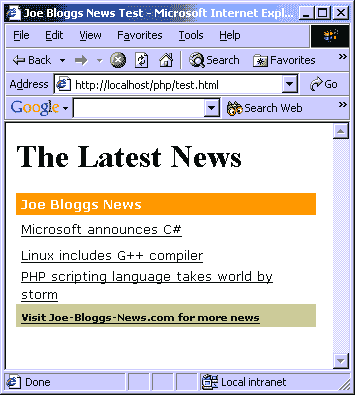
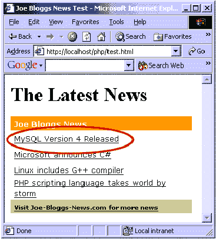
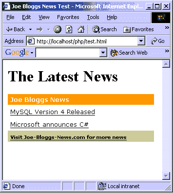

# 网站管理员日记第 2 部分——创建内容提要

> 原文：<https://www.sitepoint.com/create-content-feed/>

那么，你已经花了一年的大部分时间来创建你的 PHP/MySQL 驱动的网站。你有合理数量的体面、灵活的内容，而且你和其他几个网站管理员是好朋友，所以他们会在他们的网站上给你一个免费的横幅广告，作为交换，在你的网站上也给你一个。你还能做些什么来提高你的抵抗力？

一个网站的推广可能比它的发展更困难。我发现吸引更多访问者到你的网站的最好方法之一是与任何想要的人分享你的内容。没错；让他们在他们的网站上发表你的文章(只要他们在文章末尾添加一个链接)，专门为其他网站和电子杂志写文章(嘿，我现在正在这么做，不是吗？)，并从您的站点设置内容提要。

就在上周，我建立了一个内容提要，类似于我将在本文中描述的内容提要。你说什么？“我如何设置内容提要？我只知道 PHP 和 MySQL！”不要害怕——在本文中，我将向您展示建立一个这样的网站是多么容易。但是首先，让我们讨论一下为什么你想要为你的站点建立一个内容提要。

##### 为什么是内容提要？

我以前说过，现在我再说一遍:如果你的网站要在网上成功，它需要包含有用的、免费的内容，直接针对利基市场。

看看网上一些最受欢迎的网站:ZDNet、Slashdot、Cnet，此外，等等。所有这些网站都提供动态内容提要，任何人都可以在他们的网站上使用，因此，如果我想在我的网站上显示他们最近的新闻标题，我只需填写一个表单，然后在我的网站上粘贴一些 HTML 标签，就可以了。

如果 Joe Bloggs 在他的网站上发布 ZDNet 内容提要的 HTML 代码，那么这是一个双赢的局面:Joe 为他的访问者提供了有价值的新闻，这使他们每天都回来，当 Joe 的访问者点击新闻标题查看他们网站上的完整故事时，ZDNet 受益于流量的增加。

您应该考虑创建自己的内容提要的几个原因包括:

*   这是免费广告的最佳形式之一。
*   一旦其他人在他们的网站上发布了你的内容，每个标题都会链接到你网站的完整文章。正如你们中的许多人所知道的，从其他网站返回到你的网站的链接越多，搜索引擎如谷歌将会把你放在更高的位置。
*   显然，让其他人在他们的网站上发布你的内容会增加你的流量。你的流量会增加多少取决于你的内容质量和你的标题。

希望现在我已经说服你建立一个内容提要。让我们看看如何使用 PHP 和 MySQL 数据库创建一个示例内容提要。

##### 创建示例内容提要

内容提要如此受欢迎的原因之一是，在 99%的情况下，要在您的网站上包含其他人的内容提要，您只需使用 HTML `<script>`标记添加对外部 JavaScript 文件的引用，如下所示:

```
<script language="JavaScript" type="text/javascript"  

src="http://www.jb-news.com/feed.php"></script>
```

假设我运行一个小型网站，并希望使用上面的代码在我的站点上发布 Joe Bloggs 的内容提要。在其中，我将 `src` 属性设置为 Joe 网站上名为`feed.php`的文件(不是以`.js`结尾的典型 JavaScript 文件)。

然而，这不是问题，因为 IE 和 Netscape 都不关心文件扩展名是什么，只要当文件被抓取时，它实际上包含有效的 JavaScript 代码。现在让我们创建一个示例内容提要。首先，加载 MySQL 控制台应用程序并创建一个名为 content 的新数据库:

```
create database content; 

use content;
```

接下来，创建一个名为 articles 的新表。该表将包含我们所有的新闻项目:

```
create table articles 

( 

  articleId int auto_increment not null, 

  title varchar(100), 

  content text, 

  primary key(articleId) 

);
```

我们刚刚创建的表应该是不言自明的。它包含三个字段:

1.  `articleId`，整数，也是主键和唯一标识符，

3.  `title,`包含每条新闻的标题，以及

5.  包含每个新闻条目正文的文本字段。

让我们使用这些 MySQL 命令将三个新闻条目添加到文章表中:

```
insert into articles values(0, 'PHP scripting language takes  

world by storm', 'It was announced today that at least two  

million web sites around the world are using the PHP and  

MySQL language/databasing technique to create  

sites that are flexible'); 

insert into articles values(0, 'Linux includes G++ compiler',  

'Linux, one of the world's most popular operating systems,  

also includes a copy of both the GCC and G++ compilers, which  

allow you to compile C/C++ program easily from the  

command line'); 

insert into articles values(0, 'Microsoft announces C#',  

'Microsoft have today announced that its new .NET framework  

will be based around a language named C# (pronounced  

C-Sharp). This language is much like C++ but is designed  

for modern prorgammers');
```

接下来，我们想要创建 PHP 脚本，该脚本将从我们的 MySQL 数据库中检索新闻，并将其输出到浏览器，以便它显示为一堆 JavaScript 代码。这个 PHP 脚本的名字叫 feed.php，可以从这里下载。我们将只关注剧本中更重要的方面。

```
 header("Content-Type: text/javascript");
```

脚本必须做的第一件事是声明它将发送 JavaScript 代码，而不是 HTML。默认情况下，PHP 用 Content-Type: text/html 头标识输出的类型。然而，为了确保这个脚本的输出被识别为 JavaScript，我们必须自己设置头部。

```
 $db_server = "localhost";  

 $db_db = "content";  

 $db_user = "admin";  

 $db_pass = "password";
```

首先，我们的脚本创建了四个变量，用于登录我们的 MySQL 服务器。我假设 MySQL 安装在将要安装`feed.php`脚本的同一台机器上。

```
 $sConn = @mysql_connect($db_server, $db_user, $db_pass);  

 $dConn = @mysql_select_db($db_db, $sConn);  

 if(!$sConn || !$dConn)  

 {  

   ?>  

   document.write("Couldn't load news");  

   <?php  

 }
```

接下来，我们使用这四个变量连接到 MySQL 服务器并选择内容数据库。我们将“@”符号添加到`mysql_connect`和`mysql_select_db`函数调用的开头。这告诉 PHP 不要将任何连接错误写入浏览器。这在我们的脚本中很重要，因为我们只希望它返回有效的 JavaScript 代码。

如果`mysql_connect` 或`mysql_select_db`命令失败，那么`$sConn`或`$dConn` 将不包含任何数据。我们使用一个 if 控件来检查这一点，如果其中任何一个失败，我们就向浏览器输出`document.write("Couldn't load news");`。

```
document.write is a JavaScript function. It takes one argument and outputs the contents of that argument directly to the browser.使用一个 PHP 脚本来输出 JavaScript 可能一开始看起来有点奇怪，但是记住我前面说的。用户需要做的就是设置一个`<script>`标签，它的 `src`属性引用我们的 feed.php 文件。只要它返回 JavaScript 代码，浏览器就会像内联 JavaScript 一样处理它。

```
 $nResult = mysql_query("select articleId, title from articles order by  

                         articleId desc limit 10");
```

使用带有 select 语句的`mysql_query` 函数返回最近添加到文章表中的十篇文章的`articleId`和`title`字段。关键字`limit` 确保只返回十个。
为了将新闻标题作为 HTML 表格的一部分输出，我们使用了一个 PHP `while`循环，并输出了对 JavaScript 的`document.write`函数的几次调用，以构建表格的行，如下所示:

```
 while($nRow = mysql_fetch_array($nResult))  

 {  

   ?>  

   document.write('<tr>');  

   document.write('  <td>');  

   document.write('  <a target="_blank"  

href="http://www.jb-news.com/news.php?newsId=<?=$nRow["articleId"]?>"  

><?=addslashes($nRow["title"])?></a>');  

   document.write(' </td>');  

   document.write('<tr>');  

   <?php  

 }
```

这个`while`循环没有什么特别的。它使用 PHP 的 `mysql_fetch_array`函数从`$nResult`结果集中检索下一条记录，并输出包含超链接新闻标题的表格行。
每个标题的实际 URL 指向`http://www.jb-news.com/news.php`,并包括附加在末尾的文章 ID。您可以将该 URL 更改为 PHP 服务器上的脚本，并根据 newsId 查询字符串值显示新闻。然而，这超出了本文的范围。
关于`while`循环中的代码，需要注意的一点是，它使用 PHP 的 addslashes 函数，通过在标题中添加反斜杠，将标题中的任何单引号转换为转义单引号。如果我们将未转义的引号作为参数的一部分输出给`document.write`，那么当 JavaScript 处理该代码时，它会假设引号标记了参数的结尾，从而导致 JavaScript 语法错误。
使用 `while`循环的一个新闻条目的示例输出如下所示:

```
document.write('<tr>');  

document.write(' <td>');  

document.write(' <a target="_blank"  

href="http://www.jb-news.com/news.php?newsId=3"  

>Microsoft announces C#</a>');  

document.write(' </td>');   

document.write('<tr>');
```

这实际上是我们从示例 MySQL 数据库创建内容提要所需要做的全部工作。现在让我们设置内容提要，并在浏览器中测试它。
测试我们的内容源
测试我们的内容提要很简单。首先，确保`feed.php`脚本位于 Web 服务器的文档文件夹结构中的一个目录中。接下来，创建一个名为 `test.html` 的新 HTML 文件，并将其保存在与 `feed.php`脚本相同的目录中(我假设您已经将它们都保存在 Web 服务器根目录的`/php` 子目录中)。在`test.html`中输入以下 HTML:

```
<html>  

<head>  

<title> Joe Bloggs News Test </title>  

</head>  

<body bgcolor="#FFFFFF">  

 <h1>The Latest News</h1>  

 <script language="JavaScript" type="text/js"  

 src="feed.php"></script>  

</body>  

</html>
```

在您的网络浏览器中运行`test.html`。假设您使用了我们的示例`feed.php`，它包含格式化结果的额外代码，页面应该看起来像这样:

如果您有一个指向运行 PHP 和 MySQL 的 Web 服务器的注册域名(比如 mysite.com ),那么尝试在该服务器上创建内容数据库。也上传`feed.php`脚本。在本地机器上保留 test.html 文件的同时，替换它的 src 属性以指向 Web 服务器上的 feed.php 脚本。然后在你的浏览器中运行 test.html——它应该和以前一样。

##### 是什么让我们的内容提要充满活力？

很多事情。事实上，我们已经完全控制了我们服务器上的 feed.php 脚本，这意味着我们可以改变任何我们喜欢的东西(例如，加入赞助商的广告)。任何已经使用我们的内容提要的网站都不需要做任何事情就可以获得更新的版本，因为每次它显示在他们的网站上时，都会从我们的服务器上检索到。

此外，每当我们向文章表添加新项目时，它都会出现在内容提要的顶部。现在让我们尝试添加一个。使用 MySQL 控制台应用程序，输入以下查询:

```
insert into articles values(0, 'MySQL Version 4 Released', 'Today,    

MysQL AB have released MySQL version 4\. It comes packed with a number    

of new features including transactions and faster    

query execution plans');
```

返回浏览器，点击刷新按钮；请注意新闻报道列表中的新条目:



使用 MySQL delete 命令从我们的内容提要中删除项目同样简单:

```
delete from articles where articleId < 3;
```

这将删除那些`articeId` 少于三条的文章，从而在我们的提要中留下两条新闻标题:



因此，如您所见，使用`<script src="...">` 方法将我们的 feed.php 脚本生成的 JavaScript 包含在其他站点的页面中，可以确保我们添加的任何新记录在内容提要显示时自动可见。

##### 结论

获取本文中描述的[样本内容提要](http://www.webmasterbase.com/examples/contentfeed/contentfeed.zip),并对其进行修改以匹配您的站点的外观。您还需要修改 MySQL 查询，以便从数据库中提取正确的字段。

一旦你根据自己的需要定制了脚本，告诉所有人:你的电子杂志订户、朋友、其他站长等等。你会惊讶于有多少人会同意把它贴在他们的网站上，因为这样做很简单。

请记住，任何人要获得您的内容提要，只需在他们网站的任何页面中包含类似以下内容的 HTML 代码(当然，带有您的 feed.php 文件的 URL ):

```
<script language="JavaScript" type="text/javascript"   

 src="http://www.jb-news.com/feed.php"></script>
```

## 分享这篇文章

```