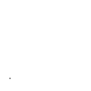
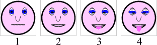
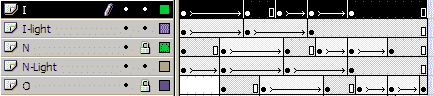
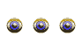
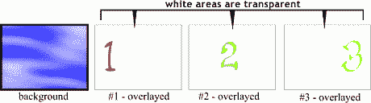
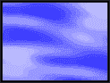

# 轻松制作动画 gif

> 原文：<https://www.sitepoint.com/animated-gifs-made/>

 ****##### 节目单上有什么？** 

我相信你现在已经看到了，现在用一组像素可以做的事情没有太多限制。例如:你可以弯曲它们，扭曲它们，扭曲它们，撕裂它们，增加它们的颜色，减少它们的颜色，甚至创建它们的大组和小组，并编排它们的外观以和谐或不和谐的方式工作。然后，当你做了所有这些，你可以教他们如何跳舞！对于这么小的东西来说，这是一个很大的多功能，与铅笔尖相比简直是小巫见大巫！

如果你有几千万美元，你可以制作一部克隆恐龙的大片，看起来如此真实，因为图形工作中有如此多的细节，它们占据了一个热带岛屿主题公园，你可以通过向人们展示它来赚取超过一亿美元！！！哦，我忘乎所以了，抱歉。但你明白我的意思，对吧？

我们将在这篇文章中谈论的是我们如何“教我们的像素跳舞”，换句话说，如何动画他们。我认为 Gif 动画已经成为网络上最流行和最有趣的特征之一。在任何给定的时间，都有数百个动画比赛在互联网上进行，以满足一般 Gif 动画爱好者的渴望。这绝对是给网站增加一些刺激的更“用户友好”的方式之一(不需要插件！).

为了创建一个动画 Gif 图像，你需要使用一个专门为此设计的程序。服务于这一目的越具体，它在易用性、文件优化和创建优秀最终产品方面的性能就越好。然而，有几个新的图形程序已经被设计来实现不止这一个功能，并且这些程序仍然可以很好地创建动画。这些程序更多地面向网页设计者群体，也将帮助网页或图形艺术家压缩、编译、甚至切割图像以放置在网页上的表格单元格中。除此之外，他们还为更有经验的艺术家提供一定程度的绘画和/或绘图能力。

由于我自己没有制作过每一个不同的动画程序，我将在这里引用我最常用的例子:(在你开始之前，快速浏览一下每个程序的例子)

 **需要注意的是:它有 17 帧，22.3kbs，使用 24 色自适应调色板(全局优化)，没有抖动。

需要注意的是:它有 29 帧，11.9kbs，使用 215 Web 安全调色板(全局优化)，没有抖动。

让我们从分解动画 Gif 背后的东西开始，好吗？

##### 动画分解

是什么让一个动画 Gif，动画？

首先，事物通常在画面中四处移动。这将是你的第一个线索:)但更确切地说，这是一个 Gif 图像。不是 Jpg，不是 Png，不是 Tiff…而是 Gif。这一点很重要，因为目前只有 Gif 图像格式是浏览器最友好和兼容的图形格式，可用于网页动画。为什么？我不太确定。这可能与 Gif 图像格式是互联网上最古老的格式之一有关，它比其他格式发展得更快，包括了透明度和交错等内容。

注意:作为参考，你也应该知道大多数动画程序会让你‘导入’很多其他的图像格式；即 Jpg、Png、Bmp、Tiff 等。只有当你准备好“导出”完成的动画时，它才会被程序转换成 Gif 格式。这就是为什么在为你的动画创建单独的图像时，密切注意颜色的类型和数量是很重要的。否则，你可能会得到一个可怕的动画，或者一个文件大小爆炸的动画。

现在，jpg 和 Png 也支持隔行扫描，Png 格式在各个方面都非常快地赶上了 Gif 的通用性和兼容性。用不了多久，它就会出现并取代陈旧的 ol' Gif 格式。另一个(可疑的)答案可能是，Gif 格式可以在其二进制数据中存储自己的选择性调色板信息，并可以使用无损压缩类型产生高质量的结果，这种压缩可以减小文件大小，同时保持图像的完整性。嗯…只是一个想法；-)

不管是什么原因，我们都不关心。我们想跳舞！所以让我们继续吧！

回到我们最初的问题:是什么让一个动画 Gif 变成动画？

好的，首先，所有的 Gif 动画都是由独立的图片组合而成的。这些单独的图像通常在光栅或矢量图形程序中创建，然后使用 Gif 动画/编译程序，按特定的顺序排列。这和拍电影的方式一样，只是要原始得多。

请看下面的图片。在这里，您将了解“特定顺序”的含义。我已经创建了 4 个单独的图像，只是略有不同。在大多数情况下，每个“帧”中的大多数像素看起来都是相同的。它们将被编译成一个图像文件，该文件将依次显示每幅图像，直到它们都被显示出来。然后，取决于动画是否被设置为“循环”(重复)，它将停止在序列中的最后一个图像上，或者从开始处继续，并无休止地重复它自己(或者直到用户点击“停止”！按钮)。

这是另一件事…你可以用“帧”或“单元”来看待 Gif 动画。就像你看到的一卷胶片上的单个帧单元一样。它们本质上是一样的，除了我们的是用二进制数据创建的，而不是刻录在胶片上:)

这里有一个取自 Macromedia Flash 的屏幕截图。这张图片展示了如何构建动画 gif 的原始结构概念。

这些层和时间轨迹是 Flash 界面的动画控件，非常容易理解和学习。动画中每个单独的帧或单元的布局(他们称之为“场景”，多个场景组成一部“电影”)是非常合乎逻辑的设计，并且基于层右侧的小块空间。顶部是框架或单元格的编号位置。请注意，该程序使用了“层”的概念，允许用户“覆盖”多个动画序列(每层)，并将它们组合成一个复杂的电影。这是一个非常强大的能力，掌握在正确的人手中，它可以产生一些非凡的结果，比如现在更常见的许多 Flash 电影风格的网站。许多其他程序也使用“层”的概念，因为它是如此的熟悉和容易理解。

想法:Flash 电影不过是美化了的 Gif 动画，但是有数百万美元的预算，而不是几千美元的独立制作:)

*深思熟虑:*如果你为一个动画 Gif 制作 1000 帧，每帧与前一帧只有一点点不同，你也可以制作一部非常流畅、高质量的“迷你电影”，而且仍然在预算之内。但是文件的大小太大了！而且非常不适合普通的网页。但是如果你有时间和耐心，它是可以做到的。

顺便说一下，动画不必像上面的例子那样简单。如果你想要或者需要一个更复杂的效果，他们可以有很多动作。但是要注意你成品的文件大小！请记住，您使用的颜色(包括组合或色调)越多，最终文件就越大。因此，人们可以看到，创建一个有效的、动态的、有趣的动画是多么困难，它不需要花很长时间来下载并在用户浏览器中呈现。不过，这部分“艺术”会随着实践而来。只要在学习时意识到这一点，你就会做得很好。

##### 了解你的选择

接下来是我们能做什么来改变我们动画的行为方式，并影响它的颜色属性。现在大多数不错的动画程序都会给你类似的选择。它们通常包括:

***选择调色板/优化***

*   **全局优化–**整个动画使用一个大调色板，仅使用所有独立图像中包含的最佳颜色(最有用/实用的选择)
*   **逐帧优化–**同上，除了动画的每一帧都有自己特定的调色板，基于其独特的颜色集合(由于文件较大，不常用，但会产生最佳效果)
*   **全局网络安全**–与全局优化相同，除了此选项将使用 215 网络安全调色板作为基础调色板来绘制其颜色(更多用于颜色较少的简单动画，不适合抖动)

***单帧速度/时长***

…帧持续时间越短，动画越快。帧速度基于以百分之一秒为单位的持续时间:即 5/100 秒= 1/5 秒；50/100 秒= 1/2 秒；500 = 5 秒；等等…

***进一步优化&调整***

您可以选择将序列中的任何一帧作为动画的背景，或者将其叠加到前面的帧上，以实现连续的移动和动画复杂性的构建。这造成了更多的运动和增加像素深度的错觉，顺便说一下，这增加了文件的大小。都是相对的。

让我们继续研究几个动画例子，看看它们都包含了什么。

##### 在幕后

这里有一个小例子(虽然只有 13kbs ),展示了我们如何通过简单地将一层层“堆叠”起来，在动画中产生“透视效果”。这张图片的设计并没有任何真正的目的，所以对于一个网页来说似乎有点老套。请记住，通过在网站上使用动画，你不仅增加了网页的美感和趣味性，还增加了访问者的下载时间。

因此，用非常具体的意图来创建它们，在你的网站内容中修饰信息，总是一个好的做法；不仅仅是为了‘养眼’。同样，每页超过 2 个动画不仅会让你眼花缭乱，还会给用户的浏览器和系统资源带来额外的压力。

上面的动画包含 11 个图像/层。每一层/图像都是前一层/图像的副本，它们已经被轻微地改变以产生序列进程中的变化。值得注意的是，你在动画中看到的是一种视错觉。我的意思是你的眼睛实际上看到了并不存在的东西(有点像你 35 个小时不睡觉！).

嘿！只是为了好玩，这是眼睛动画的一个稍微不同的版本，其中各个帧被设置为“叠加”在彼此之上，而不是替换彼此。它看起来有点狡猾。我这么说是什么意思？

嗯，当你的眼睛看到动画时，它们会“填充”一堆空白点，而动画实际上并没有做任何事情。有人还记得那些很久以前的小“活页本”吗？那些在书的每一页上都有一个小图画的书，当你用拇指翻开书页，让它们快速翻转时，这些图画是按顺序画的，以产生连续动画的幻觉？我们在这里使用相同的原则。你的眼睛设计得太好了(或者说太容易被愚弄了)，它们可以‘创造’(或者想象)一个动画中缺失的部分，这将使断裂的动作序列‘看起来’比它们实际上流动得更连续。

这又是第二页的分解后的笑脸动画，在这里你可以清楚地看到这些图像从一张到下一张看起来是多么的不连贯。注意到序列中所有“缺失”的动作了吗？当这些图像以 10/100 秒的平均速度播放时，这些空白点就会出现。这对于每幅图像来说都非常快。事实上，如此之快，以至于图像的位置看起来模糊不清，你的眼睛将无法看到所有实际存在的洞。这一点证明了“眼睛被愚弄”的理论。

让我们愚弄你的眼睛一分钟。看看你是否能说出你的眼睛正在“填充”面部运动的哪一部分。

你问这一切是什么意思？嗯…

实际上，这又归结为一件事…文件大小！文件大小！文件大小！为什么，那个“面部扭曲表演”只有区区 1.7 kb。没错。事实证明，动画中更少的帧可以极大地减少动画成品的文件大小；尤其是当你使用一个全局优化的调色板时(提示提示)。这意味着。更多快乐的游客！如果你在动画中不需要所有这些额外的帧，那为什么还要添加它们呢？给自己留点工作(除非你要把这个作品拿去参加竞赛或其他活动)。

你会惊讶地发现，你在大型企业网站上看到的大多数动画最多只有不到 5-5 帧。而且大部分都优化到了极致。但是嘿！它能完成任务，对吗？！此外，请记住，人们已经习惯了网页动画有点“起伏不定”。这对他们服务的目的来说很好。然而，人们永远不会习惯的是，必须点击一个链接，去做晚餐，洗狗，跑到商店，看电影，然后回到他们的浏览器，找到一个空的图像图标，一个臃肿的动画试图加载进来。

最后但并非最不重要的是，让我们看看网页上使用的一些类型的动画，以及我们可以用来保持它们精简和干净的方法，这样它们就可以快速加载。

##### 组织和效率

正如你在互联网上看到的那样，动画可以有多种形状和形式，其中大多数是简单的旋转横幅广告。其他形式是在图像列表中旋转的较小的产品框照片。还有一些是简单的动画图形，用于使页面的某些部分对浏览者来说更加突出。所有这些形式的动画都有其优点，并且都可以有效地使用。

***横幅广告***

对于横幅，行业标准尺寸现在是 468 X60 像素。由于它们的大小，它们要求您特别注意优化。一个好的横幅设计大纲可能包括以下内容:

*   广告中包含的信息的良好设计和布局。这将帮助您将横幅中需要和使用的“页面”数量保持在最低水平；从而降低文件的整体大小。
*   **一个小型的全球网络安全调色板**，使用不超过 4 到 5 种颜色。如果旋转横幅动画包含 3 到 5 个单页广告，这一点尤为重要。如果它们都被分配了相同的全局调色板，文件大小将更容易优化。顺便说一下，通常在图像质量上有一个小的折衷。尽管这是一个很小的代价。
*   使用尽可能少的图像抖动和渐变。尽量使用纯色。作为抖动如何负面影响文件大小的一个例子，看看下面的“天空 1，2，3”图像。它的文件大小(动画)是 2.4 kbs(这仅仅是因为云)，它使用了 255 自适应调色板中的 24 种颜色，没有抖动。即使我们将调色板减少到只有 15 种颜色，并添加抖动来使云尽可能平滑，文件大小也会跳到 8.4 kbs！这几乎是 4 倍。都是为了那个小小的动画！？长远来看不值得。所以请留意这一点:在图像的全局调色板中简单地使用更多的颜色总是比减少颜色和添加抖动更好。
*   帧的速度应该足够长，以允许完整地阅读信息，但也不要太长，以至于一个多页广告需要超过 5 到 10 秒的时间来循环播放。同样，帧也不应该设置为 5/100 秒——这将导致每一帧以模糊的愤怒掠过，到达消息的结尾。

***产品框***

以上概述也适用于旋转“产品盒镜头”类型的动画。不过，这些广告的一个例外是，它们的尺寸通常比横幅广告小得多，因此使用的颜色数量可以稍微增加。但是仍然应该注意动画中使用的每个独立图形的优化；尤其是因为这些类型的动画通常包含比横幅广告更多的独立图像。如果你在排序前优化单个图像，使用 Gif 格式，而不是 Jpg: Jpg 使用“破坏性”类型的优化，而 Gif 不使用。

***主题特定的动画或“注意力抓取器”***

同样，上述大纲也可以遵循并应用于这些类型的动画。不过，有些变体可能适用于此处。需要注意的一点是，当你编译动画时，尽可能使用所谓的“计算脏矩形”。它肯定会减少动画的文件大小，如果需要的话，允许你创建更长、更复杂的动画。不是所有的动画程序都有这种能力，但是大多数好的程序都有。

事情是这样的。

首先，你指定一个图像作为动画的“背景”。它通常是您导入动画程序的第一个图像，也可以(在大多数情况下)成为动画全局调色板的来源。动画背景图像中的像素通常在整个动画中保持不变，因此被称为“背景”。

接下来，导入或创建将在后续帧中使用的其他图像。例如，假设我们制作了一个简单的动画，在天空背景下，数字 1、2 和 3 从左到右出现，并且所有三个数字都保留在动画中直到结束。

使用“脏矩形”方法，这个动画将有 4 帧:

1.  背景

3.  数字一

5.  数字二

7.  数字三

这些数字的框架中没有其他东西，只有一个数字。然后，该程序开始时只显示天空图像，然后依次渲染叠加在天空上的数字图像，直到所有的数字都可见。如果设置为“循环”,它将只从空白的天空图像(背景)开始。

创建相同动画的另一种方法是拥有 4 个独立的天空图像，每个图像都包含一个数字。然后，程序会将每一张新图像视为背景，并连续渲染它们，直到完成整个序列。这样的动画所需的图像将是:

1.  仅仅是天空图像本身

3.  上面有数字 1 的天空

5.  上面有数字 1 和 2 的天空

7.  上面有数字 1、2 和 3 的天空

然而，这个动画将是“脏矩形”方法产生的文件大小的 4 到 5 倍。所以你可以看到对大多数类型的动画使用这种方法的好处。一些程序有能力计算“脏矩形”的效果，即使你使用完整和完整的独立图像。横幅广告等可能不会从这种方法中受益太多，因为每个单独的图像在图形中的像素位置方面根本不相同。这就是为什么他们要求你更加注意优化，并使用较少数量的全局颜色。

##### 注意事项

如果您为包含文本的优化图像添加抖动，可能会导致文本边缘看起来“粗糙”。如果抖动包含大量纯色的图像，也是如此。在抖动试图完成其工作的一些区域，纯色将变成“斑点”。请记住，比起添加抖动，向调色板添加更多的颜色要好得多。这条规则特别适用于 Gif 格式，不管它是否是动画。

有时(虽然现在不经常)需要特别注意哪些图像在动画中是第一个和最后一个使用的。原因是现在有一些旧的浏览器不支持动画。另外，有些人更喜欢在关闭图形的情况下浏览。这些用户看到的内容会有所不同。

*   非动画浏览器只会显示动画中的第一幅图像。换句话说，如果你有一个空的框架/单元格作为你的第一张图片，那么这就是那些浏览器所呈现的。所以仔细选择你的“开场形象”。这可能需要你花更多的心思来构建你的动画序列，但是这是可以做到的，并且已经被很多人做到了，所以这是可能的，而且一点也不困难。通常，你可以把你的最后一张图片(所谓的“最终结果”图片)作为你的框架/单元格列表中的第一张图片。有时这可能会破坏某些类型的效果，所以选择权在你——这是你的动画。
*   当图形关闭时，只有图像的 Alt 标签的内容是可见的。所以一定要用你想通过动画传达给观众的信息来填满它。
*   对于非循环动画，你应该注意到序列中最后出现的图像将会留在屏幕上。因此，在创建和编辑图片时，一定要注意细节。当你决定什么图像应该是第一个，什么图像应该是最后一个时，这个事实和“不支持动画”的情况会导致混乱。解决这两个问题的一个方法是使用你的最终图像两次:一次在开始，一次在结束(如果你不循环动画)。如果你正在使用“脏矩形”优化方法，如果你以后决定循环动画，这将会很有帮助。这里唯一的另一个选择是简单地放弃对不支持动画的浏览器的担心，更关心你的关闭图形而不是打开图形。

## 分享这篇文章****