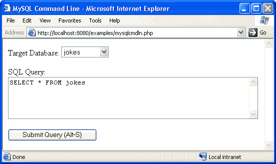
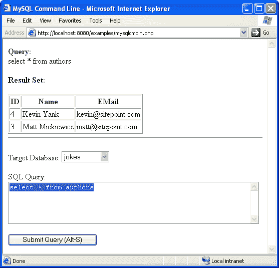

# 把我的 MySQL 命令行还给我！

> 原文：<https://www.sitepoint.com/give-back-mysql-command-line/>

要精通 PHP/MySQL 驱动的网站开发，你必须掌握的一项基本技能是很好地理解结构化查询语言(SQL)。在我的文章系列的第 2 章中，[使用 PHP & MySQL](https://www.sitepoint.com/blog/) 构建你自己的数据库驱动的网站，我关注的是让初学者熟悉在 MySQL 命令行上输入 SQL 查询。

开始使用 MySQL 的人面临的一个常见问题是，目前大多数 Web 主机不提供对服务器的 shell 访问，也不允许远程连接到他们的 MySQL 服务器。最终结果是 MySQL 命令行对大多数 Web 主机的用户不可用。为了学习 SQL，开发人员经常被迫在自己的计算机上安装 MySQL 服务器，只是为了有一个命令行可以使用。

在本文中，我将提供一个方便的替代方法——基于 Web 的 MySQL 命令行！这个脚本是用 PHP 编写的，它将允许您在文本字段中键入 SQL 查询，并查看结果，或者在出现错误的情况下，查看生成的任何错误消息。

我们将分别查看脚本的每个组件，我将在文章的最后提供完整的代码，所以请关注手头的代码段，我们将在最后看到它们是如何组合在一起的。

##### 简单的形式

我们基于 Web 的命令行的外观(图 1)将仅仅比我们试图模仿的简单界面稍微高级一点。

##### 图 1:基于 Web 的 MySQL 命令行

我们添加到界面中的唯一真正方便的特性是一个下拉列表，用于指示将成为查询目标的数据库。为了生成这个列表，我们需要一个到 MySQL 数据库服务器的连接，所以这就是我们的脚本的开头:

```
<?php 

// FILL THESE IN WITH YOUR SERVER'S DETAILS 

$mysqlhost = 'localhost'; 

$mysqlusr = 'user'; 

$mysqlpass = 'password'; 

mysql_connect($mysqlhost,$mysqlusr,$mysqlpass); 

?> 

<html> 

<head><title>MySQL Command Line</title></head>
```

现在，为了在表单中生成下拉列表，我们需要检索 MySQL 服务器中的数据库列表。我们用 PHP 函数`mysql_list_dbs`来做这件事，然后我们使用一个`for`循环来遍历这个列表，并使用`mysql_db_name`函数在每个数据库的`<select>`列表中产生一个`<option>`:

```
<p>Target Database: 

<select name="db"> 

<?php 

$dbs = mysql_list_dbs(); 

for ($i=0;$i<mysql_num_rows($dbs);$i++) { 

  $dbname = mysql_db_name($dbs,$i); 

  echo("<option>$dbname</option>"); 

} 

?> 

</select> 

</p>
```

表单的其余部分非常简单——一个`<textarea>`和一个提交按钮。为了方便起见，我设置了`<textarea>`来选择它获得焦点时包含的文本(注意`onFocus`属性)。我还为 submit 按钮分配了一个`accesskey`属性，允许用键盘触发它:

```
<p>SQL Query:<br /> 

<textarea onFocus="this.select()" cols="60" rows="5" name="query"> 

</textarea> 

</p> 

<p><input type="submit" name="submitquery" value="Submit Query (Alt-S)" 

          accesskey="S" /></p>
```

至于包含所有这些元素的`<form>`标签，它将被设置为使用 PHP 变量`$PHP_SELF`作为`action`属性将表单提交回同一个 URL:

```
<form action="<?=$_SERVER['PHP_SELF']?>" method="POST"> 

... 

</form>
```

所以除了显示表单，这个脚本还需要处理表单提交。接下来我们将查看代码来实现这一点。

##### 处理查询

我们的脚本可以通过检查`$submitquery`变量的存在来判断它何时作为我们刚刚看到的表单的提交结果而运行。这个变量是由表单中的提交按钮产生的，表单的`name`属性被设置为`"submitquery"`。因此，处理表单提交的代码将以这个`if`语句开始:

```
if (isset($_POST['submitquery'])) {
```

现在，有一个 PHP 的特性叫做**魔力语录**，有经验的 PHP 开发人员会非常熟悉。基本上，当它被启用时，所有提交给脚本的值(例如，作为表单提交的结果)都会通过在引号(`'`)等特殊字符前添加反斜杠来自动**转义**，如果没有以这种方式用反斜杠标记，将会干扰 SQL 查询。

问题是，在这种情况下，从表单(`$_POST['query']` ) *传递的值是查询的*，如果它被神奇的引号功能转义，它将无法正常工作。PHP 函数 **`stripslashes`** 可以撤销由引号引起的转义，但是如果引号被关闭，那么`stripslashes`同样会阻止查询正常工作。因此，我们需要确定是否启用了 magic quotes，如果启用了，就用`stripslashes`取消查询。魔术报价设置可以用 **`get_magic_quotes_gpc`** 检测:

```
 if (get_magic_quotes_gpc()) $_POST['query'] = stripslashes($_POST['query']);
```

接下来，为了用户的利益，我们打印出查询，这样，如果结果不是他或她所期望的，查询将帮助确定原因。我们使用`nl2br`函数将查询中的换行符转换成`<br>`标签，这样查询就显示为键入的内容。

```
 echo('<p><b>Query:</b><br />'.nl2br($_POST['query']).'</p>');
```

准备工作结束后，我们最终可以对由`$_POST['db']`变量指定的 MySQL 数据库执行查询(`$_POST['query']`)，该变量来自表单中的下拉列表:

```
 mysql_select_db($_POST['db']);  

  $result = mysql_query($_POST['query']);
```

然后，我们通过检查刚刚获得的`$result`变量是否为‘true’来验证 MySQL 查询是否成功:

```
 if ($result) {
```

现在我们知道查询成功执行了，但是我们不知道它是否返回了结果集。诸如`SELECT`、`DESCRIBE`和`SHOW TABLES`之类的 SQL 查询都产生结果集，而诸如`INSERT`、`UPDATE`和`DELETE`之类的查询只告诉您它们的执行影响了多少行。我们可以通过使用`mysql_num_rows`函数来确定查询是否返回了结果集，该函数试图确定从结果集中返回的行数:

```
 if (@mysql_num_rows($result)) {
```

由于试图在不对应于结果集的`$result`变量上调用`mysql_num_rows`会产生一个错误消息，我们在函数名前面放了一个`@`符号，以避免出现这样的消息。

在确定我们手上有一个结果集之后，我们需要为用户输出它。在下一节中，我们将看看实现这一点的代码。现在，让我们看看当`$result` *没有*指向结果集时会发生什么——上面的`if`语句的`else`子句:

```
 } else {  

      echo('<p><b>Query OK:</b> '.mysql_affected_rows().  

           ' rows affected.</p>');  

    }
```

在这种情况下，我们知道查询成功执行(因为`$result`评估为‘true’)，但是`mysql_num_rows`失败或返回零。所以我们要么处理一个空的结果集，要么处理一个不返回结果集的查询。无论哪种情况，我们都用`mysql_affected_rows`函数打印出受查询影响的行数。

最后，我们需要一个用于检查查询是否成功的`if`语句的`else`子句。如果查询失败，我们需要显示用`mysql_error`产生的错误消息:

```
 } else {  

    echo('<p><b>Query Failed</b> '.mysql_error().'</p>');  

  }
```

这涵盖了我们的查询处理代码*中的所有内容，除了*显示结果集的代码，我们现在来看看。

##### 显示结果集

因为结果集在 MySQL 命令行上显示为表格，所以对基于 Web 的对等项进行同样的操作才有意义。首先，我们必须确定结果集中存在的列，并在我们的表中为每个列放置一列。我们使用`mysql_num_fields`函数来确定结果集中的列数，然后使用`mysql_field_name`来获取它们的名称:

```
 <p><b>Result Set:</b></p>   

      <table border="1">   

      <thead>   

      <tr>   

      <?php   

      for ($i=0;$i<mysql_num_fields($result);$i++) {   

        echo('<th>'.mysql_field_name($result,$i).'</th>');   

      }   

      ?>   

      </tr>   

      </thead>
```

有了我们的列名，创建表就很简单了，只需遍历结果集的行，将每列中的值写入一个表单元格。除了再次使用`mysql_num_fields`来确定列数之外，对于有经验的 PHP 程序员来说，这是非常标准的东西，所以如果你是 PHP 新手，不要担心——随着你获得更多的语言经验，这一切都会变得清楚(参见我的 PHP/MySQL 系列的[第 4 章](http://www.webmasterbase.com/article.php/530),获得关于这方面的很好的教程)。

```
 <tbody>   

      <?php   

      while ($row = mysql_fetch_row($result)) {   

        echo('<tr>');   

        for ($i=0;$i<mysql_num_fields($result);$i++) {   

          echo('<td>'.$row[$i].'</td>');   

        }   

        echo('</tr>');   

      }   

      ?>   

      </tbody>   

      </table>
```

图 2 显示了一个简单数据库查询的代码输出。

**Fig. 2: Displaying the results of a simple query**

这涵盖了脚本的大部分代码！剩下的就是把所有的东西放在一起。

##### 把所有的放在一起

下面是脚本的结构视图，可以帮助您找到方向:

```
<?php    

  // OPEN DATABASE CONNECTION    

?>    

<html>    

<!-- PAGE HEADER -->    

<body>    

<?php    

if (QUERY SUBMITTED) {    

  // COMPENSATE FOR MAGIC QUOTES    

  // PRINT OUT THE QUERY    

  // EXECUTE THE QUERY    

  if (QUERY SUCCESSFUL) {    

    if (NON-EMPTY RESULT SET PRODUCED) {    

      // DISPLAY THE RESULT SET IN A TABLE    

    } else {    

      // DISPLAY THE NUMBER OF ROWS AFFECTED    

    }    

  } else {    

    // DISPLAY THE MYSQL ERROR MESSAGE    

  }    

}    

?>    

<form action="<?=$_SERVER['PHP_SELF']?>" method="post">    

<p>Target Database:    

<!-- DISPLAY THE LIST OF DATABASES -->    

</p>    

<p>SQL Query:<br />    

<!-- QUERY TEXT AREA -->    

</p>    

<p><!-- SUBMIT BUTTON --></p>    

</form>    

</body>    

</html>
```

请注意，在用户提交查询之前和之后都会显示查询表单。这允许用户在查看他或她提交的前一个查询的结果时键入新的查询。这对于纠正错误特别有用，鉴于这一事实，我们可以引入一些可用性调整。

首先，由于用户通常首先做的是输入一个查询，我们可以预先将文本光标放在适当的字段中。我们通过向`<body>`标签添加一点 JavaScript 来实现这一点:

```
<body onLoad="document.forms[0].elements['query'].focus()">
```

接下来，由于用户很可能希望在不同的查询中使用同一个数据库，我们将确保在数据库的下拉菜单中默认选择在先前查询中选择的数据库。当`<option>`标签中的数据库名称与提交的`$db`变量匹配时，我们通过添加一个`selected`属性来实现这一点:

```
 $dbname = mysql_db_name($dbs,$i);    

  if ($dbname == $_POST['db'])    

    echo("<option **selected**>$dbname</option>");    

  else    

    echo("<option>$dbname</option>");
```

最后，我们将把之前提交的查询复制到`<textarea>`中，这样用户就可以轻松地对相同的查询进行微小的修改并重新提交。事实上，`<textarea>`已经被设置为当它获得焦点时突出显示它的内容，这使得它特别方便。我们使用`htmlspecialchars`函数将查询中出现的任何特殊 HTML 字符(如`<`、`>`和`&`)转换成它们的 HTML 实体等价物(分别为`&lt;`、`&gt;`和`&amp;`)。

```
<p>SQL Query:<br />    

<textarea onFocus="this.select()" cols="60" rows="5" name="query">    

<?=htmlspecialchars($_POST['query'])?>    

</textarea>    

</p>
```

应该可以了！完整的脚本可以在这里找到[，但是在你把它放到你的服务器上并试用它之前，请务必阅读下一页的警告…](http://www.webmasterbase.com/examples/mysqlcmdln/mysqlcmdln.php.txt)

##### 一个警告

尽管这是使用 MySQL 数据库的一种非常方便的方式(当您只想尝试一个快速查询时，它甚至比使用 [phpMyAdmin](http://www.phpwizard.net/projects/phpMyAdmin/) 更快)，但是您需要意识到这样的脚本所带来的安全问题。基本上，使用这个脚本，您将把 MySQL 用户名和密码组合交给任何可以访问该脚本的人。这可能意味着一些非常糟糕的事情:

*   您在脚本中使用的 MySQL 用户名/密码组合可以访问的任何 MySQL 数据都可以通过该脚本自由访问。用户密码和其他敏感信息可能会因此受损。
*   如果脚本中的 MySQL 用户拥有对任何数据库的写访问权限，那么这些数据库可以被该脚本的用户自由修改。对“mysql”数据库的写访问权是对 MySQL 服务器其余部分的一扇敞开的大门，因为用户可以修改他们自己的访问权限，并获得对服务器上任何数据库的完全访问权。
*   使用一个`SELECT INTO OUTFILE`查询，用户可以在你的 Web 服务器上创建文本文件，只要 MySQL 服务器进程有写权限，如果脚本中的 MySQL 用户有权限这样做的话。在具有适当保护的 MySQL 服务器的 Linux 机器上，这意味着 MySQL 数据目录；但是，Windows 服务器在这方面提供的保护要少得多。这个漏洞，加上配置不当的 MySQL 服务器，是最近 Apache.org 网络服务器被黑的主要原因。

除非您对自己的 MySQL 管理能力非常有信心，否则像这样的脚本永远不应该对外开放。至少，把它放在你的网站上一个有密码保护的目录里！更好的是，配置目录以拒绝除您自己的机器之外的机器的访问。你越能保护这样的剧本，就越好。你已经被警告了！

##### 摘要

在本文中，我提供了古老的 MySQL 命令行的替代方法，目前大多数 PHP/MySQL 主机都不提供对它的访问。通过一个相对简单的 PHP 脚本，我们可以允许用户输入他们喜欢的任何 SQL 查询，并查看这些查询的结果(无论成功与否)。

对于刚刚学习结构化查询语言(SQL)的初学者来说，这样的脚本是一个很好的工具；然而，建立这样一个脚本需要一些努力。如果您不采取措施保护脚本免受未经授权的访问，您很快就会发现自己成为服务器黑客的受害者。

## 分享这篇文章