# 使用 VB 开始 ASP.NET。净:第十四章

> 原文：<https://www.sitepoint.com/asp-net-server-controls/>

**到目前为止，您应该对。NET 框架来创建 ASPX 网页。如果没有，请参见[示例第 1 章“ASP 入门”。【T4 网】。你获得了一些使用 ASP.NET 服务器控件(也称为 web 控件)的经验(在第 3 章)。本章将继续讨论 ASP.NET 服务器控件，并提供大量详细信息和示例来说明它们的用法。本章不包括 HTML 服务器控件和用户控件。在本章中，短语“ASP。NET 服务器控件”将指从系统派生的特定控件组。Web.UI.WebControls 基类，例如，它包括`<asp:button>, <asp:textbox>, <asp:listbox>`和`<asp:datagrid>`。](http://www.wrox.com/books/samplechapters/5040/content.pdf)**

ASP.NET 服务器控件是可重用的组件，可以执行与传统 HTML 控件相同的工作，但具有“可编程对象”的额外优势。换句话说，它们可以通过编程方式访问，就像任何其他的一样。NET 对象或类，响应事件，获取/设置属性，并做对象做的所有其他事情。ASP.NET 服务器控件使用类似标记的语法来声明网页上使用的各种控件，例如:

```
<asp:button id="SampleButton" runat="server" text="I'm A Sample Button!"/>
```

ASP.NET 服务器控件的一个独特之处在于，即使它们的标记语法不同于 HTML，每个 ASP.NET 服务器控件在服务器上处理后都会呈现为标准 HTML，从而抽象出整个 HTML 控件集的功能。其他 ASP.NET 服务器控件提供了呈现丰富 web 内容的能力，例如，用于显示日期的日历控件、用于显示数据的 DataGrid 控件以及其他控件，我们将在本章中对此进行探讨。

以下是我们将在本章中涉及的主题的总结:

*   ASP.NET 服务器控件的语法和优点回顾
*   该系统的简要概述。网页生命周期
*   在 web 窗体上使用各种 ASP.NET 服务器控件。
*   使用验证控件—您将学习一些在 web 表单中验证用户输入的技术
*   数据呈现控件简介—对这组用于显示数据的非常强大的控件的简要介绍
*   这是一个完整的应用程序，允许你在一个 ASP.NET 日历控件的上下文中包含你自己的时间表

在过去，我们创建网页的方式可能会有所不同，但几乎总是涉及到在页面中嵌入各种 HTML 标记——可能是一些客户端脚本来处理事件处理，或验证表单输入，以及一些文本来组成页面的整体内容。此外，高级开发人员通常需要以支持各种浏览器类型和功能的方式编写页面，因此混合了特殊情况代码，甚至客户端验证，这增加了额外的开发复杂性，通常难以维护。

在本章中，我们将详细探索 ASP.NET 服务器控件——具体来说，它们是什么，如何创建它们，以及如何在 ASP.NET web 窗体(ASPX 文件)中以编程方式操作它们。我们将探讨各种类型的 ASP.NET 服务器控件，这些控件可以分为四大类:

*   内在控件—这些控件对应于它们的 HTML 对应物，或者模拟一个不存在的控件。示例包括按钮、列表框和文本框控件。
*   以数据为中心的控件—用于绑定和显示来自数据源的数据的控件，如 DataGrid 控件。
*   丰富控件—这些控件没有直接的 HTML 对应物。像日历控件这样的丰富控件由多个组件组成，生成的 HTML 通常由许多 HTML 标记(以及客户端脚本)组成，以便在浏览器中呈现控件。
*   验证控件——例如，RequiredFieldValidator，可用于确保在 web 表单中正确输入数据。

本章结束时，您将能够利用各种可用的 ASP.NET 服务器控件创建自己的 web 窗体。您将接触到作为 web 开发人员可用的各种 ASP.NET 控件属性，这些属性可用于定制各种控件的外观或功能。您还将学习为 ASP.NET 服务器控件引发的各种事件编写事件处理程序。

##### 其他类型的控制

本章的主旨主要是描述和演示 ASP.NET 服务器控件的各个方面。但是，您应该了解另外两种类型的控件:

*   HTML 服务器控件
*   用户控件

##### HTML 服务器控件

HTML 服务器控件直接对应于各种 HTML 标签，并在`System.Web.UI.HtmlControls`名称空间中定义。这些控件从`System.Web.UI.HtmlControls.HtmlControl`基类派生出它们的功能。微软提供这套 HTML 服务器控件有几个原因:

*   一些 web 开发人员可能更喜欢使用他们习惯的 HTML 风格的控件
*   开发人员可以相当容易地将现有的 HTML 标记转换为 HTML 服务器控件，从而获得对控件的一些服务器端编程访问

信不信由你，下面的 HTML 标记声明是一个完全限定的 HTML 服务器控件，可以在 web 窗体的代码中以编程方式在服务器上访问它:

```
<INPUT id="MyHTMLTextBox" type="text" name="MyHTMLTextBox"   

runat="server"> 
```

是什么使它成为一个可编程的 HTML 服务器控件？在这个例子中，简单地引用`runat="server.`，使用 runat="server "确保。NET Framework 会将 HTML 标签转换成对应的`HtmlInputText` 对象(每个对应的 HTML 标签都有一个 HTML 服务器控件对象)。我们还添加了`id="MyHTMLTextBox"`，以提供对象的唯一名称，这样我们就可以在服务器端代码中引用它。像 ASP.NET 服务器控件一样，HTML 服务器控件提供了各种功能，包括:

*   **编程对象模型** —你可以使用所有熟悉的面向对象技术在服务器上编程访问 HTML 服务器控件。每个 HTML 服务器控件都是一个对象，因此，您可以访问它的各种属性，并以编程方式获取/设置它们。
*   **事件处理** — HTML 服务器控件提供了一种编写事件处理程序的机制，就像编写基于客户端的表单一样。唯一的区别是事件是在服务器代码中处理的。
*   **自动值缓存** —当表单数据发送到服务器时，用户输入到 HTML 服务器控件中的值会在页面发送回浏览器时自动维护。
*   **数据绑定** —可以将数据绑定到一个 HTML 服务器控件的一个或多个属性。
*   **自定义属性** —您可以向 HTML 服务器控件添加任何您需要的属性。的。NET Framework 将在不做任何更改的情况下将它们呈现给客户端浏览器。这使您能够向控件添加特定于浏览器的属性。
*   **验证** —您可以实际分配一个 ASP.NET 验证控件来完成验证 HTML 服务器控件的工作。本章后面将详细介绍验证控件。

您可能考虑在自己的 web 窗体页中使用 HTML 服务器控件的一个原因是利用现有 HTML 页的 HTML 标记或代码库。例如，假设您有一个现有的 HMTL 页面，您不希望从头开始重写，但仍然希望编写一些服务器端代码来访问页面上各种控件的各种属性。将现有的 HTML 页面控件转换成 HTML 服务器控件很简单:只需在 HTML 控件的标记声明中添加`runat="server"`属性。您可能还需要添加一个`id="MyControl"`引用，其中“MyControl”是您对该对象的惟一命名标识符，这样您就可以在您的服务器端代码中引用该对象。

##### HTML 服务器控件与 ASP.NET 服务器控件

鉴于 Microsoft 提供了两种不同类别的服务器控件(HTML 和 ASP.NET 服务器控件)，这两组控件共享一定程度的重叠功能，您可能会有点困惑，不知道应该在 web 窗体中使用哪一组控件。简单的回答就是:**你可以两者都用！在你的 web 表单中混合使用 HTML 服务器控件和 ASP.NET 服务器控件是完全没问题的——使用一组控件并不会限制你使用那种控件类型。但是，根据您的偏好和网页要求，可能有理由选择一个集合而不是另一个。尽管在功能上有所重叠，但在开发 ASP.NET web 窗体页时，您应该知道这些控件之间有一些明显的区别(我们将在本章中讨论下面列出的 ASP.NET 行为):**

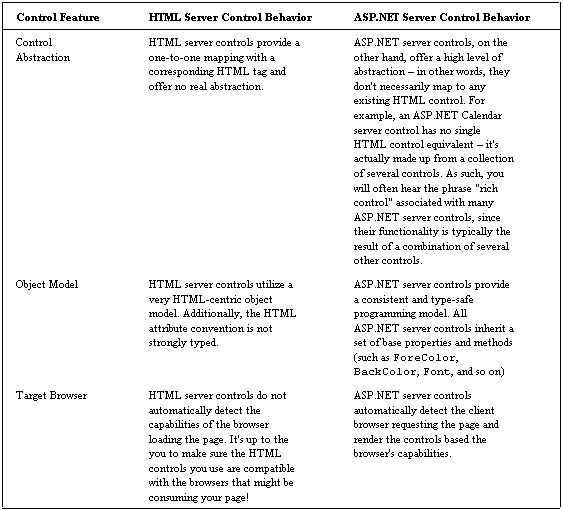

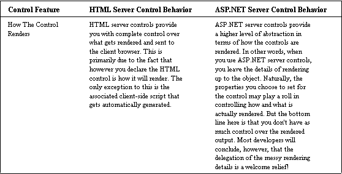

##### 用户控件

正如您可能猜到的，用户控件是您自己编写的控件。您可以使用任何文本编辑器来创建这些控件，也可以借助像 Visual Studio.NET 这样的 IDE 来创建。用户控件可以包含文本、HTML 标记、HTML 服务器控件和 ASP.NET 服务器控件，以及用于处理事件和执行服务器端处理的任何其他服务器端代码。用户控件的目的是提供跨 ASP.NET web 应用程序重用公共用户界面功能的能力。例如，考虑一个典型的登录页面。您可能有一个文本框控件用于登录名，另一个用于密码，还有一个按钮控件用于向服务器提交表单登录数据。您可能还需要一些验证控件来验证用户的输入，以及各种服务器端代码来执行实际的登录身份验证。如果这是一组将由 web 应用程序中的几个页面使用的公共功能，您可能会考虑创建一个用户控件来促进此功能，这样您只需编写一次。您可以将用户控件想象成非常类似于 ASP.NET web 窗体。但是，与 web 窗体不同，用户控件必须始终包含在现有的 web 窗体中才能工作。用户控件不能独立于 web 窗体加载。用户控制在第 13 章有更详细的介绍。

现在让我们进入本章的实质——ASP.NET 服务器控件。

##### ASP.NET 服务器控件

ASP.NET 服务器控件是创建 ASP.NET web 窗体的构造块。像它们的 HTML 对应物一样，ASP.NET 服务器控件提供了构建 web 表单所需的所有基本控件(按钮、列表框、复选框、文本框等)，以及一组丰富的控件(具有多种功能的控件，我们将在后面介绍)，如日历和数据网格控件。本节稍后将对各种控件系列进行分类和讨论，并提供许多小型示例来演示语法和其他功能。此时，您可能想知道使用 ASP.NET 服务器控件代替标准 HTML 控件有什么好处，如果有的话。以下是 ASP.NET 服务器控件为我们带来的一些好处:

*   丰富对象模型
*   自动浏览器检测
*   性能
*   事件

##### 丰富对象模型

ASP.NET 服务器控件利用了。NET 框架。因此，每个 ASP.NET 控件都从系统继承基本方法、属性和事件。Web.UI.WebControls 基类。您可能还记得前面的章节，继承是面向对象设计和编程的一个关键特性。当实例化 ASP.NET 服务器控件时，您实际上是在创建一个对象的实例，该实例允许您访问其基类的属性、方法和事件。

##### 自动浏览器检测

ASP.NET 服务器控件检测客户端浏览器功能，并为客户端浏览器创建适当的 HTML 和客户端脚本。换句话说，ASP.NET 页面和其中的控件是被编译和“提供”的，这意味着它们不仅仅是静态的文本文件。例如，考虑下面的 ASP.NET 按钮控件声明:

```
<asp:Button id="SampleButton" runat="server" Text="My Button"/> 
```

当在服务器上处理该控件时，为 Netscape 和 Internet Explorer 生成的 HTML 将非常相似:

```
<input type="submit" name="SampleButton" value="My Button"    

id="SampleButton" /> 
```

但是，根据浏览器的类型及其限制和功能，以及所呈现的 ASP.NET 控件的类型，实际上生成的 HTML 可能会有所不同。对于一个简单的按钮控件来说，其重要性并不明显——现在几乎任何浏览器都可以呈现标准的按钮。然而，一旦**事件**、**属性**和**验证**开始发挥作用，对开发者的好处是巨大的，因为这些都是影响如何为客户端浏览器生成 ASP.NET 控件的因素。这里的底线是，为不同浏览器(如 Netscape、Opera)呈现的 HTML/脚本都是由 ASP.NET 服务器控件处理的，总的来说，开发人员不必过于担心客户端浏览器的功能和/或限制。

##### 性能

所有 ASP.NET 控件共享一组公共的基本属性，以及它们自己的特定于类的属性。这些属性允许您更改控件的外观甚至行为。在本章中，您将看到各种 ASP.NET 服务器控件的各种属性。所有 ASP.NET 服务器控件共享的一些更常见的基类属性包括:

*   `BackColor` —控件的背景颜色。所有颜色属性的可能值都可以通过引用。SDK 文档中的. NET Framework 颜色结构属性(或者通过使用 ILDasm 或类浏览器示例)。比如 AliceBlue，AntiqueWhite，甚至是像# C8C8C8 这样的十六进制值。
*   `ForeColor` —控件的前景色。
*   `BorderWidth -`–控件边框的宽度，以像素为单位。
*   `Visible` —如果设置为 True(所有控件的默认值)，将显示控件。如果设置为 False，控件将被隐藏。当您想要隐藏 web 窗体上的特定控件时，此属性很有用。例如，如果您从一个用户那里获取详细信息，并且在一个框中，他们已经声明他们的国籍是英国，那么您可能想要隐藏另一个要求他们提供社会保险号的框。
*   `Enabled` —是否启用控制。如果设置为 False，控件将显示为灰色，并且在其 Enabled 属性设置为 True 之前不会处理或响应事件。
*   `Height` —控件的高度，以像素为单位。
*   `Width` —控件的宽度，以像素为单位。
*   `ToolTip` —鼠标滑过时动态显示的悬停文本。通常，用于提供额外的帮助，而不占用窗体上的空间。
*   `Font-Size` —控件字体的大小。

上述属性仅仅是一个简短的列表；还有许多更常见的属性可用。要了解这些，请看一下 SDK 文档。需要注意的一点是，并非所有浏览器都支持所有可能的属性设置。但是，您不必太担心这一点，因为当呈现 ASP.NET 服务器控件时，为目标浏览器生成的输出通常会适合该浏览器，无论其功能或限制如何。

下面是一个 ASP.NET 按钮服务器控件的示例，该控件分配了几个公共基类属性，以使其具有相当独特的外观:

```
<asp:Button id="MyButton" runat="server" Text="I'm an ASP.NET    

server control Button!"    

  BackColor="purple"    

  ForeColor="white"    

  BorderWidth="4"    

  BorderStyle="Ridge"      

  ToolTip="Common Properties Example!"    

  Font-Name="Tahoma"    

  Font-Size="16"    

  Font-Bold="True"    

/> 
```

当在客户端浏览器中呈现和显示时，此 ASP.NET 按钮服务器控件将如下所示:


为该控件生成的 HTML(适用于 Internet Explorer 6.0)如下所示:

```
<input type="submit" name="MyButton" value="I'm an ASP.NET    

server control Button!"    

id="MyButton" title="Common Properties Example!"    

style="color:White;background-   

color:Purple;border-width:4px;border-   

style:Ridge;font-family:Tahoma;font-   

size:16pt;font-weight:bold;" /> 
```

亲自尝试一下——要查看 HTML，只需选择“查看”>“源文件”。

##### 事件

ASP.NET 服务器控件支持分配事件处理程序的能力，以便执行编程逻辑来响应给定 ASP.NET 服务器控件可能引发的任何事件。正如我们在第 3 章中看到的，事件处理程序本质上是你编写的响应特定事件的代码。例如，按钮控件被单击后会引发 OnClick 事件；ListBox 控件在其列表选择更改时引发 OnSelectedIndexChanged 事件；每当 TextBox 控件的文本发生更改时，它都会引发 OnTextChanged 事件，依此类推。

作为 web 开发人员，事件和事件处理程序对我们非常有用，因为它们提供了一种动态响应表单中事件的机制，我们可以编写自己的事件处理程序来执行表单或控件调用的任何特殊逻辑或处理。例如，假设我们被要求编写一个包含按钮的页面，该按钮列出当前日期和时间，精确到秒。出于演示目的，当用户单击按钮时，我们希望日期和时间显示为按钮的新文本。

***尝试一下——创建一个事件处理程序***

**1。**第一步是声明 ASP.NET 按钮控件。为此，请在我们的代码编辑器中键入以下文本:

```
<form id=SampleEvent method=post runat="server">    

  <asp:Button id="CurrentTimeButton" runat="server"     

    Text="Click for current time..." OnClick="UpdateTime" />     

</form> 
```

**2。**将该文件另存为`eventhandler.aspx`。如果您现在在浏览器中运行这段代码，您会看到下面的错误消息:


我们得到这个错误，因为我们还没有定义我们的 UpdateTime 事件处理程序。我们现在就开始吧。

**3。**打开 eventhandler.aspx，通过添加以下开始部分来修改代码:

```
<script language="VB" runat="server">    

 Public Sub UpdateTime (ByVal sender As Object, ByVal e As     

  system.EventArgs)    

 ' Perform custom logic here -- update the button text with     

 current time    

 CurrentTimeButton.Text = DateTime.Now.ToShortTimeString()    

 End Sub     

</script>     

<form id=SampleEvent method=post runat="server">    

 <asp:Button id="CurrentTimeButton" runat="server"    

 Text="Click for current time..." OnClick="UpdateTime" />     

</form>
```

要找到所有与控件相关的属性、方法和事件，比如 ASP.NET 按钮控件，看看类浏览器。

**4。**现在，如果您在浏览器中运行代码，您将看到我们创建的按钮，当您单击它时，您将看到当前时间:

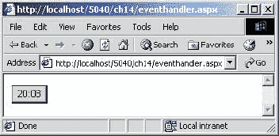

*工作原理*

在本例中，声明了一个 CurrentTimeButton 服务器控件，其对应的`Text` 属性设置为“单击当前时间…”:

```
<asp:Button id="CurrentTimeButton" runat="server"     

 Text="Click for current time..." OnClick="UpdateTime" /> 
```

此外，我们已经为这个按钮控件的`OnClick`事件方法指定了自定义事件处理程序的名称`UpdateTime`。

按钮控件的 OnClick 事件方法本质上是一个占位符，它可以被赋予一个方法名(我们编写的，在这个例子中是 UpdateTime ),以在特定事件被引发时执行处理。我们分配给 OnClick 处理程序的方法名必须符合由事件方法定义的必需的“方法语法”(相同的数量或参数、相同的类型、相同的返回值)。

然后，我们定义了自定义的`UpdateTime` 事件处理程序，用当前时间更新按钮文本，如下所示:

```
Public Sub UpdateTime (ByVal sender As Object, _     

     ByVal e As system.EventArgs)     

  ' Perform custom logic here -- update the button text with      

    current time        

  CurrentTimeButton.Text = DateTime.Now.ToShortTimeString()     

 End Sub 
```

我们在这里所做的就是首先建立`UpdateTime`子例程，然后给我们的`CurrentTimeButton,`的文本属性赋值`DateTime.Now.ToShortTimeString()`。这基本上就是说，“当`UpdateTime` 子例程被触发时，在`CurrentTimeButton`的文本属性中显示当前时间，它是一个字符串数据类型”。

##### 页面生命周期

虽然这个主题在本书的其他地方有所涉及，但是在 ASP.NET 服务器控件的上下文中回顾一下`System.Web.UI.Page`对象的生命周期还是很有价值的。具体来说，我们将简要回顾 ASP.NET 页面类是如何加载、处理事件和关闭的。在设计 web 表单时，您实际上引用了 ASP.NET 页面类的基本功能。因此，Page 类为表单提供了自己的方法、属性和事件。例如，第一次加载 web 窗体时，您可能希望用数据库中的值预加载 Page 对象的服务器控件，或者动态地为页面上的各种服务器控件设置属性值。下列清单概述了在 ASPX 页面对象实现中通常被覆盖的各种方法，这些方法允许您在页面对象生命周期的各个阶段执行处理。

##### 页面 _ 加载

`Page_Load` 方法是 Page 类的一个虚拟方法(回想一下，对象的虚拟方法是您可以覆盖的方法)，这意味着它可以(并且经常)在 Page 类实现中被覆盖。当第一次加载或刷新 ASPX 页面时，将调用 Page_Load 方法。以下是 Page_Load 方法的示例实现:

```
Sub Page_Load(ByVal Sender As System.Object, ByVal e As System.EventArgs)     

 If Not Page.IsPostback Then     

  ' First time page loads --     

  ' perform initialization here!      

 End If      

End Sub 
```

上面清单中最有趣的部分是对 Page 类的`IsPostback` 属性的引用。`IsPostback`属性非常重要，因为该属性可用于区分页面是否是第一次加载，或者是否是由于通常所说的“T2”而加载的——换句话说，如果单击了`Button`服务器控件，就会引发一个`OnClick` 事件，表单数据将被回发到服务器——因此出现了术语“回发”。在过去的几章中，我们已经多次看到这种方法。

在 ASPX 页面中实现`Page_Load`方法最常见的用途是:

*   检查这是第一次处理页面，还是在刷新后执行处理。
*   例如，在第一次处理页面时执行数据绑定，或者在后续的往返过程中重新计算数据绑定表达式，以显示不同排序的数据。
*   读取和更新控件属性。

##### 事件处理

页面生命周期的第二部分是事件处理阶段。加载并显示 ASPX 页面后，当引发控件事件时，将调用其他事件处理程序。例如，在用户点击 ASP.NET 按钮控件后，`OnClick`事件将被引发，从而将事件发送到服务器。如果编写并分配了一个事件处理程序来处理该特定控件的 OnClick 事件，则每当单击按钮控件时都会调用该事件处理程序。

并非所有控件在引发事件时都执行这种自动“回发到”服务器的操作。例如，默认情况下，当文本发生变化时，`TextBox` 控件不会向服务器回发通知。类似地，默认情况下，`ListBox`和`CheckBox` 服务器控件不会在每次选择状态改变时向服务器回发事件通知。对于这些特定的控件，它们的`AutoPostBack`属性(可以设置为`True` 或`False`)需要在控件的声明中显式设置为 T `rue`(或在代码中以编程方式设置)，以便能够将事件/状态更改自动回发到服务器进行处理。

<q>*如果您创建了一个 ASP.NET 服务器控件，每当该控件的状态发生变化时(如复选框被选中时)，该控件都会执行服务器端处理，并且您似乎没有得到预期的结果，请检查该控件是否具有 AutoPostBack 属性，如果有，请将其设置为 True。如果在定义控件时没有显式声明，此属性通常默认为 False。在接下来的“试用”一节中，我们将进一步了解 AutoPostBack 属性的作用。*</q>

##### 页面 _ 卸载

```
Page_Unload serves the opposite purpose of the Page_Load method. The Page_Unload method is used to perform any cleanup just prior to the page being unloaded. It is a virtual method of the Page class, which can be implemented. You would want to implement the Page_Unload method in cases where any of the following actions needed to be performed: 

	*   关闭文件
	*   关闭数据库连接
	*   服务器端对象和/或资源的任何其他清理或丢弃

下面是`Page_Unload`方法的一个示例实现:

```
Sub Page_Unload(ByVal Sender As System.Object, ByVal e As       

System.EventArgs)      

 ' Perform any cleanup here!       

End Sub 
```

需要注意的一点是，当你关闭浏览器或者移动到另一个页面时，页面的卸载不会发生。`Page_Unload`事件发生在页面被 ASP.NET 处理完，并被发送到浏览器之前。
 ***试一试——“哦去旅行，旅行，旅行”*** 
好了，让我们开始吧，用 ASP.NET 服务器控件做一些漂亮的事情。在本节中，我们将构建一个 web 表单 travel.aspx，只需点击几次鼠标，就可以预订从纽约到伦敦的航班！好吧，所以这只是一个演示——我们实际上不会“预订”任何东西(叹气)。然而，我们将获得一些使用各种 ASP.NET 服务器控件构建 web 表单的经验。
 **1。**打开您的代码编辑器，添加以下起始行来布局这个 ASPX 页面的框架，并将其另存为`travel.aspx`:

```
<%@ Page Language="VB" %>      

<%@ Import Namespace="System.Drawing" %>      

ASP.NET Server Controls 481      

   <script language="VB" runat="server">      

   </script>      

 <html>      

 <head></head>      

   <body>      

     <h1>Travel: New York to London</h1>      

        <form id="TravelForm"      

method="post" runat="server">      

        <!-- Flight Info -->      

        <!-- BOOK IT BUTTON SECTION &      

FEEDBACK -->      

        </form>      

   </body>      

 </html>
```

我们将参考。NET Framework 的`Color`结构，因此我们需要在该页面顶部添加一个引用`System.Drawing`名称空间的导入指令。代码的剩余部分由 `<script></script>` 标签部分(我们将在这里插入页面代码)和两个设置页面的 HTML 标签组成。
 **2。**在这一步，我们将在页面上添加一些航班日期框。我们使用 ASP.NET 面板控件作为模拟选项卡上各种控件的容器。panel 控件是显示一个框的可视化工具，在这个框中可以呈现其他控件。添加以下几行:

```
<!-- Flight Info -->      

<asp:panel id="Panel" runat="server" Width="504px" Height="89px"      

 BackColor="Wheat">       

Departure Date:       

<asp:TextBox id="flightDepartureDateTextBox" runat="server"      

 Width="80px" Height="22px"/>       

Return Date:      

<asp:TextBox id="flightReturnDateTextBox" runat="server"      

 Width="80px" Height="22px"/></br>       

<asp:RequiredFieldValidator id="validateFlightDepartureDate"      

 runat="server"      

 ErrorMessage="Please enter a valid Departure Date. "       

 ControlToValidate="flightDepartureDateTextBox" />       

<asp:RequiredFieldValidator id="validateFlightReturnDate"       

 runat="server"      

 ErrorMessage="Please enter a valid Return Date."       

ControlToValidate="flightReturnDateTextBox" />       

<asp:CustomValidator id="validateFlightDates"       

 runat="server"       

 ControlToValidate="flightDepartureDateTextBox"       

 OnServerValidate="ValidateTravelData" />      

</asp:panel>
```

注意，我们添加了三个验证控件:两个`RequiredFieldValidator`控件和一个`CustomValidator`控件。这些控件将迫使用户在`Departure Date`和`Return Date TextBox`控件中输入一个值。`CustomValidator`控件将引发一个`OnServerValidate`事件，并调用我们的`ValidateTravelData`方法，该方法将执行验证日期条目在逻辑上有意义的工作(例如，出发日期不能晚于返回日期)。`RequiredFieldValidator`控件确保某些内容被输入到字段中，因此用户不能跳过某个条目。

 **3。**我们将添加到该表单的下一个控件是`bookTheTripButton`，它将用于向服务器发送表单数据，而`feedbackLabel`标签控件将用于提供指令，并在出现无效数据输入时提供反馈。添加以下几行:

```
<!-- BOOK IT BUTTON SECTION & FEEDBACK -->        

<p>        

<asp:Button id="bookTheTripButton" runat="server"        

 Text="Book This Trip"       

 OnClick="bookTheTripButton_Click" />       

</p>        

<p> <asp:Label id="feedbackLabel" runat="server"        

 BackColor="Wheat"        

Font-Bold="True"       

 Text="Select your options, then click the 'Book This Trip' button!" />        

</p> 
```

 **4。**回想一下第 2 步，我们添加了两个 R `equiredFieldValidator`控件和一个`CustomValidator`控件。在这一节中，我们将为`OnServerValidate` 事件编写事件处理程序，即 `ValidateTravelData`方法，以验证我们的日期及其逻辑。在脚本标记之间添加以下行:

```
<script language="VB" runat="server">        

Protected Sub ValidateTravelData (source As Object, _       

  args As System.Web.UI.WebControls.ServerValidateEventArgs)       

 ' Since we have a bit to validate       

 ' assume that the entry is invalid...       

 args.IsValid = False        

Dim departDate, returnDate As Date        

feedbackLabel.ForeColor = Color.Red        

Try        

  departDate = Date.Parse (flightDepartureDateTextBox.Text)        

Catch ex As Exception         

  feedbackLabel.Text = "Invalid data entry: Departure Date        

  is invalid. " _       

    + "Enter a valid date, for example: 2001/07/04"        

  Return        

End Try        

Try       

  returnDate = Date.Parse(flightReturnDateTextBox.Text)       

Catch ex As Exception       

  feedbackLabel.Text = "Invalid data entry: Return Date        

is invalid. " _       

    + "Enter a valid date, for example: 2001/07/04"        

Return       

End Try            

' Verify that the departure date is less than the       

' return date - no same day trips in this system!       

If (departDate >= returnDate) Then       

  feedbackLabel.Text = "Invalid data entry: The Departure Date        

must be " _        

  + "earlier than the Return Date and no same-day " _        

  + "returns for this travel package!"       

  Return       

End If            

' Verify that the departure date is not in the past or today!       

If (departDate < Date.Now) Then       

  feedbackLabel.Text = "Invalid data       

entry:  The Departure        

Date cannot " _        

  + "be in the past or today!"       

  Return       

End If       

  ' Everthing is valid - set the IsValid flag...       

  args.IsValid = True       

End Sub       

</script>
```

 **5。**这个`travel.aspx` 例子的最后一步是为`bookTheTripButton's OnClick`事件编写一个事件处理程序。将以下几行添加到您的<脚本>块中，在我们刚刚添加的几行之后:

```
<script language="VB" runat="server">        

...        

Private Sub bookTheTripButton_Click(ByVal sender As System.Object, _       

  ByVal e As System.EventArgs)        

' Has the page been validated for all data entry?        

If (Not Page.IsValid) Then        

  Return        

End if        

' We're all set - book the flight!        

Dim departDate, returnDate As Date        

departDate = Date.Parse(flightDepartureDateTextBox.Text)        

returnDate = Date.Parse(flightReturnDateTextBox.Text)        

feedbackLabel.ForeColor = Color.Black        

feedbackLabel.Text = "Success! Your trip from New York to London " _        

    + "will depart on the " _        

    + departDate.ToLongDateString() _        

    + " and return on the " _        

    + returnDate.ToLongDateString()        

End Sub        

</script> 
```

如果您在浏览器中加载 travel.aspx，您应该会看到类似以下页面的内容:


在`travel.aspx`的`<!-- Flight Info -->`部分，我们开始创建面板，在其中我们将包含我们的文本框，并设置它的颜色、宽度和高度(以像素为单位)。然后我们创建我们的`Departure Date`和`Return Date`文本框，再次指定它们的大小。

```
<asp:panel id="Panel" runat="server" Width="504px" Height="89px"         

BackColor="Wheat">         

Departure Date:         

<asp:TextBox id="flightDepartureDateTextBox" runat="server"        

  Width="80px" Height="22px"/>         

Return Date:         

<asp:TextBox id="flightReturnDateTextBox" runat="server"         

  Width="80px" Height="22px"/></br> 
```

然后我们继续验证`Departure Date` 和`Return Date`文本框条目。在我们建立了`RequiredFieldValidator`控件之后，我们向页面添加了一个`CustomValidator`控件——我们分配给 O `nServerValidate`事件属性的事件处理程序是`ValidateTravelData`:

```
<asp:CustomValidator id="validateFlightDates" runat="server"         

  ControlToValidate="flightDepartureDateTextBox"           

  OnServerValidate="ValidateTravelData" /> 
```

当表单回发到服务器时，将调用此方法。在这个例子中，我们关心的是`Departure Date`和`Return Date TextBox`控件中的数据条目。我们已经知道用户输入了什么——`RequiredFieldValidator` 控件处理了这个任务。我们仍然不知道用户输入的日期是否有效——这将是我们的`CustomValidator`方法处理程序`ValidateTravelData`的工作。让我们回顾一下第 4 步中的相关部分:

```
Protected Sub ValidateTravelData (source As Object, _        

    args As System.Web.UI.WebControls.ServerValidateEventArgs)         

  ' Since we have a bit to validate         

  ' assume that the entry is invalid....         

  args.IsValid = False         

  Dim departDate, returnDate As Date         

  feedbackLabel.ForeColor = Color.Red         

  Try         

    departDate = Date.Parse(flightDepartureDateTextBox.Text)         

  Catch ex As Exception         

    feedbackLabel.Text = "Invalid data entry: Departure Date is         

    invalid. " _         

      + "Enter a valid date, for example: 2001/07/04"         

    Return         

  End Try         

  Try 
```

我们做的第一件事，是将 args 参数的`IsValid`属性(一个`ServerValidateEventArgs`对象)设置为`False`:

```
args.IsValid = False 
```

我们在这里是悲观的，但是在我们验证所有东西之前，我们希望确保没有任何东西通过我们的验证测试，直到方法的最后。接下来，我们声明两个日期类型的变量:

```
Dim departDate, returnDate As Date 
```

我们在`Try ... Catch block`内执行获取用户日期输入的工作，因此我们可以捕捉异常:

```
 Try        

    departDate = Date.Parse(flightDepartureDateTextBox.Text)         

  Catch ex As Exception         

    feedbackLabel.Text = "Invalid data entry: Departure Date is         

    invalid. " _         

      + "Enter a valid date, for example: 2001/07/04"         

    Return         

  End Try 
```

调用`Date` 对象的静态解析方法来传递用户的`Departure Date`条目。在以下两种情况下将引发异常:空日期(没有输入日期)，或者输入了格式错误或不正确的日期；不符合`Date`数据类型标准的数据。`flightReturnDateTextBox`也同样有效:

```
Try        

  returnDate = Date.Parse(flightReturnDateTextBox.Text)        

Catch ex As Exception         

  feedbackLabel.Text = "Invalid data entry: Return Date is invalid. " _         

      + "Enter a valid date, for example: 2001/07/04"         

  Return         

End Try
```

如果抛出异常，我们通过在代码文件的`<!-- BOOK IT BUTTON SECTION & FEEDBACK -->`部分创建的 feedbackLabel 为用户提供一些反馈文本。然后，我们立即将执行返回给调用该子例程的程序，这样用户就可以再次执行了。例如，尝试输入`Today`作为您的出发日期，输入`Tomorrow` 作为您的返回日期，您会看到:

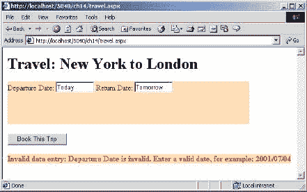

即使在确认用户输入了两个有效日期之后，仍然还有一些工作要做。下一次验证确保输入的出发日期早于返回日期:

```
' Verify that the departure date is less than the          

' return date - no same day trips in this system!          

If (departDate >= returnDate) Then          

  feedbackLabel.Text = "Invalid data entry: The Departure Date must          

  be " _          

      + "earlier than the Return Date and no same-day " _          

      + "returns for this travel package!"          

  Return          

End If 
```

这一部分的代码非常简单，只使用了一个 if 语句，如果出发日期晚于返回日期，就会发送一条反馈消息。然后，代码返回到调用验证控件之前的状态。为了使事情更加可靠，我们使用相同的技术验证出发日期不是在过去:

```
' Verify that the departure date is not in the past or today!          

If (departDate < Date.Now) Then          

  feedbackLabel.Text = "Invalid data entry: The Departure Date          

  cannot " _          

      + "be in the past or today!"          

  Return          

End If
```

如果我们试图预订从纽约到伦敦的旅程，而不在`Departure Date`和`Return Date`框中输入任何内容，那么分配的`RequiredFieldValidator`控件将开始运行并向用户显示一条消息:

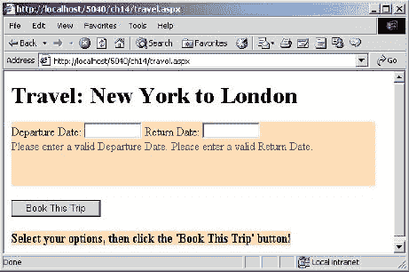

正如您可能已经注意到的，日期验证可能有点乏味——但是值得努力！这个实现的好处是我们不需要限制用户使用特定的日期格式来输入数据。是的，我们建议使用类似 YYYY/mm/dd 的格式，但是用户可以输入“10/31/2001”甚至“2001 年 10 月 31 日”——这是因为我们调用了`Date.Parse`方法，该方法完成了解析用户日期输入的工作。

我们来快速看一下 web 表单的按钮功能。按钮本身非常简单——我们只是给它一些文本，并将它的`OnClick` 事件定义为`bookTheTripButton_Click`:

```
<p>          

<asp:Button id="bookTheTripButton" runat="server" Text="Book This Trip"          

    OnClick="bookTheTripButton_Click" />          

</p> 
```

当单击按钮时，它将表单信息发送回服务器，然后服务器处理我们使用过的所有服务器控件。如果我们的页面验证正确(如果`args.IsValid = True`)，我们的`bookTheTripButton OnClick` 事件被触发:

```
Private Sub bookTheTripButton_Click(ByVal sender As System.Object, _          

    ByVal e As System.EventArgs)          

' Has the page been validated for all data entry?          

If (Not Page.IsValid) Then          

  Return          

End if          

' We're all set - book the flight!          

Dim departDate, returnDate As Date          

departDate = Date.Parse(flightDepartureDateTextBox.Text)          

returnDate = Date.Parse(flightReturnDateTextBox.Text)          

feedbackLabel.ForeColor = Color.Black          

feedbackLabel.Text = "Success! Your trip from New York to London " _          

      + "will depart on the " _          

      + departDate.ToLongDateString() _          

      + " and return on the " _          

      + returnDate.ToLongDateString()          

End Sub 
```

最后，当所有的日期和逻辑都被验证后，我们从纽约到伦敦的旅程将通过简单的点击鼠标来预订:

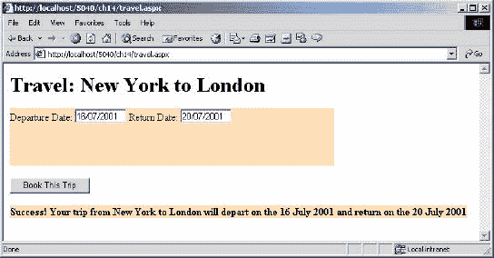

##### 控制家庭

ASP.NET 服务器控件可以分为四个基本的家族类型:**内在、验证、丰富**和**数据呈现**控件。这些控件系列相当广泛，主要基于控件的功能或用途。

设计 web 表单时，您通常需要问自己两个问题:“我需要显示什么？”以及“我该如何展示它？”。一旦您熟悉了各种控件及其功能，就可以相对容易地知道您需要哪个 ASP.NET 服务器控件来完成工作。当您创建 ASP.NET 页面时，您可以自由地在页面中混合和匹配各种不同的控件，包括标准的 HTML 控件。

 ***内在控制*** 

这些是直接对应 HTML 命令的控件，比如`Button`、`Checkbox`、`DropDownList`和`TextBox`。我们现在很熟悉这些控件，因为我们在本书中一直在使用它们，所以我们不会再花时间解释它们是如何工作的，但这里有一个列表可以提醒您哪些控件属于这一组:

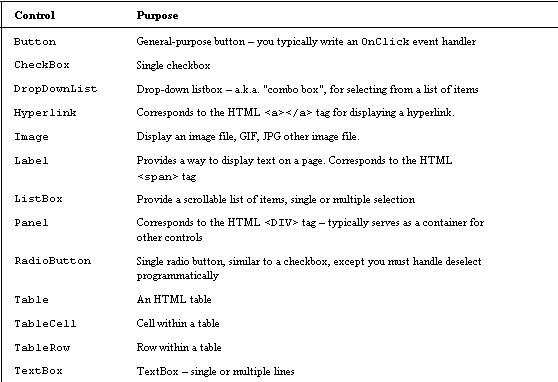

 ***验证控件*** 

任何给定的 web 表单的价值都可以通过其设计收集的数据的准确性来衡量。如果数据是伪造的，缺少值，超出范围，或者根本没有意义，您的客户可能会很快抱怨！

为了帮助缓解无效数据输入的问题，并减轻一些开发负担，微软提供了一系列 ASP.NET 服务器控件，专门用于验证输入，并在必要时向用户提供反馈。

验证控件是一个很好的例子，它说明了 ASP.NET 服务器控件通常如何抽象通常涉及手动客户端验证脚本的常见任务。通过在 ASP.NET web 窗体中使用 ASP.NET 验证控件，开发人员可以从为他们的网页编写自定义客户端验证的工作中解脱出来。在许多情况下，验证用户的数据输入是很重要的。例如，如果我们编写了一个收集用户名和密码的登录表单，我们会希望在将数据传递给服务器之前验证这些字段是否已输入。

我们已经在 travel.aspx 中看到了一些有效的验证控件，所以我们不会在这里花太多时间来研究它们。只需浏览一下下面的控件列表，就能了解什么是可能的:

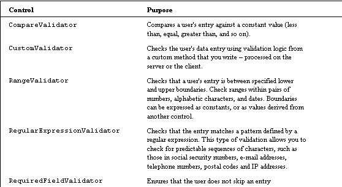

 ***丰富的控件*** 

丰富控件本质上是复合控件，并提供扩展的功能。换句话说，这些控件通常是两个或更多内在控件的组合，在一个控件中提供相似但不同的功能。这些控件的另一个显著特点是，它们与任何 HTML 控件都没有任何直接关联，尽管它们在客户端浏览器中显示时确实会呈现为 HTML。

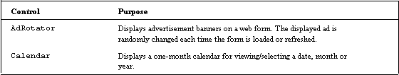

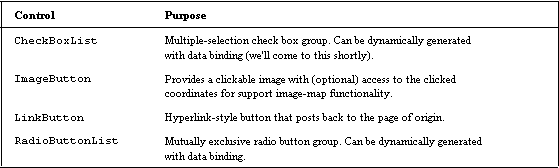

这个“富控件”家族的好处是它们和其他 ASP.NET 服务器控件一样易于使用。它们可能拥有更多的功能和属性，但定义它们并以编程方式与之交互的基本方式与所有 ASP.NET 服务器控件完全相同。我们还没有看到太多这样的控件，所以让我们来看看它们是如何使用的(要了解其他控件有什么属性，请查阅文档)。

*日历*

该控件最简单和最实用的用途之一是允许用户选择特定的日期。甚至可以通过`SelectionMode` 属性配置控件，允许用户选择日期范围。`Calendar`控件有许多属性，我们将在这里列出一些特别有趣的属性:

```
<asp:Calendar id="Calendar1" runat="server"            

  FirstDayOfWeek="Default|Monday|Tuesday|Wednesday|            

  Thursday|Friday|Saturday|Sunday" 
```

这里值得注意的是`FirstDayOfWeek`属性——这使您能够选择日历从一周的哪一天开始，我们将在本章末尾的示例中使用该属性。一些日历默认将星期日作为一周的第一天，但是出于商业目的，从星期一开始查看一周通常更实际。一个很好的功能！

```
 SelectionMode="None|Day|DayWeek|DayWeekMonth" 
```

默认情况下，Calendar 控件的 SelectionMode 默认为 Day。当您希望用户选择一天时，这很有用。但是，您可以通过将 SelectionMode 属性设置为 DayWeek(这将允许您选择一天或一整周)或 DayWeekMonth(这将允许您选择一天、一整周或整个月)来选择多天:

```
 SelectMonthText="HTML text"            

  SelectWeekText="HTML text" 
```

日历控件的`SelectMonthText` 和`SelectWeekText` 允许您定制 HTML——如果您真的想要定制外观，请使用这些属性。

您不需要定义 ASP.NET 日历控件的所有属性来显示该控件。事实上，下面的声明将创建一个 ASP.NET 日历服务器控件，根据您的喜好和需要，它看起来和显示起来都非常漂亮:

```
<asp:Calendar id="MyCalendarControl" runat="server" />
```

当交付到客户端浏览器时，结果是一个 HTML 日历显示，它提供了一些链接，定义这些链接后，您可以在不同的日期、月份和年份之间导航。自己尝试一下:

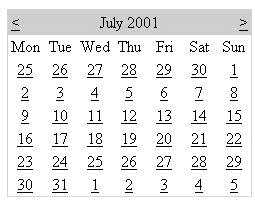

看看你的 ASP.NET 为创建这个页面生成的 HTML——生成了 100 多行代码，包括 HTML 和 JavaScript，而你只写了一行！

ASP.NET 日历控件功能非常丰富。有关此控件的完整详细信息，请参考 ASP.NET 文档。

*链接按钮*

L `inkButton` 控件在功能上很像按钮控件。但是，该控件的不同之处在于，在客户端浏览器中呈现时，它看起来像一个传统的超链接。对象的功能依赖于`OnClick`事件处理程序是如何实现的。下面是一个`LinkButton`声明的例子:

```
<html>            

  <body>            

    <form runat="server">             

      <asp:LinkButton id="WroxLinkButton" runat="server"             

        Text="Visit the Wrox Press Home Page" />             

    </form>             

  </body>             

</html> 
```

在此示例中，设置了 Text 属性，并为 OnClick 事件分配了方法处理程序的名称 OnWroxLinkButtonClick。当在浏览器中显示时，这个特定的 LinkButton 将如下所示:

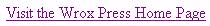

如果我们向链接按钮添加了以下事件处理程序 OnClick 事件:

```
<script language="VB" runat="server">             

  Public Sub OnWroxLinkButtonClick(sender As Object , e             

  As System.EventArgs)             

    Response.Redirect("http://www.wrox.com")             

  End Sub             

</script> 
```

链接按钮的 OnClick 事件:

```
<html>            

  <body>            

    <form runat="server">            

      <asp:LinkButton id="WroxLinkButton" runat="server"             

        Text="Visit the Wrox Press Home Page"             

        OnClick="OnWroxLinkButtonClick" />             

    </form>             

  </body>             

</html> 
```

我们在 Wrox 网站结束！你自己试试。

这是一个按钮，而不是一个简单的超链接，因此我们可以用它来执行服务器端的处理，比如将条目记录到数据库中，以便跟踪我们网站的 URL 使用情况。

##### 数据呈现控件

这些控件的功能非常丰富(它们有许多属性可供选择)，并且极大地简化了显示各种数据的工作，尤其是与数据库相关的数据。在这些控制的上下文中,“数据”的定义非常宽泛。它可以包括数据库记录、一个`ArrayList`、一个 XML 数据源等等。

在我们研究控件本身之前，我们需要掌握两个重要的概念:

*   **数据绑定。**这个术语用于描述将数据存储中的信息(可以是从数据库表到`ArrayList` 对象)与服务器控件相关联的过程。数据绑定是通过设置服务器控件的`DataSource`属性来引用一组特定的数据(类似于`DataSource = set of data`)来建立的。所有引用的数据都将来自此数据源。一旦建立了这种链接，数据集对象就会引用该数据集。

*   **模板。**这是一种定义特定控件的各种布局元素的方法；描述数据在浏览器中的显示方式。`DataGrid`和`DataList` 有默认的模板，所以如果你想改变默认的外观，你只需要创建模板。现在让我们来看看这些控件:

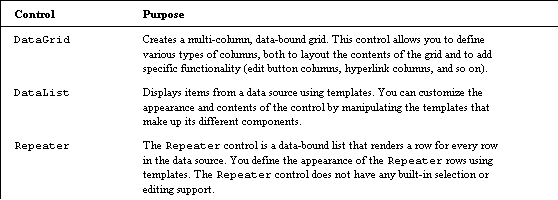

这些控制有很多。每一个都非常强大，不幸的是，彻底检查它们超出了本书的范围(每一个都至少值得一整章)。然而，让我们更仔细地看一看，每一个是如何工作的。

*数据网格*

除了允许您创建网格，`DataGrid`控件还允许您使用模板格式化它的列和行来控制网格的布局(参见`DataList`控件以获得一些模板的列表)。例如，您可以交替显示数据行的颜色。除了模板，该控件还支持几个有趣的属性，包括:

*   AllowSorting:使您能够基于选定的列动态排序和重新显示数据。例如，如果您有一个包含雇员姓氏和薪水的表，启用排序将允许您根据任一列对表进行排序。

*   AllowPaging:在不同页面上查看由`DataGrid`控件调用的数据子集的能力。页面上显示的项目数量由`PageSize`属性决定。

*   AlternatingItemStyle:列出的每个其他项目的样式(如背景色)。

*   FooterStyle:列表末尾页脚的样式(如果有)。

*   HeaderStyle:列表开头的标题的样式(如果有)。

*   ItemStyle:单个项目的样式。

要使用`DataGrid`控件，您必须在标记中指定它，设置相关的属性，定义表中的列，然后为这些列应用相关的模板。在模板标记中，您包括模板必须应用到的信息:

```
<asp:DataGrid id="EventData"             

  AllowSorting="true"             

    <Columns>              

      <asp:TemplateColumn HeaderText="Column1">              

        <ItemTemplate>              

          <%# Container.DataItem("ShortDesc") %>              

        </ItemTemplate>              

      </asp:TemplateColumn>              

      <asp:TemplateColumn HeaderText="Column2">                      

        <ItemTemplate>                        

          <%# Container.DataItem("DetailDesc") %>                      

        </ItemTemplate>                    

      </asp:TemplateColumn>                  

    </Columns>              

</asp:DataGrid> 
```

我们将在本章的最后一节中看到 DataGrid 控件的实际应用。

*数据表*

使用**模板**和**样式**，可以非常精确地控制显示数据库信息行(可以成为 DataGrid 表中的列)的格式。操作各种模板控件会改变数据的显示方式。`DataList`控件使您能够选择和编辑显示的数据。下面列出了一些受支持的模板:

*   `ItemTemplate:`为`DataList`引用的项目提供内容和布局的必需模板。

*   `AlternatingItemTemplate:`如果定义，该模板为`DataList`中的交替项提供内容和布局。如果未定义，则使用`ItemTemplate`。

*   `EditItemTemplate`:如果定义，该模板为`DataList`中设置为“编辑”的项目提供编辑控件，如文本框。如果未定义，则使用`ItemTemplate`。

*   `FooterTemplate`:如果定义了，`FooterTemplate`为`DataList`的页脚部分提供内容和布局。如果未定义，将不显示页脚部分。

*   `HeaderTemplate`:如果定义的话，为`DataList`的头部分提供内容和布局。如果未定义，将不显示标题部分。

*   `SelectedItemTemplate`:如果定义的话，这个模板为 `DataList`中当前选中的项目提供内容和布局。如果未定义，则使用`ItemTemplate`。

*   `SeparatorTemplate`:如果定义的话，提供`DataList`中项目间分隔符的内容和布局。如果未定义，将不会显示分隔符。

要使用 `DataList` 控件及其模板，您必须在标签中指定它，然后在标签中指定您的模板。与`DataGrid`不同，受模板影响的项目出现在模板标签中。每个模板都有自己的一组属性，可以在。NET 文档(记得一定要定义好你的`DataSource`):

```
<asp:DataList id="DataList1" runat="server">              

  <FooterTemplate>             

   'Items to be affected by this template              

  </FooterTemplate>              

  <SeparatorTemplate>              

    'Items to be affected by this template              

  </SeparatorTemplate>              

</asp:DataList> 
```

如果您使用`DataList`控件在网格中设置一列，您可以使用 `DataGrid`控件在该列中设置额外的模板。有关更多信息，请参考 ASP.NET 文档。

*中继器*

`Repeater`控件与`DataList`控件非常相似，但有一个非常重要的区别:显示的数据总是**只读的**——您不能编辑显示的数据。这对于显示重复的数据行特别有用。像`DataGrid`和`DataList`控件一样，它利用模板来呈现各个部分。它使用的模板通常与`DataList`控件使用的模板相同，语法也相同。在接下来的试用中，我们将看到一个使用`Repeater`控件的例子。

我们已经看完了本章中几乎所有的内容。剩下要做的就是通过两个练习把所有的东西都集合起来，第一个练习创建一个动态日历，第二个练习使用`EditItemTemplate`创建一个可编辑的信息表。

 ***试试吧—我的日历*** 

在本章的前几节中，您已经接触了许多最常见的 ASP.NET 服务器控件，包括`Calendar`控件。许多网站，尤其是个人主页，共享关于即将发生的事件的信息。例如，一个本地足球队可能有一个网站，为球员、父母、教练等显示该队的比赛时间表；或者乐队可以显示在线日历，为他们的粉丝显示所有即将到来的演出。无论哪种情况，在网页上呈现直观且熟悉的日历相关事件或约会的能力都是至关重要的。

由于日历在许多情况下的中心地位，我们决定围绕`Calendar`控件进行尝试。我们不会试图复制桌面日历工具的高级功能，比如微软的 Outlook。我们的应用程序的对象将是在一个熟悉的日历的上下文中，在 Web 上共享一些关键的日期和约会。

为了进一步充实，下面是我们将为`MyCalendar`应用程序实现的一些特性的小规格:

*   `Calendar`控件应该从 XML 文件中读取我们的日历数据(我们将使用 XML 文件作为数据源)。这将使更新和更改日历数据变得容易，而不必更改 ASPX 文件。因此，我们的任何约会或活动都不会被硬编码到 ASPX 页面中。

*   我们希望能够在一天内看到几个事件。

*   虽然我们显然希望在日历上看到事件或约会的标题，但我们也希望看到一些附加信息(例如，事件的详细描述和开始/结束时间)。要实现这一点，当我们单击事件链接时，应该会出现所有详细信息的列表。

*   虽然`Calendar`控件默认星期日为该月的第一天，但我们希望该月的第一天是星期一。

*   周末应该以稍微不同的色调显示(所以我们知道他们来了！)，作为上个月或下个月的一部分的日子也应该如此。

因为我们从 XML 文件中获取所有信息，所以让我们从将要使用的 XML 开始。

***XML 源— MyCalendar.xml *** 

我们将使用的 XML 源文件将只包含我们希望在`Calendar`控件中显示的基本信息。与整本书的所有列表一样，`MyCalendar.xml`文件可以在[www.wrox.com](http://www.wrox.com)下载。下面提供了`MyCalendar.xml`文件的摘录，只是为了向您展示所使用的 XML 语法，以及一些示例数据:

```
<MyCalendar>              

  <Event>               

    <ShortDesc>Concert at the Riverfront</ShortDesc>               

    <DetailDesc>4th of July celebration. Bring stand and a jacket.              

    </DetailDesc>               

    <EventDate>2001/07/04</EventDate>               

    <StartTime>9:30PM</StartTime>               

    <EndTime>11:00PM</EndTime>               

  </Event>               

  <Event>               

    <ShortDesc>CCT Rehearsal - Brigadoon</ShortDesc>               

    <DetailDesc>Community Theatre orchestra rehearsal - bring mutes.              

    </DetailDesc>               

    <EventDate>2001/07/14</EventDate>               

    <StartTime>3:30PM</StartTime>               

    <EndTime>6:30PM</EndTime>               

  </Event>               

</MyCalendar> 
```

这个 XML 文件的元素相当简单:

*   `MyCalendar` —根元素。XML 需要一个根元素来包含子元素。

*   `Event` —基本上作为每组元素的主要父元素。

*   `ShortDesc` —事件的简短描述。

*   对事件的详细描述，可以是随意的笔记、评论或想法。

*   `EventDate` —事件发生的日期。在示例数据中，使用的格式是 yyyy/mm/dd，这应该有助于消除各种本地日期差异之间的任何歧义。事实上，因为我们将使用`DateTime`对象来引用这些信息，`DateTime`对象可以解析的任何有效格式都是可以接受的。话虽如此，您可能更喜欢使用您当地的日期格式——这当然更容易阅读，因为这是您所习惯的。

*   `StartTime ` —事件开始的时间。

*   `EndTime` -事件结束的时间。

XML 文件的其余部分与这个摘录非常相似——它只包含我们将在 MyCalendar.aspx 文件中引用的信息。现在让我们来看看这个。

***Web 表单— MyCalendar.aspx *** 

下面是 MyCalendar.aspx web 表单实现的完整列表。您将在一系列渐进步骤中声明该 web 表单中使用的各种 ASP.NET 服务器控件，以及相应的代码和事件处理程序。这个例子很长，因此我们将在整个过程中讨论更多的内容。最后，进一步的分析和讨论将在随后的“它是如何工作的”一节中提供。

 **1。**从[www.wrox.com](http://www.wrox.com)下载`MyCalendar.xml`，保存在你的 BegASPNET 虚拟目录的第 14 章文件夹中。

 **2。**创建一个名为`MyCalendar.aspx`的新文件，保存在与`MyCalendar.xml`相同的文件夹中，并添加以下几行，它们将作为创建页面的 ASP.NET 服务器控件对象的起点，以及相应的代码和事件处理程序:

```
<%@ Page Language="VB" %>                

<%@ Import Namespace="System.Data"%>                

<%@ Import Namespace="System.IO" %>                

<html>                

<head>                

<script language="VB" runat="server">                

</script>                

</head>                

<body>                

</body>                

</html> 
```

 **3。**在<正文>标签之间添加以下代码:

```
<body>                

  <h1>My Calendar</h1>                

    <form id="MyCalendarForm" method="post" runat="server">                

      <p align="center">                

      <asp:Calendar id="MyCalendar" runat="server"                

        SelectedDate="2001/07/17"                

        VisibleDate="2001/07/01"                

        FirstDayOfWeek="Monday"                

        DayNameFormat="Full"                

        ShowDayHeader="True"                

        ShowGridLines="True"                

        ShowNextPrevMonth="True"                

        ShowTitle="True"                

        nextprevstyle-backcolor="DodgerBlue"                         

        nextprevstyle-forecolor="White"                

        nextprevstyle-font-bold="True"                

        nextprevstyle-font-size="Large"                

        TitleFormat="MonthYear"                

        TitleStyle-BackColor="DodgerBlue"                

        TitleStyle-ForeColor="White"                

        TitleStyle-Font-Size="Large"                

        TitleStyle-Font-Bold="True"                

        dayheaderstyle-backcolor="DodgerBlue"                

        dayheaderstyle-forecolor="White"                

        daystyle-horizontalalign="Left"               

        daystyle-verticalalign="Top"               

        daystyle-font-size="Small"                

        SelectedDayStyle-Font-Bold="True"                   

        selecteddaystyle-horizontalalign="Left"               

        selecteddaystyle-verticalalign="Top"                  

        selecteddaystyle-font-size="Small"                

        selecteddaystyle-forecolor="Red"                 

        TodayDayStyle-HorizontalAlign="Left"                   

        TodayDayStyle-VerticalAlign="Top"                 

        todaydaystyle-backcolor="White"                     

      </asp:Calendar>                     

      </p>                    

    </form>                

</body>
```

在这一步，我们将添加页面的主要可视组件——ASP.NET`Calendar`控件。`Calendar`控件将响应事件，它是在一个<表单>标签的上下文中声明的。这里定义的众多属性不仅会赋予`Calendar`控件独特的外观，还会影响它的行为。例如，`FirstDayOfWeek`属性被设置为“星期一”。如果你浏览一下我们在这里定义的其他属性，你会发现它们是不言自明的。

到目前为止，有几件事需要注意:`SelectedDate`和`VisibleDate`属性是硬编码的，只是为了演示的目的——这将在后面的工作原理一节中详细讨论。

为了结束这个`Calendar`控件的定义，在结束`</asp:Calendar>`标签之前为`OnDayRender`和`OnSelectionChanged`事件分配事件处理程序。这些将在本节稍后详细解释:

```
<body>                

...                

      OnDayRender="MyCalendar_DayRender"                

      OnSelectionChanged="MyCalendar_SelectionChanged">                

    </asp:Calendar>                

    </p>                

  </form>                

</body>
```

 **4。**您现在将向页面添加一个`Label` 控件，该控件稍后将向用户提供一些关于当前所选日期的日期选择反馈。在声明了`Calendar`控件之后，在`</form>`结束标记之前添加以下代码行:

```
<body>                 

...                 

    <p align="center">                 

    <asp:label id="SelectedDate" runat="server" font-size="Large" />                 

    </p>                 

  </form>                 

</body> 
```

 **5。**本例中使用的最终可视组件由两个控件组成:`Panel` 和`Repeater`控件。当用户从日历中选择一个日期时，`Calendar`控件将引发`OnSelectionChanged`事件(我们在步骤 2 中指定了处理程序)。这将使我们能够收集所有日常事件的`ArrayList` ，并将它们绑定到`Repeater`控件。ASP.NET`Panel`控件作为`Repeater`控件的容器，将用于控制显示的`Repeater`元素的可见性状态(当`Panel`控件的`Visible`属性设置为 false 时，所有相应的子控件，如`Repeater`控件，也被隐藏)。

我们在这里添加的代码只是设置了`Repeater`控件(在面板控件中)并建立了模板的属性，这些属性将用于显示我们的信息。在最后的`</form>`结束标签前插入以下 ASP.NET 面板和中继器控制声明:

```
<body>                 

...                 

  <asp:panel id="DailyDetailsPanel" runat="server">                 

  <asp:Repeater id="DailyEventDetailRepeater" runat="server">                 

    <HeaderTemplate> <p align="center">                 

    <table border="1" width="100%">                 

    <table style="color:Black;border collapse:collapse;">                 

      <tr style="color:White;background-color:DodgerBlue;font                

      -weight:bold;">                   

      <td><b>Event</b></td>                 

      <td><b>Description</b></td>                 

      <td><b>Start Time</b></td>                 

      <td><b>End Time</b></td>                 

    </tr>                 

  </HeaderTemplate>                 

  <ItemTemplate>                 

    <tr style="background-color:White;">                 

      <td> <%# DataBinder.Eval(Container.DataItem, "ShortDesc") %>                 

      </td>                 

      <td> <%# DataBinder.Eval(Container.DataItem, "DetailDesc")%>                 

      </td>                 

      <td> <%# DataBinder.Eval(Container.DataItem, "StartTime") %>                

      </td>                 

      <td> <%# DataBinder.Eval(Container.DataItem, "EndTime") %>                

      </td>                 

    </tr>                     

  </ItemTemplate >                 

  <AlternatingItemTemplate>                 

    <tr style="background-color:Gainsboro;">                 

      <td> <%# DataBinder.Eval(Container.DataItem, "ShortDesc") %>                

      </td>                 

      <td> <%# DataBinder.Eval(Container.DataItem, "DetailDesc")%>                

      </td>                 

      <td> <%# DataBinder.Eval(Container.DataItem, "StartTime") %>                

      </td>                 

      <td> <%# DataBinder.Eval(Container.DataItem, "EndTime") %>                

      </td>                 

    </tr>                 

  </AlternatingItemTemplate>                 

  <FooterTemplate>                 

  </table>                 

  </p>                 

  </FooterTemplate>                 

  </asp:Repeater>                 

  </asp:panel>                 

 </form>                 

</body>
```

 **6。**至此，MyCalendar.aspx 中使用的所有可视化组件都已声明并设置完毕。在接下来的几个步骤中，我们将在页面的`<script> </script>`标记之间添加方法和事件处理程序代码实现。为`Page_Load`方法实现添加以下代码:

```
<script language="VB" runat="server">                   

Protected Sub Page_Load(ByVal Sender As System.Object, _                  

ByVal e As System.EventArgs)                     

    If Not IsPostback Then                       

      ShowDailyEvents()                     

    End If                   

  End Sub                 

</script> 
```

在这个清单中，`IsPostback`属性被检查以查看这是否是页面第一次被加载——如果是，方法`ShowDailyEvents`被调用，它将在`Repeater`控件中执行绑定和显示每日事件数据的工作。我们将很快定义`ShowDailyEvents`。

 **7。**这个页面中的`Calendar` 控件为我们在步骤 2 中添加的`OnSelectionChanged`事件声明了一个事件处理程序。请记住，在步骤 2 中，我们分配的事件处理程序的名称是`MyCalendar_SelectionChanged`。这个事件处理程序的实现应该添加在`<script> </script>` 标签中，在我们刚刚添加的`Page_Load`方法下面，如下所示:

```
<script language="VB" runat="server">                  

...                    

Public Sub MyCalendar_SelectionChanged(ByVal sender As Object, _                   

ByVal e As System.EventArgs)                      

    ShowDailyEvents()                   

  End Sub                  

</script> 
```

当用户在日历控件上点击一个新的日期(从而触发`OnSelectionChanged`事件)时，`MyCalendar_SelectionChanged`事件处理程序将调用`ShowDailyEvents`方法。所以这在功能上几乎与我们上面的`Page_Load` 实现相同。

 **8。**为了在`Calendar`控件中显示我们的自定义日历事件，我们必须编写一个方法，将数据从`MyCalendar.xml`加载到一个`DataSet`对象中。实现如下(同样，将这段代码添加到您的`<script> </script>`标记中，在我们刚刚添加的事件处理程序下面):

```
<script language="VB" runat="server">                  

...                    

Protected Function LoadMyCalendarData() As DataSet                      

    Dim sourceXML as String = Server.MapPath("MyCalendar.xml")                        

      If ( Not File.Exists ( sourceXML ) ) Then                          

        Return Nothing                  

      End if                  

    Dim cachedDataSet as DataSet = Session("MyCalendarData")                  

        if ( Not cachedDataSet Is Nothing ) Then                  

          Return cachedDataSet                  

        End if                  

    Dim dataSet As DataSet = New DataSet()                  

  Try                  

    dataSet.ReadXml(sourceXML)                  

    Session("MyCalendarData") = dataSet                  

  Catch e As Exception                  

    SelectedDate.Text = e.Message                  

    dataSet = Nothing                  

  End Try                  

  Return dataSet                  

 End Function                  

</script>
```

从这个清单中可以观察到的要点是，我们首先检查文件`MyCalendar.xml`(我们在第一行中连同文件的位置一起定义为 sourceXML)是否存在。如果它不存在于服务器文件系统中，我们将无法在`Calendar`或`Repeater`控件中显示任何自定义日历数据。还要注意，我们使用`Session`对象来确定我们是否已经加载(或缓存)了这个`DataSet` 对象——如果是，我们可以使用它并稍微优化我们的代码。我们将在“它是如何工作的”一节中详细讨论这一点。`Try`块中的代码部分通过`ReadXml`方法将 XML 数据加载到`DataSet` 对象中(这使得文件中的 XML 能够被读取)。Catch 块检查`LoadMyCalendarData`在被调用时是否返回某些内容，因为有可能什么都不会返回，特别是当`MyCalendar.xml` 包含任何格式错误的数据时:

 **9。通过为`Calendar` 控件的`OnDayRender`事件实现一个事件处理程序，我们能够在日历中显示我们自己的数据，该事件在每次呈现日历中可见的一天时被引发。`MyCalendar_DayRender` 方法(还记得我们在第 2 步中介绍的)通过遍历`DataSe` t 中的每个记录来呈现`Calendar`控件的`Cell` 显示，以确定在呈现的特定日期是否有事件要显示。该方法还将执行设置各种`Cell.BackColor`属性的工作，基于被渲染的日期是周末、工作日还是下个月或上个月的某一天。它的实现如下，并且将再次放在`<script> </script>`标签中:**

```
<script language="VB" runat="server">                  

...                  

    Protected Sub MyCalendar_DayRender(ByVal Sender As System.Object, _                  

          ByVal e As DayRenderEventArgs )                    

    if ( e.Day.IsOtherMonth )                           

      e.Cell.BackColor=System.Drawing.Color.FromName("Gainsboro")                      

    Else If ( e.Day.IsWeekend )                        

      e.Cell.BackColor=System.Drawing.Color.FromName("PaleGoldenrod")                     

    Else                        

      e.Cell.BackColor=System.Drawing.Color.FromName                 

      ("LightGoldenrodYellow")                     

  End if                    

Dim dataSet as DataSet = LoadMyCalendarData()                      

  if dataSet is Nothing                        

    Exit Sub                      

  End if                    

Dim zRow as DataRow                      

  For Each zRow in dataSet.Tables(0).Rows                        

    Dim compareDate as DateTime                        

    compareDate = GetSafeDate ( zRow.Item("EventDate") )                        

    If ( compareDate = e.Day.Date ) Then                      

      ' Event matches date criteria -- display it...                         

      Dim myEventData as New MyCalendarEventData                          

      myEventData.ShortDesc = zRow.Item("ShortDesc")                          

      myEventData.DetailDesc = zRow.Item("DetailDesc")                         

      myEventData.StartTime = zRow.Item("StartTime")                        

      myEventData.EndTime = zRow.Item("EndTime")                      

      Dim dailyEventLabel as New Label                          

      dailyEventLabel.Text = "<br />" + myEventData.ShortDesc                       

      e.Cell.Controls.Add ( dailyEventLabel )                        

    End if                     

  Next                  

End Sub                  

</script> 
```

 **10。**下一部分实现了我们在步骤 5 和 6 中引用的方法`ShowDailyEvents`。此方法的任务是根据日历中当前选定的日期显示所有事件的详细信息(详细的事件描述、开始时间、结束时间等)。日历数据的详细显示实际上将通过 Repeater 控件呈现，并将显示在日历下方。这样，我们将有更多的空间来显示关于所选日期事件的详细信息，这些信息通常过于冗长，无法在 `Calendar`控件本身中显示。在`<script> </script>`标签中添加以下几行:

```
<script language="VB" runat="server">                   

...                   

    Protected Sub ShowDailyEvents()                   

    Dim d As Date = MyCalendar.SelectedDate()                  

    Dim dataSet as DataSet = LoadMyCalendarData()                       

    if dataSet is Nothing                        

      Exit Sub                       

    End if                       

    Dim zRow as DataRow                       

    Dim aEvents as new ArrayList()                       

    For Each zRow in dataSet.Tables(0).Rows                         

      Dim compareDate as DateTime                         

      compareDate = GetSafeDate ( zRow.Item("EventDate") )                         

    If ( compareDate = d ) Then                           

      ' Event matches date criteria -- display it...                           

      Dim myEventData as New MyCalendarEventData                           

      myEventData.EventDate = d                           

      myEventData.ShortDesc = zRow.Item("ShortDesc")                           

      myEventData.DetailDesc = zRow.Item("DetailDesc")                           

      myEventData.StartTime = zRow.Item("StartTime")                           

      myEventData.EndTime = zRow.Item("EndTime")                     

      aEvents.Add ( myEventData )                         

    End If                       

  Next                       

  ' Bind to the Repeater control...                       

  DailyEventDetailRepeater.DataSource = aEvents                         

  DailyEventDetailRepeater.DataBind()                       

  If ( aEvents.Count > 0 ) Then                         

    DailyDetailsPanel.Visible = True                         

    SelectedDate.Text = "Events For " + d.ToLongDateString()                       

  Else                         

    DailyDetailsPanel.Visible = False                         

    SelectedDate.Text = "No Events Scheduled For " +                   

    d.ToLongDateString()                       

  End if                     

End Sub                   

</script>
```

 **11。**`MyCalendar.xml`数据源文件可能在其`EventDate` XML 元素标签中包含无效的日期条目。因此，我们将在页面中添加以下帮助器方法，以保证无论从源 XML 获得的日期值是多少，都会返回非空的日期时间对象:

```
<script language="VB" runat="server">                   

...                   

  Private Function GetSafeDate ( ByVal proposedDate as String )                   

  As DateTime returns a non-null DateTime even if proposed                   

  date can't be parsed                       

  Dim safeDate as DateTime = DateTime.MinValue                       

  Try                         

    safeDate = DateTime.Parse ( proposedDate )                       

  Catch e As Exception                         

    Response.Write ( "<!-- Failed to parse date: " +                   

    e.Message + " -->" )                      

  End Try                       

  GetSafeDate = safeDate                     

 End Function                   

</script> 
```

12.在这一步，我们添加一个 `MyCalendarEventData`类实现。该类充当构成我们自己的自定义日历事件数据的各种数据元素的容器:

```
<script language="VB" runat="server">                   

...                     

Public Class MyCalendarEventData                       

  Private m_ShortDesc As String                       

  Private m_DetailDesc As String                       

  Private m_EventDate As DateTime                       

  Private m_StartTime As String                      

  Private m_EndTime As String                       

  Public Property ShortDesc() As String                         

    Get                           

      Return m_ShortDesc                         

    End Get                         

    Set                          

    m_ShortDesc = value                         

    End Set                       

  End Property                       

  Public Property DetailDesc() As String                         

    Get                          

      Return m_DetailDesc                         

    End Get                         

    Set                          

      m_DetailDesc = value                         

    End Set                       

  End Property                       

  Public Property EventDate As DateTime                         

    Get                          

      Return m_EventDate                         

    End Get                         

    Set                          

      m_EventDate = Value                         

    End Set                       

End Property                   

  Public Property StartTime() As String                         

    Get                          

      Return m_StartTime                         

    End Get                         

    Set                          

      m_StartTime = value                         

    End Set                       

  End Property                    

  Public Property EndTime() As String                         

    Get                          

      Return m_EndTime                         

    End Get                         

    Set                          

      m_EndTime = value                         

    End Set                       

  End Property                    

 End Class                   

</script>
```

一旦完成了输入控件和代码的所有步骤，就应该能够将 MyCalendar.aspx 文件加载到浏览器中了。页面加载后，您应该会看到以下显示:

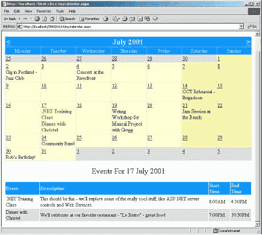

*工作原理*

创建`MyCalendar.aspx` web 表单的第一步是定义我们希望它做什么，这就是:给定一个包含各种日历事件数据(`MyCalendar.xml`)的定制 XML 文件，在一个 ASP.NET`Calendar`控件中加载每个事件项。在上面的步骤 1 到 4 中，我们基本上创建了一个定义了三个不同 ASP.NET 服务器控件的 ASPX 页面:`Calendar, Repeater` 和`Panel`。

*日历实施详情*

`Calendar`控件是用户的主要视觉界面。我们设置了许多属性来定制控件的外观——详见步骤 2。您可能想知道的第一个问题是，为什么`Calendar`控件默认为 2001 年 7 月，为什么默认选择日期 2001 年 7 月 17 日？它归结为以下代码:

```
<asp:Calendar id="MyCalendar" runat="server"                    

  SelectedDate="2001/07/17"                    

  VisibleDate="2001/07/01" 
```

`SelectedDate`属性用于设置日历首次打开时的默认日期。属性设置日历中可见的月份，例如，定义日期“`2001/08/01`”将使 2001 年 8 月可见。

如前所述，`SelectedDate`和`VisibleDate`属性这样设置只是为了演示，因为`MyCalendar.xml` 文件中的条目只有这个特定时间段的日历数据。

当我们声明日历控件时，我们为两个日历控件事件分配了事件处理程序:

```
<asp:Calendar id="MyCalendar" runat="server"                    

...                    

  OnDayRender="MyCalendar_DayRender"                    

  OnSelectionChanged="MyCalendar_SelectionChanged">                    

... 
```

每当`Calendar`控件开始显示可见的日期时，就会调用`MyCalendar_DayRender`事件，当选择新日期时，就会调用`MyCalendar_SelectionChanged`事件。我们的`Calendar`控件显示六周的数据——代表所显示月份的天数，以及前几个月和后几个月的天数。为了给我们的`Calendar`控件一个独特的外观，我们实现了一点逻辑来确定被渲染的一天是另一个月的一部分(`IsOtherMonth`)、一个周末(`IsWeekEnd`)，还是被显示的一个月的一部分。显示各种`Calendar Cell`颜色格式的逻辑在下面的代码片段中演示(来自步骤 8):

```
Protected Sub MyCalendar_DayRender(ByVal Sender As System.Object, _                    

         ByVal e As DayRenderEventArgs )                    

  if ( e.Day.IsOtherMonth )                    

      e.Cell.BackColor=System.Drawing.Color.FromName("Gainsboro")                   

  Else If ( e.Day.IsWeekend )                           

    e.Cell.BackColor=System.Drawing.Color.FromName("PaleGoldenrod")                      

  Else                        

    e.Cell.BackColor=System.Drawing.Color.FromName(                   

    "LightGoldenrodYellow")                      

  End if                        

...                    

End Sub
```

这段代码的工作方式是，我们使用一个 if 语句来确定被调用的日子是否是一个月，例如 if ( `e.Day.IsOtherMonth` )。如果这种说法是正确的，我们通过导入`System.Drawing`名称空间来定义该单元格的背景色，并请求我们想要的颜色。变量 e 由 ASP.NET 自动传递到这个事件过程中。它包含有关控件的附加信息，可能对程序员有用。在我们的例子中，我们用它来设置单元格的颜色(代表一天)。

将`MyCalendar.xml`数据呈现给给定的`Calendar Cell`的下一步包括将 XML 数据源加载到一个`DataSet`中。可能不明显的是使用`Session` 对象来存储已加载的`DataSet`的缓存实例。缓存`DataSet` 对象的原因是为了减少从零开始加载日历数据(存储在`MyCalendar.xml`文件中)的次数。 `DataSet` 对象将在会话的生命周期内被缓存。

在第 7 步中，在我们试图加载文件之前，我们首先检查了`Session`对象中的一个`MyCalendarData`对象的实例，它是一个`DataSet`对象。如果已经声明了一个对象，就不需要再次执行加载 XML 文件的工作，而是返回 cachedData 对象。如果`Session("MyCalendarData")`返回`Nothing`，那么我们执行加载 XML 源的工作，但是一旦我们完成加载，我们将数据集分配给`Session("MyCalendarData")`对象:

```
Protected Function LoadMyCalendarData() As DataSet                    

...                    

Dim cachedDataSet as DataSet = Session("MyCalendarData")                    

if ( Not cachedDataSet Is Nothing ) Then                    

  Return cachedDataSet                    

End if                    

...                    

Try                    

  fileStream = New FileStream(sourceXML, FileMode.Open)                    

  dataSet.ReadXml(fileStream)                    

  fileStream.Close()                    

  Session("MyCalendarData") = dataSet                    

...                    

End Function 
```

在使用来自`Session`对象的`DataSet`时，我们不需要在每次`Calendar`控件呈现一个日项目时从头开始加载`MyCalendar.xml`文件。请记住，`Calendar` 控件在单个页面加载中呈现 6 周的天数，相当于对`LoadMyCalendarData`方法的 42 次调用(6 周乘以 7 天)——所以即使`LoadMyCalendar`方法被多次调用，它也被优化为使用存储在`Session ("MyCalendarData")`中的缓存`DataSet`。

将`MyCalendar.xml`数据呈现给`Calendar` 控件中特定的`Cell` 的代码相当简单。我们遍历`DataSet` 对象的默认`Table`中的所有行，并与`Calendar` 控件当前呈现的日期进行比较——如果日期相同，我们需要做一些工作。请记住，每一行代表一个事件，每次渲染一天时，我们都必须查看这一天是否与其中一个事件相匹配。否则，我们循环到下一项。当我们遇到匹配时，我们实际上将内容添加到`Calendar`对象的`Cell` 属性中，方法是创建一个新的`Label`对象，设置其显示属性，并将其添加到`Cell`对象的`Controls`容器中:

```
Protected Sub MyCalendar_DayRender(ByVal Sender As System.Object, _                     

         ByVal e As DayRenderEventArgs )                     

...                     

Dim zRow as DataRow                     

For Each zRow in dataSet.Tables(0).Rows                     

  Dim compareDate as DateTime                     

  compareDate = GetSafeDate ( zRow.Item("EventDate") )                     

  If ( compareDate e.Day.Date ) Then                     

    ' Event matches date criteria -- display it...                     

    ...                     

    Dim dailyEventLabel as New Label                     

    dailyEventLabel.Text = "<br />" + myEventData.ShortDesc                     

    e.Cell.Controls.Add ( dailyEventLabel )                     

  End If                     

Next                     

End Sub 
```

*中继器控制实现细节*

实现 Repeater 控件的唯一原因是显示与日历中当前所选日期相对应的特定`MyCalendar.xml` 事件细节。一个事件或一个约会的细节可能包含相当多的信息，因此试图把它们都放到`Calendar`控件的一个`Cell` 对象中可能看起来不太好。然而，在`Calendar` 控件的`Cell`中显示简短描述(`ShortDesc`，并将详细描述(`DetailDesc`)和任何附加信息降级到中继器是谨慎的。

`MyCalendar.xml`数据到`Repeater`控件的映射由`ShowDailyEvents`方法处理，该方法在页面首次加载时被调用，也是由`Calendar` 控件发布的`OnSelectionChanged`事件的结果。当用户更改所选的日期(或月份)时，该事件会自动实现。回想一下第 10 步，我们声明了一个类，`MyCalendarEventData`。它包含各种`Private`成员和相应的`Public` 属性，这些属性充当了从`MyCalendar.xml`文件中提取的数据的容器:

```
Public Class MyCalendarEventData                     

    Private m_ShortDesc As String                     

    Private m_DetailDesc As String                     

    Private m_EventDate As DateTime                     

    Private m_StartTime As String                    

    Private m_EndTime As String                     

    Public Property ShortDesc() As String                         

      Get                       

        Return m_ShortDesc                       

      End Get                       

      Set                         

        m_ShortDesc = value                       

      End Set                      

   End Property                     

   ... 
```

创建这个类至少有两个原因。第一种纯粹与面向对象设计有关。如果`MyCalendar.xml`文件发生变化，或者添加了新的元素，最好有一个对象，比如`MyCalendarEventData`，来映射新的值。这样，我们只需在 XML 文件的相关部分下进行更改，调用这些部分的方法仍然有效。

第二个原因与第一个相关，但实际上更实用:我们可以将`MyCalendarEventData`对象绑定到任何数据呈现控件，比如 Repeater 控件(我们在步骤 8 和 9 中就是这么做的)。

这将我们带回到了`ShowDailyEvents`方法。当被调用时，这个方法执行一组与`MyCalendar_DayRender`方法类似的任务，一个关键的区别是:它将给定日期的所有匹配事件呈现给`Repeater`控件，而不是`Calendar`控件。`ShowDailyEvents`方法继续遍历`DataSet`对象的默认表中的所有`DataRow`对象，以构建`MyCalendarEventData`对象的`ArrayList`。我们需要这样做，因为`DataSet`包含所有事件，而不仅仅是所选日期的事件。因此，我们构建了一个`ArrayList`,只包含所选日期的那些事件。正如您在我们在步骤 9 中添加的代码中看到的:

```
Protected Sub ShowDailyEvents()                        

  ...                       

  Dim aEvents as new ArrayList()                     

  For Each zRow in dataSet.Tables(0).Rows                       

    Dim compareDate as DateTime                        

    compareDate = GetSafeDate ( zRow.Item("EventDate") )                         

    If ( compareDate = d ) Then                         

      ' Event matches date criteria – display it...                      

      Dim myEventData as New MyCalendarEventData                     

    ...                       

      aEvents.Add ( myEventData )                          

    End If                       

  Next                      

  ' Bind to the Repeater control...                        

  DailyEventDetailRepeater.DataSource = aEvents                         

  DailyEventDetailRepeater.DataBind()                     

...                       

  End Sub
```

将匹配的`MyCalendarEventData`对象存储在`aEvents`变量(一个仅包含所选日期的事件的`ArrayList`)中的意义在于，我们可以将这个记录子集绑定到`DailyEventDetailRepeater`对象，以生成所选日期的事件的详细列表。

关于`Repeater`控件实现的最后细节是处理显示问题。有些日子，可能没有什么特别的事件。因此，当用户点击没有相关事件的`Calendar`控件的特定日期`Cell`链接时，我们实现以下代码来切换`Panel`控件(包含`DailyEventDetailRepeater`对象)的可见性:

```
Protected Sub ShowDailyEvents()                      

  ...                      

  if ( aEvents.Count > 0 ) then                           

    DailyDetailsPanel.Visible = True                        

    SelectedDate.Text = "Events For " + d.ToLongDateString()                         

  else                       

    DailyDetailsPanel.Visible = False                        

    SelectedDate.Text = "No Events Scheduled For " + d.ToLongDateString()                     

  End if                       

  End Sub 
```

`SelectedDate`对象是一个没有在`DailyDetailsPanel`声明中声明的`Label`控件，因此当`DailyDetailsPanel.Visible`属性改变时不会受到影响。然而，`DailyEventDetailRepeater`控件的可见性状态将对应于`DailyDetailsPanel.Visible`属性。这是一个很好的使用特性，尤其是当您想要通过一个属性更改来控制一组控件的可见性状态时。

 ***使用模板编辑数据*** 

在第 13 章中，我们看了在`DataSets`中更新数据，在本章中，我们看了使用网格和模板。ASP.NET 背后最强大的特性之一是模板架构，它允许我们根据用户的动作定义不同的控件集。对于`DataGrid`和`DataList`，我们可以使用之前看到的`EditItem`模板，在用户希望编辑一些数据时自动显示不同的控件。

让我们看一个简单的例子来看看这是如何工作的。

##### 尝试使用编辑项目模板

 **1。创建一个名为`EditTemplate.aspx`的新文件，并添加以下 HTML 元素和 ASP.NET 服务器控件。不要担心它看起来又长又复杂，我们将在看到它的作用后解释它:**

```
<html>                     

  <body>                     

    <form runat="server">                     

      <asp:Label id="ErrorMessage" runat="server" /><br/>                     

      <asp:LinkButton OnClick="DEDR_Add" Text="Add new event"                     

          runat="server"/><br/>                      

      <asp:DataGrid id="EventData"                      

          AutoGenerateColumns="false" width="100%"                      

          runat="server"                     

          OnEditCommand="DEDR_Edit"                     

          OnUpdateCommand="DEDR_Update"                     

          OnCancelCommand="DEDR_Cancel"                      

          OnDeleteCommand="DEDR_Delete">                     

        <HeaderStyle ForeColor="White"                      

         BackColor="DodgerBlue" Font-Bold="true"/>                     

        <ItemStyle BackColor="White"/>                     

        <AlternatingItemStyle BackColor="Gainsboro"/>                              

        <Columns>                     

          <asp:TemplateColumn HeaderText="Event">                     

            <ItemTemplate>                     

             <%# Container.DataItem("ShortDesc") %>                     

            </ItemTemplate>                     

            <EditItemTemplate>                     

              <asp:TextBox id="txtShortDesc" Size="25"                     

                Text='<%# Container.DataItem("ShortDesc") %>'                     

                runat="server"/>                     

            </EditItemTemplate>                     

         </asp:TemplateColumn>                     

         <asp:TemplateColumn HeaderText="Description">                     

            <ItemTemplate>                     

              <%# Container.DataItem("DetailDesc") %>                     

            </ItemTemplate>                      

            <EditItemTemplate>                     

              <asp:TextBox id="txtDetailDesc" Size="50"                     

                    Text='<%# container.DataItem("DetailDesc") %>'                           

                    runat="server"/>                     

          </EditItemTemplate>                     

        </asp:TemplateColumn>                                

        <asp:TemplateColumn HeaderText="Start Time">                                  

          <ItemTemplate>                      

            <%# Container.DataItem("StartTime") %>                                  

          </ItemTemplate>                                  

          <EditItemTemplate>                     

           <asp:TextBox id="txtStartTime" Size="7"                     

            Text='<%# Container.DataItem("StartTime") %>'                     

            runat="server"/>                               

          </EditItemTemplate>                            

         </asp:TemplateColumn>                     

         <asp:TemplateColumn HeaderText="EndTime">                     

          <ItemTemplate>                     

            <%# Container.DataItem("EndTime") %>                     

          </ItemTemplate>                     

          <EditItemTemplate>                     

            <asp:TextBox id="txtEndTime" Size="7"                     

                   Text='<%# Container.DataItem("EndTime") %>'                     

                   runat="server"/>                     

          </EditItemTemplate>                     

        </asp:TemplateColumn>                     

        <asp:TemplateColumn>                      

          <ItemTemplate>                     

           <asp:LinkButton CommandName="Edit"                       

            Text="Edit" runat="server"/>                     

           <asp:LinkButton CommandName="Delete"                      

            Text="Delete" runat="server"/>                     

          </ItemTemplate>                     

          <EditItemTemplate>                     

           <asp:LinkButton CommandName="Cancel"                      

            Text="Cancel" runat="server"/>                     

           <asp:LinkButton CommandName="Update"                      

            Text="Update" runat="server"/>                     

          </EditItemTemplate>                         

        </asp:TemplateColumn>                      

     </Columns>                     

   </asp:DataGrid>                     

 </form>                     

</body>                     

</html>
```

 **2。**现在将以下内容添加到本页顶部:

```
<%@ Import Namespace="System.Data" %>                      

<%@ Import Namespace="System.IO" %>                      

<script language="VB" runat="server">                      

  Sub Page_Load(Sender As Object, E As EventArgs)                      

    If Not Page.IsPostBack Then                      

      EventData.DataSource = LoadMyCalendarData                      

      EventData.DataBind()                      

    End If                      

  End Sub                      

  Protected Function LoadMyCalendarData() As DataSet                      

    Dim sourceXML as String = Server.MapPath("MyCalendar.xml")                      

      If ( Not File.Exists ( sourceXML ) )                      

Then                       

        Return Nothing                      

      End if                      

    Dim cachedDataSet as DataSet = Session("MyCalendarData")                      

      If ( Not cachedDataSet Is Nothing )                      

Then                           

        Return cachedDataSet                      

      End if                       

    Dim dataSet As DataSet = New DataSet()                      

    Try                      

      dataSet.ReadXml(sourceXML)                      

      Session("MyCalendarData") = dataSet                      

    Catch e As Exception                      

      ErrorMessage.Text = e.Message                      

      dataSet = Nothing                      

    End Try                      

    Return dataSet                      

  End Function                      

  Sub DEDR_Edit(Sender As Object, E As DataGridCommandEventArgs)                      

    EventData.EditItemIndex = CInt                       

(e.Item.ItemIndex)                      

    EventData.DataSource = LoadMyCalendarData                      

    EventData.DataBind()                      

  End Sub                       

  Sub DEDR_Update(Sender As Object, E As DataGridCommandEventArgs)                       

    Dim dataSet  As DataSet = LoadMyCalendarData                      

    Dim row      As Integer = CInt(e.Item.ItemIndex)                      

    Dim EditText As TextBox                      

    EditText = E.Item.FindControl("txtShortDesc")                      

    dataSet.Tables(0).Rows(row).Item("ShortDesc") = EditText.Text                      

    EditText = E.Item.FindControl("txtDetailDesc")                      

    dataSet.Tables(0).Rows(row).Item("DetaiLDesc") = EditText.Text                      

    EditText = E.Item.FindControl("txtStartTime")                      

    dataSet.Tables(0).Rows(row).Item("StartTime") = EditText.Text                      

    EditText = E.Item.FindControl("txtEndTime")                      

    dataSet.Tables(0).Rows(row).Item("EndTime") = EditText.Text                      

    dataSet.WriteXml(Server.MapPath("MyCalendar.xml"))                      

    Session("MyCalendarData") = Nothing                      

    EventData.EditItemIndex = -1                      

    EventData.DataSource = LoadMyCalendarData                      

    EventData.DataBind()                      

  End Sub                         

  Sub DEDR_Cancel(Sender As Object, E As DataGridCommandEventArgs)                      

    EventData.EditItemIndex = -1                      

    Session("MyCalendarData") = Nothing                      

    EventData.DataSource = LoadMyCalendarData                      

    EventData.DataBind()                      

  End Sub                      

  Sub DEDR_Delete(Sender As Object, E As                       

  DataGridCommandEventArgs)                      

    Dim dataSet As DataSet = LoadMyCalendarData                      

    Dim row     As Integer = CInt(e.Item.ItemIndex)                      

    dataSet.Tables(0).Rows(row).Delete                      

    dataSet.WriteXml(Server.MapPath("MyCalendar.xml"))                      

    Session("MyCalendarData") = Nothing                      

    EventData.EditItemIndex = -1                      

    EventData.DataSource = LoadMyCalendarData                      

    EventData.DataBind()                      

  End Sub                      

  Sub DEDR_Add(Sender As Object, E As EventArgs)                      

    Dim dataSet As DataSet = LoadMyCalendarData                      

    Dim newRow As DataRow                      

    newRow = dataSet.Tables(0).NewRow()                      

    newRow.Item("EventDate") = "15/07/2001"                       

    newRow.Item("ShortDesc") = ""                      

    newRow.Item("DetailDesc") = ""                      

    newRow.Item("StartTime") = ""                      

    newRow.Item("EndTime") = ""                      

    dataSet.Tables(0).Rows.Add(newRow)                      

    dataSet.WriteXml(Server.MapPath("MyCalendar.xml"))                      

    Session("MyCalendarData") = Nothing                      

    EventData.DataSource = LoadMyCalendarData                      

    EventData.DataBind()                      

    EventData.EditItemIndex = EventData.Items.Count - 1                      

    EventData.DataSource = LoadMyCalendarData                      

    EventData.DataBind()                      

  End Sub                      

</script>
```

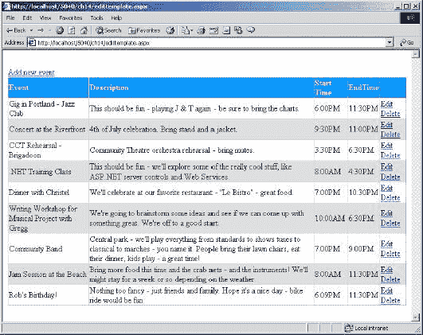

这没有什么特别的——这是一个标准的网格，有添加和编辑数据的选项。

 **4。**现在点击第一行的编辑链接:

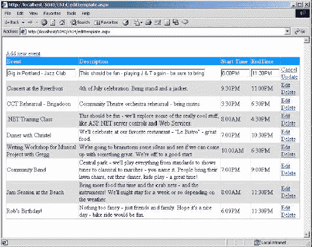

注意这一行是如何变化的——不仅仅是文本，我们现在有了允许我们编辑文本的文本框。最后一列中的链接也发生了变化，现在表明我们可以取消更改，或者用我们的更改更新数据。

 **5。**试着对文本做一些修改，然后点击`Cancel` 按钮。请注意您输入的更改是如何被忽略的。再次尝试编辑链接，这次是更新链接—更改现在已保存。

 **6。**现在试试`Add new event`链接:

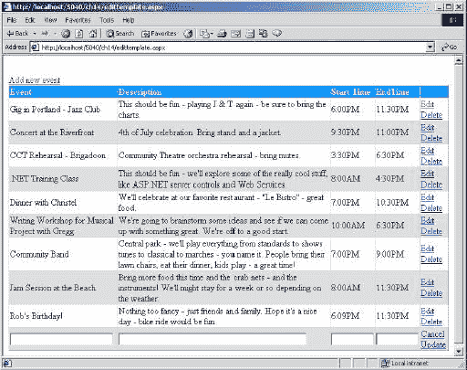

请注意如何添加了一个额外的行，其中有空值供您键入新数据。尝试按下`Cancel`，您会看到空行消失。添加另一行，这次按`Update`保存更改。

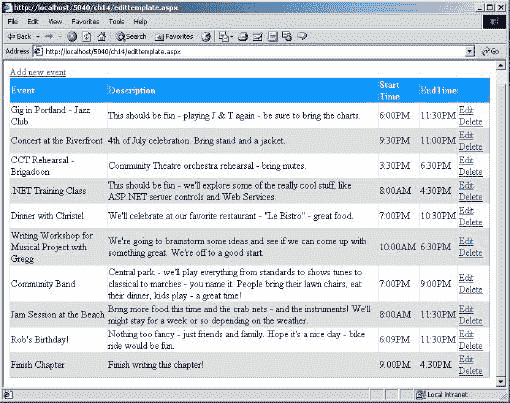

 **7。**对于您刚刚添加的行，按下`Delete`链接来测试这个功能。让我们看看所有这些是如何工作的。

*工作原理——使用 EditItem 模板*

让我们先来看看控制。我们从服务器表单和用于显示可能出现的任何错误消息的标签开始:

```
<html>                         

  <body>                         

    <form runat="server">                         

      <asp:Label id="ErrorMessage" runat="server" /><br/> 
```

接下来，我们添加一个`LinkButton`，它被用作向数据添加新行的链接。你可以在这里使用一个普通的按钮，但我认为这个看起来更整洁:

```
 <asp:LinkButton OnClick="DEDR_Add" Text="Add new event"                         

            runat="server"/><br/>
```

现在我们从`DataGrid`开始。首先要注意的是，我们已经将`AutoGenerateColumns`属性设置为 false，告诉`DataGrid`不要自动生成任何列。`DataGrid`的一个很棒的特性是，当您将数据绑定到它时，它会遍历数据的行和列，并相应地生成 HTML 表格。在本例中，我们不希望这样，因为我们希望自己创建列:

```
 <asp:DataGrid id="EventData"                         

        AutoGenerateColumns="false" width="100%" runat="server" 
```

同样，在`DataGrid`上，有一些命令属性。`DataGrid`理解编辑数据的概念，并且有一些特殊的属性，允许我们告诉它在选择 set 命令时要运行哪些事件过程。稍后您将看到这些命令是如何定义的:

```
 OnEditCommand="DEDR_Edit"                         

        OnUpdateCommand="DEDR_Update"                         

        OnCancelCommand="DEDR_Cancel"                         

        OnDeleteCommand="DEDR_Delete"> 
```

接下来，我们定义了`DataGrid`对象的一些样式属性。我们可以使用网格本身的属性来完成这项工作，但是我认为展示一种不同的方法来完成这项工作是值得的。例如，我们可以这样做:

```
 <asp:DataGrid id="EventData" HeaderStyle-ForeColor="White"                         

        HeaderStyle-BackColor="DodgerBlue"/> 
```

声明这些属性的两种方法的工作方式没有区别，所以您可以选择自己喜欢的样式。我们在这里所做的就是为各种模板定义样式属性(这些模板分别是`Header`、`Item`和`AlternatingItem`)。

```
 <HeaderStyle ForeColor="White" BackColor="DodgerBlue"                         

                       Font-Bold="true"/>                         

      <ItemStyle BackColor="White"/>                         

      <AlternatingItemStyle BackColor="Gainsboro"/> 
```

现在是我们定义列的时候了。请记住，是我们在定义它们，而不是网格。对于每一列，我们将使用一个`TemplateColumn`(这只是一个允许您定制列中控件布局的列类型)，表示该列将应用一个模板。在本章的前面，您看到了一些类似这样的代码:

```
 <asp:DataList id="DataList1" runat="server">                         

      <FooterTemplate>                         

        'Items to be affected by this template                         

      </FooterTemplate>                         

      <SeparatorTemplate>                         

        'Items to be affected by this template                         

      </SeparatorTemplate>                         

  </asp:DataList> 
```

这定义了一个模板，然后在模板中定义了列。`DataGrid`的工作方式正好相反，首先定义列，然后定义每列中的模板。这是明智的，因为网格本质上是柱状的。因此，我们有了第一个模板列，一些文本将放在标题中:

```
<Columns>                         

  <asp:TemplateColumn HeaderText="Event"> 
```

现在，对于这个新列，我们定义模板，第一个模板是 ItemTemplate，它只显示数据:

```
 <ItemTemplate>                         

      <%# Container.DataItem("ShortDesc") %>                         

    </ItemTemplate> 
```

模板中的行是数据绑定的高级形式。您已经看到了我们如何使用服务器控件(如`DataGrid` 或`Repeater`)的`DataSource`属性来识别数据的来源。当您自己定义列时，需要指定显示数据中的哪些字段。为此，我们必须参考`Container`，因为这是数据存储的地方。在我们的例子中，`Container`是网格绑定到的`DataSet`。我们使用`DataItem`集合指向一个特定的条目——在上面的例子中是`ShortDesc`,但是可以是任何字段的名称。ASP.NET 知道这是高级数据绑定，因为我们已经用`<%# %>`包围了绑定细节。这非常类似于`<% %>` ASP 标签，但是`#`才是重要的部分——它开启了绑定特性。

网格会自动为我们放置 HTML 表格标签(TR 和 TD 标签),所以我们所要做的就是使用上面描述的数据绑定语法输出数据。对于在我们编辑这一行时生效的`EditItemTemplate`，我们需要某种方法来输入文本，所以我们使用一个`TextBox`。在本例中，我们将文本框的 Text 属性设置为包含我们在 ItemTempate 中显示的数据:

```
 <EditItemTemplate>                         

    <asp:TextBox id="txtShortDesc" Size="25" Text='<%#                         

   Container.DataItem("ShortDesc") %>' runat="server"/>                         

  </EditItemTemplate> </asp:TemplateColumn> 
```

这就是一列的定义。这是一个带有两个模板的`TemplateColumn`:一个用于显示数据，另一个用于编辑数据。通常使用`ItemTemplate`，直到该行进入编辑模式(稍后您将看到如何操作)。当这种情况发生时，ASP.NET 自动显示所选行的`EditItemTemplate`。

其他列与此完全相同，只是从数据集中的不同列获取数据。然而，最后一列是不同的，因为在这里我们有编辑链接。同样，有两个模板。对于`ItemTemplate`，我们有一个到`Edit`的链接和一个到`Delete`的链接。当我们处于编辑模式时(T3)，我们想要不同的按钮——到`Update`和 `Cancel`。我再次使用了`LinkButtons`,因为我认为在这个例子中它们看起来更好，但是你可以很容易地使用标准按钮:

```
<asp:TemplateColumn>                         

  <ItemTemplate>                        

    <asp:LinkButton CommandName="Edit" Text="Edit"                         

      runat="server"/>                        

    <asp:LinkButton CommandName="Delete" Text="Delete"                         

      runat="server"/>                         

  </ItemTemplate>                        

  <EditItemTemplate>                          

    <asp:LinkButton CommandName="Cancel" Text="Cancel"                             

      runat="server"/>                               

    <asp:LinkButton CommandName="Update" Text="Update"                              

      runat="server"/>                             

  </EditItemTemplate>                              

     </asp:TemplateColumn> 
```

其中最关键的是`CommandName`属性，它标识了这个按钮与哪个命令相关联。还记得我们在定义网格时是如何用命令来标识事件过程的吗？我们正是为这些命令定义过程的。所以带`CommandName="Edit"`的按钮会调用`OnEditCommand="DEDR_Edit"`定义的事件过程。

现在让我们看看代码。

当页面第一次加载时，我们使用`LoadMyCalendarData`例程从 XML 文件中加载日历细节。这与我们在前面的`MyCalendar.aspx`例子中使用的例程完全相同，所以我们在这里不再赘述。

现在让我们看看编辑的事件过程，从直接编辑条目的过程开始。这是在我们选择 Edit 链接时运行的，它的工作是告诉网格正在编辑哪一行。这是通过在网格上设置 EditItemIndex 属性来实现的。每当设置为一行时，显示该行的`EditItemTemplate`而不是`ItemTemplate`。为了识别正确的行，我们使用事件过程的参数—这些参数由 ASP.NET 定义，并提供有关哪个对象调用了该事件的信息，以及各种其他种类的信息。在这种情况下，其他信息是我们正在编辑的行的索引号，由 ItemIndex 属性定义。这是由 ASP.NET 自动提供的，因为我们在网格的一行中有链接按钮，每当链接按钮被按下时，索引号被提供给事件过程，从而允许我们识别正确的行。一旦`EditItemTemplate`出现，我们就可以做出改变:

```
Sub DEDR_Edit(Sender As Object, E As DataGridCommandEventArgs)                              

  EventData.EditItemIndex = CInt(e.Item.ItemIndex)                              

  EventData.DataSource = LoadMyCalendarData                             

  EventData.DataBind()                          

End Sub 
```

要更新一行，我们必须提取插入到该行文本框中的数据。我们再次获得当前的行号，这将用于索引到`DataSet`中的行:

```
Sub DEDR_Update(Sender As Object, E As DataGridCommandEventArgs)                           

  Dim dataSet As DataSet = LoadMyCalendarData                             

  Dim row As Integer = CInt(e.Item.ItemIndex) 
```

为了找到`DataSet`文本框中的信息，我们必须使用`FindControl`方法。虽然我们给了文本框名称，但是因为它们在网格中使用，所以这些名称可能会有歧义。因此，在生成网格时，ASP.NET 使用这个名称作为网格上控件的唯一名称的一部分。我们不知道这个唯一名称的其余部分是什么，因此我们必须使用 FindControl 来找到正确的控件。一旦我们找到了行，我们就更新`DataSet`中的数据:

```
 Dim EditText As TextBox                             

  EditText = E.Item.FindControl("txtShortDesc")                             

  dataSet.Tables(0).Rows(row).Item("ShortDesc") = EditText.Text                            

  EditText = E.Item.FindControl("txtDetailDesc")                             

  dataSet.Tables(0).Rows(row).Item("DetaiLDesc") = EditText.Text                              

  EditText = E.Item.FindControl("txtStartTime")                             

  dataSet.Tables(0).Rows(row).Item("StartTime") = EditText.Text                           

  EditText = E.Item.FindControl("txtEndTime")                            

  dataSet.Tables(0).Rows(row).Item("EndTime") = EditText.Text 

在这个阶段，`DataSet`已经被更新，但是数据还没有写回 XML 文件，所以我们使用`WriteXml`将文件写到磁盘:
 ` dataSet.WriteXml(Server.MapPath("MyCalendar.xml"))` 
当我们最初读取 XML 时，我们将它置于`Session`状态，以避免再次读取它。现在数据已经更改，需要重新加载到`Session`中，因此我们删除了当前在`Session` : 
 `  Session("MyCalendarData") = Nothing ` 
中的副本，然后将网格的`EditItemIndex`设置为-1，这将使网格退出编辑模式。当这种情况发生时，不再使用`EditItemTemplate`，该行恢复使用`ItemTemplate` : 
 `  EventData.EditItemIndex = -1 ` 
最后，我们将数据重新加载到网格中:
 ` EventData.DataSource = LoadMyCalendarData                            

  EventData.DataBind()                            

End Sub ` 
它负责更改现有数据，但是取消更改呢？当处于编辑模式时，我们有`Cancel`链接，它调用下面的过程。这很简单，首先将`EditItemIndex`设置为-1，使网格脱离编辑模式。然后我们使`Session`状态无效，并重新加载数据。严格地说，我们并不总是需要在这里使`Session`变量无效。例如，编辑行时，更改仅作为表单的一部分可用—更新`DataSet`的是`Update`过程。因此，我们可以重新绑定到缓存的数据，它没有改变。然而，当我们添加一行时，我们确实更新了`DataSet`——在这种情况下，仅仅重新绑定不起作用——我们实际上必须使`Session`状态无效，并从文件中重新加载数据:
 `Sub DEDR_Cancel(Sender As Object, E As DataGridCommandEventArgs)                            

  EventData.EditItemIndex = -1                            

  Session("MyCalendarData") = Nothing                         

  EventData.DataSource = LoadMyCalendarData                            

  EventData.DataBind()                            

End Sub ` 
要删除一行，我们只需识别所选的行号(使用`ItemIndex`,然后使用它来删除`DataSet`中所选的行。删除后，我们将数据写入 XML 文件并使`Session`数据无效，因为数据已经改变:
 `Sub DEDR_Delete(Sender As Object, E As DataGridCommandEventArgs)                            

  Dim dataSet As DataSet = LoadMyCalendarData                            

  Dim row     As Integer = CInt(e.Item.ItemIndex)                            

  dataSet.Tables(0).Rows(row).Delete                             

  dataSet.WriteXml(Server.MapPath("MyCalendar.xml"))                            

  Session("MyCalendarData") = Nothing` 
```

然后，我们使网格脱离编辑模式，并重新绑定数据:

```
 EventData.EditItemIndex = -1                             

  EventData.DataSource = LoadMyCalendarData                            

  EventData.DataBind()                            

End Sub 
```

添加数据与更改数据的其他方法略有不同，因为没有特定的`Add`命令。我们要做的是将行添加到数据集中，然后重新绑定数据。首先，我们从`Session` : 
 `Sub DEDR_Add(Sender As Object, E As EventArgs)                             

  Dim dataSet As DataSet = LoadMyCalendarData ` 
加载数据，然后我们使用表的`NewRow`方法创建一个新的行对象。
 `  Dim newRow As DataRow                             

  newRow = dataSet.Tables(0).NewRow() ` 
现在我们有了新的行，我们可以为它设置数据了。您可以在这里使用任何日期(可能是从日历中选择的日期)，但是我使用了与前面条目相似的日期。其他数据设置为空字符串:
 `  newRow.Item("EventDate") = "2001/07/15"                             

  newRow.Item("ShortDesc") = ""                               

  newRow.Item("DetailDesc") = ""                            

  newRow.Item("StartTime") = ""                             

  newRow.Item("EndTime") = ""`

一旦设置了数据，我们就将新行添加到表中。
 `  dataSet.Tables(0).Rows.Add(newRow)` 
现在我们将数据保存到它的文件中，使`Session`无效，并重新加载:
 `  dataSet.WriteXml(Server.MapPath("MyCalendar.xml"))                             

  Session("MyCalendarData") = Nothing                            

  EventData.DataSource = LoadMyCalendarData                             

  EventData.DataBind()` 
现在数据被重新加载，我们设置新行的`EditItemIndex`，使该行进入编辑模式。您不必这样做，但是它让用户不必在新行上单击`Edit`链接。我们使用`Datagrid`的`Items`集合来标识它有多少行。`Count`属性告诉我们有多少行，因为这些行是从 0 开始索引的，所以我们从这个计数中减去 1，然后重新绑定数据(从而强制切换模板):
 `  EventData.EditItemIndex = EventData.Items.Count - 1                               

  EventData.DataSource = LoadMyCalendarData                            

  EventData.DataBind()                             

 End Sub                           

</script> ` 
这就是全部内容。看起来很多，但实际上代码并不多。要记住的关键事情是:

*   `Use Button`或`LinkButton`控件提供编辑命令

*   使用`DataGrid`的`On...Command`属性将这些编辑命令按钮与事件程序链接起来

*   将`EditItemIndex`设置为所需的行，并重新绑定数据，使网格进入编辑模式

*   将`EditItemIndex`设置为-1 以取消编辑模式

这个例子使用了一个 XML 文件，但是在每个更新数据的事件过程中，您可以很容易地更新数据库。这可以通过使用数据集的内置命令或直接发出 SQL 命令来完成。ASP.NET 快速入门中有几个例子可以说明这一点。

 ***自动生成栏目*** 

作为自己编写列信息的另一种解决方案，您可以让`DataGrid`为您完成大部分布局。在上面的代码中，我们使用了`AutoGenerateColumns`属性告诉网格不要从绑定数据中自动创建列。这使我们能够提供我们需要的精确布局。但是，如果让网格生成列，也可以使用`Columns`标签添加列。以下代码显示了这是如何实现的，它让网格处理数据的列，同时我们为编辑链接添加额外的列:

```
<asp:DataGrid id="EventData"                                   

    width="100%" runat="server"                               

    OnEditCommand="DEDR_Edit"                                

    OnUpdateCommand="DEDR_Update"                             

    OnCancelCommand="DEDR_Cancel"                            

    OnDeleteCommand="DEDR_Delete">                             

  <HeaderStyle ForeColor="White" BackColor="DodgerBlue"                              

                  Font-Bold="true"/>                                 

  <ItemStyle BackColor="White"/>                             

  <AlternatingItemStyle BackColor="Gainsboro"/>                                

  <Columns>                           

    <asp:TemplateColumn>                               

      <ItemTemplate>                                 

        <asp:LinkButton CommandName="Edit"   text="Edit"                                        

          runat="server"/>                               

        <asp:LinkButton CommandName="Delete" Text="Delete"                                   

          runat="server"/>                                 

      </ItemTemplate>                              

      <EditItemTemplate>                               

        <asp:LinkButton CommandName="Cancel" Text="Cancel"                           

          runat="server"/>                                

        <asp:LinkButton CommandName="Update" Text="Update"                               

          runat="server"/>                             

      </EditItemTemplate>                               

    </asp:TemplateColumn>                           

  </Columns>                               

</asp:DataGrid> 

This would create a grid like so:

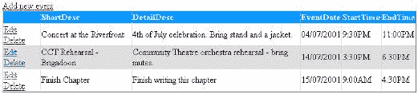

将编辑链接放在第一列并不是什么大问题，尽管我个人更喜欢将它们放在最后。更大的问题是，标题现在反映了列的名称，而不是一些简洁的文本。从长远来看，我认为定义自己的模板更好，因为你可以更好地控制数据的外观。

`EditItemTemplate`技术在`DataList`中也是可用的，当你需要一种更自由的布局方式，而不是更多的列式网格布局时，这是非常有用的。无论您选择哪种方式来显示数据，模板化都非常容易。

##### 摘要

本章介绍了可以在任何 web 表单中使用的各种 ASP.NET 服务器控件。提供了大量示例来说明如何在 ASPX 页面中使用 ASP.NET 服务器控件，以及以编程方式使用这些控件的特定示例。到目前为止，您应该对 ASP.NET 服务器控件有了很好的基本了解，包括:

*   声明 ASP.NET 服务器控件的语法
*   ASP.NET 服务器控件的优点，如丰富的对象模型、自动浏览器检测、各种属性、事件和可重用性
*   各种 ASP.NET 服务器控件系列(内部控件、验证控件、丰富控件和数据呈现控件)

ASP.NET server controls derive their methods, properties and events from the various classes and objects that make up the .NET Framework and provide an object-oriented way to write dynamic web forms. All ASP.NET server controls are declared using same tag element naming conventions, similar to well-formed XML, and provide a uniform way to declare properties, and assign event handler methods.

提供了与 ASP.NET 服务器控件相关的 ASP.NET 页面生命周期的一些见解。对`Page`对象的`Page_Load`和`Page_Unload`方法进行了解释，以提供何时以及为何实现这些方法的上下文。我们还讲述了与`Page`对象的`IsPostback`属性相关的事件处理的基础知识。

本章中介绍的 ASP.NET 验证控件以及这里的示例，应该有助于打开一扇大门，让您了解自己可以使用哪些工具来创建能够验证数据的 web 表单。虽然我们只是触及了各种数据呈现控件的表面，比如`DataGrid`、`DataList`和`Repeater`，但是您应该能够看到它们在呈现各种类型的数据方面的优势。

## 分享这篇文章

```

```