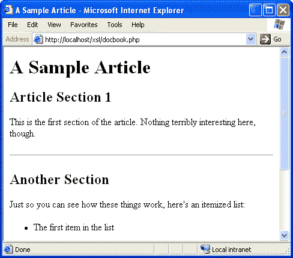

# 用 XSLT 改造您的 PHP

> 原文：<https://www.sitepoint.com/transform-php-xslt/>

**在[让 XSL 做你的脏活](http://www.webmasterbase.com/article/595)中，我们讨论了 XSL 转换(XSLT)以及 XSL 处理器如何集成到传统的内容管理系统(CMS)中。我们看到了 XSL 处理器如何从编写普通 CMS 的繁重工作中解脱出来，并为定制标记提供更好的错误检查。**

如果我让您相信 XSL 是您希望添加到下一个数据库驱动的网站中的东西，那么您可能急于了解如何将 XSL 处理器与您选择的服务器端语言集成起来。虽然在这个领域存在许多选择，但本文将向您展示如何在 PHP 中设置和使用 XSL 处理器，PHP 是 SitePoint 社区中一种流行的服务器端语言。

<q>**注意:**本文中提到的 PHP 中的 XSLT 功能是在 PHP 4.1.0 中引入的。在这个版本之前，PHP 看到了它的 XSLT 模块的几个实验性修订；然而，它们在许多方面与这里描述的模块不同。在继续之前，请确保您有 PHP 4.1.0 或更高版本。</q>

##### 用于 Windows 的 XSLT 模块安装

您需要做的第一件事是在没有 XSLT 支持的情况下，在基于 Windows 的 Web 服务器(无论是 Apache、IIS 还是其他什么)上启动并运行 PHP。如果你需要这方面的帮助，可以看看我的文章，[使用 PHP & MySQL 构建你自己的数据库驱动网站——第 1 部分:安装](http://www.webmasterbase.com/article.php/525)，它将带你完成这个过程。

一旦 PHP 启动并运行，下一步就是启用它附带的 XSLT 模块。为了发挥作用，这个模块使用了开源的 Sablotron XSLT 处理器。反过来，Sablotron 依赖于开源的 XML 解析器 Expat。以下是在您的 Windows 系统上安装这些软件的方法:

*   从 SourceForge 上的[项目网站](http://sourceforge.net/projects/expat/)下载 Expat 。您将需要最新版本的 expat_win32bin 软件包。
*   像安装任何其他程序一样，将 Expat 安装到系统上一个方便的目录中。
*   在您的 Expat 安装的`Libs`子目录中找到 **`expat.dll`** 文件，并将其复制到您的 Windows `SYSTEM32`目录中(例如`C:WINDOWSSYSTEM32`)。
*   **从[生姜联盟网站](http://www.gingerall.com/)下载 Sablotron** 。“Windows 二进制”版本是您所追求的版本。
*   **将压缩文件**解压到系统中一个方便的地方。将为您创建一个`Sablot-*version*`目录。
*   在您的 Sablotron 安装目录的`bin`子目录下找到 **`sablot.dll`** 文件，并将其复制到您的 Windows `SYSTEM32`目录下。

有了所需的软件，现在可以启用 PHP 扩展来支持 XSLT。打开您的`php.ini`文件并找到`extension_dir`行。要么将其设置为 PHP 安装的`extensions`目录，要么将该目录中的`php_xslt.dll`文件复制到该设置指定的目录中。然后，取消注释(删除开头的`;`)或将下面一行添加到“Windows 扩展”下的部分:

```
extension=php_xslt.dll
```

完成这些更改后，保存更新的文件并关闭编辑器。您已经在 PHP 安装中激活了 XSLT 支持。为了让这个改变影响到你的网络服务器，你需要重启它(或者重启你的电脑，如果你是懒惰型的，效果是一样的)。

一旦您的 Web 服务器启动备份，PHP 应该完全可以用 XSLT 处理 XML 数据。为了确保这一点，您可以创建一个简单的 PHP 脚本，只调用`phpinfo()`，然后在您的服务器上查看结果。生成的页面应包含以下部分:

现在跳过 Linux 安装过程，我们将测试 XSLT 函数。

##### 用于 Linux 的 XSLT 模块安装

PHP 中的 XSLT 支持依赖于 [Sablotron](http://www.gingerall.cz/charlie/ga/xml/p_sab.xml) XSLT 处理器，而 XSLT 处理器又依赖于 [expat](http://sourceforge.net/projects/expat) XML 解析器，因此您不仅需要安装这两个包，还需要按照正确的顺序安装它们以满足依赖关系。

首先，下载 expat 的最新版本(撰写本文时为 1.95.2)。避开。RPM 包。虽然它们可能很方便，但是它们不包括 Sablotron 使用 expat 所需的库。下载源文件(`expat-1.95.2.tar.gz`)，然后解压到一个方便的目录中:

```
tar xfz expat-1.95.2.tar.gz
```

这将创建一个名为`expat-1.95.2`的目录，其中包含编译和安装 expat 所需的文件。进入该目录，键入以下命令，使用默认选项配置、编译和安装 expat。您可能需要以 root 用户身份登录来执行`make install`，它会将新的系统库安装到非公共目录中。如果要修改默认选项，请参考 expat 文档。

```
./configure  

make  

make install
```

expat 编译和安装完成后，您现在可以为 Sablotron 做同样的事情了。下载最新版本(撰写本文时为 0.71)。再次强调，你需要的是源代码下载(`Sablot-0.71.tar.gz`)，而不是 rpm，尽管如果你同时安装了`sablotron`和`sablotron-devel`rpm，你可能会有机会(风险自担！).像对 expat 一样提取源文件:

```
tar xfz Sablot-0.71.tar.gz
```

进入这样生成的目录(`Sablot-0.71`)并运行以下命令来配置、编译和安装 Sablotron。配置过程应该会自动检测您的 expat 安装。同样，您应该以 root 用户身份登录来执行`make install`。

```
./configure  

make  

make install
```

最后，您已经准备好编译和安装支持 XSLT 的 PHP 了。假设您的服务器上已经安装了 PHP，但是与大多数模块安装一样，您必须下载 PHP 源文件并重新编译 PHP 以添加 XSLT 支持。这个过程在[使用 PHP & MySQL 构建你自己的数据库驱动网站——第 1 部分:安装](http://www.webmasterbase.com/article.php/525)中有完整的记录；所有改变的只是编译前配置 PHP 时需要使用的一组开关:

```
./configure   

  --prefix=/usr/local/php   

  --with-config-file-path=/usr/local/php   

  --with-apxs=/usr/sbin/apxs   

  --enable-track-vars   

  --enable-magic-quotes   

  --enable-debugger   

 **--enable-xslt**  

 **--with-xslt-sablot**
```

粗体的行为您的 PHP 配置添加了 XML 和 XSLT 支持。从那里开始，PHP 的安装应该像往常一样通过执行一个`make`和一个`make install`来完成。一旦安装了新编译的 PHP 模块重新启动 Web 服务器，PHP 就应该完全可以用 XSLT 处理 XML 数据了。为了确保这一点，您可以创建一个简单的 PHP 脚本来调用`phpinfo()`，然后在您的服务器上查看结果。生成的页面应包含以下部分:

现在让我们试用一下 XSLT 函数。

##### 试车

为了试验我们刚刚在 PHP 中设置的新 XSLT 功能，我将返回到我在 [Get XSL To Do Your Dirty Work](http://www.webmasterbase.com/article/595) 中使用的简单 DocBook 示例文档。这是有问题的文件:

```
<?xml version="1.0" encoding="UTF-8"?>   

<article>   

  <title>A Sample Article</title>   

  <section>   

    <title>Article Section 1</title>   

    <para>   

    This is the first section of the article. Nothing terribly   

    interesting here, though.   

    </para>   

  </section>   

  <section>   

    <title>Another Section</title>   

    <para>   

    Just so you can see how these things work, here's an   

    itemized list:   

    </para>   

    <itemizedlist>   

      <listitem>   

        <para>The first item in the list</para>   

      </listitem>   

      <listitem>   

        <para>The second item in the list</para>   

      </listitem>   

      <listitem>   

        <para>The third item in the list</para>   

      </listitem>   

    </itemizedlist>   

  </section>   

</article>
```

注意，我在文件的顶部省略了 DOCTYPE 声明。因为 Sablotron XSLT 处理器使用的 expat XML 解析器不是一个验证解析器，所以 DOCTYPE 在大多数情况下只会降低解析速度(作为对 XML 万事通的让步，也有例外)。

下面是我们开发的 XSL 样式表，用于以上述格式显示文档:

```
<?xml version="1.0" encoding="UTF-8"?>   

<xsl:stylesheet version="1.0"   

  xmlns:xsl="https://www.w3.org/1999/XSL/Transform">   

  <xsl:output method="html"/>   

  <xsl:template match="article">   

    <html>   

    <head>   

      <title><xsl:value-of select="title"/></title>   

    </head>   

    <body>   

      <h1><xsl:value-of select="title"/></h1>   

      <xsl:apply-templates select="section"/>   

    </body>   

    </html>   

  </xsl:template>   

  <xsl:template match="section">   

    <xsl:apply-templates/>   

    <hr/>   

  </xsl:template>   

  <xsl:template match="section/title">   

    <h2><xsl:apply-templates/></h2>   

  </xsl:template>   

  <xsl:template match="para">   

    <p><xsl:apply-templates/></p>   

  </xsl:template>   

  <xsl:template match="itemizedlist">   

    <ul><xsl:apply-templates/></ul>   

  </xsl:template>   

  <xsl:template match="listitem">   

    <li><xsl:apply-templates/></li>   

  </xsl:template>   

</xsl:stylesheet>
```

在你的网络服务器上分别保存为`docbook.xml`和`docbook.xsl`，然后创建`docbook.php`。这个脚本的工作是根据`docbook.xsl`中的规则转换`docbook.xml`，并将 HTML 输出发送到用户的 Web 浏览器。

以下是`docbook.php`的代码:

```
<?php   

  // Create an XSLT processor   

  $xsltproc = xslt_create();   

  // Perform the transformation   

  $html = xslt_process($xsltproc, 'docbook.xml', 'docbook.xsl');   

  // Detect errors   

  if (!$html) die('XSLT processing error: '.xslt_error($xsltproc));   

  // Destroy the XSLT processor   

  xslt_free($xsltproc);   

  // Output the resulting HTML   

  echo $html;   

?>
```

上面代码中的这个注释应该可以很好地解释它。关于正在使用的函数的更多信息，请参考 PHP 手册中关于 XSLT 处理函数的章节([http://www.php.net/manual/en/ref.xslt.php](http://www.php.net/manual/en/ref.xslt.php))。

在您的服务器上尝试一下，服务器最近配备了 XSLT 处理功能。您应该看到由 Sablotron XSLT 引擎生成的文档的 HTML 版本！

修改这个脚本来提供来自数据库的内容非常简单。只需以通常的方式提取存储在数据库中的 XML 代码，然后使用`xslt_process`用 XSL 样式表将其转换成 HTML。样式表可以存储在数据库中，动态生成，或者保存在服务器上的文件中，如上例所示。

探索 PHP 中其余的 XSLT 函数，您就可以开始使用基于 XSLT 的 CMS 了！

## 分享这篇文章