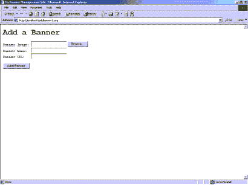
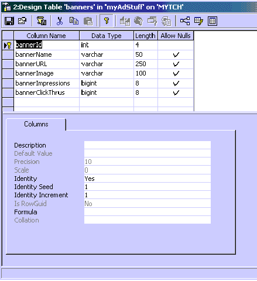
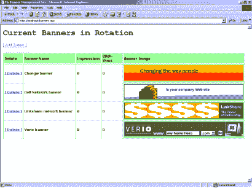
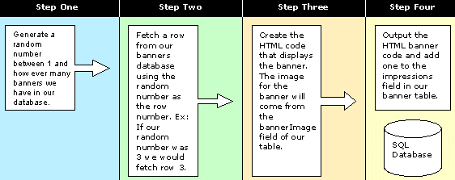
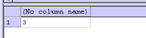

# 创建您自己的横幅管理应用程序

> 原文：<https://www.sitepoint.com/management-application/>

如果你像我一样，那么你可能会经营一个或多个小网站，或者向你的访问者提供信息，或者销售一系列针对特定受众的产品和服务。你有你信任的人来管理和更新内容，你花了很多很多时间来开发网站，你甚至可以每天吸引几千个访问者。

除了通过会员费或产品销售获得的利润，在你的网站上管理一个简单的横幅轮换和统计系统不是很好吗？有了这个系统，你可以在你网站的每一页的顶部显示一个随机的横幅，跟踪浏览量和点击率，并且，随着你的网站获得可信度，你可以通过允许其他人在你的网站上做广告来获利。

##### 你需要什么

要创建我将要解释的简单应用程序，您需要:

*   能够运行 ASP 脚本的网络服务器(最好是 Win2k 机器)
*   SQL Server 2000
*   ASP 基础知识
*   基本 SQL 语法和企业管理器知识

请注意，本文中包含的所有代码都可以在这里下载[。](http://www.webmasterbase.com/examples/bannermgmt/bannercode.zip)

##### 项目概述

基本上，我们的简单项目将做三件事:

1.  允许我们在轮换计划中添加和删除横幅

3.  使用非常简单的 ASP 脚本在我们的网站上显示横幅

5.  跟踪我们网站上展示的每个横幅的印象和点击率

让我们从第一步开始:从我们的轮换计划中添加和删除横幅。如果您不理解代码的某些部分，不要担心:到本文结束时，它们都会变得有意义。

##### 第一步:开发一个 Web 应用程序，将横幅添加到我们的轮换计划中

在这一步中，我们将开发一个简单的网页，允许我们将横幅广告添加到我们的轮换计划中。轮换计划只是我们所有横幅列表(将存储在数据库中)的一个花哨的名称。

首先，我们需要创建一个基本的 HTML 表单。此表单将允许我们为横幅选择一个图像，并在轮换计划中为此横幅创建一个名称。复制下面的代码并粘贴到一个名为 addbanner1.asp 的文件中。

```
<html> 

<head> 

<title> My Banner Management Site </title> 

</head> 

<body bgcolor="#ffffff"> 

  <form enctype="multipart/form-data" name="frmBanner"  

action="addbanner2.asp" method="post"> 

    <pre> 

<h1>Add a Banner</h1> 

Banner Image: <input type="file" name="banner_image"> 

Banner Name:  <input type="text" name="banner_name"> 

Banner URL:   <input type="text" name="banner_url"> 

<br><br> 

<input type="submit" value="Add Banner"> 

    </pre> 

  </form> 

</body> 

</html>
```

将 addbanner1.asp 保存到您的 Web 服务器可以处理的目录中(默认情况下这个目录是 c:inetpubwwwroot)，然后使用您的 Web 浏览器启动它。您应该会看到类似如下的页面:



这个页面背后的代码只是简单的 HTML。我将代码分成几个部分，描述如下:

```
<html> 

<head> 

<title> My Banner Management Site </title> 

</head>
```

上面的代码显示了开始的 HTML 标签。首先，标签告诉浏览器将整个页面解释为一个 HTML 文档。接下来，标签告诉浏览器我们正在为我们的网页描述一些元数据。我们描述的唯一元数据是<title>标签，它在我们的网页浏览器窗口的顶栏中设置标题。最后，标题标签是结束标签(</title>)，后面是标签。

```
<body bgcolor="#ffffff"> 

  <form enctype="multipart/form-data" name="frmBanner"  

action="addbanner2.asp" method="post"> 

    <pre> 

<h1>Add a Banner</h1> 

Banner Image: <input type="file" name="banner_image"> 

Banner Name:  <input type="text" name="banner_name"> 

Banner URL:   <input type="text" name="banner_url"> 

<br><br> 

<input type="submit" value="Add Banner"> 

    </pre> 

  </form> 

</body> 

</html>
```

接下来，标签用来标记我们文档的开始。在标签中，我们还将页面的背景颜色设置为白色(#FFFFFF 是白色的十六进制代码)。

在这之后，

<form>标签告诉我们的浏览器我们想要获取一些信息进行处理。注意我们表单的 enctype="multipart/form-data "属性。这是整个页面最重要的部分。它告诉浏览器我们想要上传我们的图像，并且它必须准备好以二进制模式而不是普通的 ASCII 模式来处理它。表单的 action="addbanner2.asp "属性告诉浏览器将表单中捕获的所有信息发送到 addbanner2.asp 页面进行处理。</form>

其次，我们有我们的表单元素。第一个是一个文件框，通过它我们可以浏览我们的横幅图像。第二个元素只是一个简单的文本框，我们可以在其中键入横幅的名称，第三个是另一个文本框，当横幅被单击时，它将重定向到 URL。我们还有一个提交按钮，告诉浏览器将我们的表单提交给 addbanner2.asp。

最后，我们用标签结束表单，并用

***保存横幅详情到我们的数据库:***

下一步涉及到使用 SQL Server 2000 企业管理器来创建我们的表，并使用 ASP 脚本将我们的横幅添加到数据库中。首先打开企业管理器(开始->程序-> Microsoft SQL Server ->企业管理器)。这是让我们创建数据库和表格的程序。

我们想创建一个新的数据库。将新数据库称为 myAdStuff。一旦创建了数据库，我们只需要创建一个简单的名为“banners”的表。该表的字段如下所示(请注意，bannerId 字段是一个自动递增的标识字段，因此请确保将其 identity 属性设置为“yes”并使其成为主键。



现在，我们已经创建了数据库和横幅表，我们可以关闭 SQL Server 企业管理器，并开始编写将横幅添加到数据库中的 ASP 代码。

***使用 ASP 脚本添加新横幅:***

如果您关注了上一两个部分，您会记得我们的“添加横幅”表单将我们的表单数据发送到 addbanner2.asp。我们将使用这段代码创建 addbanner2.asp 页面(同样，如果您不理解也不要担心，在本文的结尾，这些代码都是有意义的):

```
<%@ Language="VBScript" %>  

<!-- METADATA Type="TypeLib" File="c:program filescommon   

filessystemadomsado15.dll" -->  

<%  

  dim objConn  

  dim objRS  

  dim objUpload  

  dim strBanner_Image  

  dim strBanner_Name  

  dim strBanner_URL  

  dim strBanner_Path  

  set objConn = Server.CreateObject("ADODB.Connection")  

  set objRS = Server.CreateObject("ADODB.Recordset")  

  set objUpload = Server.CreateObject("Persits.Upload.1")  

  strBanner_Path = "c:inetpubwwwrootbanners"    

  objUpload.OverwriteFiles = True  

  objUpload.Save strBanner_Path  

  if objUpload.Files.Count = 0 then  

    Response.Write "* Error ** You must select a file to upload.   

<a href='javascript:history.go(-1)'>Click here</a> to go back."    

    Response.End  

  end if  

  strBanner_Image = objUpload.Files(1).ExtractFileName  

  strBanner_Name = objUpload.Form.Item("banner_name").Value  

  strBanner_URL = objUpload.Form.Item("banner_url").Value  

  if strBanner_Name = "" then  

    Response.Write "* Error ** You must enter a name for this banner.   

<a href='javascript:history.go(-1)'>Click here</a> to go back."    

    Response.End  

  end if  

  if strBanner_url = "" then   

    Response.Write "* Error ** You must enter a url for this banner.   

<a href='javascript:history.go(-1)'>Click here</a> to go back."    

    Response.End  

  end if  

  objConn.Open "Provider=SQLOLEDB; Data Source=localhost; Initial   

Catalog=myAdStuff; UId=sa; Pwd="  

  objRS.Open "select * from banners", objConn, adOpenDynamic,   

adLockPessimistic  

  objRS.AddNew  

  objRS("bannerName") = strBanner_Name  

  objRS("bannerURL") = strBanner_Url  

  objRS("bannerImage") = strBanner_Image  

  objRS("bannerImpressions") = 0  

  objRS("bannerClickThrus") = 0  

  objRS.Update  

  objRS.Close  

  objConn.Close  

  set objRS = nothing  

  set objConn = nothing  

  Response.Redirect "banners.asp"  

%>
```

不要被上面的 ASP 代码吓到，它真的很简单。让我们一步一步来看看:

```
<%@ Language="VBScript" %>  

<!-- METADATA Type="TypeLib" File="c:program filescommon  

filessystemadomsado15.dll" -->
```

如果你接触过哪怕是最少量的 ASP，你应该熟悉`<%@ Language="VBScript" %>`指令。该指令是可选的，但应该包含在内。它只是让 ASP 引擎知道我们的页面将包含 VBScript 代码，而不是 Jscript。

下一个标签可能看起来不熟悉。这是一种特殊类型的标记，称为服务器端包含(简称 SSI)。这个标签告诉 ASP 引擎从 Web 服务器上的 msado15.dll 文件(位于 c:program files common files systemado 目录中)中提取所有的常量和变量(称为类型库)。Msado15.dll(msado 15–Microsoft ActiveX 数据对象版本 1.5)包含了我们在声明数据库对象时将使用的所有常量，如光标类型、锁类型等。

```
<%  

  dim objConn  

  dim objRS  

  dim objUpload  

  dim strBanner_Image  

  dim strBanner_Name  

  dim strBanner_Url  

  dim strBanner_Path
```

这些基本的变量声明只是对我们的数据库对象、我们的特殊上传对象(我稍后将描述)和一些简单的字符串变量进行了维度划分，这些变量将保存我们的横幅的详细信息。

```
 set objConn = Server.CreateObject("ADODB.Connection")  

  set objRS = Server.CreateObject("ADODB.Recordset")  

  set objUpload = Server.CreateObject("Persits.Upload.1")  

  strBanner_Path = "c:inetpubwwwrootbanners"    

  objUpload.OverwriteFiles = True  

  objUpload.Save strBanner_Path
```

三行“set…”实例化了数据库并上传了我们的脚本用来处理数据的对象。前两个 set 命令声明了我们的数据库连接和记录集对象，它们将分别用于连接和更新我们的数据库。下一行，设置 objUpload = Server。CreateObject("Persits。Upload.1”)引用了我们的 ActiveX 对象，该对象将处理横幅图像的上传。ActiveX 组件名为 Persits ASP Upload，可以在这里下载[。一旦你下载了自解压的可执行文件，只需运行安装程序并重启你的网络服务器。](http://www.persists.com)

接下来，strBanner_Path 变量将保存我们希望横幅上传后所在的目录位置。这应该是服务器上保存 ASP 脚本的目录的子目录(例如，如果我的脚本位于 c:myscripts 中，我将使用类似 c:myscript images 的内容作为图像目录。在运行脚本之前，请确保图像的目录存在！).如果需要，更改此变量。在此之后，我们只需设置 Persits upload 组件来覆盖已经存在的图像文件，并将 save 参数设置为 strBanner_Path 变量。

```
if objUpload.Files.Count = 0 then  

    Response.Write "* Error ** You must select a file   

to upload. <a href='javascript:history.go(-1)'>Click here</a> to  

go back."    

    Response.End  

  end if  

  strBanner_Image = objUpload.Files(1).ExtractFileName  

  strBanner_Name = objUpload.Form.Item("banner_name").Value  

  if strBanner_Name = "" then  

    Response.Write "* Error ** You must enter a name for   

this banner. <a href='javascript:history.go(-1)'>Click here</a> to  

go back."    

    Response.End  

  end if  

  if strBanner_Url = "" then  

    Response.Write "* Error ** You must enter a url for   

this banner. <a href='javascript:history.go(-1)'>Click here</a> to  

go back."    

    Response.End  

  end if
```

如同所有好的程序、脚本和组件一样，我们将包括一些基本的错误检查和处理过程。在前几行中，我们使用 upload objects 文件集合属性来检查横幅图像是否已经上传。如果没有(如果 objUpload。Count = 0)，那么我们将显示一条错误消息并终止脚本。

然后，我们将从上传对象的文件集合中检索图像文件名，以及我们为这个横幅输入的名称和 url。请记住，我们不能使用请求来访问这些。表单集合，因为我们已经将 forms enctype 属性设置为“multipart/form-data ”,这阻止了对请求的所有访问。处理页面时的窗体集合。相反，我们的上传组件处理从请求中解析的变量。窗体集合，并将它们存储在其窗体集合中。

```
objConn.Open "Provider=SQLOLEDB; Data Source=localhost; Initial   

Catalog=myAdStuff; UId=sa; Pwd="  

  objRS.Open "select * from banners", objConn, adOpenDynamic,   

adLockPessimistic
```

ASP 脚本的下一部分使用我们的数据库连接对象(objConn)来连接我们的数据库。如果您的数据库与 ASP 脚本不在同一台计算机上，则更改 Data Source=localhost 属性以匹配 SQL Server 的名称。

当我们连接到数据库时，我们将打开我们的记录集对象(objRS)。有许多方法可以打开一个记录集对象，但是我们将使用最简单的方法来简化这个例子。第一个参数“select * from banners”可以是任何有效的 SQL 查询。现在它只是用来与数据库交互。下一个参数“objConn”设置了对我们的数据库连接对象的引用，这意味着我们的记录集对象将使用 objConn 来执行其查询。接下来,“adOpenDynamic”游标类型告诉 SQL Server，我们希望对数据库进行“动态”访问:包括读取和写入，而不仅仅是读取(adOpenForwardOnly)。最后一个参数设置数据库的锁类型。

```
 objRS.AddNew  

  objRS("bannerName") = strBanner_Name  

  objRS("bannerUrl") = strBanner_Url  

  objRS("bannerImage") = strBanner_Image  

  objRS("bannerImpressions") = 0  

  objRS("bannerClickThrus") = 0  

  objRS.Update
```

上面的代码是我们的 ASP 脚本的主要部分。这段代码告诉 SQL server 我们想要向数据库添加一条新记录(objRS。AddNew)。然后，我们设置想要添加到新记录中的字段名和值对(bannerName、bannerUrl、bannerImage、bannerImpressions 和 bannerClickThrus ),并调用 Update 方法来保存记录。注意，我们不必指定 bannerId 字段的值，因为它是一个自动递增的字段。

```
 objRS.Close  

  objConn.Close  

  set objRS = nothing  

  set objConn = nothing  

  Response.Redirect "banners.asp"  

%>
```

最后，我们关闭记录集和连接对象，将它们设置为 nothing(这样它们使用的资源就被释放了)，并向我们的浏览器发送一个重定向响应代码。看看反应如何。重定向命令告诉我们的浏览器去 banners.asp？此页面不存在，但将用于显示我们日程中所有横幅的列表。现在我们可以添加横幅了，让我们创建代码来列出我们的横幅，并在我们不再需要它们时删除它们。

***清单横幅:***

信不信由你，我们已经克服了编码中最难的部分！对于这一步，我们希望创建一个横幅列表，如果需要，我们还希望能够删除横幅。首先，让我们创建一个简单的 ASP 脚本，它将在 HTML 页面的表格中显示我们的横幅。将下面显示的代码复制到名为 banners.asp 的文件中。把这份文件交给 addbanner1.asp 和 addbanner2.asp 保管。

```
<%@ Language="VBScript" %>   

<!-- METADATA Type="TypeLib" File="c:program filescommon    

filessystemadomsado15.dll" -->   

<html>   

<head>   

<title> My Banner Management Site </title>   

</head>   

<body bgcolor="#FFFFFF">   

<form name="frmBanner" action="delbanner.asp" method="post">   

<pre><h1>Current Banners in Rotation</h1></pre>   

<a href="addbanner1.asp">[ Add Banner ]</a><br><br>   

<table width="100%" align="left" cellspacing="2" border="1"   

bordercolor="white" cellpadding="3" border="0" bgcolor="lightgreen">   

<tr>   

<td width="7%">   

<font face="verdana" size="2"><b>Delete</b></font>   

</td>   

<td width="23%">   

<font face="verdana" size="2"><b>Banner Name</b></font>   

</td>   

<td width="10%">   

<font face="verdana" size="2"><b>Impressions</b></font>   

</td>   

<td width="10%">   

<font face="verdana" size="2"><b>Click-Thrus</b></font>   

</td>   

<td width="50%">   

<font face="verdana" size="2"><b>Banner Image</b></font>   

</td>   

</tr>   

<%   

dim objConn   

dim objComm   

dim objRS   

dim strBanner_Path     

set objConn = Server.CreateObject("ADODB.Connection")   

set objComm = Server.CreateObject("ADODB.Command")   

set objRS = Server.CreateObject("ADODB.Recordset")   

strBanner_Path = "c:inetpubwwwrootbanners"   

objConn.Open "Provider=SQLOLEDB; Data Source=localhost; Initial    

Catalog=myAdStuff; UId=sa; Pwd="   

objComm.ActiveConnection = objConn   

objComm.CommandType = adCmdText   

objRS.ActiveConnection = objConn   

objRS.CursorType = adUseForwardOnly   

objRS.LockType = adLockReadOnly   

objComm.CommandText = "select * from banners order by bannerName asc"   

set objRS = objComm.Execute   

while not objRS.EOF   

%>   

<tr>   

  <td bgcolor="#E9E9E9" width="7%">   

    <font face="verdana"    

size="2"><b>   

      <a href="delbanner.asp?bannerId=<%=objRS("bannerId")%>">[   

Delete ]</a>   

    </b></font>   

  </td>   

  <td bgcolor="#FFFFC0" width="23%">   

    <font face="verdana"    

size="2"><b><%=objRS("bannerName")%></b></font>   

  </td>   

  <td bgcolor="#FFFFC0" width="10%">   

    <font face="verdana"    

size="2"><b><%=objRS("bannerImpressions")%></b></font>   

  </td>   

  <td bgcolor="#FFFFC0" width="10%">   

    <font face="verdana"    

size="2"><b><%=objRS("bannerClickThrus")%></b></font>   

  </td>   

  <td width="50%">   

    <font face="verdana" size="2"><b><a   

href="<%=objRS("bannerUrl")%>"></a></b></font>   

  </td>   

</tr>   

<%   

objRS.MoveNext   

wend   

%>   

</table>   

</form>   

</body>   

</html>
```

上面显示的代码使用了与我们在本文前面的“添加横幅”页面中讨论的非常相似的对象和技术。然而，这里使用了一些新的想法，它们是我们现在要描述的。

```
dim objComm   

...   

set objComm = Server.CreateObject("ADODB.Command")   

...   

objComm.ActiveConnection = objConn   

objComm.CommandType = adCmdText
```

在 ASP 脚本的这一部分，我们引入了一个新的数据库对象，称为命令对象。command 对象用于解析发送给 SQL server 的命令。这些命令可以采取存储过程、文本命令、保存在文件中的命令等形式。对于我们的横幅系统，我们只想将普通的旧文本查询传递给 SQL server。为此，我们将命令对象(objComm)的 CommandType 参数设置为 adCmdText，这意味着传递给 SQL server 的任何查询都应该被解释为纯文本。

通过 command 对象，我们使用一个简单的 select 查询获得所有横幅的列表。查询结果存储在我们的记录集对象(objRS)中，如下所示:

```
objComm.CommandText = "select * from banners order by bannerName asc"   

set objRS = objComm.Execute
```

现在我们在记录集对象中有了一个行列表，我们可以遍历每一行，并在 HTML 表中显示数据。我们将显示一个链接来删除横幅(我稍后会解释)，横幅的名称，印象和点击数，以及图像。记得将 strBanner_Path 变量更改为保存横幅的目录。

```
strBanner_Path = "c:inetpubwwwrootbanners"   

...   

while not objRS.EOF   

%>   

...   

<%   

objRS.MoveNext   

wend   

%>
```

如果一切顺利，您将看到数据库中的横幅列表，如下所示:



***删除条幅:***

毫无疑问，你会好奇如何从你的轮换中删除横幅，对吗？要删除横幅，我们将创建一个名为 delbanner.asp 的新页面。创建页面后，您可以单击“当前轮换横幅”页面上显示的[删除]链接，从列表中删除横幅。创建一个名为 delbanner.asp 的新页面，并将以下代码添加到其中:

```
<%@ Language="VBScript" %>    

<%    

  dim objConn    

  set objConn = Server.CreateObject("ADODB.Connection")    

  objConn.Open "Provider=SQLOLEDB; Data Source=localhost; Initial     

Catalog=myAdStuff; UId=sa; Pwd="    

  objConn.Execute "delete from banners where bannerId=" &     

Request.QueryString("bannerId")    

  Response.Redirect("banners.asp")    

%>
```

我告诉过你删除横幅很简单！让我们更详细地看看这段代码:

```
<%@ Language="VBScript" %>
```

你应该能够记住这个标签的作用。它是一个 ASP 指令，告诉 ASP 引擎我们在 ASP 页面中使用 VBScript。接下来，我们声明数据库连接并打开它:

```
 dim objConn    

  set objConn = Server.CreateObject("ADODB.Connection")    

  objConn.Open "Provider=SQLOLEDB; Data Source=localhost; Initial    

Catalog=myAdStuff; UId=sa; Pwd="    

objConn.Execute "delete from banners where bannerId=" &     

Request.QueryString("bannerId")    

objConn.Close    

set objConn = nothing    

  Response.Redirect("banners.asp")    

%>
```

最后，我们将使用我们的连接对象(是的，您也可以使用连接对象执行 SQL 查询！)来解析 SQL 查询以删除横幅。如果你跳回 banners.asp 页面，你会注意到当你将鼠标放在一个横幅的[Delete]链接上时，你会看到类似 http://localhost/delbanner.asp？浏览器状态栏中的 bannerId=23。它是 URL 的 bannerId=23 部分，在我们的 SQL 查询中用作我们将删除的横幅的 Id。在我们上面的例子中，请求。QueryString("bannerId ")的计算结果为 23。

最后，当命令执行后，我们关闭并释放数据库连接，并将浏览器重定向回横幅列表。

第一步到此为止。第二步，我们将在我们的网站上展示横幅，并通过我们的管理系统跟踪印象。

##### 步骤 2:显示和跟踪横幅、印象和点击率

到现在为止，您应该已经创建了我在第一部分中描述的四个页面:addbanner1.asp、addbanner2.asp、banners.asp 和 delbanner.asp。您应该将这些页面保存在某种管理文件夹中，并使用您的 Web 服务器来配置该目录的安全权限，以便需要用户名和密码来访问您的横幅脚本。

说到这里，我现在将演示我们将用来从数据库中检索横幅的代码，将其显示在我们的网页上，并跟踪每个横幅的印象和点击量。

***在你的网站上显示横幅:***

毫无疑问，你去过成千上万个在屏幕上方显示横幅的网站。这些横幅可以是 468×60、460×60、215×125 等。关键是横幅是互联网上最受欢迎的广告形式。

要在我们的网站上显示数据库中的横幅，需要四个步骤，如下图所示:



创建以下代码，并将其保存到名为 bannercode.asp 的文件中

```
<%@ Language="VBScript" %>     

<!-- METADATA Type="TypeLib" File="c:program filescommon      

filessystemadomsado15.dll" -->     

<%     

  function GetBanner()     

    dim objConn     

    dim objComm     

    dim objRS     

    dim strBanner_VirtualPath     

    dim strBannerHTML     

    dim intNumBanners     

    dim intRandom     

    set objConn = Server.CreateObject("ADODB.Connection")     

    set objRS = Server.CreateObject("ADODB.Recordset")     

    strBanner_VirtualPath = "/banners/"              

    objConn.Open "Provider=SQLOLEDB; Data Source=localhost;     

Initial Catalog=myAdStuff; UId=sa; Pwd="     

    objRS.ActiveConnection = objConn     

    objRS.LockType = adLockReadOnly     

    objRS.CursorType = adUseForwardOnly     

    objRS.Open "select count(*) from banners"     

    intNumBanners = objRS.Fields(0).Value     

    if intNumBanners = 0 then     

      exit function     

    end if     

    Randomize     

    intRandom = int(rnd(1)*intNumBanners)       

    objRS.Close     

    objRS.Open "select * from banners"     

    objRS.Move intRandom     

    strBannerHTML = "<a href='bannerclick.asp?bannerId=" &      

objRS("bannerId") & "'></a>"         

    Response.Write strBannerHTML     

    objConn.Execute "UPDATE banners SET bannerImpressions =     

bannerImpressions + 1 WHERE bannerId = " & objRS("bannerId")     

    objConn.Close     

    set objConn = nothing     

    set objRS = nothing     

  end function     

%>
```

现在，让我们分解一下不熟悉的代码…

让我们从函数声明开始:

```
function GetBanner()      

  dim objConn      

  dim objRS      

  dim strBanner_VirtualPath      

  dim strBannerHTML      

  dim intNumBanners      

  dim intRandom      

  set objConn = Server.CreateObject("ADODB.Connection")      

  set objRS = Server.CreateObject("ADODB.Recordset")      

  strBanner_VirtualPath = "/banners/"          

  objConn.Open "Provider=SQLOLEDB; Data      

Source=localhost; Initial Catalog=myAdStuff; UId=sa; Pwd="      

  objRS.ActiveConnection = objConn      

  objRS.LockType = adLockReadOnly      

  objRS.CursorType = adUseForwardOnly
```

该功能负责从我们的数据库中随机检索和显示横幅。首先，我们声明一个新的数据库连接和记录集。之后，我们在 strBanner_VirtualPath 变量中设置 banners 文件夹位置的虚拟路径。最后，我们打开一个到数据库的连接，并将记录集对象的 ActiveConnection 设置为指向这个连接。

```
 objRS.Open "select count(*) from banners"      

  intNumBanners = objRS.Fields(0).Value      

  if intNumBanners = 0 then      

    exit function      

  end if      

  Randomize      

  intRandom = int(rnd(1)*intNumBanners)        

  objRS.Close
```

我们代码的下一部分是随机数生成的地方。首先，我们使用记录集对象来计算横幅表中的记录数。我们使用的查询(select count(*) from banners)返回一个表，其中一个字段包含一个值。如果我们在表中有三个横幅时使用 query analyser 执行该查询，我们将获得以下结果:



在我们将返回值存储到变量 intNumBanners 中之后，我们运行一个快速检查来确保我们的表中至少有一个横幅。如果没有，我们退出函数，不返回任何东西。

现在是随机横幅生成。首先，我们调用 Randomize 函数，它基本上告诉我们的 ASP 引擎:“当我们调用 Rnd()函数时，确保我们每次都得到一个随机数”。这听起来令人困惑，但事实上，并非如此。然后，我们使用 Rnd()函数生成一个介于 1 和数据库中的记录数(在我的例子中是 3)之间的随机整数，然后关闭我们的记录集对象。

```
 objRS.Open "select * from banners"      

  objRS.Move intRandom      

  strBannerHTML = "<a href='bannerclick.asp?bannerId=" &       

objRS("bannerId") & "'></a>"          

  Response.Write strBannerHTML
```

因为我们之前关闭了记录集对象，所以我们必须再次打开它。但是，这次我们选择 banners 表中的所有行作为查询。因为我们使用的是带有动态光标的记录集(objRS。CursorType = adUseDynamic)，我们能够移动到该记录集中的任何一行。objRS。Move intRandom 使用我们随机生成的数字作为要移动到的行。因此，如果我们生成一个随机数 3，我们将移动到记录集中的第三行(记住，记录集就像一个从零开始的数组，所以我们将移动到第三行，但该行的索引为 2)。

最后一行用于构建我们将在浏览器中输出的 HTML 字符串。该代码使用简单的锚和图像标签来显示带有链接的横幅。注意锚标记中的 URL(banner click . ASP？bannerId=" & objRS("bannerId "))。这是我们将要讨论的下一页，也是最后一页。这个页面处理点击量的增加，并将用户重定向到与特定横幅对应的 URL。稍后会有更多的介绍。

```
 objConn.Execute "UPDATE banners SET bannerImpressions =      

bannerImpressions + 1 WHERE bannerId = " & objRS("bannerId")      

  objConn.Close      

  set objConn = nothing      

  set objRS = nothing      

end function
```

GetBanner 函数的最后一部分使用我们的 connection 对象来增加随机选择的横幅的印象数，并释放 connection 和 recordset 对象使用的内存。

我已经得到了函数，现在呢？

那么，现在我们已经在 bannercode.asp 存储了 GetBanner()函数，我们如何在我们的网站上显示横幅呢？向任何现有的 ASP 页面添加两行代码非常简单。让我们看一个例子:

```
<!-- #INCLUDE file="bannercode.asp" -->      

<html>      

<head>      

<title> My Test Banner </title>      

</head>      

<body>      

  <%=GetBanner()%>      

</body>      

</html>
```

从上面的例子中可以看出，我们只是使用 SSI(服务器端包含)来引用保存 GetBanner 函数的文件。然后我们简单地用`<%= GetBanner() %>`方法或`<% Response.Write GetBanner() %>`方法调用这个函数。

在本教程的下一部分，也是最后一部分，我们将创建 bannerclick.asp 页面，当从我们的网站点击横幅时，它处理点击和重定向。

##### 步骤 3:处理横幅点击

现在，我们项目的最后一步，也是最简单的一步，追踪点击量。当访问者点击你的网站上显示的任何广告时，就会发生点进。当访问者点击广告链接时，该横幅的点进计数被更新，然后访问者被重定向到包含与该广告相关的信息/产品的页面。

还记得我们的 GetBanner()函数没有把横幅直接链接到它的 URL，而是链接到 bannerclick.asp 吗？嗯，bannerclick.asp 充当我们的网站和广告客户的网站之间的中间页面，更新该横幅的点击率，然后将用户重定向到广告客户的网站，如上所述。

事不宜迟，让我们创建一个名为 bannerclick.asp 的新页面，并将其保存在与 bannercode.asp 相同的目录中。现在将这段代码输入到您的 bannerclick.asp 文件中:

```
<%@ Language="VBScript" %>       

<!-- METADATA Type="TypeLib" File="c:program filescommon        

filessystemadomsado15.dll" -->       

<%       

  dim objConn       

  dim objRS       

  dim strBannerURL       

  set objConn = Server.CreateObject("ADODB.Connection")       

  set objRS = Server.CreateObject("ADODB.Recordset")       

  objConn.Open "Provider=SQLOLEDB; Data Source=localhost; Initial        

Catalog=myAdStuff; UId=sa; Pwd="       

  objRS.ActiveConnection = objConn       

  objRS.LockType = adLockReadOnly       

  objRS.CursorType = adUseForwardOnly       

  objRS.Open "select bannerURL from banners where bannerId=" &        

Request.QueryString("bannerId")       

  if objRS.EOF then               

    Response.Write "Invalid banner id"       

    Response.End       

  end if       

  strBannerURL = objRS("bannerURL")       

  objRS.Close       

  objConn.Execute "UPDATE banners SET bannerClickThrus =        

bannerClickThrus + 1 WHERE bannerId = " &       

Request.QueryString("bannerId")       

  objConn.Close       

  set objConn = nothing       

  set objRS = nothing       

  Response.Redirect(strBannerURL)       

%>
```

这里不应该有太多新代码。我只讲几行，重要的几行。

```
 objRS.Open "select bannerURL from banners where bannerId=" &       

Request.QueryString("bannerId")       

  if objRS.EOF then       

    Response.Write "Invalid banner id"       

    Response.End       

  end if       

  strBannerURL = objRS("bannerURL")
```

这部分代码打开我们的记录集对象，并从 id 与请求匹配的记录中只选择 bannerURL 字段。QueryString("bannerId ")变量(来自横幅下的链接)。如果具有该 id 的记录不存在，那么我们向浏览器写入“无效的横幅 id ”,然后简单地结束页面。如果确实存在，我们将 bannerURL 字段的值赋给 strBannerURL 变量。

` objConn.Execute "UPDATE banners SET bannerClickThrus =        
bannerClickThrus + 1 WHERE bannerId = " &        
Request.QueryString("bannerId")`

如果我们向下跳过几行，我们使用我们的连接对象将这个横幅的点击量增加一，同样使用请求。QueryString("bannerId ")作为要更新的横幅的 Id。

```
Response.Redirect(strBannerURL)
```

最后但同样重要的是，我们将访问者重定向到横幅后面的实际 URL，很快，一切都完成了。

##### 结论

既然你已经有了如何为你的网站写一个横幅广告管理系统的想法，那就想想你如何使用它来产生稳定的收入流。为什么不把我描述的代码和 SitePoint.com 其他几篇关于广告的文章结合起来，真正认真起来呢？如果有数万亿美元被扔在互联网上，至少有几千美元上面有你的名字…对吗？

请注意:为了使本文尽可能简短，在某些情况下省略了严格的错误处理。

## 分享这篇文章