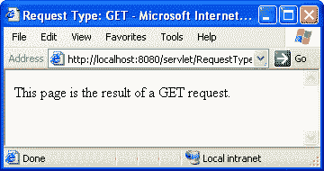
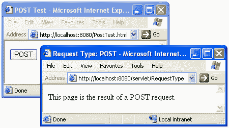
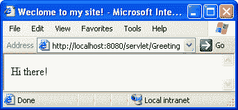
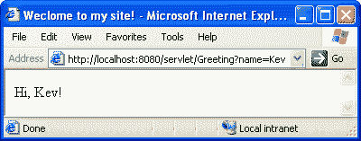
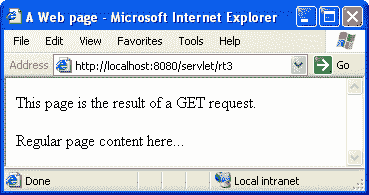

# Java servlet–第 2 部分

> 原文：<https://www.sitepoint.com/java-servlets-2/>

正如我们在本文的第 1 部分中所了解到的，Java Servlet 是一个小的 Java 程序，用于处理 Web 浏览器的请求，并生成动态生成的 Web 页面作为响应。我们已经看到了如何编写、编译和部署简单的 Servlets。如果您不熟悉这些任务，您应该在继续之前阅读并理解第 1 部分。

在第二部分中，我们将更深入地了解 Servlets 的工作原理。首先，我们将研究如何使用`HttpServletRequest`对象获取关于负责调用 Servlet 的浏览器请求的信息，比如作为请求的一部分提交的 HTML 表单的内容。由于表单可以通过 GET 和 POST 请求提交，我们将学习如何用相同的代码创建一个 Servlet 来处理这两种请求类型。我们还将浏览我上次介绍的`web.xml`文件，学习如何动态配置 Servlets。

最后，为了实际演示所有这些概念，我们将构建一个简单的测验 Servlet，您可以扩展并使用它来创建基于 Web 的多项选择测验。

##### 处理 GET 和 POST 请求

正如我在第 1 部分中解释的，Servlet 通过实现一个名为`doGet`的方法来处理一个标准的 Web 页面请求(使用 HTTP GET 方法),并使用它来产生和发送一个动态响应。现在，虽然 Web 上的绝大多数页面请求都是 GET 请求，但是另一种 HTTP 请求方法 **POST** 也很常见。

GET 请求可以通过将表单中输入的所有信息作为 URL 的一部分发送来提交表单。例如，如果一个表单包含两个字段`name`和`email`，并且我在相应的字段中键入`Kevin Yank`和`kevin@sitepoint.com`，那么如果使用 HTTP GET 提交表单，浏览器将尝试加载一个网址，例如:

```
http://www.mysite.com/servlet/Submit?name=Kevin+Yank&email=kevin%40sitepoint.com
```

Servlet(上例中的`Submit`)将能够使用`HttpServletRequest`对象访问`name`和 email 的值(下一节将详细介绍)。

POST 请求方法允许表单以更离散的方式提交。提交的值不是作为 URL 的一部分发送，而是作为 HTTP 请求体的一部分不可见地发送。这其中的机制并不重要；*重要的是*避免了 URL 中出现的令人讨厌的问题，比如提交的密码(应该一直隐藏起来)。

此外，如果用户将 GET 提交产生的页面加入书签，被加入书签的 URL 将包括表单中提交的所有信息，因此单击书签将有效地重新提交表单以产生相同的页面，而 POST 提交结果的书签仅包括 URL，不包括提交的表单数据。有时候这些行为都是可取的(例如，搜索引擎倾向于使用 GET，以便用户可以将他们喜欢的搜索添加到书签中，以便在需要时快速重新提交)，所以您应该学习如何处理这两种行为。

因为用 Servlet 处理 GET 请求需要在 Servlet 类中实现一个`doGet`方法，所以处理 POST 请求需要一个`doPost`方法也就顺理成章了。这里有一个简单的 Servlet 处理这两种请求类型(【RequestType.java】T2):

```
import java.io.*; 

import javax.servlet.*; 

import javax.servlet.http.*; 

public class RequestType extends HttpServlet { 

  public void doGet(HttpServletRequest req, HttpServletResponse rsp) 

                throws ServletException, IOException { 

    rsp.setContentType("text/html"); 

    PrintWriter out = rsp.getWriter(); 

    out.println("<html>"); 

    out.println("<head><title> Request Type: GET </title></head>"); 

    out.println("<body>"); 

    out.println("<p>This page is the result of a GET request.</p>"); 

    out.println("</body></html>"); 

  } 

  public void doPost(HttpServletRequest req, HttpServletResponse rsp) 

                throws ServletException, IOException { 

    rsp.setContentType("text/html"); 

    PrintWriter out = rsp.getWriter(); 

    out.println("<html>"); 

    out.println("<head><title> Request Type: POST </title></head>"); 

    out.println("<body>"); 

    out.println("<p>This page is the result of a POST request.</p>"); 

    out.println("</body></html>"); 

  } 

}
```

编译这个 Servlet(或者下载 [RequestType.class](http://www.webmasterbase.com/examples/servlets/RequestType.class) )并将其部署在您的 Tomcat 服务器上，然后加载`http://localhost:8080/servlet/RequestType`。您应该会看到如下页面:

如果你用 Tomcat 设置了 Apache，那么`http://localhost/servlet/RequestType`(必要时指定端口 8000)应该也可以工作。正如您所看到的，在 Web 浏览器中输入一个 URL 来加载它会产生一个 GET 请求，在本例中由我们的`RequestType` Servlet 的`doGet`方法来处理。为了测试我们的 Servlet 对 POST 请求的处理，我们必须创建一个 HTML 页面，其中包含一个通过 POST 提交的表单。创建下面的 HTML 文件(【PostTest.html】T4):

```
<html> 

<head> 

<title> POST Test </title> 

</head> 

<body> 

  <form method="POST" action="servlet/RequestType"> 

    <input type="submit" value="POST" /> 

  </form> 

</body> 

</html>
```

如您所见，该页面包含一个简单的 HTML 表单，该表单被设置为通过 POST 请求(`method="POST"`)提交给我们的`RequestType` Servlet ( `action="servlet/RequestType"`)。将这个文件放在 Tomcat 的`webappsROOT`目录中(例如`D:Program FilesApache Groupjakarta-tomcat-3.2.3webappsROOT`)——这是 Tomcat 期望找到非 Java Web 资源如 HTML 和图像文件的地方。然后，您应该能够加载`http://localhost:8080/PostTest.html`并单击“POST”按钮来加载带有 POST 请求的`RequestType` Servlet:

要在 Apache 服务器上尝试这种方法，您需要将`PostTest.html`放在 Apache 的文档根目录中，或者在 Apache 的配置文件中使用一个`JkMount`指令将对`/PostTest.html`的请求重定向到 Tomcat，如第 1 部分所述。

通常，您会希望 Servlet 以同样的方式处理 GET 和 POST 请求。在大多数情况下，当您设计 Servlet 来处理表单时，您并不关心表单是通过 GET 还是 POST 提交的，所以您需要实现两种不同的方法来处理这两种情况这一事实看起来有点痛苦。相反，你可以写一个单独的`doGet`方法来处理所有的请求，然后让`doPost`调用`doGet`方法。这里有一个更新的(有点短)版本的`RequestType` Servlet，叫做【RequestType2.java】()的`RequestType2`:

```
import java.io.*; 

import javax.servlet.*; 

import javax.servlet.http.*; 

public class RequestType2 extends HttpServlet { 

  public void doGet(HttpServletRequest req, HttpServletResponse rsp) 

                throws ServletException, IOException { 

    rsp.setContentType("text/html"); 

    PrintWriter out = rsp.getWriter(); 

    String requestType = req.getMethod(); 

    out.println("<html>"); 

    out.println("<head><title> Request Type: " + requestType + 

                " </title></head>"); 

    out.println("<body>"); 

    out.println("<p>This page is the result of a " + requestType + 

                " request.</p>"); 

    out.println("</body></html>"); 

  } 

  public void doPost(HttpServletRequest req, HttpServletResponse rsp) 

                throws ServletException, IOException { 

    doGet(req,rsp); 

  } 

}
```

首先要注意的是，`doPost`方法被简化为一行，它简单地用相同的`HttpServletRequest` ( `req`)和`HttpServletResponse` ( `rsp`)参数调用 doGet 方法:

```
 doGet(req,rsp);
```

现在，由于这个特定的 Servlet 需要对用于调用它的请求类型敏感(Servlet 的全部目的是显示请求类型)，我们使用`HttpServletRequest`对象的`getMethod`方法来获得一个字符串(或者“get”或者“POST”)来指示请求中使用的 HTTP 方法。

```
 String requestType = req.getMethod();
```

然后，我们使用在输出行中产生的`requestType`变量，在需要的地方显示请求类型。编译(或下载 [RequestType2.class](http://www.webmasterbase.com/examples/servlets/RequestType2.class) )并部署`RequestType2` Servlet，如果愿意的话，可以试一试。

##### 表单处理

正如我们在[第 1 部分](http://www.webmasterbase.com/article.php/509)中看到的，每次 Servlet 被请求处理页面请求时，它都会被提供一个`HttpServletRequest`对象，这个对象包含了请求的完整描述。如果页面请求是表单提交的结果，那么这个请求对象包含每个表单字段中提交的值。在这一节中，我将向您展示如何访问这些值，并在您的 Servlets 中使用它们来生成响应的动态页面。

在 Servlet 中检索表单参数非常简单；您只需使用`HttpServletRequest`对象的`getParameter`方法。例如，要检索“名称”字段的值并将其存储在字符串变量`name`中，您可以使用以下代码:

```
String name = req.getParameter("name");
```

简单吧？与其他一些语言不同，Java Servlets 使用一种方法来检索这样的请求参数，无论它们是作为表单的一部分与 HTTP POST 请求一起提交的，还是包含在 URL 查询字符串中的。让我们来看一个实践中的例子([Greeting.java](http://www.webmasterbase.com/examples/servlets/Greeting.java)):

```
import java.io.*;  

import javax.servlet.*;  

import javax.servlet.http.*;  

public class Greeting extends HttpServlet {  

  public void doGet(HttpServletRequest req, HttpServletResponse rsp)  

                throws ServletException, IOException {  

    rsp.setContentType("text/html");  

    PrintWriter out = rsp.getWriter();  

    // Get the name parameter value  

    String name = req.getParameter("name");  

    // If a name was specified, build a personalized greeting  

    String greeting;  

    if (name == null)  

      greeting = "Hi there!";  

    else  

      greeting = "Hi, " + name + "!";  

    out.println("<html>");  

    out.println("<head><title> Weclome to my site! </title></head>");  

    out.println("<body>");  

    out.println("<p>" + greeting + "</p>");  

    out.println("</body></html>");  

  }  

  public void doPost(HttpServletRequest req, HttpServletResponse rsp)  

                throws ServletException, IOException {  

    doGet(req,rsp);  

  }  

}
```

上面给出的代码相对简单，但是让我们分解重要的代码行:

```
 // Get the name parameter value  

    String name = req.getParameter("name");
```

首先，我们检索“name”参数。现在，如果请求不包含“name”参数，它将返回`null`——Java 中的“T4”nothing。因此，在我们用`name`创建个性化问候之前，我们需要检查它是否是`null`。如果是的话，我们用一种不使用`name`的更不带人情味的问候:

```
 // If a name was specified, build a personalized greeting  

    String greeting;  

    if (name == null)  

      greeting = "Hi there!";  

    else  

      greeting = "Hi, " + name + "!";
```

最后，我们将`greeting`显示为页面的一部分:

```
 out.println("<p>" + greeting + "</p>");
```

编译这个 Servlet(或者下载 [Greeting.class](http://www.webmasterbase.com/examples/servlets/Greeting.class) ),然后部署并加载它，您应该会看到类似这样的内容:

不出所料，因为我们没有为我们的请求提供‘name’参数，`getParameter("name")`返回`null`，并显示通用问候。现在，要测试个性化问候语，您可以创建一个 HTML 文件，其中包含一个如下所示的表单:

```
<form action="/servlet/Greeting" method="POST">  

  Your name: <input type="text" name="name" /><br />  

  <input type="submit" value="Greet me!" />  

</form>
```

如果您特别希望看到表单提交的运行，您可以这样做，但是为了测试我们的 Servlet，我们可以使用一个更简单的方法。只需在用于加载上述 Servlet 的 URL 中添加一个“name”参数(例如`http://localhost:8080/servlet/Greeting?name=Kev`)。如果您在上面的`<form>`标签中指定了`method="GET"`,这就是表单提交的方式。以下是您应该看到的内容:

现在，你可以让 Servlet 本身用一个表单提示用户，而不是使用一个单独的带有`<form>`标签的 HTML 文件。下面的 Servlet，`Greeting2`([Greeting2.java](http://www.webmasterbase.com/examples/servlets/Greeting2.java))，是我们上面创建的问候 Servlet 的修改版本。这一次，如果没有设置“name”参数，Servlet 将显示一个表单，提示用户输入姓名:

```
import java.io.*;  

import javax.servlet.*;  

import javax.servlet.http.*;  

public class Greeting2 extends HttpServlet {  

  public void doGet(HttpServletRequest req, HttpServletResponse rsp)  

                throws ServletException, IOException {  

    rsp.setContentType("text/html");  

    PrintWriter out = rsp.getWriter();  

    // Get the name parameter value  

    String name = req.getParameter("name");  

    // If a name was specified, build a personalized greeting  

    String greeting;  

    if (name == null) {  

      // Get the URL of this Servlet  

      StringBuffer action = HttpUtils.getRequestURL(req);  

      greeting =  "<form action="" + action + "" method="POST">n";  

      greeting += "  Your name: ";  

      greeting += "  <input type="text" name="name" /><br />n";  

      greeting += "  <input type="submit" value="Greet me!" />n";  

      greeting += "</form>n";  

    } else greeting = "Hi, " + name + "!";  

    out.println("<html>");  

    out.println("<head><title> Weclome to my site! </title></head>");  

    out.println("<body>");  

    out.println("<p>" + greeting + "</p>");  

    out.println("</body></html>");  

  }  

  public void doPost(HttpServletRequest req, HttpServletResponse rsp)  

                throws ServletException, IOException {  

    doGet(req,rsp);  

  }  

}
```

让我们看看这里的重要变化。如果浏览器没有在请求中发送“name”参数，那么变量`name`将像以前一样被赋值为`null`。然而，我们的新 Servlet 将显示一个表单，而不是显示一般的消息。因为我们希望表单被提交回 Servlet，所以我们需要获得浏览器用来加载 Servlet 的 URL，并将其作为`<form>`标记的`action`参数输出。

人们通常认为 URL 可以从`HttpServletRequest`对象的方法中获得，但实际上该对象只有检索 URL 的一小部分的方法，比如请求的协议或路径。相反，Servlet API 包括一个名为`HttpUtils`的类，它有许多静态方法(属于类而不是类的对象的方法)，用于执行与 Servlet 相关的有用操作。`HttpUtils.getRequestURL`方法将一个`HttpServletRequest`对象作为参数，并返回 URL:

```
 if (name == null) {  

      // Get the URL of this Servlet  

      StringBuffer action = HttpUtils.getRequestURL(req);
```

唯一的问题是它将 URL 作为一个`StringBuffer`返回，而不是我们更熟悉的字符串。StringBuffers 基本上就是无需创建新对象就可以修改的字符串。至于把它的值作为`<form>`标签的一部分打印出来，你可以把它当作一个字符串:

```
 greeting =  "<form action="" + action + "" method="POST">n";
```

请注意，我们在代码中的任何引号(`"`)前放置了反斜杠，这样它们就不会干扰标记文本字符串开头和结尾的引号。我们还使用特殊的`n`代码来表示应该出现在 HTML 中的换行符。

编译(或下载 [Greeting2.class](http://www.webmasterbase.com/examples/servlets/Greeting2.class) )并部署这个新的 Servlet，然后加载它(`http://localhost:8080/servlet/Greeting2`)。您应该看到一个表单，当提交时，会生成一个带有个性化问候的页面！

##### Servlet 初始化参数

像任何潜在的复杂软件一样，Servlets 可以有配置设置和可以启用或禁用的选项。在 Servlets 的世界里，这些设置被称为**初始化参数**，并且设置在我们上次讨论的`web.xml`文件中。

初始化参数的一个常见用途是启用调试输出。例如，如果一个 Servlet 连接到一个数据库来检索一些要在页面上显示的信息，那么您可能希望在开发 Servlet 时显示发送到数据库的命令，这样您就可以确保一切都在幕后正常工作。但是当需要在生产环境中部署 Servlet 时，您不希望显示这些调试消息。通过使用初始化参数来设置是否显示调试输出，您可以轻松地构建一个适用于开发和生产环境的 Servlet。让我们来看看这是如何做到的。

所有 Servlets 都应该扩展的`HttpServlet`类有一个`getInitParameter`方法，该方法检索给定名称的初始化参数的值。因为所有的 Servlets 都是`HttpServlet`的子类，所以它们都继承了那个方法。因此，获取 init 参数的值就像这样简单:

```
String param = getInitParameter("paramName");
```

对于用于启用调试输出的参数，我们可以在每次需要检查时调用`getInitParameter("debug")`，但是一个更有效的解决方案(也节省了一些输入)是在 Servlet 第一次加载时检查一次，并将结果存储为一个`boolean` (true/false)变量。

为了在加载 Servlet 时执行一些动作，您需要为您的 Servlet 提供一个`init`方法。下面是一个 Servlet 的框架，它有一个`boolean`属性变量`debug`，该变量在加载时由`init`方法赋值:

```
import java.io.*;   

import javax.servlet.*;   

import javax.servlet.http.*;   

public class MyDebugServlet extends HttpServlet {   

  boolean debug;   

  public void init() throws ServletException {   

    String debugParam = getInitParameter("debug");   

    if (debugParam != null &&   

        debugParam.equalsIgnoreCase("true")) {   

      debug = true;   

    } else {   

      debug = false;   

    }   

  }   

  // ... doGet, doPost, etc. ...   

}
```

正如您所看到的，必须声明`init`方法来抛出一个`ServletException`。ServletException 是一种错误类型，`init`方法(和大多数其他 Servlet 方法)会产生这种错误来告诉服务器发生了错误，并显示一条错误消息，因为 Servlet 没有按预期工作。我将在本文的最后一个例子中演示这一点，但是在这种情况下，我们的 Servlet 不需要产生这样的错误。然而，必须声明`init`方法，就好像它可以一样。

上面的第一件事`init`是获取调试初始化参数(`getInitParameter("debug")`)。就像我们在上一节看到的`getParameter`函数(用于获取请求参数)，如果没有指定参数，`getInitParameter`将返回 null。因此，在我们使用`debugParam`变量之前，我们应该确保它不是`null`(试图在一个空变量上调用一个方法会导致您的 Servlet 崩溃并出现`NullPointerException`错误):

```
if (debugParam != null &&   

    debugParam.equalsIgnoreCase("true")) {
```

这个`if`语句使用 AND ( `&&`)运算符。用文字来说，它说

*if `debugParam` isn’t `null` and debugParam is "true" (ignoring case)…*

因为如果`debugParam`是`null`的话，调用`equalsIgnoreCase`会导致一个`NullPointerException`，所以重要的是我们要检查它不是第一个。Java 相当聪明，所以如果在一个`if`语句中，一个条件和(`&&`)另一个条件必须为真，而结果第一个条件为假，那么 Java 甚至不会去检查第二个条件。在这种情况下，如果`debugParam` *为* null，那么 Java 将跳过第二个条件，避免崩溃。

因此，如果`if`语句被证明为真，那么我们设置我们的`debug`属性变量`true`。如果不是，我们将`debug`设置为假。然后我们可以使用这个属性变量来决定是否在我们的`doGet`方法中显示调试输出:

```
if (debug) out.println("Debug output here!");
```

我们在本文开始时开发的`RequestType2` Servlet 的以下变体仅在`debug`参数设置为 true(【RequestType3.java】)时显示请求类型:

```
import java.io.*;   

import javax.servlet.*;   

import javax.servlet.http.*;   

public class RequestType3 extends HttpServlet {   

  boolean debug;   

  public void init() throws ServletException {   

    String debugParam = getInitParameter("debug");   

    if (debugParam != null &&   

        debugParam.equalsIgnoreCase("true")) {   

      debug = true;   

    } else {   

      debug = false;   

    }   

  }   

  public void doGet(HttpServletRequest req, HttpServletResponse rsp)   

                throws ServletException, IOException {   

    rsp.setContentType("text/html");   

    PrintWriter out = rsp.getWriter();   

    String requestType = req.getMethod();   

    out.println("<html>");   

    out.println("<head><title> A Web page </title></head>");   

    out.println("<body>");   

    if (debug) out.println("<p>This page is the result of a " +   

                           requestType + " request.</p>");   

    out.println("<p>Regular page content here...</p>");   

    out.println("</body></html>");   

  }   

  public void doPost(HttpServletRequest req, HttpServletResponse rsp)   

                throws ServletException, IOException {   

    doGet(req,rsp);   

  }   

}
```

正如您所看到的，上面的代码使用我们上面的框架代码中的`init`方法来基于 init 参数设置`debug`属性，然后如果请求调试输出，我们显示请求类型:

```
 if (debug) out.println("<p>This page is the result of a " +   

                           requestType + " request.</p>");
```

编译(或下载 [RequestType3.class](http://www.webmasterbase.com/examples/servlets/RequestType3.class) )并部署这个 Servlet，然后加载它。您应该只看到“此处的常规页面内容…”段落(无调试输出):

现在，问题仍然是:我们如何设置初始化参数？为此，我们返回到`web.xml`文件，您可以在`WEB-INF`目录中找到它(例如`C:Program FilesApache Groupjakarta-tomcat-3.2.3webappsROOTWEB-INFweb.xml`)。您应该还记得，在第 1 部分中，我们使用这个文件来指定 Servlets 的名称和映射。使用新标签`<init-param>`，您可以为 Servlet 设置初始化参数。例如，下面的`web.xml`文件将我们的`RequestType3` Servlet 命名为`rt3`，并给它一个名为`debug`的初始化参数，其值为`true`。标签实际上是可选的，但是我们用它来解释参数的作用。

```
<?xml version="1.0" encoding="ISO-8859-1"?>   

<!DOCTYPE web-app   

    PUBLIC "-//Sun Microsystems, Inc.//DTD Web Application 2.2//EN"   

    "http://java.sun.com/j2ee/dtds/web-app_2_2.dtd">   

<web-app>   

  <servlet>   

    <servlet-name>   

      rt3   

    </servlet-name>   

    <servlet-class>   

      RequestType3   

    </servlet-class>   

    <init-param>   

      <param-name>   

        debug   

      </param-name>   

      <param-value>   

        true   

      </param-value>   

      <description>   

        Set to 'true' for debug output.   

      </description>   

    </init-param>   

  </servlet>   

</web-app>
```

现在，如果您使用分配的名称(`http://localhost:8080/servlet/rt3`)加载`RequestType3` Servlet，您将看到调试输出:



##### 一个实际的例子:在线测验

网络上的一个常见元素是多项选择问题。它可以用于调查用户的意见，也可以用于在线考试的教育场合；这种类型的应用有许多不同的用途。为了巩固本文中演示的概念，我们将开发一个 Servlet 来显示一个多项选择问题，然后通知用户他们的选择是否正确。我们将使用我们新发现的表单处理技巧来检查他们的答案，并且我们将使用初始化参数来设置问题、四个可用的答案以及正确的答案。

首先，让我们从创建一个询问特定问题的 Servlet 开始。一旦它工作了，我们将修改它，从初始化参数中获取问题和答案。这个测试 Servlet 的第一个版本实际上与表单处理部分的最后一个例子没有什么不同。我们将显示问题和四个可能答案的单选按钮，而不是提示用户名的表单。与个性化问候示例一样，该表单将被提交回同一个 Servlet，该 Servlet 将检测请求参数(在本例中是选择的答案)的存在，并检查该值是否对应于正确的答案。代码如下:

```
import java.io.*;    

import javax.servlet.*;    

import javax.servlet.http.*;    

public class QuizServlet extends HttpServlet {    

  public void doGet(HttpServletRequest req, HttpServletResponse rsp)    

                throws ServletException, IOException {    

    rsp.setContentType("text/html");    

    PrintWriter out = rsp.getWriter();    

    String answer = req.getParameter("answer");    

    String correct = "C";    

    out.println("<html>");    

    out.println("<head><title> Online Quiz </title></head>");    

    out.println("<body>");    

    if (answer == null) {    

      StringBuffer action = HttpUtils.getRequestURL(req);    

      out.println("<form action="" + action + "" method="POST">n");    

      out.println("<p><b>Question:</b> What is WORA?</p>");    

      out.println("<p><input type="radio" name="answer" " +    

                  "value="A" /> Wear Only Reinforced Acryllic<br />");    

      out.println("   <input type="radio" name="answer" " +    

                  "value="B" /> Where Old Rhinos Assemble<br />");    

      out.println("   <input type="radio" name="answer" " +    

                  "value="C" /> Write Once Run Anywhere<br />");    

      out.println("   <input type="radio" name="answer" " +    

                  "value="D" /> Walk Or Run Anywhere<br />");    

      out.println("   <input type="submit" value="Submit" /></p>");    

      out.println("</form>");    

    } else {    

      if (answer.equals(correct))    

        out.println("<p><b>YES!</b> That's the right answer!</p>");    

      else    

        out.println("<p><b>Sorry.</b> That's the wrong answer.</p>");    

    }    

    out.println("</body></html>");    

  }    

  public void doPost(HttpServletRequest req, HttpServletResponse rsp)    

                throws ServletException, IOException {    

    doGet(req,rsp);    

  }    

}
```

现在，这一切都很好，但是我们希望能够将这个 Servlet 用于不止这个问题。为此，我们将从代码中取出问题、答案和正确答案，并使用初始化参数来设置它们。问题将来自`question`参数，答案将是`answerA`、`answerB`、`answerC`和`answerD`，而指示正确答案的字母将由`correct`参数设置。所有这些参数都被读入 Servlet 的`init`方法中同名的属性变量:

```
 public void init() throws ServletException {    

    question = getInitParameter("question");    

    answerA  = getInitParameter("answerA");    

    answerB  = getInitParameter("answerB");    

    answerC  = getInitParameter("answerC");    

    answerD  = getInitParameter("answerD");    

    correct  = getInitParameter("correct");    

    if (question == null || answerA == null || answerB == null ||    

        answerC == null || answerD == null || correct == null) {    

      throw new ServletException("Missing required init parameter(s)!");    

    }    

  }
```

在`init`方法的末尾，您会注意到一个相当大的`if`语句。它检查是否有任何初始化参数丢失(以及`null`，使用 OR ( `||`)操作符用一个`if`语句检查所有参数。可以大声读出*“如果问题为空或答案 a 为空或……”*。如果任何需要的参数被认为丢失，我们**抛出**一个`ServletException`。`ServletException`是一个 Java 类，所以要创建该类的对象，我们键入`new`后跟类名。`ServletException`让我们通过向构造函数传递一个字符串来给出错误的原因，这正是我们上面所做的。最后，`throw`关键字表示我们希望在该点停止方法的执行，并将错误(`ServletException`对象)传递给最初调用该方法的任何代码(在本例中，是 Web 服务器的一部分)。然后，Web 服务器将通过在用户的 Web 浏览器中显示错误页面来处理它，以响应任何请求。

加载参数后，生成表单的更新代码相当简单:

```
 out.println("<form action="" + action + "" method="POST">n");    

      out.println("<p><b>Question:</b> " + question + "</p>");    

      out.println("<p><input type="radio" name="answer" " +    

                  "value="A" /> " + answerA + "<br />");    

      out.println("   <input type="radio" name="answer" " +    

                  "value="B" /> " + answerB + "<br />");    

      out.println("   <input type="radio" name="answer" " +    

                  "value="C" /> " + answerC + "<br />");    

      out.println("   <input type="radio" name="answer" " +    

                  "value="D" /> " + answerD + "<br />");    

      out.println("   <input type="submit" value="Submit" /></p>");    

      out.println("</form>");
```

真的就是这么回事！下面是我们的`QuizServlet`类([QuizServlet.java](http://www.webmasterbase.com/examples/servlets/QuizServlet.java))的完整代码:

```
import java.io.*;    

import javax.servlet.*;    

import javax.servlet.http.*;    

public class QuizServlet extends HttpServlet {    

  String question, answerA, answerB, answerC, answerD, correct;    

  public void init() throws ServletException {    

    question = getInitParameter("question");    

    answerA  = getInitParameter("answerA");    

    answerB  = getInitParameter("answerB");    

    answerC  = getInitParameter("answerC");    

    answerD  = getInitParameter("answerD");    

    correct  = getInitParameter("correct");    

    if (question == null || answerA == null || answerB == null ||    

        answerC == null || answerD == null || correct == null) {    

      throw new ServletException("Missing required init parameter(s)!");    

    }    

  }    

  public void doGet(HttpServletRequest req, HttpServletResponse rsp)    

                throws ServletException, IOException {    

    rsp.setContentType("text/html");    

    PrintWriter out = rsp.getWriter();    

    String answer = req.getParameter("answer");    

    out.println("<html>");    

    out.println("<head><title> Online Quiz </title></head>");    

    out.println("<body>");    

    if (answer == null) {    

      StringBuffer action = HttpUtils.getRequestURL(req);    

      out.println("<form action="" + action + "" method="POST">n");    

      out.println("<p><b>Question:</b> " + question + "</p>");    

      out.println("<p><input type="radio" name="answer" " +    

                  "value="A" /> " + answerA + "<br />");    

      out.println("   <input type="radio" name="answer" " +    

                  "value="B" /> " + answerB + "<br />");    

      out.println("   <input type="radio" name="answer" " +    

                  "value="C" /> " + answerC + "<br />");    

      out.println("   <input type="radio" name="answer" " +    

                  "value="D" /> " + answerD + "<br />");    

      out.println("   <input type="submit" value="Submit" /></p>");    

      out.println("</form>");    

    } else {    

      if (answer.equals(correct))    

        out.println("<p><b>YES!</b> That's the right answer!</p>");    

      else    

        out.println("<p><b>Sorry.</b> That's the wrong answer.</p>");    

    }    

    out.println("</body></html>");    

  }    

  public void doPost(HttpServletRequest req, HttpServletResponse rsp)    

                throws ServletException, IOException {    

    doGet(req,rsp);    

  }    

}
```

如果您编译( [QuizServlet.class](http://www.webmasterbase.com/examples/servlets/QuizServlet.class) )并部署这个 Servlet 而不指定任何初始化参数，您将看到当 Servlet 在其`init`方法中抛出`ServletException`时会发生什么:

如您所见，显示了一个错误页面，显示了 ServletException、错误原因(`Missing required init parameter(s)!`)以及代码中发生错误的位置。

为了避免这个难看的错误，让我们将所需的参数添加到`web.xml`中。下面是您可以为这个 Servlet 添加的代码(请随意使用您自己的问题和答案):

```
 <servlet>    

    <servlet-name>    

      quiz    

    </servlet-name>    

    <servlet-class>    

      QuizServlet    

    </servlet-class>    

    <init-param>    

      <param-name>question</param-name>    

      <param-value>What is WORA?</param-value>    

    </init-param>    

    <init-param>    

      <param-name>answerA</param-name>    

      <param-value>Wear Only Reinforced Acryllic</param-value>    

    </init-param>    

    <init-param>    

      <param-name>answerB</param-name>    

      <param-value>Where Old Rhinos Assemble</param-value>    

    </init-param>    

    <init-param>    

      <param-name>answerC</param-name>    

      <param-value>Write Once Run Anywhere</param-value>    

    </init-param>    

    <init-param>    

      <param-name>answerD</param-name>    

      <param-value>Walk Or Run Anywhere</param-value>    

    </init-param>    

    <init-param>    

      <param-name>correct</param-name>    

      <param-value>C</param-value>    

    </init-param>    

  </servlet>
```

现在再次加载 Servlet(记得使用您在`web.xml`中分配的`<servlet-name>`，否则它将看不到您刚刚添加的 init 参数)，您应该会看到测验问题出现:


##### 总结和进一步阅读

在这篇介绍 Java Servlets 的文章的第二部分中，我介绍了一些编写 servlet 的更复杂的概念。首先，我展示了如何用一个`doPost`方法处理 POST 请求，并演示了该方法如何简单地调用`doGet`将所有请求处理代码放在一个地方。接下来，我展示了如何使用`HttpServletRequest`对象来检索请求参数，比如输入到 HTML 表单字段中的值，或者作为 URL 查询字符串的一部分传递。当我们想要创建一个提交回生成它的同一个 Servlet 的表单时，`HttpUtils`类就派上了用场。最后，我展示了如何在部署 Servlet 时使用初始化参数来配置它。通过在`web.xml`文件中设置参数，并在 Servlet 的`init`方法中检查它们的值，我们可以控制我们的 Servlet 的行为，而不必改变它的代码并重新编译它。

然后，我们利用所有这些知识，开发了一个基于 Web 的测验 Servlet。如果您正在寻找一些练习，考虑一下如何扩展这个 Servlet，使问题的答案多于或少于 4 个。如果你真的雄心勃勃，考虑如何支持一个包含多个问题的测验，也许每页一个问题，并有一个机制在用户进行测验时跟踪他的分数！

有了 Java 语言的强大支持，Servlets 可以成为非常强大的东西。此外，我们仅仅触及了 Servlet API 所能提供的表面。从会话跟踪和 cookies 到密码保护和缓存控制，Servlets 是一项完整而强大的技术。它们唯一明显的缺点是页面的静态 HTML 部分必须嵌入到 Java 代码中，或者作为属性隐藏在一个`web.xml`文件中。不管是哪种情况，对于那些不需要熟悉 Java Servlets 的复杂性，但是想要修改页面上的图像或静态文本的设计人员来说，这都是一件困难的事情。JavaServer Pages (JSP)等技术试图通过将 Servlet API 封装在一个方便的框架中来补救这种情况，该框架允许您使用 Java 代码编写 Java 支持的 Web 页面，这些代码出现在看起来很正常的 HTML 文件中。这使得 JSP 非常类似于 ASP、PHP、Cold Fusion 和其他流行的 Web 脚本技术。

为了全面彻底地了解 Servlet 世界和它们的能力，我推荐 Jason Hunter 和 William Crawford 的优秀著作《Java Servlet 编程第二版》(T2)。它不仅以令人难以置信的详细程度涵盖了关于 Servlets 的所有知识，而且还用实际例子和清晰、有时幽默的讨论来支持每一点。这本书还深入研究了许多围绕 Servlets 框架的技术，比如 JavaServer Pages (JSP)。

## 分享这篇文章