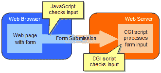

# JavaScript 101–第 3 部分

> 原文：<https://www.sitepoint.com/javascript-101-3/>

在这个 JavaScript 介绍性系列的前两部分中，我们探索了组成该语言的一般元素，并把它们应用到一些实际的、简单的应用中。然而，这些例子的不幸现实是，它们都可以用直接的 HTML 来完成。交替的表格行颜色可以手工创建，月收入数字可以记录在电子表格中，并手工转录成 HTML，尽管 JavaScript 弹出窗口在理论上很好，但它们绝不是必需的。

在这个由三部分组成的系列文章的最后一部分中，我们将把目前为止我们所看到的所有概念应用到一个更现实的 JavaScript 应用程序中:**客户端表单验证**。在这个过程中，我们将探索与表单和表单元素相关的文档对象模型(DOM)的有用子集，并了解新的事件处理程序。到本文结束时，您应该对 JavaScript 的基础知识有了全面的了解，并准备将本文介绍的技术应用到您的下一个 Web 设计项目中，或者处理更高级的主题，如动态 HTML (DHTML)。

##### 客户端表单验证

经验丰富的程序员有一个共同的格言:“总是假设用户会输入无意义的内容。”基本上这意味着，虽然你的程序(或网页)可能会接受一些合理的用户输入并产生合理的输出，但你也应该考虑到用户输入可能只是随机的字符，你的程序仍然应该产生合理的输出！例如，如果每次你输入一个不正确的网址，你的浏览器就会崩溃，你会有多沮丧？我觉得*很*！

幸运的是，对于像你我这样的 Web 程序员来说，大部分用户交互都是以点击链接的形式出现的，而且由于人们很难点击一个“错误”的链接，所以不正确的用户输入不是我们必须要处理的事情。几乎唯一有问题的地方是当我们要求用户填写表单时。例如，如果您要创建一个页面，某个软件产品的用户可以在其中注册技术支持，那么您可能需要表单字段来输入他们的姓名、地址、电话号码、电子邮件地址以及其他相关的详细信息。然而，用户可以很容易地将该字段留空，而不是键入他或她的姓名。用户可以键入“不关你的事”，而不是他或她的电话号码除了有效的电子邮件地址，用户还可以输入任意数量的内容。最后一个值尤其有问题，因为您可能有一个向注册用户发送技术支持公告的自动化过程，如果一个无效的电子邮件地址出现在该列表中，它可能会干扰向正确填写表单的其他用户发送这些公告的过程！

对于所有这些问题，最简单的解决方案是在接受提交进行处理之前，检查用户是否在表单域中输入了合理的值。有两个地方可以进行这种验证:客户端或服务器端。



在过去，无论 Web 服务器上的哪个程序(例如 CGI 脚本)接收和处理表单提交，都必须首先检查提交的数据以确保它是有效的。如果发现它在某些方面不正确，程序不会处理提交，而是会向浏览器发回一个解释问题的网页(例如“对不起。一个或多个必填字段未填写。).因为在这种情况下，验证发生在 Web 服务器上，所以这种设置通常被称为**服务器端表单验证**。虽然它具有简单可靠的优点，但服务器端验证的速度非常慢，因为用户必须等待表单提交到服务器，等待响应页面返回，然后才发现(比如说)他输入了错误的电话号码。

相反，可以在表单的 Web 页面中包含一些 JavaScript，即时验证输入表单的数据，如果要提交的信息有问题，就阻止表单提交。正如我们将看到的，JavaScript 还允许增加灵活性，通过将用户的光标移动到问题字段来指出错误发生的确切位置，以便可以立即修复错误。由于 JavaScript 在 Web 浏览器(客户端)上运行，这种类型的验证被称为**客户端表单验证**。这种类型的验证将是本文的重点。

在我们进入细节之前，最后注意一点:由于 JavaScript 可以很容易地在当前服务中的所有 Web 浏览器上被禁用，并且由于一些旧的 Web 浏览器甚至不支持 JavaScript，客户端表单验证最好用作服务器端验证的补充，而不是替代。JavaScript 验证本质上是针对不正确表单提交的“第一道防线”。如果某个不正确的提交进入了您的服务器端程序，它应该仍然能够优雅地处理提交。

##### `onSubmit`事件处理器

用 JavaScript 验证表单提交的第一步是能够响应提交表单的用户。幸运的是，有一个事件处理程序使这变得非常容易。

```
<form action="blah.cgi" method="post" **onSubmit="return false;"**>  

Your name: <input type="text" name="name">  

<input type="submit" name="submit" value="Go!">  

</form>
```

这里有一张永远无法提交的表格！诀窍在于表单标签的`onSubmit`属性。就像我们在[第 2 部分](https://web.archive.org/web/20030201093549/http://www.webmasterbase.com:80/article/454/)中看到的`onClick`、`onMouseOver`和`onMouseOut`属性一样，这是一个 JavaScript **事件处理程序**。它指定要运行的 JavaScript 代码来响应提交的表单。与其他事件处理程序一样，这个事件处理程序返回的值允许您控制浏览器在执行完 JavaScript 代码后是否处理事件本身。在上面的例子中，事件处理程序所做的只是返回一个 false 值，它指示浏览器*而不是*继续提交表单！因此，如果你需要一个“只是为了展示”的表单，或者完全由 JavaScript 处理的表单，那么简单地从`onSubmit`事件处理程序返回 false 就足以阻止在支持 JavaScript 的浏览器上提交表单。

现在，`onSubmit`事件处理程序真的变得有趣了，当它返回的值依赖于一些条件时。这里有一个例子:

```
<script language="JavaScript" type="text/javascript">  

<!--  

**function confirmSubmit() {  

  if (confirm("Really submit this form?")) return true;  

  else return false;  

}**  

//-->  

</script>  

<form action="blah.cgi" method="post"  

      **onSubmit="return confirmSubmit();"**>  

Your name: <input type="text" name="username">  

<input type="submit" name="submit" value="Go!">  

</form>
```

在这个例子中，`onSubmit`事件处理程序返回由`confirmSubmit()`函数返回的任何值。`confirmSubmit()`使用内置的 JavaScript 函数`confirm()`，它与`alert()`相似，向用户显示一个消息框。但是消息框将有“确定”和“取消”按钮，而不仅仅是一个“确定”按钮。如果用户点击 OK，`confirm()`返回 true 如果用户单击取消或关闭消息框，它将返回 false。这个返回值充当 if 语句中的条件，进而决定`confirmSubmit()`返回 true 还是 false。

简而言之，上面的例子拦截表单提交并显示一个消息框，要求用户确认提交。如果用户单击 OK，提交继续进行；否则，表单提交将被取消。

事实上，由于`confirm()`函数本身如此方便地返回 true 或 false，我们可以通过在事件处理程序中直接使用`confirm()`来更有效地编写上面的例子:

```
<form action="blah.cgi" method="post"  

      **onSubmit="return confirm('Really submit this form?');"**>  

Your name: <input type="text" name="username">  

<input type="submit" name="submit" value="Go!">  

</form>
```

然而，使用自定义函数来确定表单提交是否继续是表单验证的一项重要技术，我们将在下一节中看到。现在，您可以在任何表单上使用上面的代码，在提交之前要求用户确认。

##### 必填字段

最简单也是最常见的表单验证形式是必填字段。您可以向用户指出表单中的某些字段必须填写，并使用 JavaScript 来阻止那些字段为空的任何提交。

下面是一个只有一个字段的表单的基本代码，在允许提交之前必须填写这个字段:

```
<script language="JavaScript" type="text/javascript">   

<!--   

**function validateForm() {   

  var name = document.myForm.username.value;   

  if (name == "") {   

    alert("Required field not filled in!");   

    return false;   

  } else return true;   

}**   

//-->   

</script>   

<form action="blah.cgi" **name="myForm"** method="post"   

      **onSubmit="return validateForm();"**>   

Your name: <input type="text" **name="username"**> *   

<input type="submit" name="submit" value="Go!">   

</form>   

<p>(* indicates a required field)</p>
```

同样，我们使用一个定制函数(`validateForm()`)，它返回 true 或 false 来指示表单提交是否被允许。但是，在这种情况下，该函数必须检查所需的表单字段是否已经填写。让我解释一下这个函数是如何工作的，从第一行开始:

```
var name = document.myForm.username.value;
```

毫无疑问，您认识到这一行创建了一个名为`name`的变量，但是它赋予这个变量的值可能有点令人困惑。这一行实际做的是获取必填字段中的值，并将其存储在新的 name 变量中。为了访问这个值，它使用了一系列文档对象模型(DOM)对象。`document`代表 HTML 文档本身。后面的点表示我们想要访问“内部”或“属于”文档的内容，在本例中是我们的表单。

查看表单标记，您会注意到我添加了一个属性:`name="myForm"`。这为我们的表单指定了一个名称，上面的 JavaScript 代码行使用这个名称来访问我们的表单(`document.myForm`)。访问表单后，我们可以用同样的方式访问必填字段本身(`document.myForm.username`)。

这个 DOM 对象在我们的表单中表示一个文本字段，它有许多属性和方法，正如我们在[第 2 部分](https://web.archive.org/web/20030201093549/http://www.webmasterbase.com:80/article/454/)中了解到的。对于我们的目的来说，其中最重要的是`value`属性，它包含当前显示在表单字段中的值。因此，`document.myForm.username.value`将产生输入到表单域中的值。

`validateForm()`函数的其余部分非常简单。它检查这个值是否是一个空字符串(这将表明表单域没有被填充)，如果是，在返回 false 之前向用户显示一条消息，取消表单提交。否则，它返回 true，表单提交照常进行。

多个必填字段也很容易实现。下面是一个包含两个必填字段和一个可选字段的示例:

```
<script language="JavaScript" type="text/javascript">   

<!--   

**function validateForm() {   

  var name = document.myForm.username.value;   

  var email = document.myForm.email.value;   

  if (name == "") {   

    alert("Please fill in your name.");   

    return false;   

  }   

  if (email == "") {   

    alert("Please fill in your email address.");   

    return false;   

  }   

  return true;   

}**   

//-->   

</script>   

<form action="blah.cgi" **name="myForm"** method="post"   

      onSubmit="return validateForm();">   

Your name: <input type="text" **name="username"**> *<br>   

Email address: <input type="text" **name="email"**> *<br>   

Phone Number: <input type="text" name="phone"><br>   

<input type="submit" name="submit" value="Submit">   

</form>   

<p>(* indicates a required field)</p>
```

##### 改进的必填字段

我们可以对上面开发的代码进行一些改进。首先，我们不需要为表单指定一个名称让`validateForm()`函数用来访问其元素的值，而是通过在一个参数中向函数发送对表单的引用来节省一些输入:

```
<script language="JavaScript" type="text/javascript">    

<!--    

function validateForm(**theForm**) {    

  var name = **theForm**.username.value;    

  var email = **theForm**.email.value;    

  if (name == "") {    

    alert("Please fill in your name.");    

    return false;    

  }    

  if (email == "") {    

    alert("Please fill in your email address.");    

    return false;    

  }    

  return true;    

}    

//-->    

</script>    

<form action="blah.cgi" method="post"    

      onSubmit="return validateForm(**this**);">    

Your name: <input type="text" name="username"> *<br>    

Email address: <input type="text" name="email"> *<br>    

Phone Number: <input type="text" name="phone"><br>    

<input type="submit" name="submit" value="Submit">    

</form>    

<p>(* indicates a required field)</p>
```

在上面的例子中，我修改了`validateForm()`函数，接受一个参数，并将其值存储在变量 Form 中。然后，该变量用作访问待验证表单中元素的基础(例如`theForm.email.value`)。在表单标签的事件处理程序中，我们通过使用关键字`this`作为参数来传递对表单本身的引用。这个特殊变量总是包含一个对“当前”对象的引用，在 onSubmit 事件处理程序的情况下，这个对象就是正在提交的表单。

这种传递对要验证的表单的引用的技术为编写可以被多个表单使用的更复杂的验证函数打开了大门。然而，这种复杂类型的表单验证超出了本文的范围。

对上述代码的另一个改进是自动将文本光标放在未填写的必填字段中，这样用户只需输入值，然后重新提交表单。正如我们已经看到的，表单文本字段有一个 value 属性，但是它们也有许多方法。其中一个是`focus()`方法，它给出了有问题的字段‘焦点’(即移动文本光标到它上面)。下面是上述示例的更新版本，它使用`focus()`方法将焦点分配给任何未填写的必填字段:

```
<script language="JavaScript" type="text/javascript">    

<!--    

function validateForm(theForm) {    

  var name = theForm.username.value;    

  var email = theForm.email.value;    

  if (name == "") {    

    alert("Please fill in your name.");    

    **theForm.username.focus();**    

    return false;    

  }    

  if (email == "") {    

    alert("Please fill in your email address.");    

    **theForm.email.focus();**    

    return false;    

  }    

  return true;    

}    

//-->    

</script>    

<form action="blah.cgi" method="post"    

      onSubmit="return validateForm(this);">    

Your name: <input type="text" name="username"> *<br>    

Email address: <input type="text" name="email"> *<br>    

Phone Number: <input type="text" name="phone"><br>    

<input type="submit" name="submit" value="Submit">    

</form>    

<p>(* indicates a required field)</p>
```

##### 验证其他表单元素

检查必填的文本字段是否已填写好固然很好，但是对于一般的表单来说，除了几个文本字段和一个提交按钮之外，还有更多内容。在这一部分，我们将看到验证复选框、单选按钮、列表和文本区域的方法。

一个**复选框**用一个输入标签创建，如下所示:

```
<input type="checkbox" name="myCheckbox" value="someValue">
```

复选框的值可作为其`value`属性访问，就像文本字段的值一样。然而，一个名为`checked`的附加属性允许您确定给定的复选框是否被选中。因此，如果您有一组复选框(假设它们被命名为`myCheckbox1`、`myCheckbox2`等等)，并且要求至少选中一个复选框来提交表单。检查这一点的 JavaScript 代码如下所示:

```
if (!theForm.myCheckbox1.checked && !theForm.myCheckbox2.checked &&     

    !theForm.myCheckbox3.checked && !theForm.myCheckbox4.checked ) {     

  alert("Please select at least one checkbox.");     

  return false;     

}
```

上面的`&&`运算符是**逻辑 AND** 运算符。它允许您将两个条件组合成一个复合条件，当且仅当两个基本条件都为真时，该复合条件才为真。我们还使用了`!`、**逻辑非**运算符，如果条件为假，则使条件为真，反之亦然。因此，上述代码可以读作如下:

<q>*如果`myCheckbox1`不勾选、`myCheckbox2`不勾选、`myCheckBox3`不勾选、`myCheckBox4`不勾选，则显示一条信息并返回 false。*</q>

另一种方法是使用**逻辑或**运算符(`||`)来代替:

`if (!(theForm.myCheckbox1.checked || theForm.myCheckbox2.checked ||    
   theForm.myCheckbox3.checked || theForm.myCheckbox4.checked)) {    
 alert("Please select at least one checkbox.");    
 return false;    
}`

逻辑 OR 运算符允许您将两个条件组合成一个复合条件，如果任何一个基本条件为真，则该复合条件为真。还要注意，我们已经用括号将由四个`||`操作符形成的条件括起来，并使用`!`操作符将其反转。因此，上述代码可以读作如下:

<q>*如果以下不成立，则显示一条信息并返回 false: `myCheckbox1`被选中或`myCheckbox2`被选中或`myCheckbox3`被选中或`myCheckbox4`被选中。*</q>

如果你稍微思考一下这个问题，你应该能看出这个段落与上面的段落是等价的。使用您喜欢的任何一个—它们都可以工作。

**单选按钮**与复选框非常相似:

```
<input type="radio" name="myRadio" value="someValue">
```

不同之处在于，单选按钮通常在共享同一`name`属性的组中指定，并且每组单选按钮中只能选择一个。您可以通过将`checked`属性添加到其中一个`input`标签来强制用户选择一组单选按钮中的一个，如下所示:

```
<input type="radio" name="myRadio" value="someValue" **checked**>
```

当页面加载时，该单选按钮将被默认选中，用户没有办法在不选择另一个按钮的情况下取消选择。因此，在为用户提供默认选择有意义的情况下，单选按钮不需要验证。

然而，有时没有默认选择是有意义的(例如，两个单选按钮让用户指定他或她是男性还是女性)，并且没有一个单选按钮会被默认选择。在这种情况下，可以用与复选框类似的方式进行验证，依次检查每个复选框的`checked`属性，看它是否被选中。然而，由于一个组中的单选按钮共享相同的名称，`myForm.myRadio`引用实际上将是该组中单选按钮的数组。然后，检查是否选择了一个选项的代码如下:

```
if (!theForm.myRadio[0].checked && !theForm.myRadio[1].checked &&     

    !theForm.myRadio[2].checked && !theForm.myRadio[3].checked ) {     

  alert("Please select a radio button.");     

  return false;     

}
```

或者:

```
if (!(theForm.myRadio[0].checked || theForm.myRadio[1].checked ||     

    theForm.myRadio[2].checked || theForm.myRadio[3].checked)) {     

  alert("Please select a radio button.");     

  return false;     

}
```

因为我们处理的是数组，所以也可以使用 for 循环:

```
var radioSelected = false;     

for (var i=0; i<theForm.myRadio.length; i++) {     

  if (theForm.myRadio[i].checked) radioSelected = true;     

}     

if (!radioSelected) {     

  alert("Please select a radio button.");     

  return false;     

}
```

第一眼看上去，最后一个选项可能比较长，但是如果你的组中有很多单选按钮，你会发现它可以节省很多打字的时间。

**列表**是在 HTML 中创建的，带有一个`select`标签，包含许多`option`标签:

```
<select size="1" name="myList">     

  <option value="" selected>Please choose an option</option>     

  <option value="1">One</option>     

  <option value="2">Two</option>     

  <option value="3">Three</option>     

</select>
```

至于单选按钮，您可以指定一个默认选择(`selected`)，这通常会减少任何强制用户选择选项的验证需求。然而，在下拉列表的情况下，(如上例中的`size="1"`)，列表中的第一项经常被用来(如上例)向用户显示某种提示，并且您希望确保他们已经选择了其他选项中的一个。

这里的技巧是注意你可以为列表中的每个元素指定一个`value`。如上所述，通过将列表中第一项(以及任何其他不可接受的选项)的值设置为空字符串，您的 JavaScript 验证代码就可以检查所选项的值是否为空字符串！下面是相关的 JavaScript 代码:

```
if (theForm.myList[theForm.myList.selectedIndex].value == "") {     

  alert("Please make a valid selection from the list.");     

  return false;     

}
```

您会注意到，与单选按钮的情况一样，表示列表的 DOM 对象实际上是其中包含的元素的数组。要访问当前选中的元素，可以从列表的`selectedIndex`属性中检索它的索引。因此，如果选择了列表中的第三个元素，`theForm.myList.selectedIndex`将等于`2`(记住，数组中的第一个元素的索引是`0`)。然后`theForm.myList[2].value`会给出当前选中列表项的值！检查这是否是`""`(空字符串)让我们确定当前是否选择了无效的项目。

总的来说，**文本区域**可以用与常规文本字段相同的方式进行验证，我们在本文开始时详细讨论了常规文本字段。但是，我经常被问到的一个问题是，如何限制可以输入到文本区域的字符数，以便执行规定的限制，例如“最多 255 个字符”。事实证明，这很容易做到。只需检索文本区域的 value 属性，它包含已输入的文本字符串，然后检查它的 length 属性(所有字符串都有):

```
if (theForm.myTextArea.value.length > 255) {     

  alert("You are over the limit of 255 characters! You typed " +     

        theForm.myTextArea.value.length + " characters.");     

  return false;     

}
```

请注意，在 Windows 计算机上，在文本区域中键入 Enter 以开始新的一行实际上插入了两个不可见的字符(回车和新的一行)，它们计入字符限制。

##### 总结和进一步阅读

在本文中，我描述了用 JavaScript 在客户端验证表单提交的基本技术。我展示了如何强制必填字段、复选框和单选按钮。我还讨论了如何确保从 HTML 选择列表中选择有效的项目，以及如何对文本区域中的最大字符数进行限制。

使用 JavaScript 的高级特性**正则表达式**，也可以实现更复杂的验证形式(例如，检查文本字段中是否输入了有效的电子邮件地址或电话号码)。如果你对学习 JavaScript 中的正则表达式感兴趣，我建议你阅读[我的同名文章](https://www.sitepoint.com/expressions-javascript/)。

本文还总结了 JavaScript 101 系列，这意味着您现在已经了解了 JavaScript 的基础知识以及如何在 Web 上使用它。然而，还有很多东西需要学习，下一步最好的方法之一是看看其他网站上使用的 JavaScript 代码，以实现您感兴趣的效果。当然，我邀请您继续和我们一起学习，看看这个站点上的其他 JavaScript 文章。

## 分享这篇文章