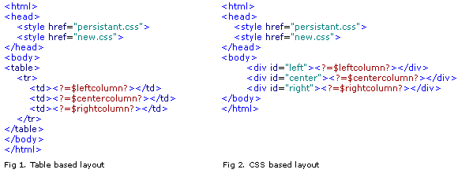
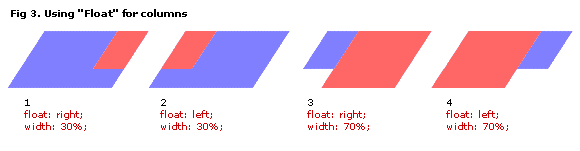
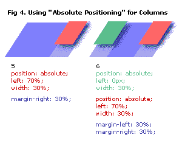
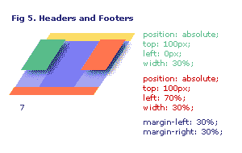
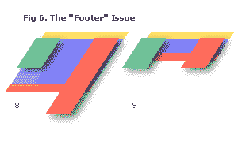

# HTML 乌托邦！设计没有表格的网站——第一部分和第二部分

> 原文：<https://www.sitepoint.com/websites-tables-parts-1-2/>

欢迎来到 HTML 乌托邦——这是关于创建没有表格的网页设计的两部分系列。

[第 1 部分](https://www.sitepoint.com/blog/)介绍了使用 CSS 创建无表格设计的概念，并解释了这一理念变得如此流行的原因。

第 2 部分探索了这种设计的一些符合标准的商业应用程序，并展示了一些漂亮的技巧和窍门来改进你的 CSS 布局…

尽情享受吧！

这个系列激发了这个想法，最终发展成为 SitePoint 的第二个印刷标题， [HTML Utopia:使用 CSS](https://www.sitepoint.com/books/css1/) 设计无表格。在这里阅读《T2》一书中的四个章节。

##### HTML 乌托邦——没有表格的设计:第 1 部分

##### 一见钟情的‘网站’！

几周前，我偶然发现了一个真正启发我的网站。它设计精美，外观精美。直到看了后面的代码，我的心才真正的漏跳了一拍。

这个网站与众不同，是杰弗里·泽尔德曼的创意。泽尔德曼还参与了发起浏览器升级运动的网络标准项目 [WaSP](http://www.webstandards.org/upgrade/tips.html) 。该活动鼓励用户升级到符合 WC3 建议的浏览器，并游说浏览器开发商开发更符合建议的浏览器。

我决定尝试在不使用任何表格的情况下重建一个 SitePoint 页面(目前有 18 个表格在使用，其中 17 个是不必要的)。

编辑注意:这些例子是基于以前的 SitePoint 设计，并不涉及当前的站点。

[点击此处](https://www.sitepoint.com/html-css/)查看。不信可以看看代码([这里是出处](https://www.sitepoint.com/html-css/))。如果你对[感兴趣，这是样式表](https://www.sitepoint.com/html-css/)。

如果你看到的只是一个不那么漂亮的黑白页面，那么我相信你会对这篇文章有一些话要说！根据 WaSP 的说法，你的浏览器不符合标准。如果你觉得一切正常，那就打开你的旧网景 4，看看同一个页面…或者点击这里模拟一下！

当我谈到 HTML 乌托邦时，我指的是内容和格式的分离。有了数据库，我们在某种程度上实现了这种分离，但只是在生产方面。我们仍然将我们的内容输出到类似意大利香肠的 HTML 代码中，在那里我们将它与和<font>标签的胆固醇混合在一起。此外，并不是所有的网站都是数据库驱动的，那些很少 100%的数据库内容。</font>

在我谈论这种编码的荣耀之前，让我们首先解决与旧浏览器的向后兼容性问题。

##### 版本 4 咬人！

作为网页设计者和网页开发者，我们一直在竭尽全力让我们的作品在所有浏览器和所有平台上都能工作。到目前为止，我们中的大多数人都很高兴地将版本 3 浏览器提交给退休之家。然而，我们仍然在遭受第 4 版浏览器的缺点。

我们已经找到了违背逻辑的方法和技巧。我们开发了脚本来检测我们的用户客户端。尽管如此，我们还是很少能做到面面俱到，让我们面对现实吧——为不同的浏览器编写不同的代码，甚至不能就文本字段的长度达成一致，这变得越来越令人厌烦。

答案是什么？说“不！”不符合网络标准的浏览器。我说的 web 标准是指 [CSS](http://www.webmasterbase.com/article.php/309) -1、HTML 4.01 和 ECMAScript(JavaScript 的“官方”版本)——基本上，任何版本 4 或更旧的浏览器？此时，警钟开始响起。

随着 Netscape 6 和 Opera 5 的发布，我们现在有了 Microsoft Internet Explorer 的重要替代产品，它在历史上为 CSS 提供了最好的支持。如果你正在寻找一个 Unix/Linux 浏览器，那么 Konqueror 是可用的。

根据我的研究，目前的统计数据表明，今天 77-80%的网络冲浪者正在使用符合网络标准的浏览器。也许剩下的 20%需要一些鼓励。

##### 当“不”意味着“是”时

当我说不的时候，我并不是在说向不兼容的浏览器提供一个类似于 10 辆汽车堆砌的页面(由于其对样式的误用)。当我说不的时候，我不是在说一个粗鲁的信息和一扇关着的门。我们能传递的是一个好的信息和你的内容！(如果你还没有加载你的旧浏览器，这里有[它看起来会像](https://www.sitepoint.com/html-css/)。)

WaSP 建议您使用您的信息鼓励使用不兼容浏览器的用户升级，并提供升级页面的链接。

这种方法的一个奇妙的好处是，您仍然可以将您的内容呈现给不理解 CSS 的浏览器。这包括能够显示从互联网上检索到的文件的任何设备，例如手持设备、WAP 电话、盲文阅读器和互联网冰箱。

我们不测试 N4，然后提供专门设计的 N4 内容。我们根本不测试！通过使用一种新的链接外部样式表的方法…

```
<style type="text/css" media="all">@import "styles.css";</style>
```

…不兼容的浏览器(不理解这种方法)将简单地加载没有任何样式的页面。只要你用

标签和

# 、

## …

###### 等来应用你的风格，那么你的内容在任何浏览设备上都是有意义的。它会看起来有点老派。

需要更有说服力的吗？让我们看看许多其他的好处。

##### CSS 幸福！

好了，我们已经谈到了迎合包括 N4 在内的所有非 CSS 设备，甚至还没有发明出来的设备！将内容与格式分离还有其他一些好处。

 <q><q>**减小文件大小:**</q>
<q>我将 SitePoint 页面的文件大小从 34353 字节减小到了 18585 字节。如果没有那些圆角，它会再小一点！</q>
<q>**一个文件控制着整个网站的设计:**</q>
<q>好吧，你以前听说过这个——这是 CSS 的好处之一。如果你决定将 Geneva 添加到你的字体家族中，因为你正在变得对 Mac 友好，那么修改你的样式表，这些改变将会反映到你的整个网站上。</q>
<q>**可选样式表:**</q>
<q>您可以拥有一个单独的样式表，在打印页面时使用。这意味着不再有单独的“印刷版”页面。</q></q>

##### 老狗和新把戏

你们中那些手工编码的人应该很容易过渡到这种风格的 HTML，如果你和我一样，你会从做一些新的事情中得到乐趣。对于那些依赖 WYSIWYG 软件的人来说，这是个坏消息——至少在短期内——因为没有任何程序有这种级别的 CSS 支持。Macromedia 通常很快，所以你可能不用等太久。你甚至会发现，一旦你掌握了窍门，像这样编码比摆弄 100 个表格单元要容易得多！

祝你好运，愿源头与你同在。

##### 资源:

一份清单:

[http://www.alistapart.com](http://www.alistapart.com)

激发本文灵感的《与众不同》一文:

[http://www.alistapart.com/stories/tohell/](http://www.alistapart.com/stories/tohell/)

WaSP——网络标准项目:

[http://www.webstandards.org](http://www.webstandards.org/)

WaSP 关于包含升级信息的提示:

[http://www.webstandards.org/upgrade/tips.html](http://www.webstandards.org/upgrade/tips.html)

一些更好的 css 技巧和窍门:

[http://www.bluerobot.com/web/layouts/](http://www.bluerobot.com/web/layouts/)

这一主题的非常全面的集合:

[http://glish.com/css/](http://glish.com/css/)

##### 浏览器统计

[http://www.upsdell.com/BrowserNews/stat.htm](http://www.upsdell.com/BrowserNews/stat.htm)

[http://www.w3schools.com/browsers/browsers_stats.asp](http://www.w3schools.com/browsers/browsers_stats.asp)

回到 HTML 乌托邦的第一部分——没有表格的设计，我们介绍了使用 CSS 定位而不是表格来布局网站的想法。在第 1 部分中，我们对 Netscape 4 等旧浏览器采取了相当歧视性的观点。

下面的第 2 部分是关于用一种不那么敌对的方式解决老的浏览器问题。我们还将看一看一些技巧。

##### HTML 乌托邦——没有表格的设计:第 2 部分

##### 我回来了

自从我为 SitePoint 写了第一篇(也是唯一一篇)文章已经一年多了，我想我应该分享一下我在无表格设计中的经历。

对第一部分的反应非常积极。谢谢！然而，有相当多的读者评论说，他们不准备像我建议的那样给网景公司错误的指导。

凯文·杨克的一句简单的评论对我未来的网页设计产生了重大影响，他问了这样一个问题:“网景 4 能做的所有 CSS 呢？”

##### WaSP——网络标准项目

回到第 1 部分，是 WaSP 运动(通过[一个单独的列表](http://www.alistapart.com))让我开始了这整个乌托邦之旅。从那时起，我学会了在 WaSP 意识形态和我的商业导向客户的需求之间寻求平衡。

我想你可以说这是出卖，但让我们面对它——我们的工作是尽我们最大的能力满足我们的客户。我决定寻找方法来锻炼我对 CSS 定位的新热情，同时仍然给 Netscape 一个机会。

##### 疯狂中的方法

我想我可以用一些现实生活中的案例研究来最好地说明我所探索的一些选择。在我开始之前，我应该让你知道我是 SitePoint 商业网站设计部门的一名设计师，我将要展示的案例研究是我以 SitePoint 网站开发经理的身份参与的真实网站。

如果这冒犯了你，那就不要读下去了。否则，让我们开始吧！

***关注糖尿病——新浏览器纯 CSS***

这个设计来自 WaSP 学派——纯粹的 CSS，也是 Netscape 4 的香草处理。在 Netscape 4 中检查一下——令人惊讶的是，你可以使你的非 CSS 布局看起来如此整洁。

不可否认，像这样的简报有点奢侈。对于 www.eyesondiabetes.org.au 来说，可访问性是第一位的，使用纯 CSS 很有吸引力，因为它从内容中抽象出了表现形式。

样式表是这样命名的:

```
<link type="text/css" media="all" rel="stylesheet"     

href="/includes/persistent.css" />
```

正如我在第 1 部分中提到的，Netscape 既不理解`@import`方法，也不理解`media="all"`属性。通过在对样式表的调用中使用这两者之一，可以确保 Netscape 不会加载它。

***SitePoint.com.au——适用于所有浏览器(甚至 N4)的纯 CSS***

编者按:写这篇文章一年后，我们重新设计了 www.sitepoint.com.au 网站，该网站现在对 Netscape4 来说已经非常精简了。

对于我们自己的一个网站，[SitePoint.com.au](http://www.sitepoint.com.au)，我决定采纳 Kev 的想法，让 Netscape 4 尽可能多地使用 CSS。最初，我希望它可以管理字体和颜色，但没有太多其他的。我实际发现的是，我可以用 CSS 让整个网站在 Netscape 中工作，而不用表格！唯一的问题是网景公司对百分比的解释非常奇怪——这是争论的焦点。

在我的第一次构建中，我简单地调用了两个样式表 Netscape 跳过了其中一个:

```
<link type="text/css" rel="stylesheet"     

href="/includes/basic.css" />    

<link type="text/css" media="all" rel="stylesheet"     

href="/includes/advanced.css" />
```

基本样式表锁定了基于像素的宽度和边距，以适应 800×600 的分辨率。高级样式表将所有这些宽度重新声明为百分比，因此布局扩展到所有屏幕分辨率的 100%。

几个月后，我重访了该网站，并选择了浏览器检测脚本。这使我能够将我的 CSS 分成三个样式表:

*   常见的样式，如字体、颜色和背景*   新浏览器的定位风格*   Netscape 4 的定位样式我为 Netscape 4 设计的新样式表甚至设法找到了一组宽度和边距作为百分比

***Editize.com——两种截然不同的布局模板***

EditizeTM 产品的一个特点是它可以在所有浏览器中工作。因此，在 Netscape 4 中，网站看起来尽可能好是很重要的。

所有网页都将使用一个模板，因为大多数网页都是通过内容管理系统建立数据库和编辑的。

对于基于模板的网站，所有内容都显示在一个容器中。该容器通常是一个`<div>`或一个`<td>`。对于 www.editize.com 的 T2，我做了两个包含结构(布局文件)，我们的内容可以插入其中。



然后我简单地使用了一个浏览器检测脚本来选择正确的模板。

##### 浏览器检测脚本

对于浏览器检测脚本应该如何工作，已经进行了相当多的思考。

检测像 Netscape 4 这样的旧浏览器是很重要的，以便为它们提供特别有限的布局，同时用新的 CSS 布局呈现其他浏览器。我们这样做，而不是挑选新的浏览器，因为:

*   我们不想每次发布新版本的浏览器时都要修改我们的脚本。*   我们希望真正老的浏览器(通常不用于测试你的站点的浏览器)得到 CSS 布局——最好保守一点，确保它们没有任何格式(只是为了安全起见)。*   我们希望其他设备，如手持设备和互联网冰箱，得到更简单的 CSS 布局(*总是*与互联网冰箱！).*   我们希望搜索引擎机器人搜索我们更有效的 CSS 布局。

这是我的 PHP 脚本(2003 年 5 月 20 日更新):

```
// Grab Netscape 4 on all platforms     

// (This isn't fullproof but it's pretty close)     

$tmp = explode(" ", $HTTP_USER_AGENT);     

$brvers = explode("/", $tmp[0]);     

$brvers = (float)$brvers[1];     

if ($brvers > 4.01 and $brvers < 4.99)     

  $version = "old";     

else     

  $version = "new";     

// Here's a 'find' function to      

// specifically grab some other browsers     

function find($component)      

{      

 global $HTTP_USER_AGENT;      

 $result = stristr($HTTP_USER_AGENT,$component);      

 return $result !== FALSE;      

}     

// Use this to get IE5 on Windows (optional)     

if ((find ('MSIE 5.0')) and (find('Win')))     

  $version = "old";     

// At this stage WebTV seems to cope much     

// better with a Netscape style page so      

// lets grab it     

if (find ('WebTV'))     

  $version = "old"; 
```

你可以看到，我用十进制增量剔除了网景 4。这些增量是独立于平台的，根据我的经验，没有任何其他浏览器使用过。

在上面的脚本中，我选择将 IE5 归类为旧浏览器，因为它有很多 CSS 错误，而且现在很少有人使用它。注意，我专门在 Windows 上寻找 IE5，因为 Mac 版本是 CSS 友好的浏览器。

##### CSS 布局技术

下面是你可以用 CSS 布局你的页面的技术的概述。关于 CSS 定位的一篇非常好的文章，更加详细，请查看。

***浮动***

尽管这并不是 CSS 属性“Float”的真正用途，但这种技术是一种很好的、简单的布局两列的方法。



我更喜欢上面的例子 3 和 4，因为:

*   你的主栏内容在你的专栏之前。这将导致文档以正确的顺序呈现给语音浏览器和那些忽略样式表的浏览器。*   您的主要内容很可能比您的瘦栏长，您不希望它像示例 1 和 2 中那样换行。

***绝对定位***

绝对定位技术是另一个不错的选择——尤其是对于三列布局。



请注意我们的主要层如何扩展到 100%的宽度，我们的列位于顶部。我们使用边距来防止主列的内容重叠。

理论上，所有的层都可以绝对定位，但是你很快就会明白为什么至少保持其中一层(最长的列)相对是个好主意。



页眉和页脚可以很容易地嵌入。因为我们的主层也是相对的，它简单地堆叠在头的后面。我们的绝对定位层需要与顶部保持一定的距离，这样它们才能与页眉底部对齐。

只要我们有一个相对定位的主层，一个页脚(也是相对定位的)就会简单的堆叠在它后面。这里存在一个问题！

***页脚发布***

我们的相对定位层(通常是主层)必须比任何其他层都长。如果不是这样，我们将会遇到如图 6 所示的问题。



对于数据库驱动的网站来说，这可能是一个真正的问题，因为您经常会自动生成一些您并不总是计划好的内容。

例如，假设您的数据库文章显示在主栏中，其他文章的名称列在右栏中。过了一段时间，你的客户(一个多产的作家)在右边一栏列出的文章比你预期的要多，还有几篇非常短的文章。这将导致如图 8 所示的问题。

另一个例子是简短的确认页面，如感谢信息，如图 9 所示。

答案？做好准备。限制对动态列的查询，用几个`<p>&nbsp;</p>`填充任何短页面。

***打印样式表***

当你在做的时候，为打印机清理你的站点。IE6、Netscape7 和 Mozilla 都有很好的打印预览功能，可以在不破坏森林的情况下微调打印模式样式表。

使用以下命令调用打印模式样式表:

```
<link type="text/css" media="print"  rel="stylesheet"       

href="/includes/print.css" />
```

这也很简单。您可以通过将 display 属性设置为 none 来关闭这些功能。我喜欢:

*   隐藏我的导航系统*   将我的徽标换成黑白版本*   将任何基于像素的字体大小更改为磅*   在每一页的顶部添加一个信头样式的商业地址*   对列宽进行任何调整*   将列更改为位置:相对；让他们了解我的主要内容。

##### 表演结束了

这大概就够吊你胃口了。记住，现在有越来越多的浏览器支持 CSS 标准。我通常测试的是:

*   [Mozilla](http://www.mozilla.org/)*   [歌剧](http://www.opera.com/)*   网景公司*   [网络浏览器](http://www.microsoft.com/)

不幸的是，它们之间仍然有一些小的特质，但总的来说，让你的网站跨越所有这些特质并不太难。

我希望你喜欢 HTML 乌托邦！别忘了看看 SitePoint 的书 [HTML Utopia:使用 CSS](https://www.sitepoint.com/books/css1/) 设计无表格，它建立在这里介绍的概念之上。阅读书中的[这四章，你将会在设计乌托邦的道路上走得很好！祝你好运！](https://www.sitepoint.com/blog/)

## 分享这篇文章