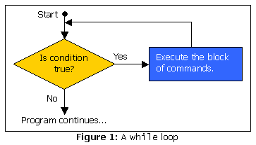

# Java 语言基础文章

> 原文：<https://www.sitepoint.com/java-language-basics-6/>

##### 环

第一种循环称为 **`while`循环**。它的名字符合它的功能:当一个条件保持为真时，反复做某事**。下面是一个`while`循环的样子:**

```
while (condition) {      

  // a block of commands (the loop body)      

}
```

图 1 中的流程图最好地说明了`while`循环的操作。



在大多数情况下，`while`循环的条件是开始为真，但最终在命令块执行一定次数后变为假。下面是一个简单的程序，它使用了一个`while`循环:

```
1  /**      

2   * Countdown.java      

3   * A simple Java program that counts down from 10\.      

4   */      

5        

6  class Countdown {      

7    public static void main(String[] args) {      

8      int count = 10;      

9      

10     System.out.println("Countdown to liftoff...");      

11     while (count > 0) {      

12       System.out.println(count + "!");      

13       count = count - 1;      

14     }      

15     System.out.println("Liftoff! We have liftoff!");      

16   }      

17 }
```

这是这个程序的细目分类:

*   **第 8 行:**我们声明一个名为`count`的变量，值为 10。
*   **第 11 行:**一个`while`循环，只要`count`大于 0 就会继续。
*   **第 13 行:**从`count`中存储的值减去 1。

所以当程序第一次到达`while`循环时，`count`是 10，所以循环体被执行，打印出“10！”然后从存储在`count`中的值中减去 1。然后再次检查条件。9 仍然大于零，所以循环体再次执行(“9！”).这一直持续到第 10 次执行循环体(“1！”)，当从`count`中减去 1 使其值为零。现在，当条件被检查时，它是假的；因此，循环停止，执行继续跟随循环。

当您编译和运行这个程序时，您应该看到以下内容:

```
D:javaJavaLanguageBasics> **java Countdown**      

Countdown to liftoff...      

10!      

9!      

8!      

7!      

6!      

5!      

4!      

3!      

2!      

1!      

Liftoff! We have liftoff!
```

```
while loops are very handy, but there are two limiting cases you should be aware of:

	*   如果条件一开始就是假的，循环体就不会被执行。*   如果条件永远为真，程序将一遍又一遍地执行循环，永远不会停止。
虽然第一种情况有它的用途，但第二种情况是要小心的。永不结束的循环被称为无限循环。无限循环可能在最意想不到的情况下发生，这是一个令人惊讶的常见错误，即使是有经验的程序员有时也会犯。如果你的一个程序看起来卡住了，停止了响应，很有可能它陷入了一个无限循环。您可以通过按 Ctrl-C 重新获得控制，这将中断程序，迫使它停止。当然，像上面这样的程序中的无限循环是相当明显的，因为循环中的`println`语句会导致程序打印出无穷无尽的数字流。要查看这是什么样子，只需在第 11 行更改 while 循环的条件:

```
11     while (true) {
```

不用担心；不会伤害你的电脑。不过，这可能会让你有点头晕。

**Go to page:** 1 | 2 | 3 | 4 | 5 | 6 | 7

```

## 分享这篇文章