# 企业家寻找 16 种最佳产品

> 原文：<https://www.sitepoint.com/16-best-product-hunt-finds-for-entrepreneurs/>

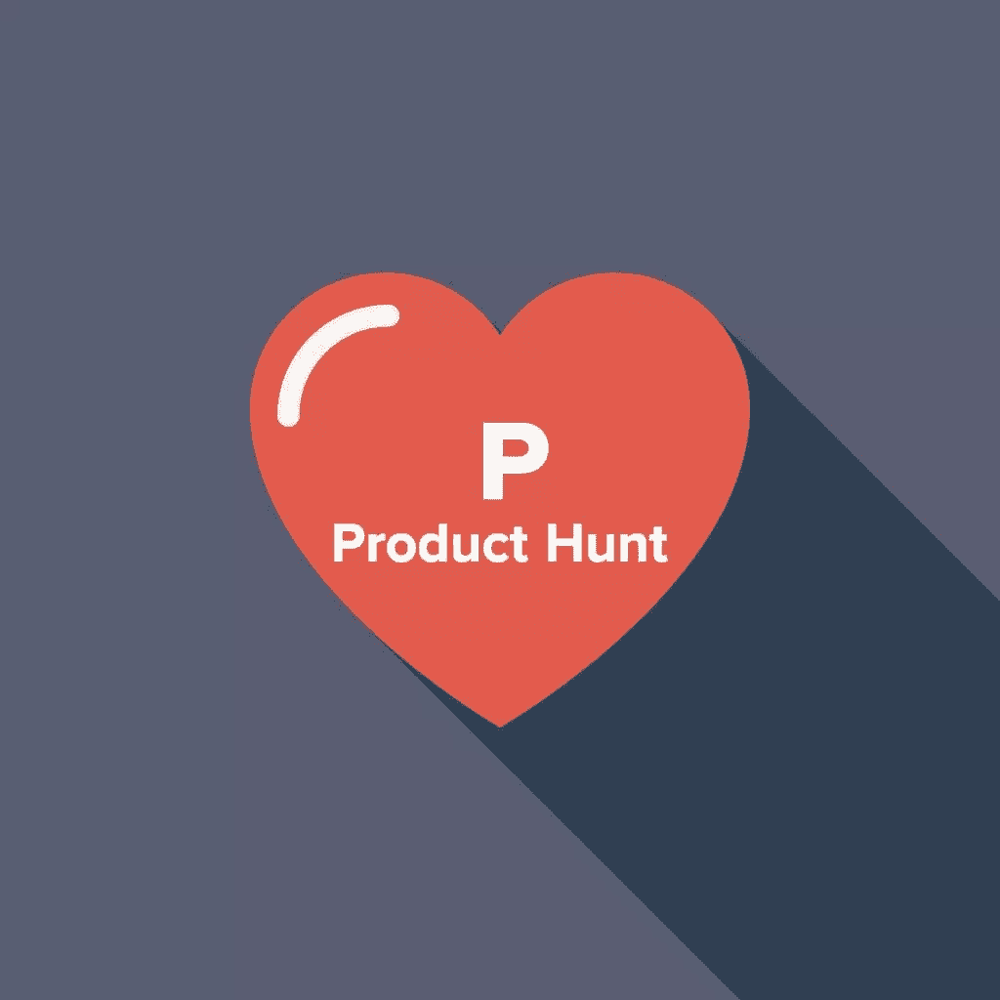

一些人通过在脸书冲浪或观看网飞来放松。我通过寻找产品来放松。如果你不太清楚什么是产品搜索，想象一下一个致力于最酷的新产品的新闻源——从应用程序和网站到书籍和资源。

除了具有娱乐性、启发性和上瘾性，产品搜索也是一个名副其实的酷工具金矿。看看我最喜欢的 16 个企业家。

## 1.[悬浮卡](http://www.producthunt.com/tech/hovercards)

这个 Chrome 扩展在你点击之前给你一个链接的预览，节省了你大量的时间。假设你得到了一个 YouTube 视频的链接。你不必打开一个全新的标签，你可以马上观看视频。

## 2. [MakerMVP](http://www.makermvp.com)

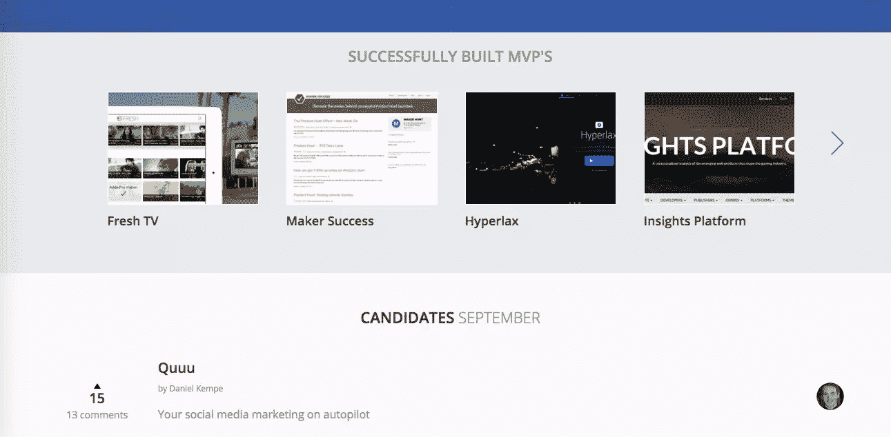

也许你有一个很棒的想法，但没有实现它所需的技术能力。或者你有一个很棒的想法，可以利用专家的见解和反馈。

有了 MakerMVP，你就可以把你的牛逼想法变成最小可行的产品。提交您的提案，设定预算，您将与来自产品搜索社区的制造商取得联系，他们将帮助您实现项目。

## 3.[构建与购买计算器](https://baremetrics.com/calculator)

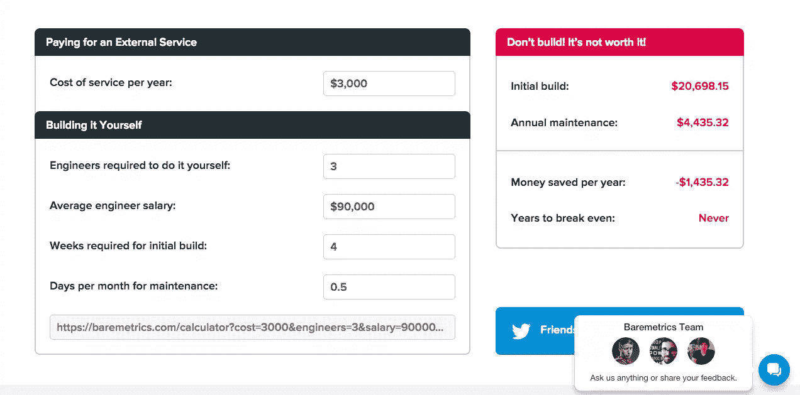

作为一名企业家，你不断地在外包项目和内部完成项目之间做出选择。这个计算器将使选择变得非常非常容易。只需要插入各种费用，项目需要多长时间，需要的维护等等。，并了解是建造它还是购买它更经济。

## 4.透明的

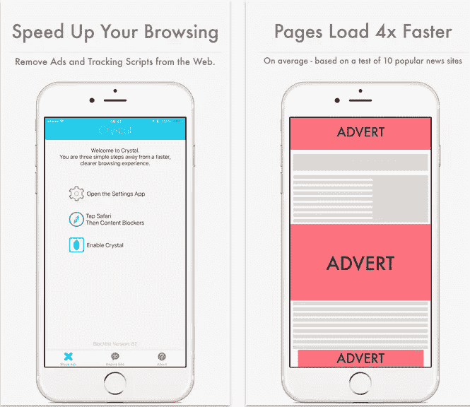

这个应用程序很棒，有两个原因。首先，它阻止了大多数广告和侵犯隐私的追踪器——这意味着你不必看广告或忍受隐私侵犯。其次，删除这些内容可以加快浏览网页的速度。

## 5.[天使洞察](https://soundcloud.com/angelinsights)

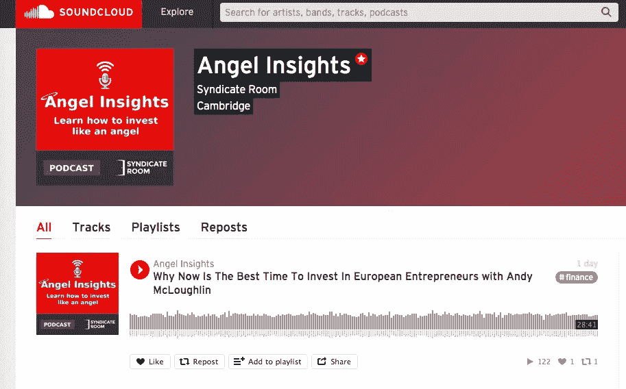

听听天使投资者之间的对话不是很有帮助吗？他们在讨论估值、他们想要什么，以及他们对自己的初创公司有什么期望。多亏了这个播客，现在你可以了。

查看[伙伴网站](https://www.syndicateroom.com/learn/home.aspx)了解更多信息和见解。

## 6.啊哈！商业模型构建器

商业模式总是在变化(尤其是现在[精益方法](https://www.sitepoint.com/premium/books/the-lean-product-playbook/)如此流行)。这个工具允许你创建一个全面的，充实的商业计划，可以随时更新。
从愿景和定位等高级部分到运营成本和客户细分等更具体的部分，使用业务模型构建器肯定会帮助您明确您的目标、计划和功能。

## 7. [unSend.it](http://unsend.it/)

这个扩展采用了 Gmail 的“撤销”功能，并将它提升到了一个全新的水平。

与只在你按下“发送”后的前几秒起作用的撤销不同，取消发送允许你编辑或取消发送任何电子邮件——即使收件人已经打开了它。您还可以编辑或取消发送附件，跟踪收件人何时打开您的邮件，以及在邮件被打开后使其自毁。

## 8. [SaaS 入侵者](http://www.saas-invaders.co/)

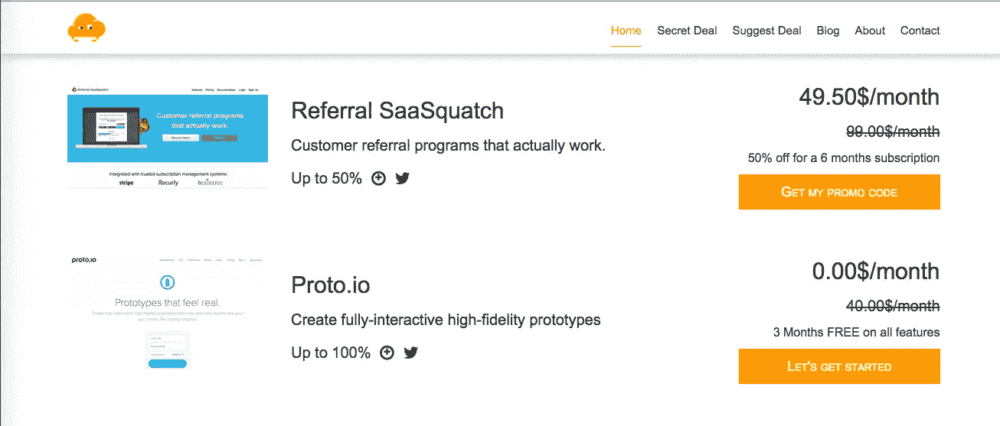

把 Saas 入侵者想象成创业公司的 Groupon。每周，初创公司的创始人都会收到四种不同网络应用的折扣。例如，本周，企业家可以在 Recruitee、Algolia、Typeform 和 hotjar 上获得独家优惠。

由于注册是免费的，你没有义务购买，成为会员是显而易见的。

## 9.[清脆](https://itunes.apple.com/us/app/crisp-email-template-keyboard/id1015801280?mt=8)

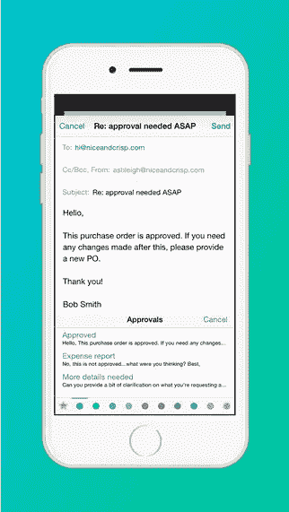

不要浪费时间重写同样的基本邮件。Crisp 是一款设计精美、易于使用的模板键盘。

您可以添加无限数量的模板，将它们分类到文件夹中(例如，“客户”、“投资者”、“董事会”等)。)，然后选择收藏夹。最棒的是？Crisp 可以在任何应用程序中使用，因此无论您主要通过电子邮件、文本还是社交媒体进行交流，您都可以随时获得正确的信息。

## 10.[重大决策 App](http://www.bigdecisionsapp.com/)

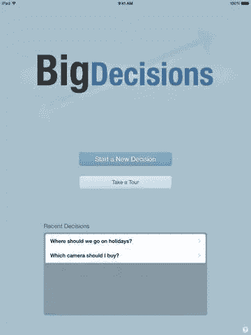

作为一名企业家，你每天都要做出重大决定。Big Decisions 应用程序(目前只在 iPad 上可用)帮助你收集和组织最重要的考虑因素。

正如一位评论者所说，“它有用、有吸引力、聪明、时尚。”

## 11.[在任何地方努力工作](http://workhardanywhere.com/)

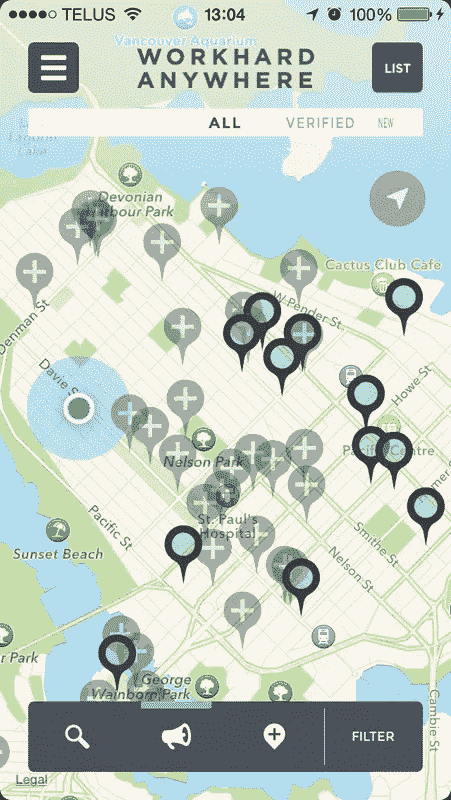

你可能花了很多时间在咖啡馆和书店之间徘徊，徒劳地寻找好的无线网络。

这就是 WHA 应用的用武之地。它会告诉你在你当前位置附近哪里可以找到最好的工作空间，不仅考虑到了 WiFi，还考虑到了插座的可用性、大小、食物选择、价格和停车选择。

## 12.[收款人](http://checkeeper.com/)

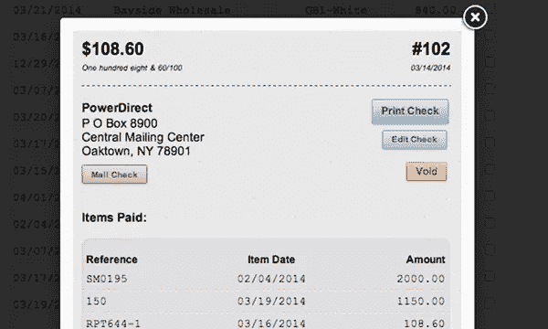

Checkeeper 使打印自己的支票几乎没有摩擦。你所要做的就是上传一张支票的照片或扫描图像，这样你就有了一个可打印的支票模板，可以反复使用。

因为除了普通的纸张和墨水，它不需要任何东西，你可以在任何有打印机的地方打印支票。

## 13.[对](http://www.assistant.to/)的助理

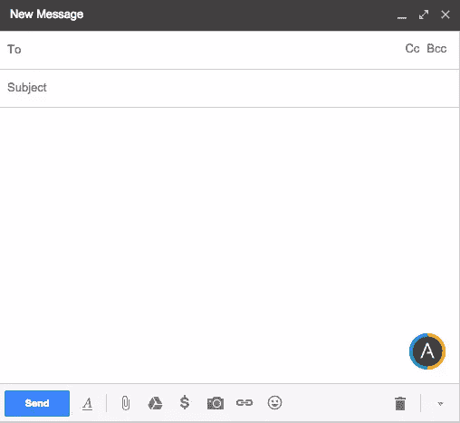

安排会议通常需要一些努力。首先，你来回发邮件来决定一个时间；然后，一旦你选择了一个兼容的，你必须发送一个 Gcal 邀请，等待其他人接受。

然而，Assistant.to 消除了所有的来回。下载后，你会在你的邮件撰写窗口看到一个小图标。点击它，应用程序将与你的收件人合作，找到你们都有空的时间。

## 14.[凌空](https://volley.works/)

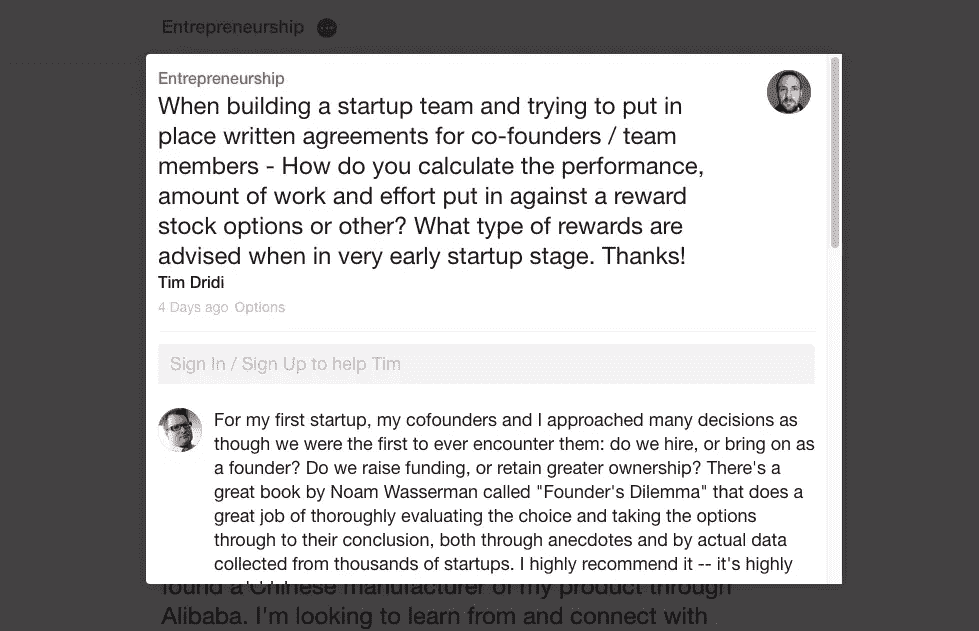

当你需要来自工程师、企业家、营销人员或设计师的移动输入时，凌空是完美的。该应用程序(在桌面和移动上都有)是一个点对点的建议平台。问题范围从“你用什么字体管理软件？”到“我应该从创业的哪一点开始申请加速器？”

## 15. [Wondr](http://getwondr.net/)

无论你的业务有多先进，与客户互动总是很重要的。然而，当你在经营一家初创公司时，这一点至关重要——不仅每一次互动都使你的品牌人性化并增加客户忠诚度，而且你可以收集关于你的产品做得好和需要改变的宝贵见解。

这就是 Wondr 如此有用的原因。它可以让你和你的 Twitter 关注者开始聊天，当你说话的时候，关注者是匿名的。

您可以为每个聊天会话设置一个主题；我们设想开始诸如“你希望在下一次更新中看到什么？”或者“你觉得 X feature 怎么样？”

## 15.AnyPerk

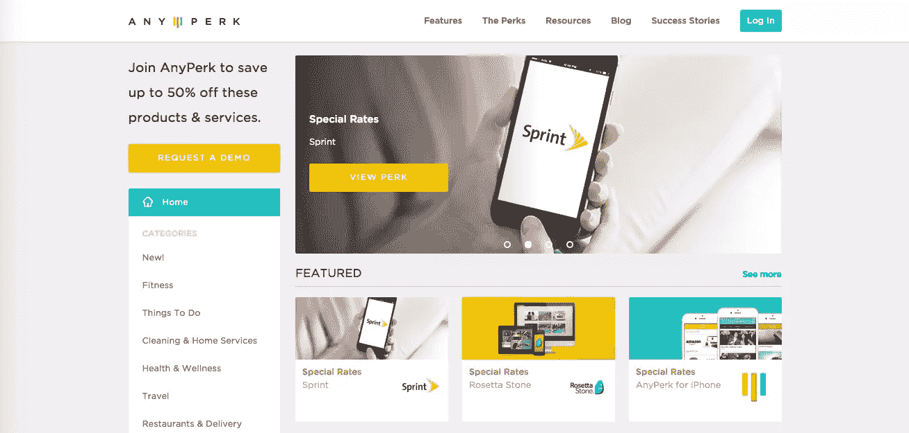

作为一家年轻的公司，你可能没有太多的额外津贴(当然，除了无处不在的乒乓球桌)。AnyPerk 是一个可靠的解决方案。该计划允许您为员工提供 850 多种产品高达 50%的折扣，包括健身房会员资格、儿童保育服务和电子产品。此外，奖励功能允许您向团队成员发送在线积分，以购买他们选择的礼物。

## 16.启动 Yar

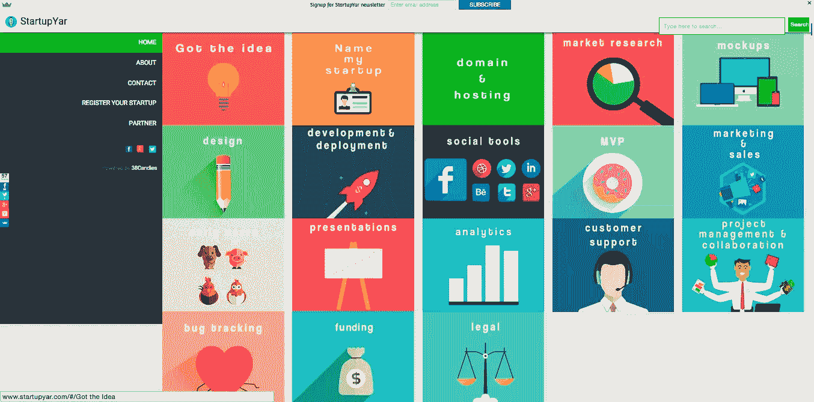

你正在阅读的列表有一些很好的建议，但是如果你想要更多，看看 Startup Yar。这是一个按启动阶段分类的工具和应用目录，从“给我的初创公司命名”到“法律”*奖励:*大部分工具都是免费的。

## 分享这篇文章