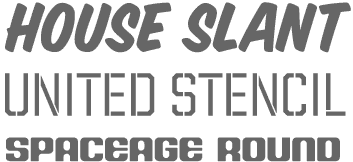
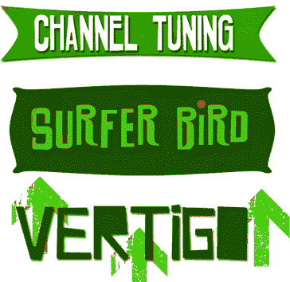
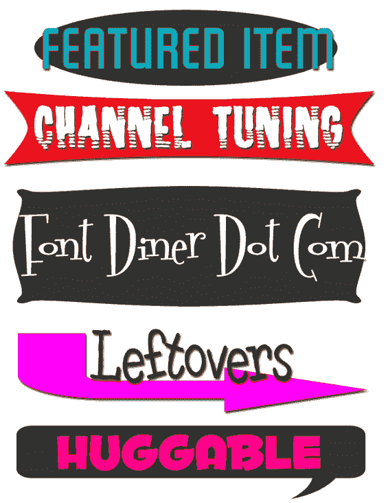
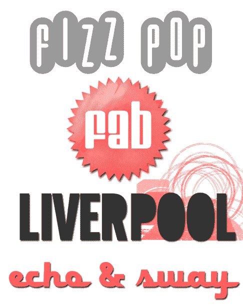

# 16 种高质量复古和复古字体

> 原文：<https://www.sitepoint.com/16-high-quality-retro-and-vintage-fonts/>

昨天我在网上写了关于的[复古设计。实现复古外观的一个主要因素是选择正确的字体。](https://www.sitepoint.com/gone-retro-10-gorgeous-websites-with-a-touch-of-yesteryear/)

今天是 Sitepoint 上的印刷星期五，我想接着介绍一些最好的复古字体制作商的免费字体。有一些优秀的字体铸造厂提供复古字体，他们通常会提供免费的字体，让你有机会看到质量有多好。我挑选了一些可能对你的设计工作有用的。

几周前，我有幸参加了来自房屋工业公司的 Rich 的演讲，他们的工作令人惊叹。他们对字体的关注和研究令人难以置信。要获得免费字体，你必须[注册他们的目录](https://www.houseind.com/catalog/)，这也是免费的。

丰托维尔有一些非常好的作品。他们的字体通过[字体公司](http://www.fontbros.com/free_fonts.php)发行，在那里你可以接触到一些很酷的免费字体，如下图所示。字体兄弟 h

另一个特别受欢迎的是 [Font Diner](http://www.fontdiner.com/) 。字体餐厅由印刷工斯图尔特·桑德勒于 1996 年创办。他创作了 400 多种字体，深受 20 世纪 50 年代文化的启发。你可以在这里免费下载超过 30 种他们的字体，包括你可以在下面看到的样本。

戴眼镜的女孩有相当多的免费字体可供下载，他们也出售复古剪贴画。该网站似乎有点过时，但字体很好。

最后，希区柯克字体基于索尔·巴斯的标志性作品。

虽然免费获得这样的字体很好，但偶尔购买一些字体也很好，这样这些辛勤工作的印刷工人就可以支付抵押贷款。

你喜欢这些字体吗？你遇到过其他字体代工厂生产很酷的复古作品吗？

## 分享这篇文章