# 16 个鼓舞人心的活动页面设计

> 原文：<https://www.sitepoint.com/16-inspiring-event-page-designs/>

当你开始构建你的网站时，你已经知道有一些特定的页面是完全必要的。这些页面包括主页、关于我和联系人页面。但是，根据站点的目的，您可能会发现您需要一个事件页面。

这些网页是必要的，以介绍即将到来的重要事件，你想让你的访客知道。这可能是任何事情，从音乐巡演日期，商务会议或充满乐趣的研讨会。

虽然似乎花了很多时间来教导设计良好的“关于我”页面和其他页面元素的重要性，但为您的活动页面呈现高质量的设计仍然是必不可少的。记住，每一页都应该尽你最大的能力来设计，以保持连贯性，不管你认为一个页面是多么的没有被充分利用。

今天的展览展示了设计风格独特的活动页面，希望能激发你重新思考自己的设计。

## 觉醒

[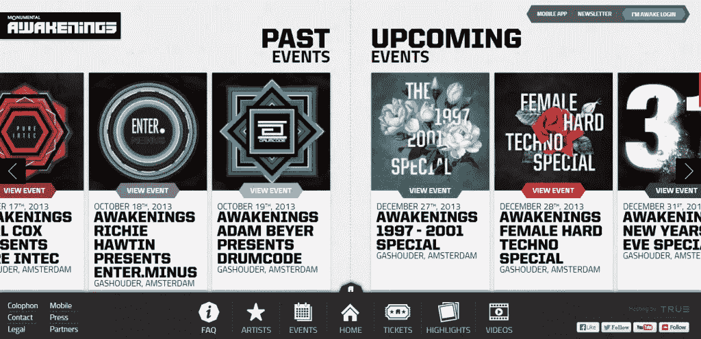](http://www.awakenings.nl/events/)

## 异硫氰酸荧光素

[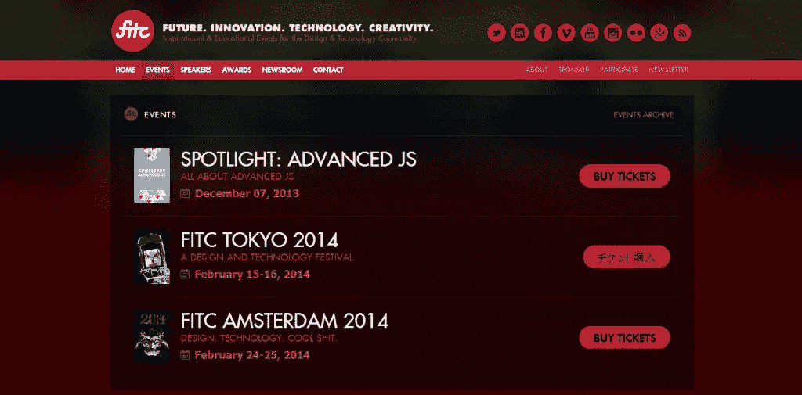](http://fitc.ca/events/)

## 交换 LA

[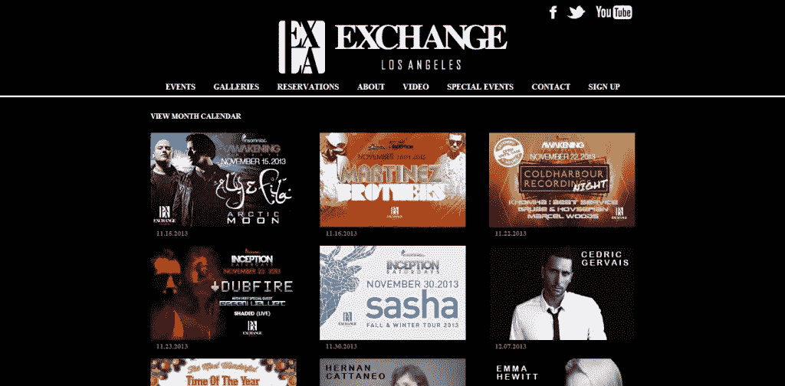](http://exchangela.com/calendar/event-calendar)

## 电子邮件地址

[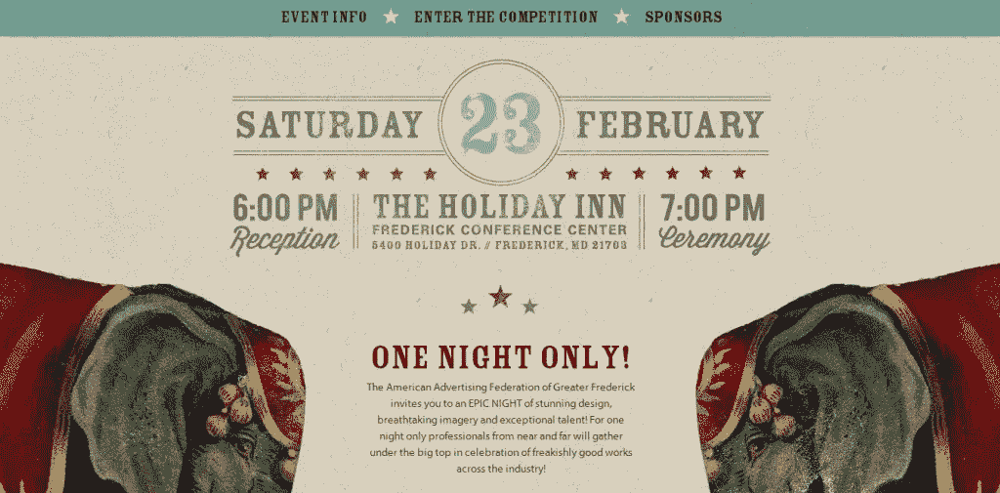](http://addys.aaffrederick.org/)

## 坐标

[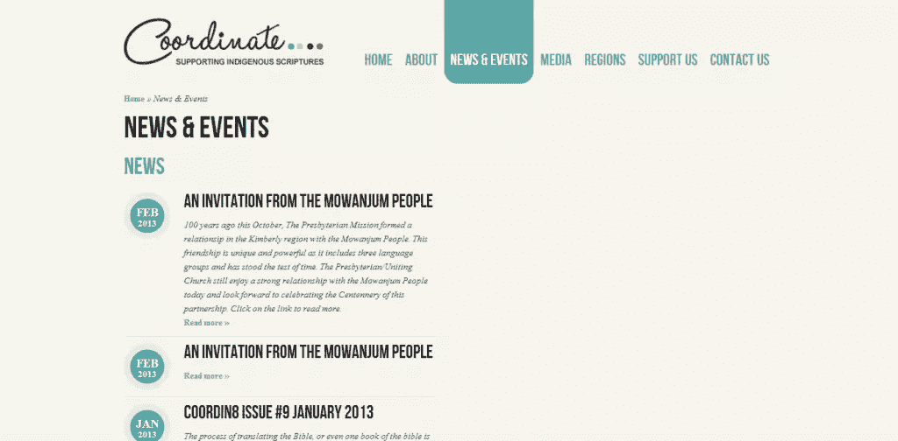](http://www.coordinate.org.au/news-events)

## 应用的未来

[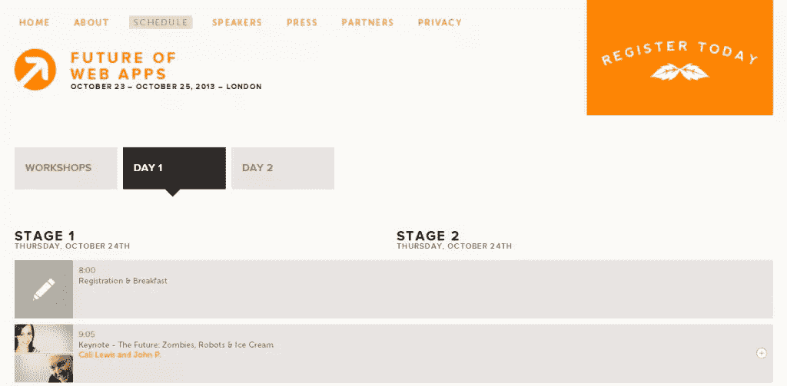](http://futureofwebapps.com/london-2013/schedule/day-1/)

## 结合

[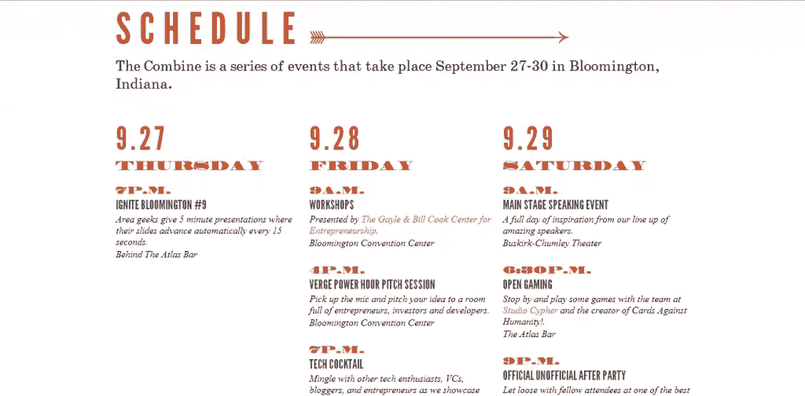](http://www.thecombine.org/)

## 正面全裸

[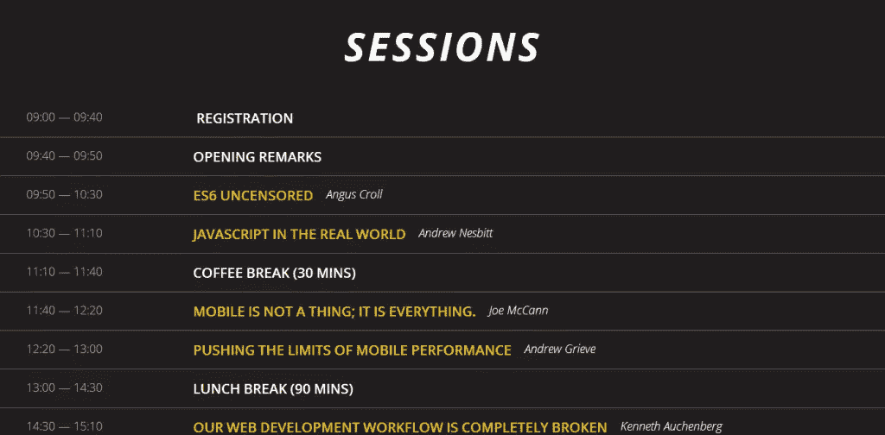](http://2013.full-frontal.org/#sessions)

## Barcamp

[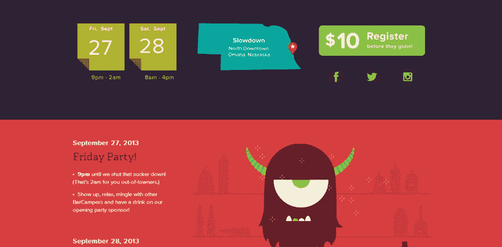](http://barcampomaha.org/)

## 费尔贝利营

[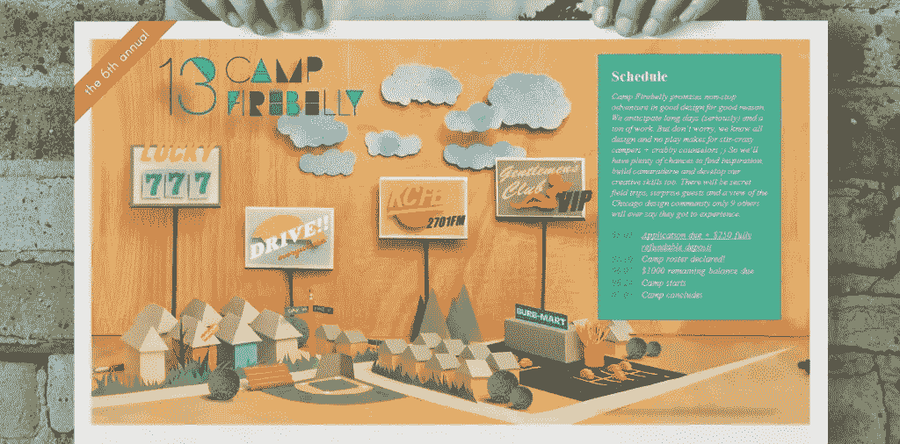](http://campfirebelly.com/#2)

## QC 合并

[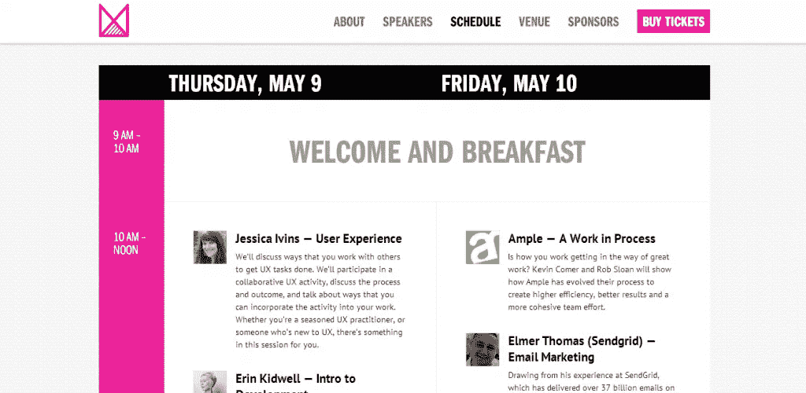](http://qcmerge.com/)

## 摇滚歌手

[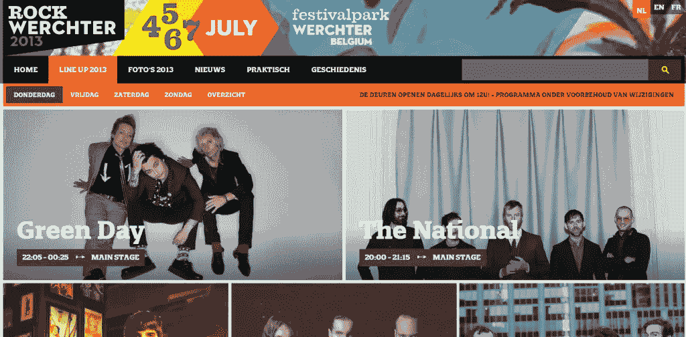](http://www.rockwerchter.be/nl/line-up-2013/donderdag)

## 红宝石运动

[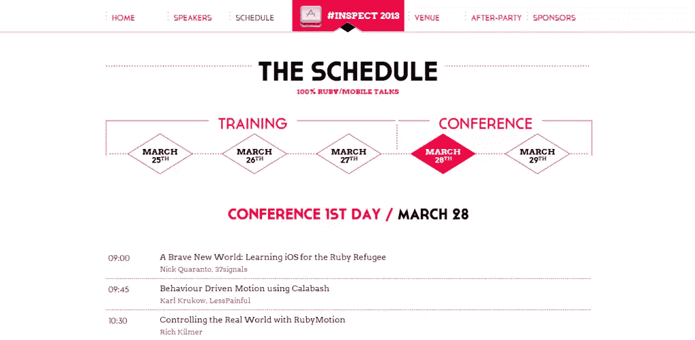](http://www.rubymotion.com/conference/)

## 灵感之夜

[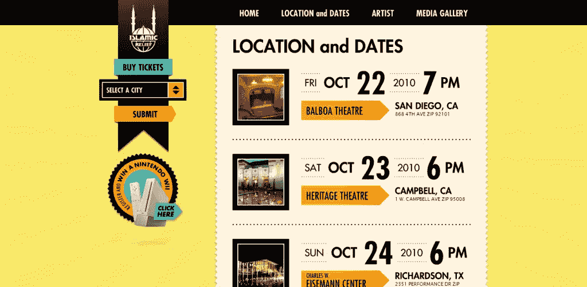](http://www.transform.st/archive/eveningofinspiration/)

## STL 设计周

[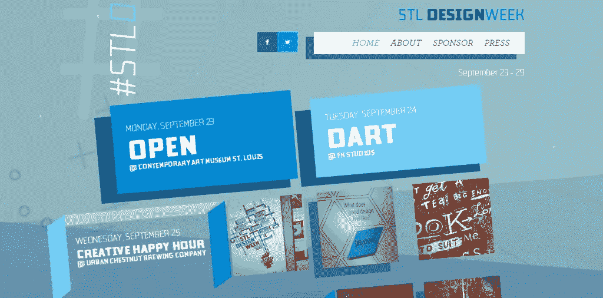](http://stldesignweek.com/)

## 蒙多

[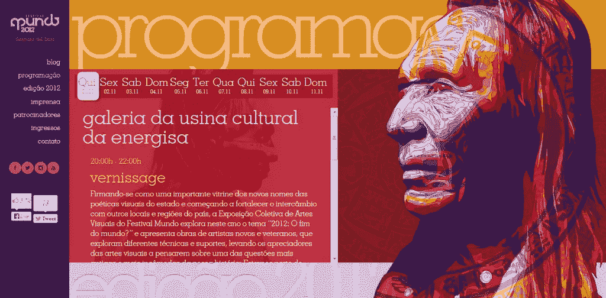](http://2012.festivalmundo.com.br/programacao/)

## 分享这篇文章