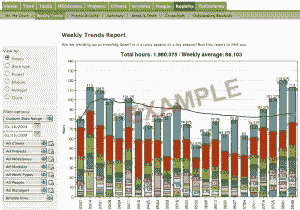
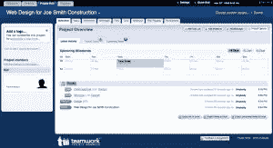

# 让杂耍变得简单的 16 个项目管理工具

> 原文：<https://www.sitepoint.com/16-project-management-tools-that-make-juggling-easy/>

如果您没有某种系统来跟踪所有的事情，管理多个项目可能会很麻烦和混乱。当您在客户端添加多个服务、分包商或员工以及各种团队成员时，这一挑战会变得更加复杂。我发现，当我拥有一个系统来推动数据收集、跟踪任务并促进与所有需要了解特定项目的人的协作时，我的业务运行效率最高。

在寻找完美系统的过程中，我尝试了许多项目管理应用程序，并提出了一个似乎对我最有潜力的简短选项列表。当然，每个人的工作方式都是独一无二的，所以找到适合自己的工具可能需要一些个人研究。但是，这里有三个我最喜欢的和少数几个给你一个起点。

**1。[间隔](http://www.myintervals.com/)**

Intervals 被列在第一位，因为它是我目前使用的应用程序，但不要因此动摇你。这是一个强大的工具，对任何项目管理列表都是一个有价值的补充。它有一个基于任务的设置，非常适合我，而且它有(几乎)我愿望清单上的所有功能，包括:

*   任务管理
*   文件存储器
*   报告功能
*   客户端访问
*   分包商任务分配
*   时间跟踪
*   安全性

Intervals 还内置了发票和一系列预算功能，尽管我还没有使用这些功能…至少现在还没有。他们有很好的客户服务，对我的许多功能请求反应很快，并且一直在增加新功能。此外，Intervals 背后的公司是一家 web 设计/开发公司，他们努力为自己的业务找到一个完美的项目管理工具，所以他们创建了自己的工具。

我缺少的是一个周期性任务选项、一个笔记本/白板空间和一些其他小功能。这可能有点贵(附带 SSL 保护的计划是每月 100 美元)，但是如果您在以任务为中心的流程中工作，并且需要 PM 应用程序中的扩展功能，这是一个很好的选择。

**2。[基地营](http://www.basecamphq.com/)**

Basecamp 是一个非常流行的项目管理系统，被吹捧为每个人都可以使用。这是真的。非常好用。部分被分解成待办事项、里程碑、写字板、聊天、时间、文件和一个仪表盘，显示所有数据中所有最高优先级的项目。这是一个很好的协作和交互工具，其功能包括:

*   多个项目
*   文件共享
*   基于项目的待办事项
*   时间跟踪
*   评论和留言板
*   写字板(类似笔记本的功能)
*   安全性

它有一个很好的月计划范围，与区间 100 美元/月计划相比，其功能的中等价格计划为 49 美元/月。Basecamp 提供了一份详尽的按菜单销售的额外服务和附加服务的清单，这使成本更接近区间。一些有用的插件包括发票、时间跟踪、桌面小工具和一些 iPhone 应用程序。

对我来说，失败在于它有点太简单了，我无法让它满足我的需求。当然，我有面向任务的重点来支持，而 Basecamp 没有。但是这是一个很好的选择，如果您正在寻找一个快速而简单的工具，几乎没有学习曲线，团队中的每个人都可以使用，这就是它。

**3。[团队项目经理](http://www.teamworkpm.net/)**

团队合作项目管理器以非常直观的形式提供了一套强大的功能。它的外观和感觉让人想起 Basecamp，但范围更广一些。一些功能包括:

*   任务列表
*   时间跟踪
*   文件共享
*   里程碑
*   留言板
*   笔记本电脑
*   电子邮件集成

像 Intervals 一样，团队合作项目经理是另一个非常强大的项目管理工具，背后有一个反应灵敏的公司和出色的客户服务。他们会快速回复问题和功能请求，并在网上提供一份即将推出的增强功能的路线图。他们提供许多月计划，从免费到每月 150 美元不等。他们提供 SSL 的最低计划(整个帐户，而不仅仅是登录时)是每月 24 美元。如果你喜欢 Basecamp，但需要更多的内置功能，这是一个很好的选择。

其他一些值得一看的项目管理工具:

4.[@任务](http://www.attask.com/)
5。[下午 5 点](http://www.5pmweb.com/)6 点
。 [activeCollab](http://www.activecollab.com)
7。中央桌面
8。 [Clientspot](http://myclientspot.com)
9。[Deskaway](http://www.deskaway.com)10。 [GTD 议程](http://www.Gtdagenda.com)
11。[挤作一团](http://www.huddle.net)
12。[台上](http://www.onstageportal.com/)台下
13。[Projjex](http://www.projjex.com)14。 [Smartsheet](http://smartsheet.com)
15。[箭牌](http://www.wrike.com)16。 [Zoho 项目](http://projects.zoho.com/jsp/home.jsp)

## 分享这篇文章