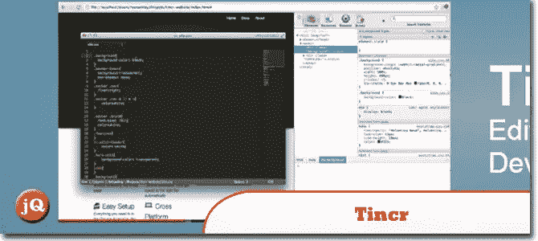
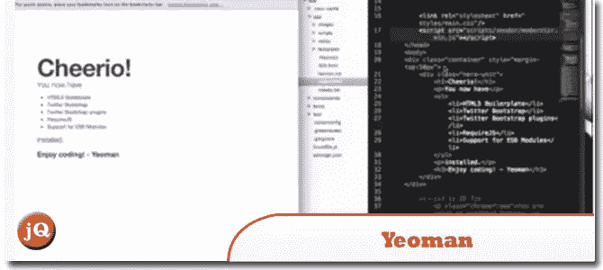
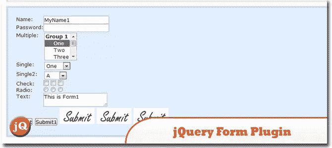
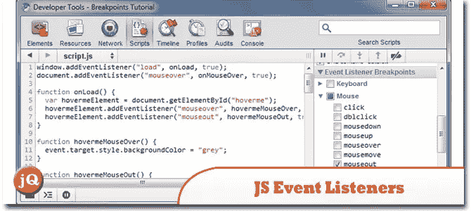
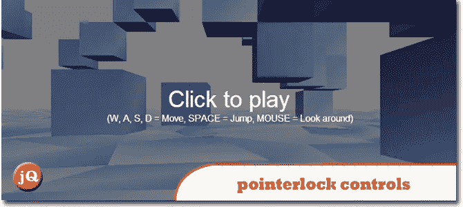
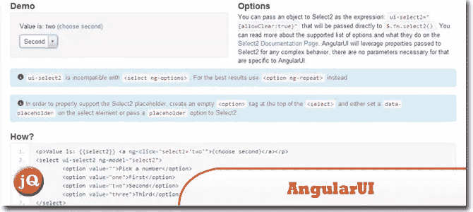
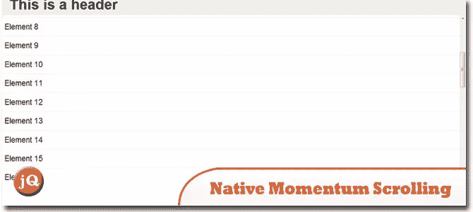
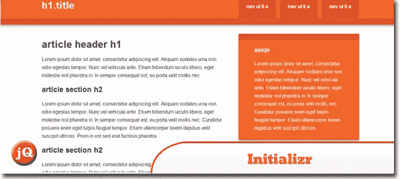
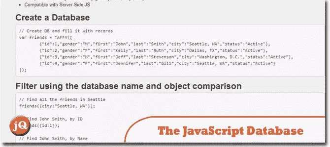
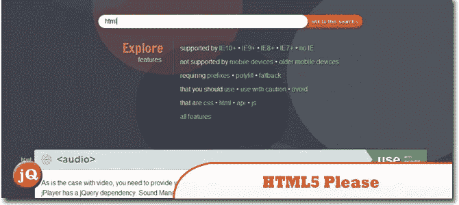

# 我在网上为 Web 开发人员找到的 17 个很酷的东西

> 原文：<https://www.sitepoint.com/17-cool-net-web-developers-octnov/>

大家好，在今天的博文中，我将与大家分享过去几个月我在互联网上发现的一些很酷的东西——这有助于我逐月找到东西。每天都有很多很酷的东西出现！很多很酷的东西，点击链接查看吧！

## 1.主题编辑器

**妙极了！**作为 Sublime 2 的忠实粉丝，之前[创建了一个 Notepad++主题](http://www.jquery4u.com/editors/setup-sublime-2-text-editor/)很高兴看到开发者现在有一个像样的 UI 来为 SublimeText、Textmate 和其他文本编辑器创建配色方案。

 
[来源](https://github.com/aziz/tmTheme-Editor#tmtheme-editor) [演示](http://tmtheme-editor.herokuapp.com/)

## 2.Tincr

**直播重装！哇！当你在 Chrome 开发者工具中编辑代码时，看看这个可以节省你大量的时间。**

## 3.约曼

**Addy Osmani“吃掉你的心”展示了 Yeoman**——这是一套强大而有见解的工具、库和工作流，可以帮助开发人员快速构建漂亮、引人注目的 web 应用。去看看吧，这会节省你建立新项目的大量时间。

## 4.艾迪·奥斯马尼和保罗·刘易斯的断点

一个致力于开发工具和节省时间技术的节目——Addy Osmani 和 Paul Lewis(代替生病的 Paul Irish)谈论约曼。[这一集](http://www.jquery4u.com/video-tutorials/breakpoint-paul-irish-addy-osmani-episode-2/)有男主角在里面！

 
[来源](https://www.youtube.com/watch?feature=player_embedded&v=ktwJ-EDiZoU#!)

## 5\. Cloud9 IDE

使用我们强大且**灵活的云 IDE** 编写、运行和调试您的代码。公开协作您的工作区，或保持其私密性。

## 6.jQuery 表单插件

很酷——真不敢相信我没有早点看到这个！它允许你轻松地升级 HTML 表单以使用 AJAX。主要方法 ajaxForm 和 ajaxSubmit 从表单元素收集信息，以确定如何管理提交过程。

 
[来源](http://www.malsup.com/jquery/form/) [演示](http://www.malsup.com/jquery/form/#ajaxForm)

## 7.JavaScript 事件侦听器上的断点

女士们，学习你们的断点。展开脚本面板右侧的事件监听器断点侧栏窗格。展开鼠标输入。
T3T5
来源

## 8 three.js 指针锁控件

非常酷的指针锁定控件！

 
[来源](http://mrdoob.github.com/three.js/examples/misc_controls_pointerlock.html)

## 9.推文到地图

**在地图上发推文！我怎么没想到呢！一个 jQuery 插件让你能够创建谷歌地图，显示基于位置的推文。**

[来源](http://tweettomap.com/) [演示](http://tweettomap.com/)

## 10.以打字打的文件

微软的东西 …………………实际上 OOP 是一个很好的概念，但是还没有被说服。它是一种用于应用级 JavaScript 开发的语言。TypeScript 是 JavaScript 的类型化超集，它编译成普通 JavaScript。

 
[来源](http://www.typescriptlang.org/) [演示](http://www.typescriptlang.org/Playground/)

## 11.安古拉瑞

我真的很喜欢 AngularJS，希望不久能在博客上看到更多关于这个框架的东西。这是 AngularJS 框架的增强配套套件。

 
[来源](http://angular-ui.github.com/) [演示](http://angular-ui.github.com/#directives-select2)

## 12.自然动量滚动

**一个面向移动开发者。**移动 Safari 中最大的网络应用问题之一即将结束。在 iOS 5 Beta 2 中，您可以使用 CSS 在元素上执行此操作:

 
[来源](http://johanbrook.com/browsers/native-momentum-scrolling-ios-5/) [演示](http://playground.johanbrook.com/css/touchtest.html)

## 13 .初始化

**疯狂快速定制自举！这是一个 HTML5 模板生成器，帮助你开始一个基于 HTML5 的新项目。**

 
[来源](http://www.initializr.com/) [演示](http://www.initializr.com/try)

## 14.JavaScript 数据库

我已经看到一些应用程序使用这个，我自己还没有试过，但很快就会做，并发布在博客上。一个开源库，将数据库特性引入到您的 JavaScript 应用程序中。

## 15.Smush.it

雅虎……使用特定于图像格式的优化技术从图像文件中删除不必要的字节。这是一个“无损”工具，这意味着它优化了图像，而不改变它们的外观或视觉质量。

[来源](http://www.smushit.com/ysmush.it/) [演示](http://www.smushit.com/ysmush.it/)

## 16.揭秘。射流研究…

制作这个的人我想见见他，请联系我。你有麻烦了…..只是在和你的牛逼男人开玩笑！干得好，哈基姆！这是一个使用 HTML 轻松创建漂亮演示的框架。

 
[来源](http://lab.hakim.se/reveal-js/#/)

## 17.HTML5 请

如果你以前没有看过，你必须看看这个。请谢谢你。查找 HTML5、CSS3 等特性，了解它们是否可以使用，如果可以，找出应该如何使用它们——使用 polyfills、fallbacks 或原样。

## 分享这篇文章