# 20 个大品牌的商标中隐藏着鲜为人知的小聪明

> 原文：<https://www.sitepoint.com/20-big-brands-with-little-known-cleverness-hidden-in-their-logos/>

有时，品牌变得如此之大和熟悉，以至于我们不再注意到隐藏在它们标志中的细微差别。在某种程度上，大型老牌公司通常被认为不如更小、更前卫的初创公司聪明和有创造力。但是，如果你看一看这些旧的，熟悉的标志，你可能会发现一些象征意义，技巧和扭曲，你已经忽略了多年。让我们来看看 20 个标志——从简单的“大”品牌到无处不在的公司——对于善于观察的眼睛来说，它们隐藏着一些小聪明。

### 托西托斯

[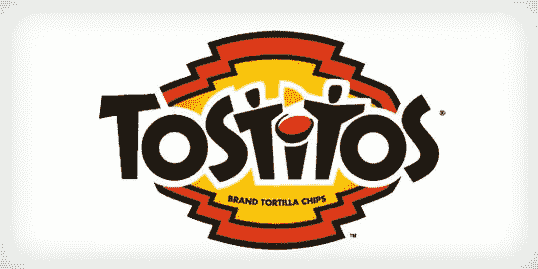](http://www.fritolay.com/tostitos/index.html)

Tostitos 的标志当然足够熟悉，但你有没有注意到这对派对常客吃萨尔萨？

### 联邦快递

[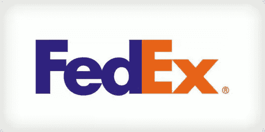](http://www.fedex.com/)

世界上几乎每个国家都有联邦快递。看看能不能找到他们徽标上的向右箭头。

### 亚马孙

Amazon.com 声称提供从“A”到“Z”所有能想到的产品。你能在他们的标志中看到同样的承诺吗？

### 亚特兰大猎鹰队

[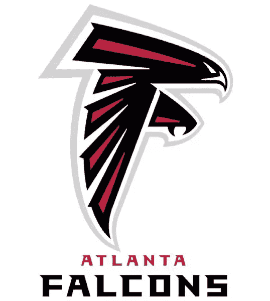](http://www.atlantafalcons.com/)

亚特兰大猎鹰队的标志主要是基于这种鸟，但你能看到字母“F”的反复出现吗？(提示:在房间允许的情况下，尽量远离屏幕。)

### 巴斯金·罗宾斯

[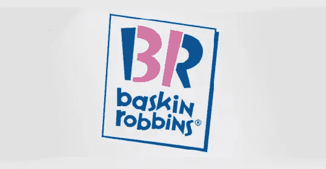](http://www.baskinrobbins.com/content/baskinrobbins/en.html)

巴斯金·罗宾斯宣称有 31 种独特口味的冰淇淋，他们也将这一宣称作为他们品牌的一部分。

### 十大会议

[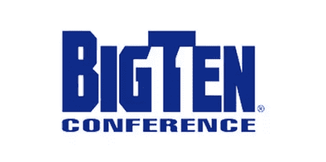](http://www.bigten.org/)

美国大学队的十大会议遇到了品牌问题。他们曾有过 11 个团队。(事实上，在内布拉斯加州于 2011 年加入后，他们现在有 12 个，他们显然已经放弃了任何将他们的团队总数与他们的品牌名称相协调的希望。)负空间提供了包含所有 11 个团队的机会。

### 商誉

[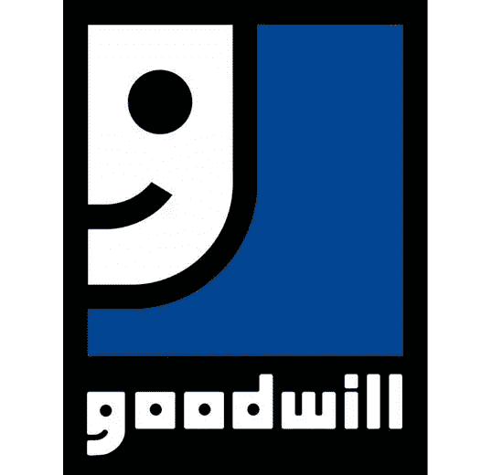](http://www.goodwill.org/)

“善意”标志在印刷和说明性标志之间取得了平衡。“G”组成了一个友好的微笑。嗯，至少一半。

### 伦敦交响乐团

[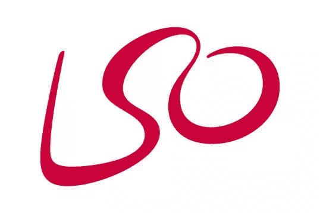](http://lso.co.uk/)

这个辉煌的标志结合了交响乐指挥(右手拿着指挥棒)的建议和“LSO”的缩写。

### 密尔沃基酿酒人队

[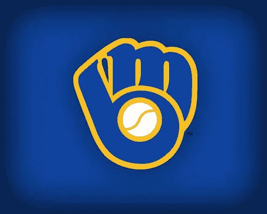](http://milwaukee.brewers.mlb.com/index.jsp?c_id=mil&sv=1)

密尔沃基酿酒人队将传统的棒球手套与字母“M”和“B”结合在一起。

### 太阳微系统公司

Sun Microsystems 的标志似乎是以无限循环(顺时针)的顺序拼写“太阳”这个词。

### 家用电器

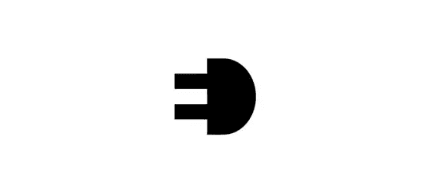

通过对负空间的巧妙利用，Elettro Domestici 拼写出了“ED ”,同时展示了一个电插头。

### 我的字体

[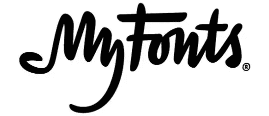](http://www.myfonts.com/)

我的字体不仅采用了有趣的字体来表现它们，它们还包括一个滑动的手，好像在重申占有欲(我的！)的品牌。

### 隐藏的软木

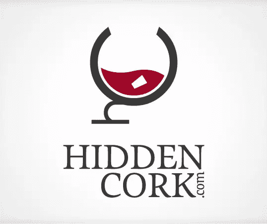

隐藏软木的标志形成了一个带有字母“H”和“C”的酒杯。并且，他们通过使用负空间来隐藏他们自己的软木塞。

### 安装人员

安装者利用他们自己安装的双扇门(以及背后一个光线充足的房间)通过负空间形成一个大写的“I”。

### 家族

[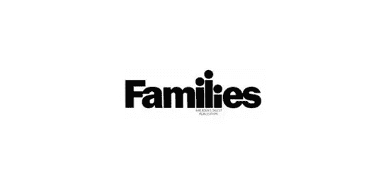](http://www.rd.com/)

“家庭”包括一个他们自己的家庭，在他们的家庭友好的标志中间有一个有趣的排版。

### 傲慢的孔雀

[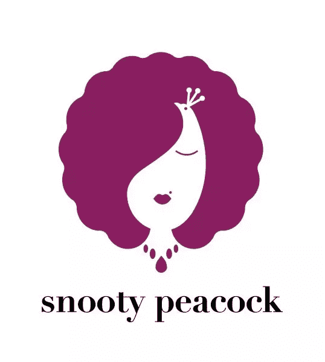](http://www.snootypeacock.com/)

按照 M. C .埃舍尔的传统，傲慢的孔雀将两个完全不同的形象融合在一起，形成他们的标志。

### 联合利华（公司）

[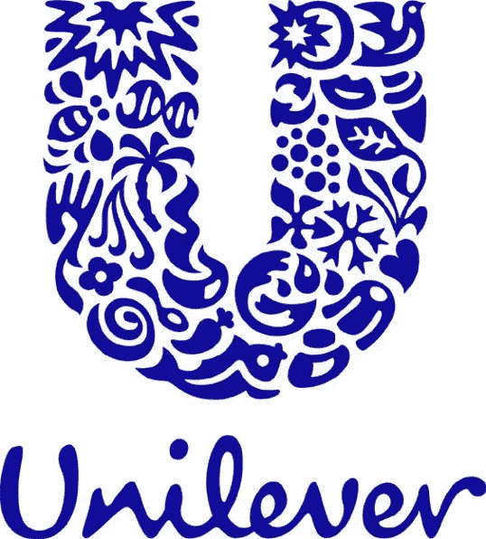](http://www.unilever.com/)

联合利华的业务有 24 个不同的方面，每一个方面都体现在他们品牌的更大的“U”中。

### 索尼 Vaio

[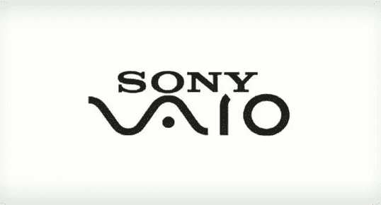](http://www.sony.com.au/productcategory/it-personal-computer)

索尼 Vaio 的标志代表了模拟向数字的演变。典型模拟“波”中的“V”和“A”以及“I”和“O”构成了构成任何数字信息的基本二进制代码。

### Elefont

[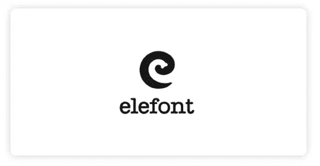](http://logopond.com/gallery/detail/50999)

Elefont 不仅为他们的标志选择了一种引人注目的字体，他们还为小写的“e”和大象的鼻子找到了空间。

### 非洲儿童希望倡议

[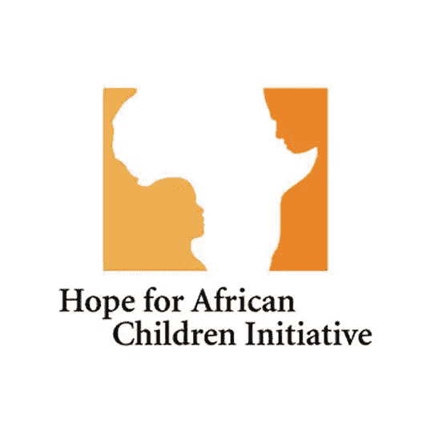](http://www.hopeforafricanchildren.org/)

“非洲儿童希望”倡议的品牌显然包含了非洲大陆，但它也包括一个儿童和一个成人在负面空间中面对面。

你是否在看似熟悉的标志中发现了一些新的花样？你认为大型组织在他们的品牌中还有发挥聪明才智的空间吗，或者这有损于他们来之不易的权威和规模吗？

## 分享这篇文章