# 20 个创意，不寻常的 404 页

> 原文：<https://www.sitepoint.com/20-creative-unusual-404-pages/>

我们都知道设计师有一套网页标准，这对构建一个成功、完整的网站至关重要。从介绍性的“[关于我的页面](https://www.sitepoint.com/5-ways-to-truly-personalize-your-about-me-page/)”到信息性的“[联系方式](https://www.sitepoint.com/15-creative-and-artistic-contact-pages/)”页面，每一个页面都有其用途。但是，404 页呢？404 页面，或者有时称为“未找到页面”页面，是对 have 的一个重要补充。因为没有一个设计是完美的，所以有一个页面来指示和识别错误是一个很好的实践。这些错误通常是由于断开或死链接而发生的。无论错误是你的还是由你以外的因素造成的，关键是你应该有一个 404 页的设计，以防万一。毕竟，你永远不知道什么时候可能会出错，优雅地处理这些意外问题很重要。

自然地，你可以创建一个平淡无奇的、基本的 404 页面设计，但是为什么要用一些普通的、平凡的东西来破坏你出色的、有创意的网站设计呢？设计上的创造性会让你在访问者中加分，所以你最好给你的 404 页面和你给网站其他部分一样的待遇和考虑。这是一个很好的机会来解决和平息由错误或断开的链接带来的沮丧。为了让你的创意源源不断，这里有一些创意设计的 404 页，肯定会启发你重新设计你现在的 404 页。

**Apadeloup**

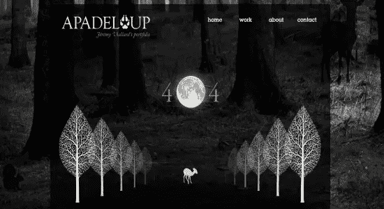

维拉德的作品集不仅有一幅大图片作为背景，而且有一个引人注目的 404 页，上面有简单的轮廓，非常漂亮。

**蓝丹尼尔**  

[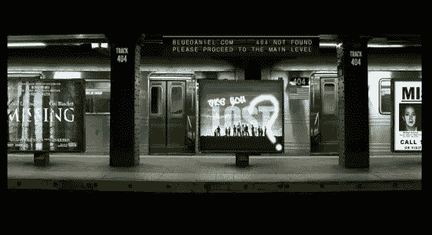](http://www.bluedaniel.com/404)

《蓝色丹尼尔》网站本身就美得让人流连忘返，以剪刀手爱德华臭名昭著的配乐为特色。404 页非常适合，因为它创造性地使用了以失踪或失落为主题的电影和电视节目标题。

**暴雪**  

[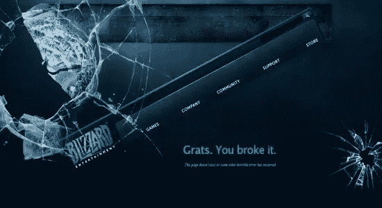](http://us.blizzard.com/en-us/error.html)

暴雪的 404 页面采用了碎页的概念，并逐字翻译成碎页。它拥有一个破碎的屏幕和一个歪斜的导航菜单，挂在“亲爱的生活”上，再加上玩家俚语“Grats”作为对客户的点头。

**Deviantart**  

[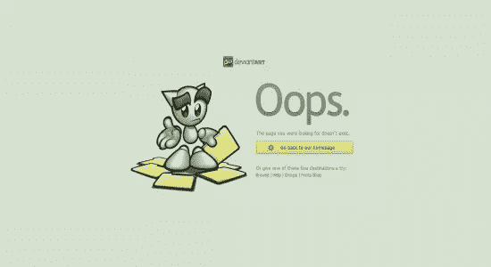](http://www.deviantart.com/404)

Deviantart 的用户在访问过程中很有可能几次碰到 404 页面。该网站的吉祥物的使用是一个很好的接触。

**Agens**  

[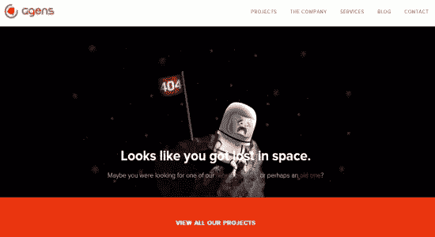](http://agens.no/404)

迷路总是一件令人沮丧的事情，Agens 通过他们的 404 页面设计清楚地表明了这一点。以一名迷失在太空中的孤独宇航员为特色，设计相当简单，但仍然富有创意。

**的多面性**

 **[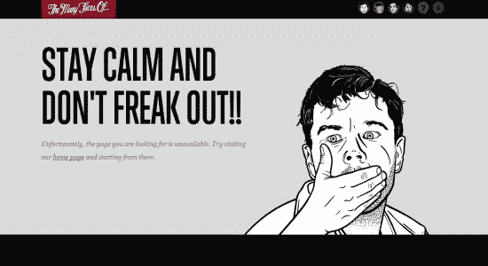](http://themanyfacesof.com/four-oh-four/leo.html)

在你的网页设计中使用插图是让它脱颖而出的好方法。《许多面孔》完美地做到了这一点，并进一步添加了动画，让他们的莱昂纳多·迪卡普里奥插画在你被指示保持冷静、不要惊慌时惊恐地喘息。

**CoolApps**  

[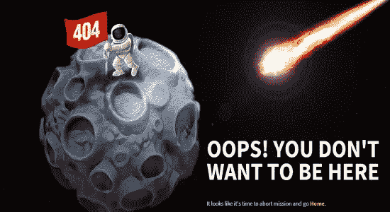](http://www.coolappse.com/404notfound)

以迷失在太空中为主题，以及他们已经以太空为主题的网站设计，CoolApps 创建了一个独特的 404 页面，敦促你返回，因为你目前正在一个你真的不想去的地方。

**MailChimp**T2

[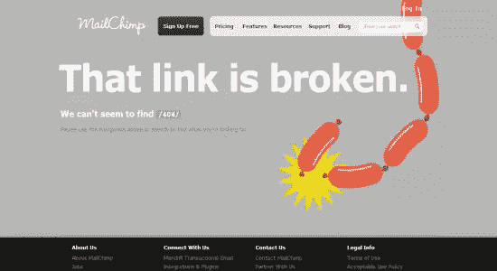](http://mailchimp.com/404/)

大多数人都能欣赏诙谐的幽默，所以 MailChimp 在发布“该链接已断开”公告的同时，还配有一张香肠断开的矢量香肠链接图片。

 **** 

 **[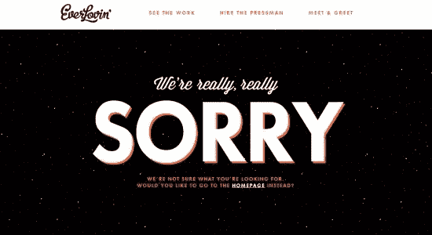](http://everlovinpress.com/404#.UbD1-_nVCSr)

当你犯了一个给别人带来不便的错误时，道歉总是一个好主意。EverLovin 的 404 页面以简单的格式提供了一个道歉，并提供了一个让你返回主页的链接。

**Bol.Com**T2

如果你的荷兰语有些生疏，“helaas deze pagina bestaat niet”可以翻译成“不幸的是，这个页面已经不存在了。”这个角色是在尴尬中躲藏还是在寻找缺失的内容还有待观察，但是蓝色的设计真的很好看。

**BrandCrowd**  

[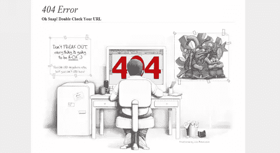](http://www.brandcrowd.com/40)

你很少看到 404 页看起来像草图。设计非常详细，将错误消息作为唯一的流行颜色是一个不错的选择。

**Airgid**  

[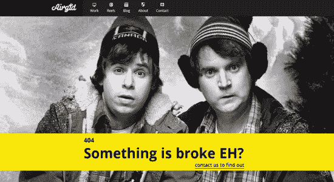](http://www.airgid.com/404)

有时候，没有必要有一个丰富多彩的插图。一张照片可以说明你遇到了一个问题，尤其是当你的照片中的人脸上都带着表情的时候。

 **** 

 **

当你在做 404 页面设计时，你会想要确保它和你网站的其他部分很好的配合。Pulpfingers 在这方面做得很好，它保持了相同的元素，而不会使页面过于繁忙。

**画廊的莫**  

[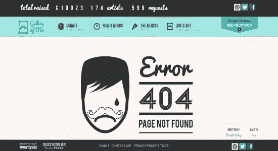](http://www.galleryofmo.co.uk/404)

大的图片和字体可以帮助你的错误信息在背景中凸显出来，就像 Mo 网站的图库中的一个特色。

**黑月设计**

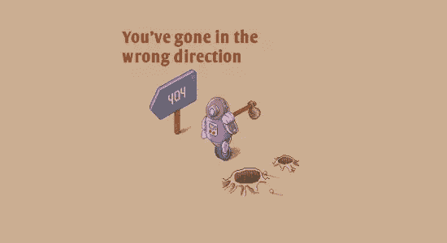

请记住，保持页面的一致性是一个很好的练习。BlackMoon Design 在让你知道你已经走错方向的同时，让老派游戏图形继续下去。

**乐高**T2

[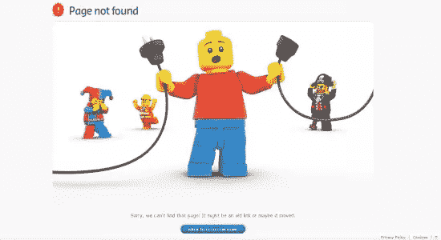](http://www.lego.com/404)

在构建 404 页面时，使用可识别的字符作为公司品牌的一部分是明智的想法。乐高做得很好，让他们的角色说明你遇到了一点问题。

**威廉·Csete**  

[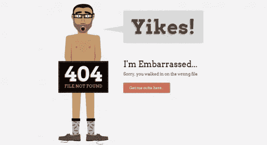](http://www.williamcsete.com/404)

断开的链接确实会让你的网站尴尬，所以添加一个承认尴尬的幽默的 404 页面是一种对人友好的方法，正如 William Csete 的页面所展示的。

**ACM 内饰**  

[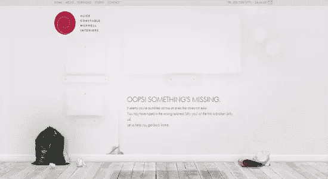](http://www.acm-interiors.com/404.html)

既然使用大幅照片作为你网站的背景仍然很流行，你没有理由不能在你的 404 页面上使用。一间空房是室内设计网站的绝佳形象。

**豆荚**T2

[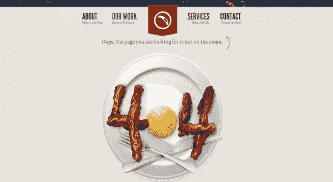](http://www.peapod.ca/404)

你不需要总是把你的错误信息图片建立在你公司的基础上——也许你永远都不需要。有时候，围绕信息设计图像也很好，尤其是在 Peapod Studio 的 404 页面中。

### 结论

虽然你应该确保你设计了一个 404 页面以防出错，但它肯定不会让忽视网站错误变得更可接受……即使你暗地里想炫耀你有创意的 404 错误页面。从上面的展示中获取一些线索，创造一些有趣和大胆的东西，但要保持你的网站平稳运行。

*在今天的 showcase 中，你有最喜欢的 404 页面设计吗？你认为是什么造就了一个伟大的 404 页面？******* 

## ****分享这篇文章****