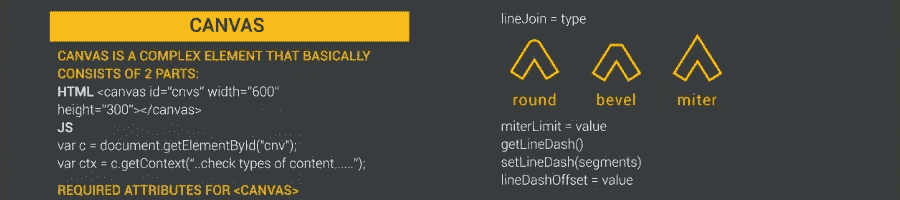
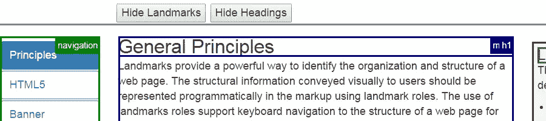
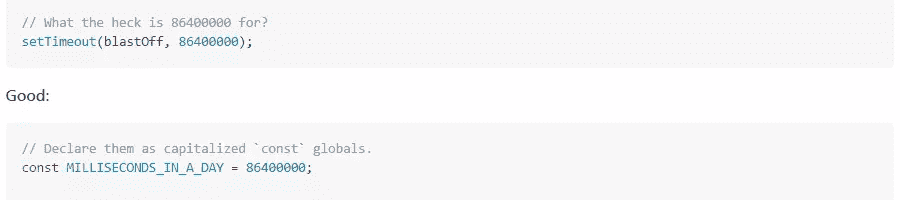
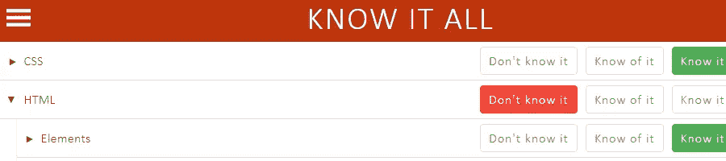
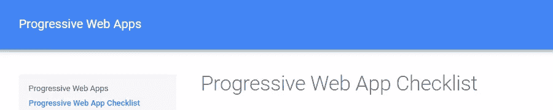
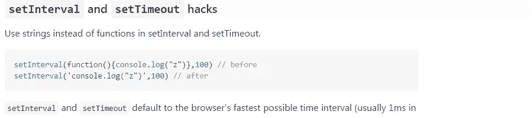
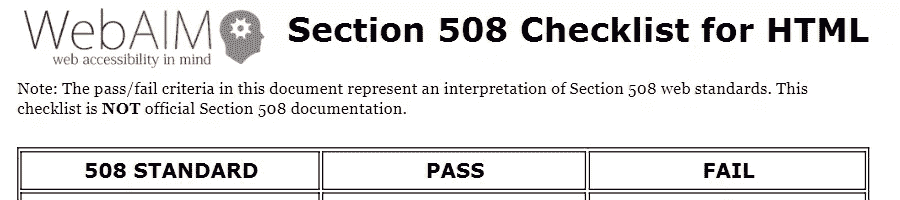
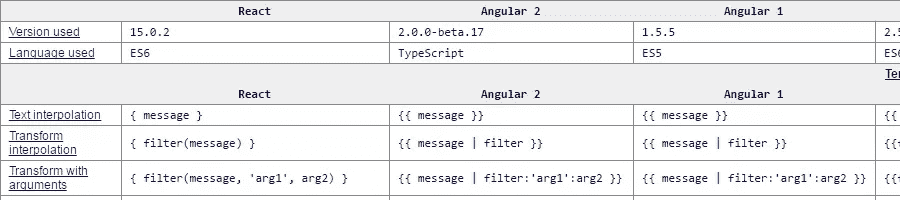

# 面向前端开发人员的 20 多份文档和指南(第 11 位)

> 原文：<https://www.sitepoint.com/20-docs-guides-front-end-developers-11/>

又到了该学习的时候了！和以前一样，我收集了许多不同的学习资源，包括指南、文档和其他有用的网站，以帮助您快速了解前端开发的不同领域。

因此，请欣赏我们的文档和指南系列第十一期，不要忘记在任何其他人的评论中告诉我我还没有包括的内容。

## [1。HTML 画布备忘单](https://skilled.co/html-canvas/)

一个 HTML Canvas 语法 cheatsheet，以常规 web 格式或可下载的 PDF 或 PNG 格式提供。这张备忘单从基本要素(形状、文字、颜色等)开始，有一个很好的概述。)并转向更高级的功能(图像、变换、动画)。

## [2。咏叹调地标示例](https://w3c.github.io/aria-practices/examples/landmarks/index.html)

广泛的 W3C 指南，提供了使用 ARIA 地标和标题创作可访问页面的详细信息。除了各种页面中的信息(包括横幅角色区域的所有内容)之外，页面顶部还有交互式按钮，允许您直观地查看地标和标题，这对于识别网页的组织和结构非常有用。

## [3。干净代码 JavaScript](https://github.com/ryanmcdermott/clean-code-javascript)

开发人员 Ryan McDermott 从 Robert C. Martin 的书 *Clean Code* 中收集了一个软件工程原则的综合库，并将其改编为 JavaScript。这是用 JavaScript 编写可读、可重用和可重构软件的指南。

## [4。无所不知](https://know-it-all.io/)

与其说是指南本身，不如说是帮助你决定哪些指南、教程等的工具。，去寻找。它基本上是一个待办事项列表风格的 web 应用程序，让您指出您知道或不知道哪些 web 平台和 Node.js 技术。该列表从非常广泛的范围开始，并允许您深入到每个类别下更具体的功能。

## [5。函数式编程指南](https://github.com/MostlyAdequate/mostly-adequate-guide)

似乎每周都有关于函数式编程的新资源，但是对于有经验的程序员和那些还不熟悉函数式编程概念的人来说，这是一个不错的选择。这是为 JavaScript 开发人员编写的，似乎是一项正在进行的工作。前九章已经写完了，我想这对刚开始学这门课的人来说已经足够了。

## [6。在 WHATWG](https://fetch.spec.whatwg.org/) 上获取生活标准

如果您还没有注意到的话，Fetch 标准是 XMLHttpRequest 的现代替代标准，现在具有非常强大的浏览器支持。如果您正在考虑从旧技术过渡到这个新的 API，官方规范可能是一个不错的起点。

## 7 .[。从零开始的 JavaScript 堆栈](https://github.com/verekia/js-stack-from-scratch)

Jonathan Verrecchia 的这本“组装 JavaScript 栈的简明扼要的指南”可能会帮助开发人员克服当前 JavaScript 生态系统的复杂性。本指南并没有详细介绍每项技术，只是演示了如何让这些技术运行起来。

## 8.npm 与 Yarn 备忘单

Yarn 是一个 JavaScript 包管理器，它试图解决 npm 的一些问题。Gant Laborde 整理了一个小指南来帮助开发者理解他们想要进行转换的不同之处。这是文章的 PDF 版本，内容相同。

## [9。CSS 参考](http://cssreference.io/)

CSS 的可视化指南，分为基本类别，包括插图和动画示例，帮助您理解不同的属性及其可能的值。

## 10。iOS 突进

我以前曾推出过桌面版的 Dash，但这是 iPad 和 iPhone 版本。Dash 是一个免费的开源 API 文档浏览器，让您的 iPad 和 iPhone 可以即时离线访问 150 多个 API 文档集，包括 Bootstrap、Angular、CoffeeScript、Ember.js、Node.js、Meteor 以及面向前端和后端开发人员的大量文档。

## [11\. ES6 Cheatsheet](https://es6cheatsheet.com/)

我知道你在想什么:不是另一个 ES6 小抄！不过，这个很酷。它分为 9 个部分，包含 31 个代码示例。每个例子都有一个 CodePen 代码，比较了旧的做事方式和 ES6 的做事方式。

## [12。渐进式网络应用清单](https://developers.google.com/web/progressive-web-apps/checklist)

来自谷歌的关于 PWA 热门话题的指南:“为了帮助团队创造尽可能最好的体验，我们整理了这份清单，它分解了我们认为成为基线 PWA 所需的所有东西，以及如何通过提供更有意义的离线体验、更快地实现互动以及关注更多重要细节来进一步发展示范性 PWA。”

## 13。字节节省技术

基于一个名为 140Bytes 的旧 code golf 项目，本文提供了许多快速 JavaScript 优化技巧和技术。请注意，其中一些在现实项目中可能不实用，因为它们在代码维护期间可能会出现问题。

## 14.AMP by 示例

该网站提供了基于代码和实时示例的加速移动页面的实践介绍。它将帮助您学习如何使用 AMP 创建网页以及如何使用 AMP 组件。

## 15。WebAIM 第 508 节清单

一份来自 WebAIM 的清单，帮助你让你的页面符合 508 条款。该指南可在线获得或以 PDF 格式提供，它分为两部分内容:1) HTML 2)脚本和插件。

## 16。前端超聚合

Jeff Carpenter 的流行 JavaScript 框架中类似特性的对比图。如果您正在考虑使用 React、Angular、Ember、Polymer、Vue 或 Riot.js，这个分类将向您展示这些类型的库和框架中常见的许多不同技术的每个库的语法。

## [17。排版手册](http://typographyhandbook.com/)

Kenneth Wang 的《最佳网页排版实践简明参考指南》包括关于 CSS 和字体格式的设计、大小和单位的提示。

## 18。JavaScript 模块

ES6 模块的快速介绍和说明，这是一个受 Node.js 模块启发的模块系统。虽然 ES6 模块[还没有太多的浏览器支持](http://caniuse.com/#feat=es6-module)，但这是一个很好的指南，可以让你提前知道会发生什么。还有一个[与 CommonJS](http://jsmodules.io/cjs.html) 的比较。

## [19。Sassisfaction](https://sassisfaction.com/)

面向 Sass 开发人员的可搜索资源集合，包括工具、教程、库等。

## 20。selfcare.tech

最后，让我们从詹妮弗·林·帕森斯那里收集一些自我护理的资源来完成这个列表。包括关于锻炼、积极性、日志等的提示、文章和工具。所有科技工作者都将从优先考虑健康和幸福中受益，这可能是一个很好的起点。

## 其余中最好的…

*   [浏览验证手册](https://github.com/substack/browserify-handbook)
*   [SaaS 首席技术官安全检查清单](https://cto-security-checklist.sqreen.io/)
*   [HTTP 状态狗](https://httpstatusdogs.com/)
*   [极限角度 CLI 参考指南](https://www.sitepoint.com/ultimate-angular-cli-reference/)
*   [CSS 框架对比](http://www.saravanakumar.org/css-frameworks-compare/)
*   [前端性能检查表](https://www.smashingmagazine.com/2016/12/front-end-performance-checklist-2017-pdf-pages/)
*   [亚马逊网络服务开放指南](https://github.com/open-guides/og-aws)
*   [网络开发播客](https://github.com/ryanburgess/web-development-podcasts)
*   [Docker 备忘单收藏](https://sub.watchmecode.net/ebooks/docker-cheatsheet-collection/)

## 建议你的

如果你已经为前端开发人员建立或知道另一个学习资源，请在评论中提出来，我会在以后的帖子中考虑它。

同时，以下是本系列之前的帖子:

*   [20 份前端开发者文档和指南(第一期)](https://www.sitepoint.com/20-docs-guides-front-end-developers/)
*   [20 份前端开发者文档和指南(第二期)](https://www.sitepoint.com/20-more-docs-guides-front-end-developers/)
*   [20 份前端开发者文档和指南(第三期)](https://www.sitepoint.com/another-20-docs-guides-front-end-developers/)
*   [20 份前端开发者文档和指南(第 4 期)](https://www.sitepoint.com/20-docs-guides-front-end-developers-4/)
*   [20 份前端开发者文档和指南(第 5 期)](https://www.sitepoint.com/20-docs-guides-front-end-developers-5/)
*   [20 份前端开发者文档和指南(第 6 期)](https://www.sitepoint.com/20-docs-guides-front-end-developers-6/)
*   [20 份前端开发者文档和指南(第 7 期)](https://www.sitepoint.com/20-docs-guides-front-end-developers-7/)
*   [20 份前端开发者文档和指南(第 8 期)](https://www.sitepoint.com/20-docs-guides-front-end-developers-8/)
*   [20 份前端开发者文档和指南(第 9 期)](https://www.sitepoint.com/20-docs-guides-front-end-developers-9/)
*   [20 份前端开发者文档和指南(第 10 期)](https://www.sitepoint.com/20-docs-guides-front-end-developers-10/)

## 分享这篇文章