# 前端开发人员的 20 个文档和指南(第 4 期)

> 原文：<https://www.sitepoint.com/20-docs-guides-front-end-developers-4/>

又到了该学习的时候了！嗯，在这个行业里，我想那个时间总是*T1。这是我整理的第四篇这样的帖子，这可能是迄今为止最好的一篇。*

最近几个月，我偶然发现并收集了许多不同的指南和学习资源，这是最新的一期。

尽情享受吧！

## [1。放大镜](http://latentflip.com/loupe/)

这是“一个帮助你理解 JavaScript 的调用栈/事件循环/回调队列如何相互作用的小可视化”它是交互式的，允许你包含你自己的定制代码，然后执行它，并且还有一个关于相同主题的视频演示。

[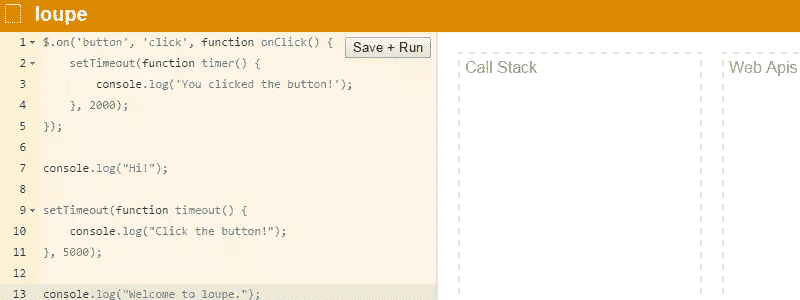](http://latentflip.com/loupe/)

## [2。急救 Git](http://firstaidgit.io/)

"一个最常见的 Git 问题的可搜索集合."这对于 Git 技能一般或低于一般水平的人来说很有用。目前有 38 个单独的主题，可以通过页面上的搜索过滤器找到。

## [3。元素周期表 1.0 角色](http://dylanb.github.io/periodic-aria-roles.html) & [属性](http://dylanb.github.io/periodic-aria-attributes.html)

这是两个独立的页面——我想这使得这个列表达到了 21 个——记录了 ARIA 角色和[属性](http://dylanb.github.io/periodic-aria-attributes.html)的详细信息。

[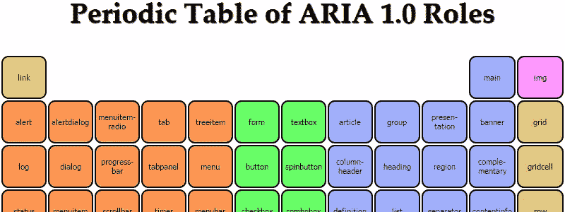](http://dylanb.github.io/periodic-aria-roles.html)

只需单击一个角色或属性，就会出现一个覆盖图，显示该特性规范中的信息。

[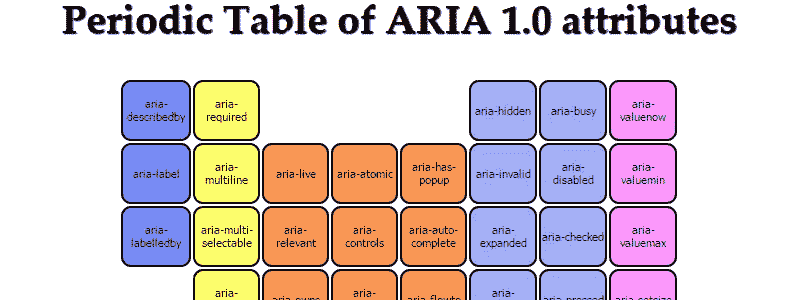](http://dylanb.github.io/periodic-aria-attributes.html)

## [4。服务人员准备好了吗？](https://jakearchibald.github.io/isserviceworkerready/)

服务工人规范是一个有前途的(没有双关语的意思！)由于缺乏浏览器支持且仍在不断变化，新标准还没有准备好投入生产。这个小小的信息网站描述了该规范的特性，以及它们在不同浏览器中的表现。

[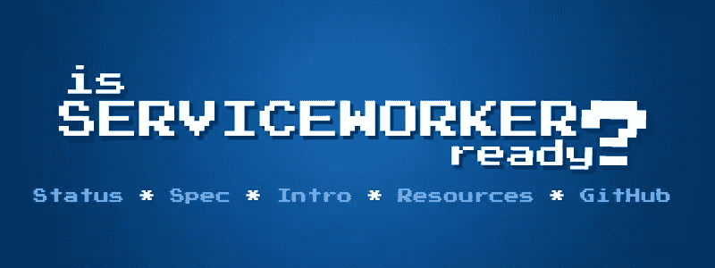](https://jakearchibald.github.io/isserviceworkerready/)

## [5。浏览器对破损/缺失图像的支持](http://codepen.io/bartveneman/full/qzCte/)

大多数时候，我们可能都认为这是理所当然的。这是 Bart Veneman 的一个基于 CodePen 的文档，它准确地描述了不同的浏览器/操作系统如何处理破损的图像(包括占位符、替换文本、边框等)。)

[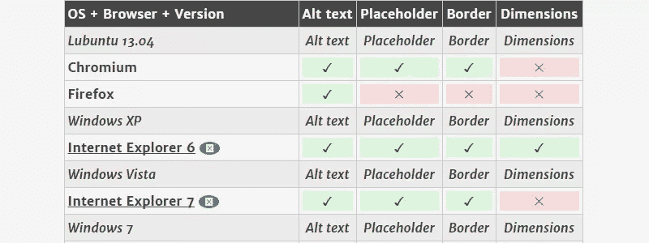](http://codepen.io/bartveneman/full/qzCte/)

## [6。2014 年响应报告](http://2014.report.gridsetapp.com/)

这是由 Gridset 的人进行的年度响应调查。本次调查中的 1000 多名参与者提供了他们在 RWD 工作流程中面临的挑战信息，这些挑战与客户、测试等相关。该调查还关注乐观主义(或缺乏乐观主义)、趋势以及在 RWD 使用的工具。

## [7。排版备忘单](http://www.typewolf.com/cheatsheet)

"使用正确的印刷字符的综合指南，包括正确的语法用法."也有单页的 PDF 格式，它包括了为 Mac 和 Windows 生成不同字符的快捷键，非常方便。

[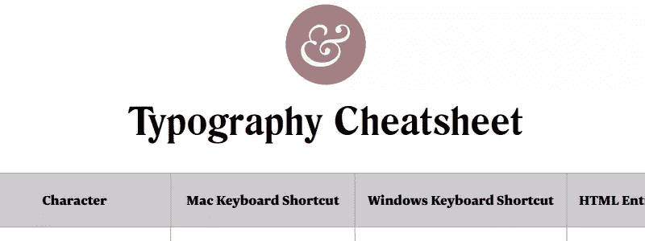](http://www.typewolf.com/cheatsheet)

## [8。咏叹调示例](http://heydonworks.com/practical_aria_examples/)

易访问性专家 Heydon Pickering 出色地汇编了 HTML 示例，展示了各种 ARIA 特性的不同用例。9 个不同例子的演示和代码。对于任何希望进入高级 ARIA 实现的人来说，这是一个非常好的起点。

[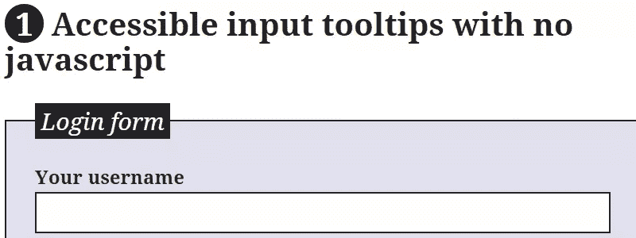](http://heydonworks.com/practical_aria_examples/)

## [9。ES5 手机兼容性表](https://github.com/AlloyTeam/Mars/blob/master/tools/es5-mobile-compat-table.md)

就 compat 表而言，这有一点不同，也更具体一些。它展示了 ES5 中引入的所有 JavaScript 特性，以及它们在不同移动浏览器中的表现。

[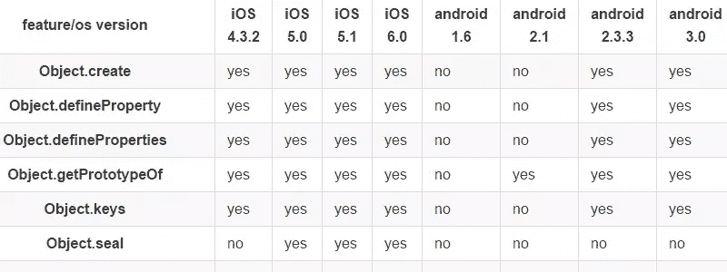](https://github.com/AlloyTeam/Mars/blob/master/tools/es5-mobile-compat-table.md)

## 10。iOS 字体

“每一种字体。每个 iOS 版本。”说到真正具体和可移动，这是一个可在 iOS 设备上使用的字体的 insta-filtered 列表，包括 Apple Watch。

## [11。CSS 滤镜游乐场](http://bennettfeely.com/filters/)

一个简单的界面来处理过滤器规范的各个部分。有用还因为你可以选择一个自定义的 URL，甚至可以用 iframe 或视频来尝试。

[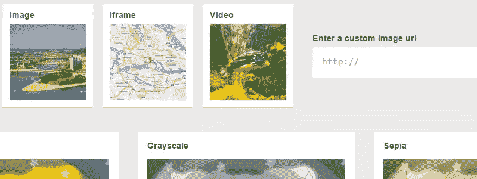](http://bennettfeely.com/filters/)

## [12。Git Cheatsheet](http://www.ndpsoftware.com/git-cheatsheet.html)

Git 命令的交互式可点击备忘单。不同的部分也有深度链接，这对于分享来说是一个很好的奖励。

[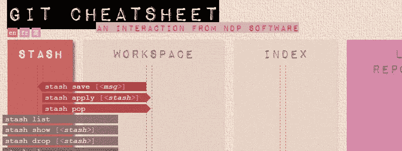](http://www.ndpsoftware.com/git-cheatsheet.html)

## [13。密码〔t1〕](http://keycodes.atjayjo.com/)

一个快速访问的 little info 站点，用于获取用于 HTML、CSS 或 JavaScript 的键盘按键、unicode 字符和 URL 编码字符的代码。

[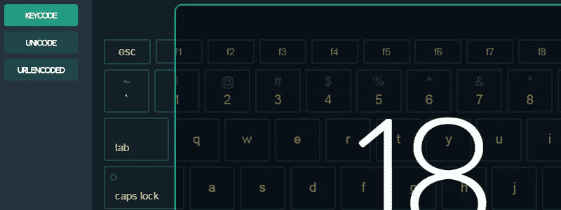](http://keycodes.atjayjo.com/)

## [14。正则表达式 101](https://regex101.com/)

一个非常漂亮的小应用程序，帮助你测试和学习正则表达式。我喜欢它显示“解释”和“匹配信息”的方式，它让你选择 3 种不同风格的正则表达式。

[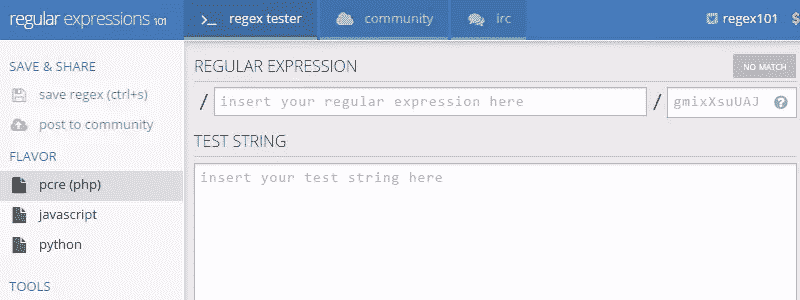](https://regex101.com/)

## 15。钙

这是一个移动应用程序，“为 HTML5、CSS3、JS API、SVG 和其他即将到来的 web 技术中的功能提供兼容性表。”我假设这个名字应该是“我可以使用移动设备吗”上的一个游戏，但他们似乎没有使用那个确切的短语，可能是为了避免版权问题，但我不确定。

[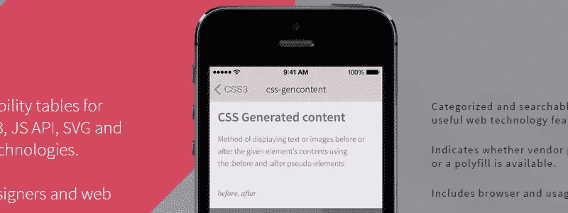](http://www.binaries-included.net/cium/)

## 16。DevTools 片段

"在浏览器开发工具中使用的有用代码片断的集合."看起来大约有 20 个，你可以贡献你自己的。

[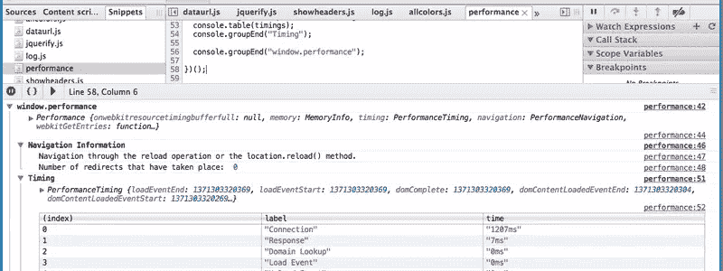](http://bgrins.github.io/devtools-snippets/)

## [17。Codrops CSS 参考](http://tympanus.net/codrops/css_reference/)

如果你错过了这个，Codrops 在 Sara Soueidan 的帮助下制作了他们自己的非常好的设计和全面的 CSS 参考。

[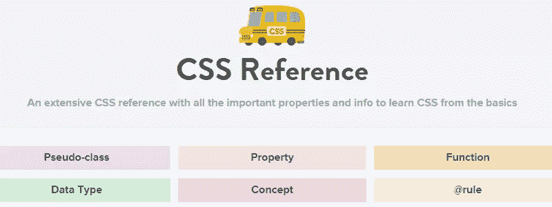](http://tympanus.net/codrops/css_reference/)

## 18。屏幕尺寸

一个非常广泛的移动设备和笔记本电脑列表，包括它们各自的屏幕尺寸。这些设备甚至链接到他们在亚马逊上的产品页面。

[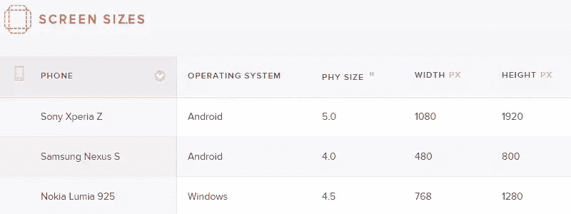](http://screensiz.es/)

## [19。前端指南](https://github.com/bendc/frontend-guidelines)

一个开发人员关于 HTML/CSS/JavaScript 各方面代码风格的提示。这里有很多好的建议。

[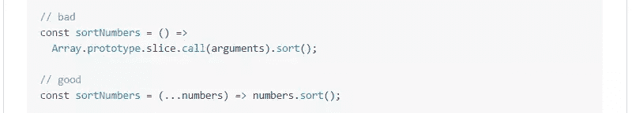](https://github.com/bendc/frontend-guidelines)

## 20。CSS 标尺

一个简单的交互式小工具，帮助你理解 CSS 处理相对和绝对字体大小的不同方式。

[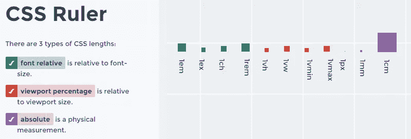](http://katydecorah.com/css-ruler/)

## 建议你的

如果你对学习资源有其他建议，请在评论中留下。与此同时，当你看完这篇文章后，如果你错过了之前的文章，你可以看看:

*   [20 个对前端开发人员有用的文档和指南](https://www.sitepoint.com/20-docs-guides-front-end-developers/)
*   [面向前端开发人员的 20 多份文档和指南](https://www.sitepoint.com/20-more-docs-guides-front-end-developers/)
*   [另外 20 份面向前端开发人员的文档和指南](https://www.sitepoint.com/another-20-docs-guides-front-end-developers/)

## 分享这篇文章