# 20 个对前端开发人员有用的文档和指南

> 原文：<https://www.sitepoint.com/20-docs-guides-front-end-developers/>

我在日常研究中遇到了这么多有趣的信息应用和文档，所以我想我应该在这里提供一个列表。

诚然，并不是每个人都喜欢“名单贴”或综述，但嘿，我们不能取悦每个人。而且我们也不经常发布这种类型的帖子。

在这种情况下，这是给一些东西做书签的好方法，也许是为了晚上或周末阅读。我保证你会在这里找到至少几个你想回来的链接。

尽情享受吧！

## [1。CSS 词汇](http://pumpula.net/p/apps/css-vocabulary/)

一个很棒的点击式小应用程序，让你快速掌握 CSS 语法的所有不同部分，以及它们的正确名称。

[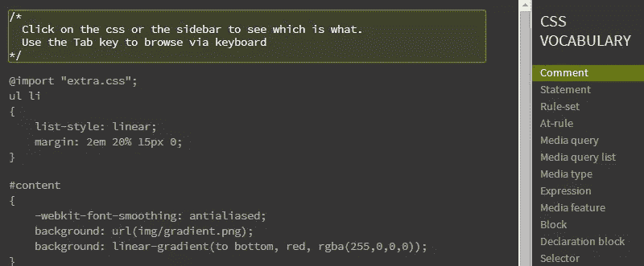](http://pumpula.net/p/apps/css-vocabulary/)

## [2。清盘](http://liquidapsive.com/)

一个非常简单的信息布局，通过一个选择框，您可以在响应式、自适应式、流动式和静态式之间进行选择，这样您就可以看到这四种布局类型之间的区别。

[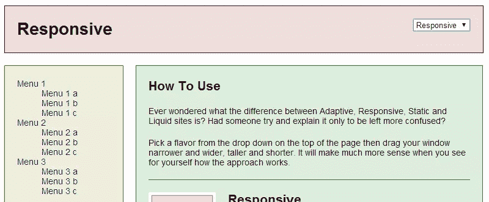](http://liquidapsive.com/)

我想这甚至可以展示给客户看，这样他们就可以看到使用不同的风格是如何调整的。

## [3。超级英雄. js](http://superherojs.com/)

关于帮助维护大型 JavaScript 代码库的最佳文章、视频和演示的集合。

包括一些一般原则类型的东西、测试资源、工具、性能、安全性等等。

## [4\. HowToCoffeeScript.com](http://howtocoffeescript.com/)

学习和记忆 CoffeScript 语法的备忘单。

[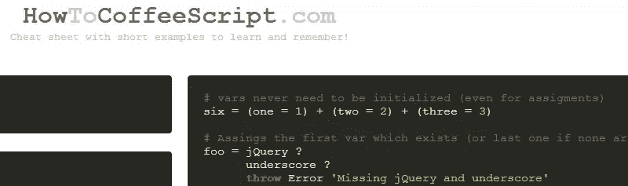](http://howtocoffeescript.com/)

## [5。HTML 的前景](https://www.w3.org/html/landscape/)

这很有趣。这是一个 W3C 文档，描述了三个 HTML 规范之间的“可察觉的差异”: WHATWG、W3C 的 HTML5.0 和 W3C 的 HTML5.1

可能有点过于技术化，但你也许能在这里找到一些有趣的新东西。

## [6。HTML 的元素](http://rawgithub.com/w3c/elements-of-html/master/index.html)

一个很好的 HTML 和 XHTML 元素的单页图表，显示了这些元素属于哪个规范。

[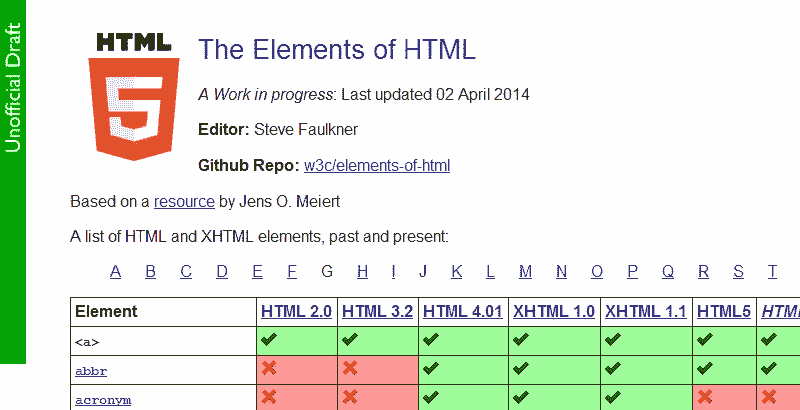](http://rawgithub.com/w3c/elements-of-html/master/index.html)

这对于研究 HTML5 中某个元素何时/是否被弃用或过时非常有用。

## [7。JavaScript 等式表](http://dorey.github.io/JavaScript-Equality-Table/)

一个漂亮的三层图表，帮助你理解 JavaScript 的两倍和三倍运算符。

[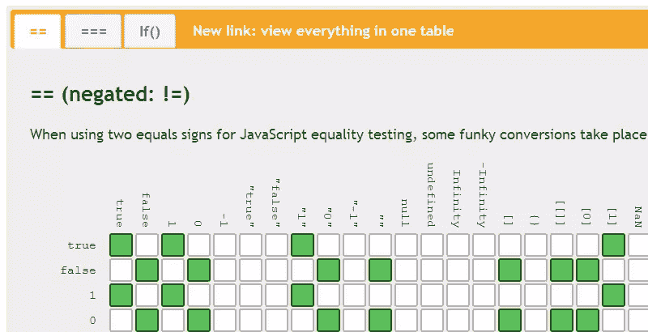](http://dorey.github.io/JavaScript-Equality-Table/)

结论呢？"使用三个等号，除非你完全理解两个等号之间的转换."

## [8。网络无障碍清单](http://a11yproject.com/checklist.html)

这是一个有用但并不强大的参考，可以帮助您检查项目中的各种项目的可访问性。

[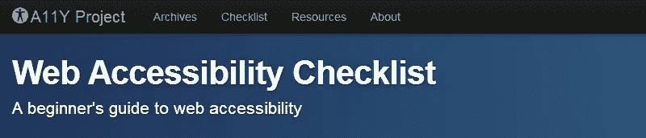](http://a11yproject.com/checklist.html)

这很简单，但是除了进行可访问性验证之外，总是进行最后的检查并没有坏处。

## [9。静态网络应用—现场指南](http://www.staticapps.org/)

根据描述:“本指南将向您介绍静态 web 应用程序的世界，并为构建它们时遇到的常见挑战提供解决方案。”

这里的想法是促进一个减轻常见开发问题的架构。

## 10。55 分钟左右学会正则表达式

介绍正则表达式的大量文档/教程。

[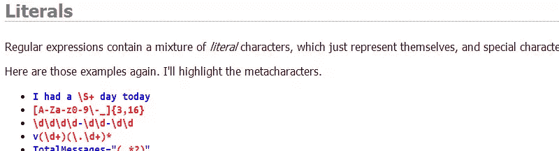](http://qntm.org/files/re/re.html)

我猜想这将需要比声称的“55 分钟”更长的时间才能真正得到一些东西，但肯定值得一看。

## [11。打开 Web CSS 参考](http://ref.openweb.io/CSS/)

这是一个真正全面的和鲜为人知的 CSS 属性和功能参考。

[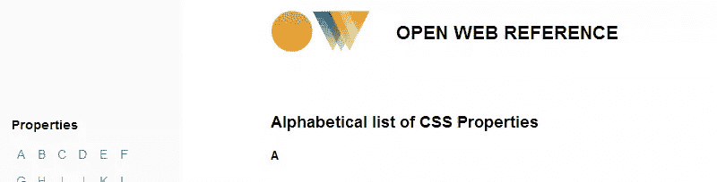](http://ref.openweb.io/CSS/)

按字母顺序排列，包括所有列出的规范的链接。

## [12。CSS 值](http://cssvalues.com/)

这是我自己的副业之一。这是查找 CSS 属性并快速查看可能值的简单方法。例如，如果你忘记了什么样的值对于像`font-variant`这样模糊的东西是可接受的。

[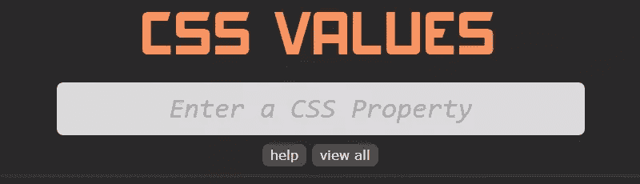](http://cssvalues.com/)

除了价值，最近的更新包括浏览器对每个属性的支持图表，由[caniuse.com](http://caniuse.com/)支持。

## 13。es6 特性

来自微软开发人员卢克·霍班，对 ECMAScript 6 规范中新内容的概述。

[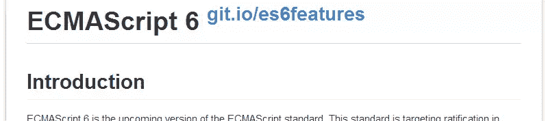](https://github.com/lukehoban/es6features)

正如 repo 所指出的，“这些特性在主要 JavaScript 引擎中的实现正在进行中”，所以开始熟悉这些东西将是有用的。

## [14。相关规格链接](https://github.com/mozilla/servo/wiki/Relevant-spec-links)

我经常很难在规范中找到合适的位置来研究一些东西。这是来自 Mozilla 的一个很好的简短摘要，总结了你需要知道的与规范相关的链接。

[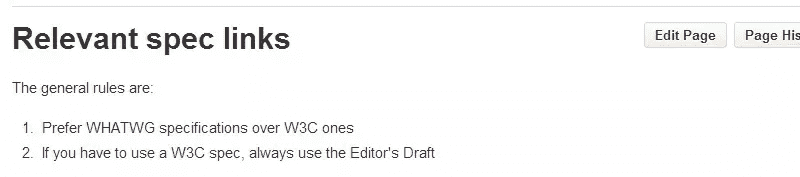](https://github.com/mozilla/servo/wiki/Relevant-spec-links)

## [15 分钟。超 API . com](http://overapi.com/)

疯狂作弊，伙计们。

[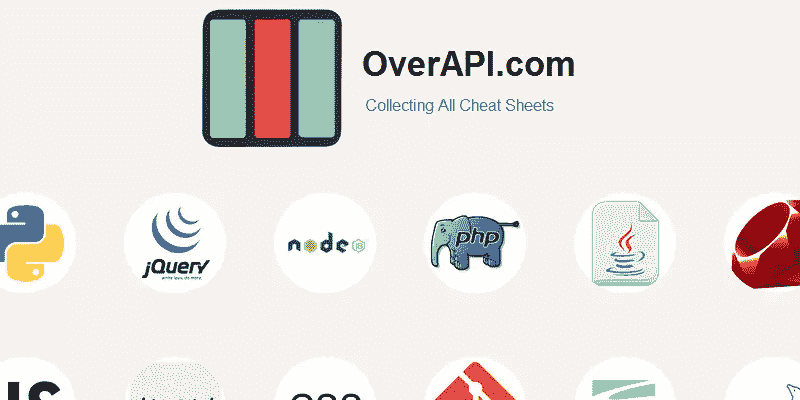](http://overapi.com/)

这好像什么都有了。备忘单将链接到相关的权威资源(MDN、PHP.net 等)。

## 16。JavaScript:正确的方式

JavaScript 指南“旨在向新开发人员介绍 JavaScript 的最佳实践，并帮助有经验的开发人员。”

## [17。HTML5 JavaScript API 索引](http://html5index.org/)

一个真正全面的一站式搜索 HTML5 API 信息的地方。

[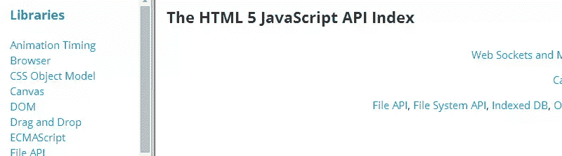](http://html5index.org/)

是“从 HTML 5 规范文档自动生成的”,使用 3 窗格视图很容易导航。

## 18。热情

这看起来很整洁。这是一款原生应用，是 Windows 和 Linux 版的 Dash T1，可以让你离线搜索 130 多个 API 文档。

[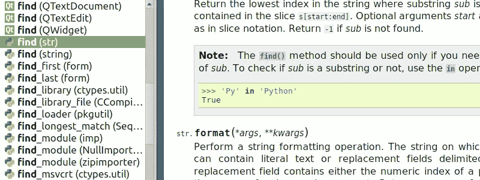](http://zealdocs.org/)

通过简单的键盘快捷键，您可以在工作区的任何位置显示 API 浏览器。

## [19。终极 Flexbox 备忘单](http://www.sketchingwithcss.com/samplechapter/cheatsheet.html)

帮助你找到 flexbox 语法和复习不太熟悉的内容的广泛参考。

来自做了很酷的[交互式 Flexbox 教程](http://www.sketchingwithcss.com/flexbox-tutorial/)的同一个人。

## 20。jsCode

一个帮助你创建你自己的定制 JavaScript 编码指南的应用程序。

您还可以查找其他人创建的自定义指南，并与您的团队或其他协作者共享您的指南。

## 还有其他的吗？

我在这里收录的大部分东西都是不太出名的。如果你已经创造了一些东西或者知道一个文档工具或者一套你想要分享的指南，请在评论中告诉我们。

## 分享这篇文章