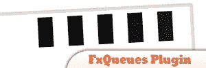
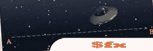
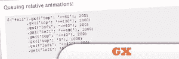
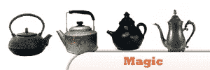
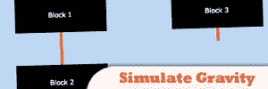
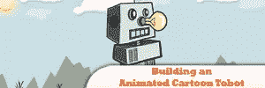
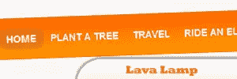
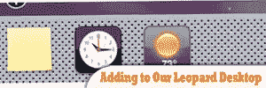
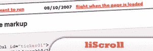

# 20 个类似 Flash 的 jQuery 插件

> 原文：<https://www.sitepoint.com/20-flash-like-jquery-plugins/>

20 Flash-like jQuery Plugins to help you give Flash a horrible death! Impressive flash-like JavaScript Animation Inspirations, tutorials and plugins. jQuery and mootools, a lot other frameworks that designed to enhance the animation abilities have emerged. Now, we can use create impressive javascript animation easily and your visitors just wouldn’t able to tell the differences. I hope you will get something new from this post. Enjoy!

## [1 .jParallax 外挂程式](http://webdev.stephband.info/parallax.html)

jParallax，将选定的元素转换为“窗口”或视口，将其所有子元素转换为可以通过视口看到的绝对定位的层。这些层响应鼠标而移动，并且根据它们的尺寸。

来源

## 2.FxQueues 插件

这个插件是基于约翰不久前辞职的一个脚本。范围的东西，新的例子页和一些单元测试已被添加。需要改进，但这是一个良好的开端。

  

## [3。jsAnim–免费的 JavaScript 动画库](http://www.jsanim.com/)

功能强大，但易于使用的图书馆添加令人印象深刻的动画网站，而不牺牲标准或可访问性。

来源

 

## [4。$fx](http://fx.inetcat.com/)

一个紧凑、轻量级的动画 Javascript 库。沿时间线调整 CSS 属性。平行效果集和效果链。用于调整行为的扩展回调集。

来源

 

## [5。GX](http://gx.riccardodegni.net/)

全功能、跨浏览器、超小型(10kb 未压缩)Javascript 动画框架。使用 GX，你可以创建与每个 w3c CSS 属性一起工作的复杂动画。

来源

 

## [6。微光](http://visitmix.com/writings/glimmer-a-jquery-interactive-design-tool)

jQuery 对动画的支持是惊人的。Glimmer 使创建基于标准的自定义动画变得容易，这些动画可以直接与现有的 HTML 和 CSS 一起工作。

来源

 

## [7。魔法](http://miso.blog.matfyz.sk/p355-magic-a-simple-javascript-animation-framework)

一个简单的 JavaScript 框架。

来源

 

## [8。用 jQuery](http://blog.themeforest.net/tutorials/simulate-gravity-with-jquery/) 模拟重力

得益于 jQuery 这样的框架，网页上的视觉效果变得越来越有效。能够通过点击或按钮来调整页面外观的想法给了用户一点额外的互动。

来源

 

## [9。制作卡通机器人](http://css-tricks.com/jquery-robot/)

像瓶子里的微型船一样有用。然而，它确实有一个潜在的目的。它可以激励人们超越网页设计者和开发者的限制。

来源

 

## 10。jQuery 动画的华丽介绍

以前，几乎每个网站都有一个 Flash 介绍或标题，让你永远等下去。现在越来越多的人使用 jQuery 的动画功能来使他们的网站变得有趣。

来源

 

## [11。如何用 jQuery](http://buildinternet.com/2009/02/how-to-make-an-impressive-animated-landscape-header-with-jquery/) 制作令人印象深刻的动画风景标题

在本教程中，我们将从一个卡通主题的标题开始，为内容构建两个不同的状态，并使用 jQuery 制作它们之间的过渡动画。

来源

 

## [12。带有 jQuery & CSS](http://tutorialzine.com/2009/12/animated-share-buttons-jquery-css/) 的动画分享栏

美联储与旧的份额按钮及其性能和外观？这篇教程是你不想错过的。

来源

 

## 13。面向设计师的 jQuery 教程

包含 10 个可视化教程，面向网页设计者和新手，介绍如何使用 jQuery 应用 Javascript 效果。如果您不了解 jQuery，它是一个“少写多做”的 JavaScript 库。

来源

 

## [14。jQuery 爱好者的 LavaLamp！](http://www.gmarwaha.com/blog/2007/08/23/lavalamp-for-jquery-lovers/)

当谈到 Flash 播放器时，flash 菜单栏吸引你的访问者是不够的。试试这个教程，当你把鼠标移到菜单上时，它会制作一些导航条动画。

来源

 

## 15。jQuery 悬停子标签云

旧的 wordpress 插件显示你的文章标签云，现在很无聊。是时候让你自己做标签云了。试试这个教程。

来源

 

## 16。如何用 jQuery 载入内容并制作动画

在本教程中，你将学习如何制作一个普通的日常网站，并使用 jQuery 对其进行改进。学习如何添加 Ajax 功能，以便将内容加载到相关的容器中，而不是让用户导航到另一个页面。

来源

 

## [17。使用 jQuery](http://net.tutsplus.com/tutorials/javascript-ajax/adding-to-our-leopard-desktop-with-jquery/) 添加到我们的 Leopard 桌面

了解 Leopard Desktop，而不将其显示在您的网页上。试试这个教程，让你的访问者在访问你的网页时有不同的感受。

来源

 

## 18。liScroll(一个简单的 jQuery 新闻收报机)

看看这个为你的网页制作简单滚动条的简单教程。既然是简单的教程，肯定可以学到 jQuery 的基本东西。

来源

 

## [19。使用 jQuery 的滑动菜单](http://www.ilovecolors.com.ar/sliding-menu-using-jquery/)

厌倦了简单的菜单栏？那你应该看看这个教程。这将帮助您使用我们的 jQuery 创建一个滑动菜单栏。

来源

 

## 20。性感下拉菜单 w/ jQuery & CSS

如果你想让你的访问者对你的网页感兴趣，那就做一些吸引人的东西。制作一个组织有序的导航菜单。

来源

## 分享这篇文章