# 20 个鼓舞人心的登录页面设计

> 原文：<https://www.sitepoint.com/20-inspirational-landing-page-designs/>

所有设计师都知道，有效的登录页面在增加在线交易和转化率方面起着关键作用。但是，尽管正确、有效的登录页面设计的重要性众所周知，但没有一个放之四海而皆准的公式可以保证构建一个成功的登录页面。

有许多不同的方法来构建高性能的登录页面，但它们都有一些共同的基本原则:突出的行动号召，高度集中的服务或产品描述，以及大胆、吸引人的颜色。

设计登陆页面的伟大之处在于有大量的优秀设计值得仔细研究。如果你正在为自己或客户设计一个登陆页面，并且碰巧缺乏灵感，看看这 20 个有灵感的登陆页面设计，让你自己回到头脑风暴中，为你的目的设计一个完美的页面。

**1\. Klout **

**2。奇蹟〔t1〕**

[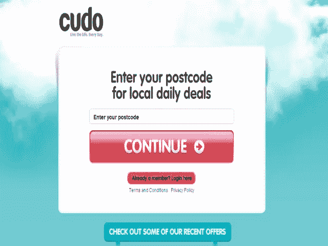](http://cudo.com.au/)

**3。邮件黑猩猩**

**4。Screenr**

[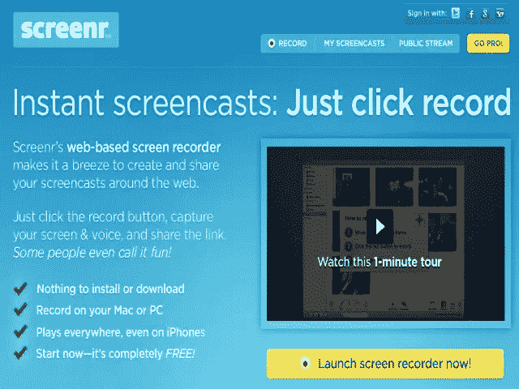](http://www.screenr.com/)

**5。磁力**

[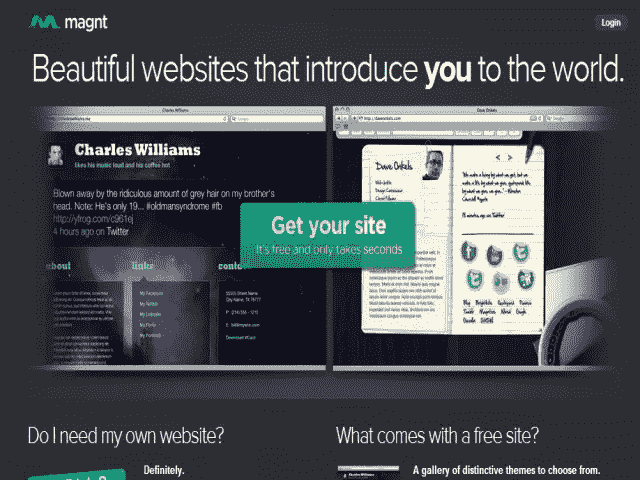](http://magnt.com/)

**6。五福**

[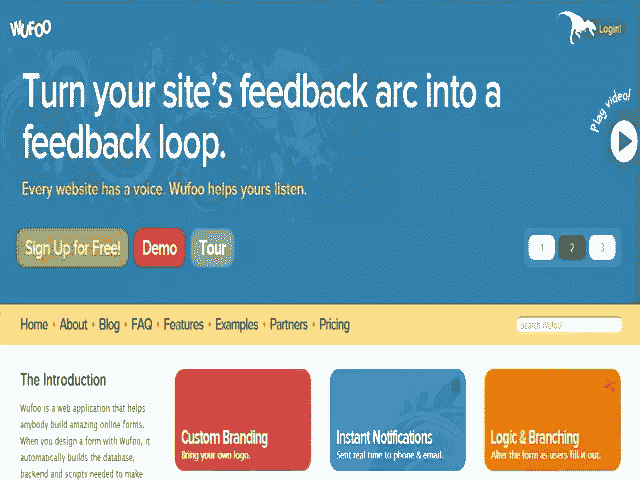](http://wufoo.com/)

**7。歌剧**

[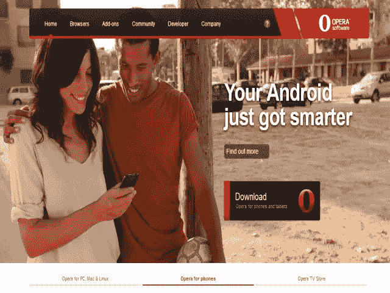](http://www.opera.com/)

**8\. TapTapTap**

[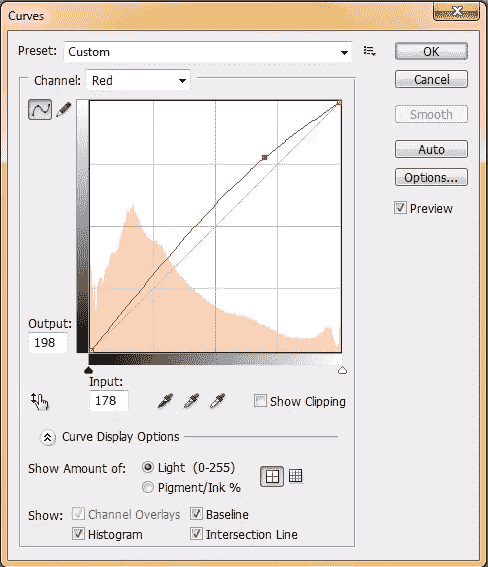](http://www.taptaptap.com/#)

**9。绿灯**

[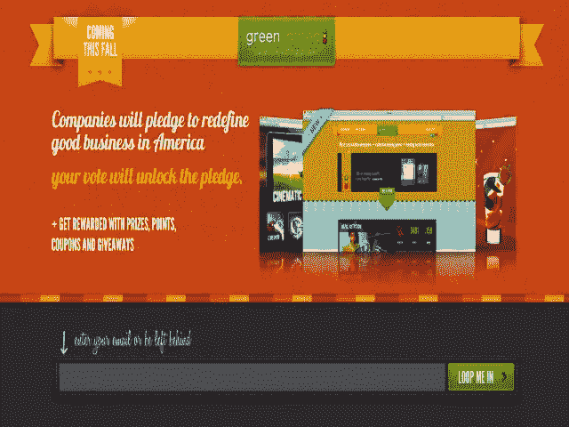](http://launch.greenlighted.com/)

10。设计助推

[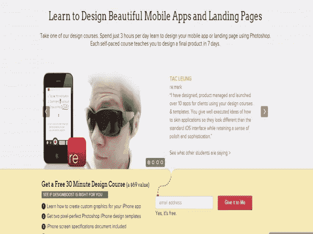](http://www.designboost.net/)

**11。茶圆**

[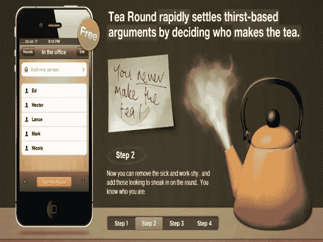](http://www.tearoundapp.com/)

**12。旅行行话**

[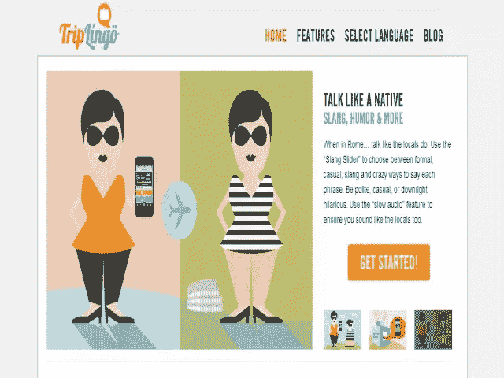](http://www.triplingo.com/)

13。Dribbblr

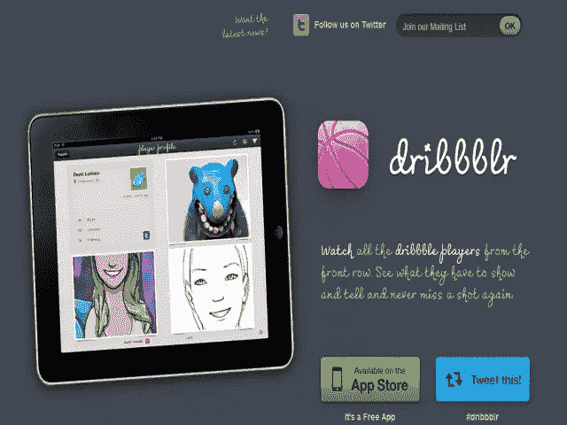

**14。我买**好吗

[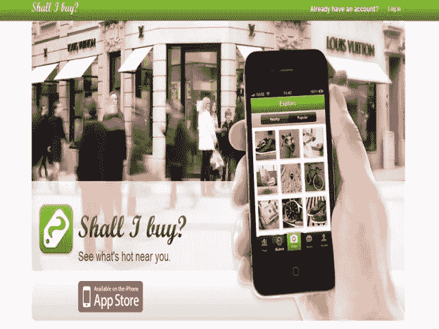](http://shallibuy.it/)

15。天气方面

[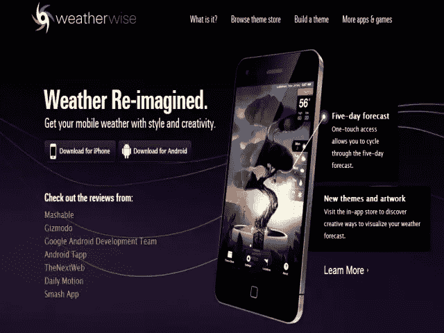](http://weatherwiseapp.com/)

16。正方形

[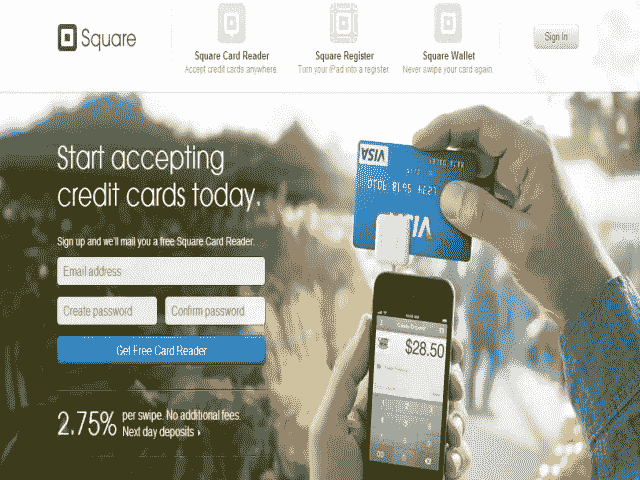](https://squareup.com/)

**17。选择者**

[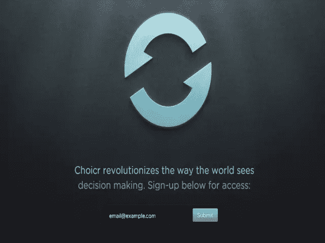](http://choicr.com/)

**18 号。管虫〔t1〕**

**19。数字心灵感应**

**[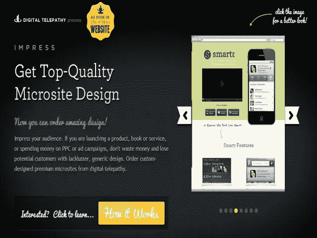](http://impress.dtelepathy.com/)**

 **20。幻灯片

[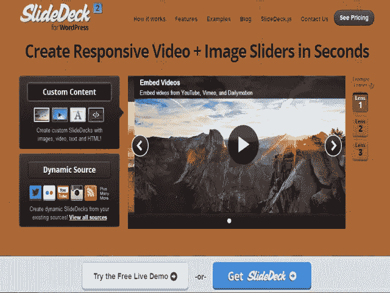](http://www.slidedeck.com/)

这二十个中哪一个是你最喜欢的？你在网上有其他值得收录的吗？** 

## **分享这篇文章**