# 20 个 jQuery 和 Ajax 插件

> 原文：<https://www.sitepoint.com/20-jquery-ajax-plugins/>

jQuery 库有一整套 AJAX(异步 JavaScript 和 XML)功能。其中的函数和方法允许我们在不刷新浏览器页面的情况下从服务器加载数据。下面是一些教程，会让你知道如何执行它，享受！

**2013 年 2 月 28 日更新:**移除了断开的链接并添加了新图片。

## 1.使用 PHP 和 AJAX 创建一个 Shoutbox

一个基于 PHP 和 AJAX(使用 jQuery)的令人惊叹的动态 shoutbox。
[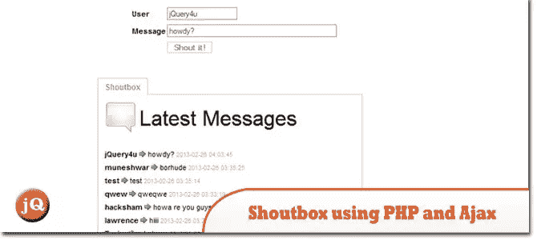](http://yensdesign.com/2009/01/create-a-shoutbox-using-php-and-ajax-jquery/) 
[来源](http://yensdesign.com/2009/01/create-a-shoutbox-using-php-and-ajax-jquery/) [演示](http://www.yensdesign.com/tutorials/shoutbox/)

## 2.使用 jQuery 和 Ajax 在设定的时间间隔刷新元素

您可以在设定的时间间隔内更改一些信息。
[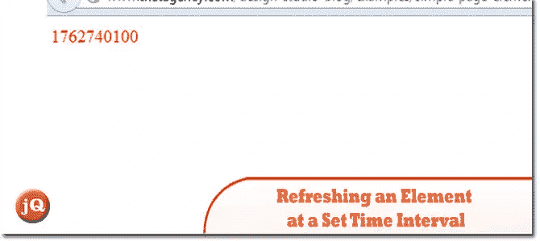](http://www.thatagency.com/design-studio-blog/2009/01/refreshing-an-element-at-a-set-time-interval-using-jquery-and-a-sprinkle-of-ajax/) 
[来源](http://www.thatagency.com/design-studio-blog/2009/01/refreshing-an-element-at-a-set-time-interval-using-jquery-and-a-sprinkle-of-ajax/) [演示](http://www.thatagency.com/design-studio-blog/examples/simple-page-element-refresh/)

## 3.用 jQuery 实现 CakePHP Ajax“快速保存”

当你在一个管理面板中时，有时你想要一个“快速保存”功能，让你不用离开页面就可以保存。下面是如何用 CakePHP 和 jQuery
[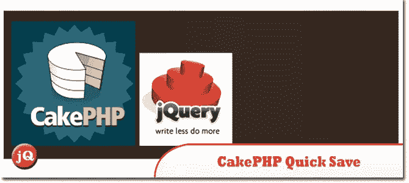](http://marcgrabanski.com/articles/cakephp-ajax-quick-save-jquery)
[Source+Demo](http://marcgrabanski.com/articles/cakephp-ajax-quick-save-jquery)来实现这一点

## 4.使用 Jquery 和 PHP 的 Ajax 登录表单

这将向您展示如何创建一个 ajax 驱动的登录表单。使用 Jquery 和 PHP。
[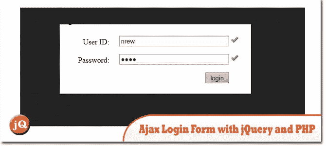](http://kyokasuigetsu25.wordpress.com/2011/07/09/how-to-create-an-ajax-login-form-using-jquery-and-php/) 
[源+演示](http://kyokasuigetsu25.wordpress.com/2011/07/09/how-to-create-an-ajax-login-form-using-jquery-and-php/)

## 5.Twitter 喜欢 jQuery 和 Ajax 的更多按钮

关于如何使用 Jquery 和 AJAX 创建 Twitter Like More button 的有趣教程。
[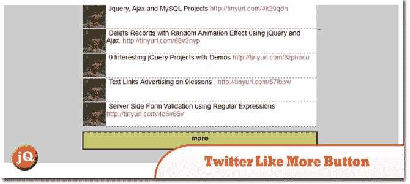](http://www.9lessons.info/2009/04/twitter-like-more-button-with-jquery.html) 
[来源](http://www.9lessons.info/2009/04/twitter-like-more-button-with-jquery.html) [演示](http://demos.9lessons.info/moree.php)

## 6.就像 Twitter 的 jQuery 和 Ajax 的 Follow 和 Remove 按钮一样

Twitter 喜欢使用淡出和淡入效果的跟随和移除按钮。
 
[来源](http://www.9lessons.info/2009/04/exactly-twitter-like-follow-and-remove.html) [演示](http://demos.9lessons.info/followdemo.html)

## 7.用 jQuery 和 Ajax 提交表单而不刷新页面

一个非常简单的教程，使用 jQuery 和 Ajax 提交 HTML 表单值，无需刷新页面。
[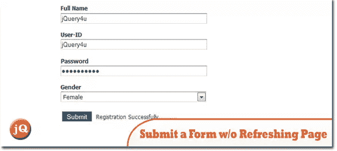](http://www.9lessons.info/2009/04/submit-form-jquery-and-ajax.html) 
[来源](http://www.9lessons.info/2009/04/submit-form-jquery-and-ajax.html) [演示](http://demos.9lessons.info/jqueryform.html)

## 8.使用 jQuery 和 Ajax 删除具有动画淡出效果的记录

jQuery 教程不刷新页面的删除操作。
[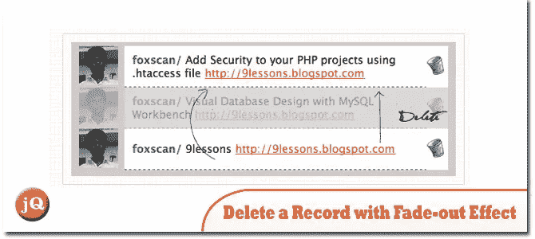](http://www.9lessons.info/2009/01/delete-record-using-ajax-get-method-and.html) 
[来源](http://www.9lessons.info/2009/01/delete-record-using-ajax-get-method-and.html) [演示](http://demos.9lessons.info/deleterecord.html)

## 9.Ajax 使用 jQuery 添加一个按钮状态变化记录

了解如何添加一个按钮状态变化的记录，像脸书和推特..
[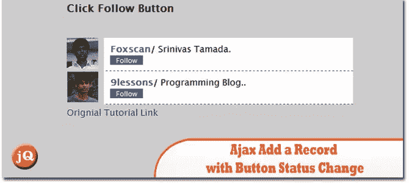](http://www.9lessons.info/2009/03/ajax-add-record-using-jquery.html) 
[来源](http://www.9lessons.info/2009/03/ajax-add-record-using-jquery.html) [演示](http://demos.9lessons.info/jqueryhtml.html)

## 10.使用 jQuery 和 Ajax 插入和加载记录

本教程解释了如何在不刷新网页的情况下插入和显示记录。
[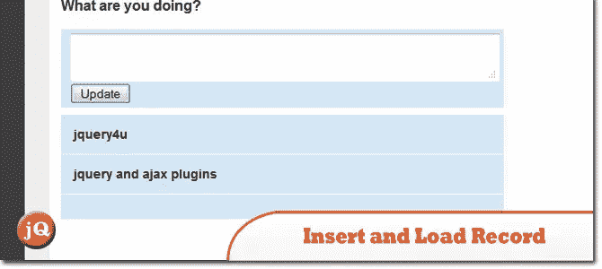](http://www.jsusanto.com/2012/07/07/insert-and-load-record-using-jquery-and-ajax/) 
[源+演示](http://www.jsusanto.com/2012/07/07/insert-and-load-record-using-jquery-and-ajax/)

## 11.使用 jQuery 和 Ajax 自动填充选择框

如果您熟悉使用选择框进行分类和子分类，比如 ebay 在销售商品时，通常需要大量 JavaScript 来维护选择框，但是 jQuery 可以通过添加少量 AJAX 来极大地简化这项任务。
[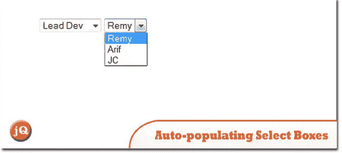](http://remysharp.com/2007/01/20/auto-populating-select-boxes-using-jquery-ajax/) 
[来源](http://remysharp.com/2007/01/20/auto-populating-select-boxes-using-jquery-ajax/) [演示](http://remysharp.com/wp-content/uploads/2007/01/select.html)

## 12.使用 jQuery 的 Ajax 多文件上传表单

学习如何创建一个 Ajax 化的多文件上传表单，它使用了很少的服务器端代码，并且提供了一个非常好的用户界面。
[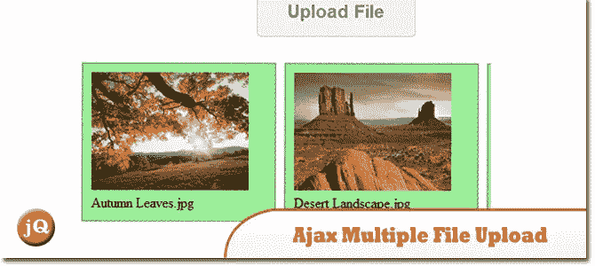](http://webdeveloperplus.com/jquery/ajax-multiple-file-upload-form-using-jquery/) 
[源+演示](http://webdeveloperplus.com/jquery/ajax-multiple-file-upload-form-using-jquery/)

## 13.AjaxFileUpload

这个插件是由 yvind Saltvik 创建的 Ajaxupload 插件的黑客版本，对于正常使用来说已经足够好了。它的想法是创建一个 iframe 并将指定的表单提交给它进行进一步的处理。
[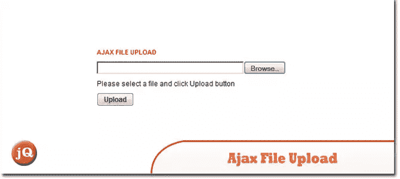](http://www.phpletter.com/Our-Projects/AjaxFileUpload/) 
[来源](http://www.phpletter.com/Our-Projects/AjaxFileUpload/) [演示](http://www.phpletter.com/Demo/AjaxFileUpload-Demo/)

## 14.将 jQuery 表单验证和 Ajax 提交与 ASP.NET 结合起来

在本教程中，将向您展示如何将 jQuery 表单验证和 AJAX 提交与 ASP.NET 结合起来。
[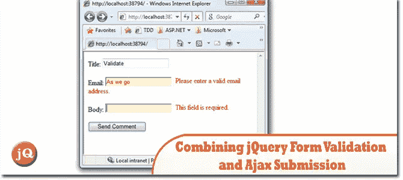](http://haacked.com/archive/2008/11/21/combining-jquery-form-validation-and-ajax-submission-with-asp.net.aspx) 
[源+演示](http://haacked.com/archive/2008/11/21/combining-jquery-form-validation-and-ajax-submission-with-asp.net.aspx)

## 15.PHP 中使用 jQuery 和 Ajax 动态加载 ComboBox

学习创建下拉列表的动态加载。由 jQuery 创建的简单解决方案。
[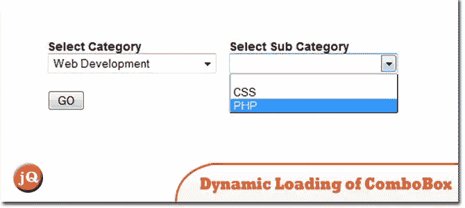](http://www.99points.info/2010/06/ajax-tutorial-dynamic-loading-of-combobox-using-jquery-and-ajax-in-php/) 
[来源](http://www.99points.info/2010/06/ajax-tutorial-dynamic-loading-of-combobox-using-jquery-and-ajax-in-php/) [演示](http://demos.99points.info/dynamic_dropdown/)

## 16.AJAX-缩放

它使用图像拼贴来快速生成缩放图像的一部分(类似于谷歌地图)。
[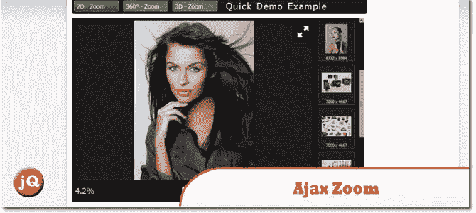](http://www.ajax-zoom.com/) 
[来源+演示](http://www.ajax-zoom.com/)

## 17.AjaxPager

是一个 JQuery + Bootstrap 插件，它根据配置创建一个分页控制栏，可以远程请求数据。
[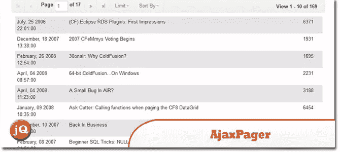](http://examples.cutterscrossing.com/ajaxPager/) 
[来源](http://examples.cutterscrossing.com/ajaxPager/) [演示](http://examples.cutterscrossing.com/ajaxPager/#demo)

## 18.AjaxPanel

一个 jQuery 插件，提供了更新 HTML 元素的统一方式，更新基于 jQuery 的底层 AJAX 实现。
[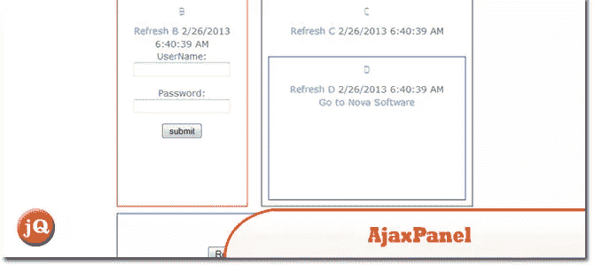](http://www.novasoftware.com/download/jquery/ajaxpanel.aspx) 
[来源](http://www.novasoftware.com/download/jquery/ajaxpanel.aspx) [演示](http://www.novasoftware.com/download/jquery/AjaxPanel-Demo.aspx)

## 分享这篇文章