# 20 个 jQuery 图像增强器

> 原文：<https://www.sitepoint.com/20-jquery-image-enhancers/>

看到一个人可以使用 jQuery 创建什么真的很令人惊讶。开发人员只是不停地开发令人难以置信的交互式 web 应用程序。下面的教程展示了最好的 jQuery 图像增强器插件的优秀例子。边学边享受！

 

## [1。jQuey 滑块(滑块图库)](http://jqueryfordesigners.com/slider-gallery/)

苹果网站上展示产品的类似效果。这个“产品滑动条”类似于一个直接的图库，除了有一个滑动条来导航项目。
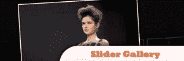
来源

 

## [2。jQuey 滑块(辅助滑块)](http://www.filamentgroup.com/lab/update_jquery_ui_slider_from_a_select_element_now_with_aria_support/)

演示如何使 slider UI 控件对那些没有运行 JavaScript 或 CSS 的人来说是可访问的。
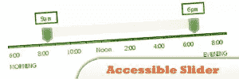
来源

 

## [3。jQuery 操作图像](http://www.bennadel.com/blog/1009-jQuery-Demo-Creating-A-Sliding-Image-Puzzle-Plug-In.htm)

基于包含图像的容器创建滑动图像谜题。
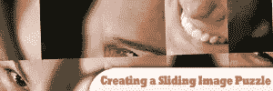
来源

 

## [4。jQuery 特色内容滑动器](http://www.dynamicdrive.com/dynamicindex17/featuredcontentglider.htm)

通过将普通的 HTML 内容变成交互式的“滑进”幻灯片，在您的页面上展示新内容或特色内容。支持两种不同的显示模式-“手动”和“幻灯片”
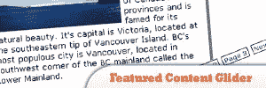
来源

 

## [5。jQuery 简单效果](http://www.learningjquery.com/2008/02/simple-effects-plugins)

漂亮的动画效果，可以很容易地切换，隐藏，显示，淡化，滑动元素。
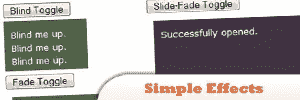
来源

 

## [6。jQuery 滑出和抽屉效果](http://jqueryfordesigners.com/slide-out-and-drawer-effect/)

通常被称为手风琴效果，鼠标停留在“部分”的标题上，相关的链接就会显示出来。
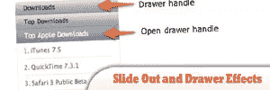
来源

## 7.jQuery 褪色头

一个使用 jQuery 和 CSS 的简单例子，展示了如何创建渐变标题技术。

 

## [8。jQuery 尾波气泡](http://jqueryfordesigners.com/coda-popup-bubbles/)

Coda 网站(http://www.panic.com/coda/)

 

## [9。jQuery 滑块](http://nivo.dev7studios.com/)

具有 9 个独特的过渡效果，简单干净和有效的标记，调整设置负载，内置方向和控制导航，打包版本仅重 7kb，支持链接图像，键盘导航，在麻省理工学院许可下免费使用和滥用。
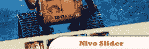
来源

 

## 10。jQueryGlobe

具有光滑的效果，不需要闪光灯，2K 可重复使用的多个容器，通过幻灯片循环项目，可以自定义 HTML/CSS 的风格。

来源

 

## [11。jQuery LightBox 插件 0.5](http://leandrovieira.com/projects/jquery/lightbox/)

它简单、优雅、不引人注目，不需要额外的标记，并通过 jQuery 选择器的强大功能和灵活性用于在当前页面上覆盖图像。

来源

 

## [12。gallerific jQuery Plgin](http://www.twospy.com/galleriffic/#1)

提供丰富的免费回传体验，优化处理大量照片，同时节省带宽。
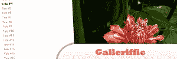
来源

 

## 13。jQuery 图像滚动条

jQuery 出色的动画效果。图像滚动条当然不是什么新鲜事。大多数都是用户发起的。这个滚动条与众不同，因为它是完全自主的，一旦页面加载就会开始滚动。

来源

 

## [14。jQuery 图像旋转器](http://designm.ag/tutorials/image-rotator-css-jquery/)

一个伟大的方式来展示作品，电子商务产品图像，甚至作为一个图像画廊。
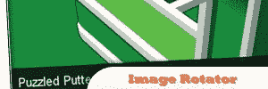
来源

 

## 15。jQuery 圆形图库

另一个你可能想学习的优秀动画效果。自主，将开始滚动页面加载后。
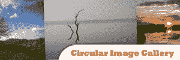
来源

 

## 16。jQuery 图像条

一个图像带配上一点动画会产生一个非常好看的效果。当你想看起来像是在使用 Flash，但实际上并没有使用它时，这些技巧真的很好。
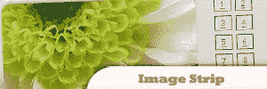
来源

 

## [17。jQuery 成为时髦的照片特效](http://www.befunky.com/)

让日常生活中的人们无需任何技术知识，就能轻松地从他们的数字图像中创造出丰富的艺术效果。
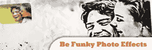
来源

 

## 18。jQuery 图像照片增强器

一个易于使用的数码照片增强软件，可以立即将您的照片转换成丰富，发光，美丽的图像。现在你可以给你所有的照片一个专业的触摸，而不需要花哨，昂贵的工作室设备。

来源

 

## [19。用 jQuery 调整大小的图像网格](http://webdesignledger.com/tutorials/create-a-resizable-image-grid-with-jquery)

现在，你可以简单地拖动滑块来制作平滑缩放的网格，而不需要像 iPhoto 或 Picasa 这样的桌面应用程序。
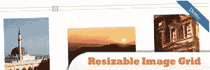
来源

 

## 20。简单的 JQuery 图片幻灯片展示

这里将展示如何使用 jQuery 创建一个带有半透明标题的简单图像幻灯片。最终结果将适合显示新闻标题，或在您的网站主页上显示图像幻灯片。
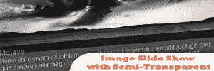
来源

## 分享这篇文章