# 20 个 jQuery 插件来创建动画图像效果

> 原文：<https://www.sitepoint.com/20-jquery-plugins-create-animating-image-effects/>

jQuery 非常强大，随着您对它了解的越来越多，您会对它的能力感到惊讶。今天的帖子收集了 20 个 jQuery 插件，用于在你的网站/博客上创建动画图像效果。他们可以非常有助于吸引新的访问者停留在您的页面上，降低跳出率或只是为了好玩！享受吧。

## 1.光子:JS CSS 3D 照明引擎

Photon 是一个实验性的 JavaScript CSS 3D 光照引擎。
 
[来源](https://github.com/thomasxiii/photon) [演示](http://photon.attasi.com/)

## 2.hover transitions–jQuery 动画悬停效果

允许您为网页元素创建许多过渡动画效果。这些效果是通过将元素分解成更小的盒子，并根据不同的模式和效果对每个盒子的外观进行动画处理来实现的。
[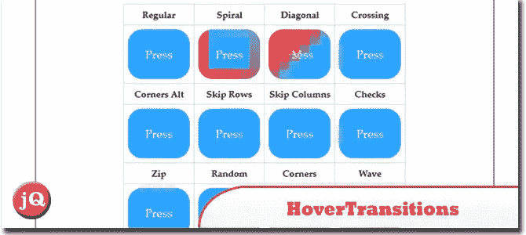](http://codecanyon.net/item/hovertransitions-jquery/2801099) 
[来源](http://codecanyon.net/item/hovertransitions-jquery/2801099) [演示](http://codecanyon.net/item/hovertransitions-jquery/full_screen_preview/2801099)

## 3.forkit.js:一个动画 GitHub 丝带

一个实验性的动画带，揭示了一幕额外的内容。看到右上角了吗！演示的片段。
[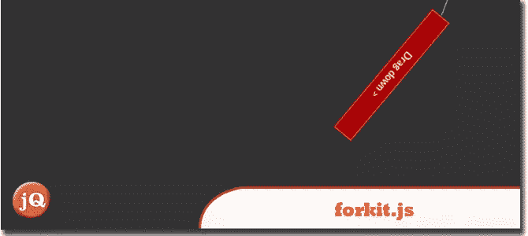](https://github.com/hakimel/forkit.js) 
[来源](https://github.com/hakimel/forkit.js) [演示](http://lab.hakim.se/forkit-js/)

## 4.带有 jQuery 和 CSS3 的漂亮闪亮进度条

带百分比标签的闪亮进度条。条形内的火花是使用线性渐变和径向渐变的组合作为背景创建的，然后使用动画和关键帧属性制作动画。
[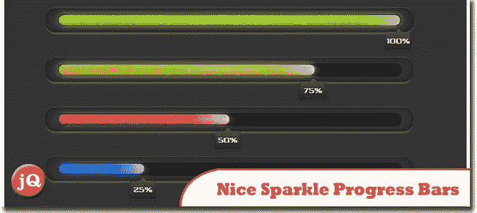](http://cssdeck.com/labs/nice-sparkle-progress-bars) 
[源+演示](http://cssdeck.com/labs/nice-sparkle-progress-bars)

## 5.just gage:SVG & raphal 库中的动画仪表

一个方便的 JavaScript 插件，用于生成漂亮整洁的仪表并制作动画。它基于拉斐尔矢量绘图库，所以它完全独立于分辨率和自我调整。
[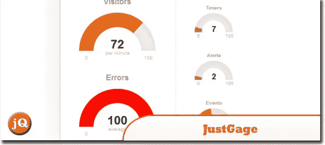](http://www.justgage.com/) 
[源+演示](http://www.justgage.com/)

## 6.:JZoopraxiscope

一个 jQuery 插件，用于从静态图像制作动画，灵感来自埃德沃德·迈布里奇的 Zoopraxiscope。除了 jQuery 之外，它还使用 jQuery UI，并要求将帧作为一个单独的水平图像进行动画处理。
[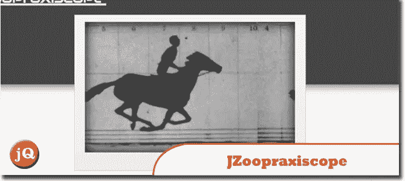](https://github.com/cobalys/JZoopraxiscope) 
[来源](https://github.com/cobalys/JZoopraxiscope) [演示](http://cobalys.github.com/JZoopraxiscope/)

## 7.带 CSS3 和 jQuery 的 Mac OS X 狮子

该部分由一个 CSS3 关键帧动画组成。登录部分主要由一个时钟，两个图像(徽标和头像用户名)，两个背景和一个密码输入框组成。
[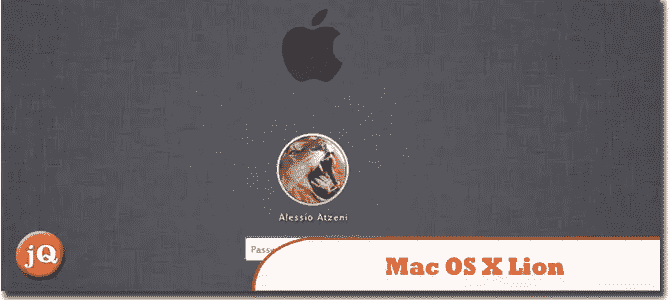](http://www.alessioatzeni.com/blog/mac-os-x-lion-with-css3/) 
[来源](http://www.alessioatzeni.com/blog/mac-os-x-lion-with-css3/) [演示](http://www.alessioatzeni.com/mac-osx-lion-css3/)

## 8.用 jQuery 滑入背景

在本教程中，我会给你一个快速运行如何着手创建这个幻灯片的效果。
[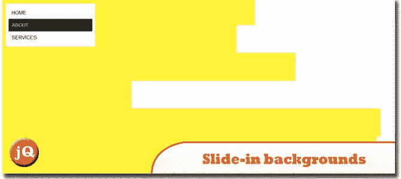](http://www.inserthtml.com/2012/07/slide-backgrounds-jquery/) 
[来源](http://www.inserthtml.com/2012/07/slide-backgrounds-jquery/) [演示](http://www.inserthtml.com/demo/sp-slide-in/)

## 9.用 jQuery 和 CSS3 缩小共享按钮

我开始创造一种吸引注意力的方式来显示按钮，并提出了这个:一个圆圈，在悬停时展开，显示一堆共享按钮。请继续阅读，了解如何做到这一点，并查看演示！
[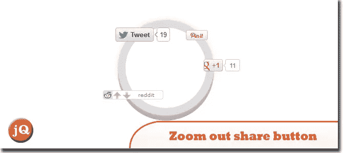](http://www.inserthtml.com/2012/03/zoom-out-share/) 
[来源](http://www.inserthtml.com/2012/03/zoom-out-share/) [演示](http://inserthtml.com/demo/circle-share/)

## 10.jQuery flex

流体不对称动画网格插件。
[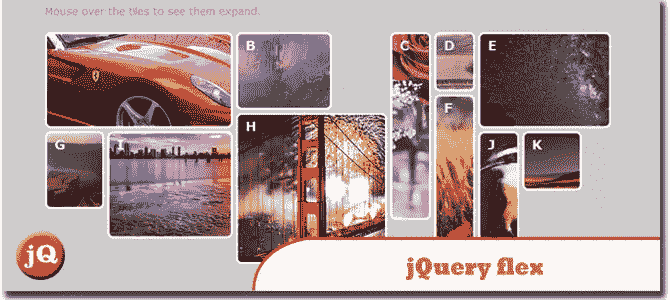](https://github.com/jasonenglish/jquery-flex/#readme) 
[来源](https://github.com/jasonenglish/jquery-flex/#readme) [演示](http://jsonenglish.com/projects/flex/)

## 11.计量器. js

100%原生的和看起来很酷的动画 JavaScript 量表。
[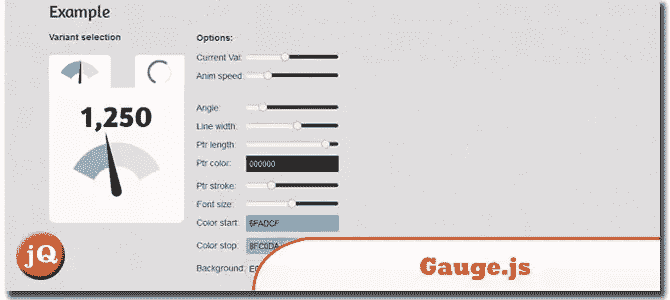](http://bernii.github.com/gauge.js/) 
[源+演示](http://bernii.github.com/gauge.js/)

## 12.使用 jQuery 和 CSS3 旋转特征框

它的全部效果(包括过渡动画)将在新的 WebKit 和 Opera 浏览器以及上面的 Firefox 4 中工作。任何其他浏览器将旋转块，而不显示过渡动画。
[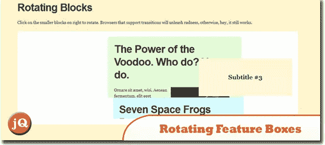](http://css-tricks.com/rotating-feature-boxes/) 
[来源](http://css-tricks.com/rotating-feature-boxes/) [演示](http://css-tricks.com/examples/RotatingBlocks/)

## 13.ThumbFx:响应式 jQuery 缩略图效果

使用 ThumbFx 丰富您的网站体验，ThumbFx 是一个 jQuery 动画插件，可以将您的图像和内容栩栩如生地呈现出来。无需任何 jQuery 知识，轻松创建独特的动画效果。
[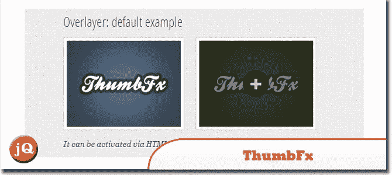](http://codecanyon.net/item/thumbfx-responsive-jquery-thumbnail-effects/2705877) 
[来源](http://codecanyon.net/item/thumbfx-responsive-jquery-thumbnail-effects/2705877) [演示](http://codecanyon.net/item/thumbfx-responsive-jquery-thumbnail-effects/full_screen_preview/2705877)

## 14.拉出:jQuery 滑出式小部件

允许从网页中抓取任何内容，并将其显示为一个可拉出的小部件。无论是一段文字、图片、购物车、登录、搜索或订阅表格、视频或任何其他内容，你都可以把它变成一个抽拉出来的东西。
[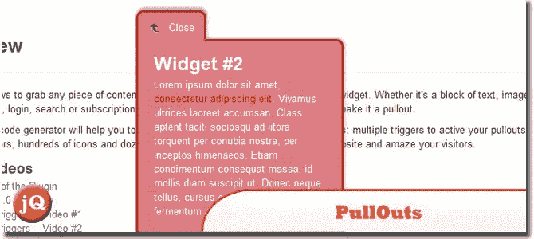](http://codecanyon.net/item/pullouts-jquery-slideout-widgets/2680810) 
[来源](http://codecanyon.net/item/pullouts-jquery-slideout-widgets/2680810) [演示](http://codecanyon.net/item/pullouts-jquery-slideout-widgets/full_screen_preview/2680810)

## 15.彩色动画 jQuery-插件

这个插件还增加了 rgba 颜色，所以现在你可以独立地设置背景和前景文本的透明度。请注意，Internet Explorer 8 和更早版本不支持 rgba 颜色。
[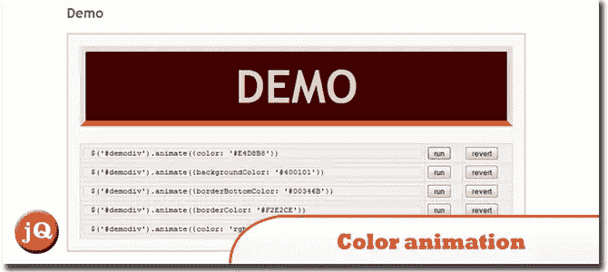](http://www.bitstorm.org/jquery/color-animation/) 
[源+演示](http://www.bitstorm.org/jquery/color-animation/)

## 16.带有 jQuery 的 Mac OS X 仪表板

这是一个具有拖放图标的 Mac OS X 仪表板的例子，带有 jQuery 的 3D 翻转应用程序。变换和过渡用于实现最佳效果。
[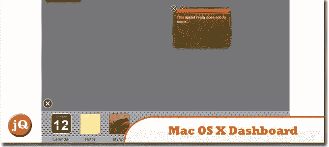](http://www.aplweb.co.uk/blog/js/mac-dashboard/) 
[来源](http://www.aplweb.co.uk/blog/js/mac-dashboard/) [演示](http://www.aplweb.co.uk/blog/js/mac-dashboard/demo.html)

## 17.jQuery 排序和订单组合插件

功能:
>可扩展的过滤和排序按钮。
>自定义 CSS3 驱动动画，优雅退化。
>大约 30 种动画过渡风格，在 easeIn 和 easeOut 上不同。
>可选逆序，可以设置顺序按钮支持与否。
 
[来源](http://codecanyon.net/item/jquery-sort-and-order-portfolio-plugin/2669205) [演示](http://codecanyon.net/item/jquery-sort-and-order-portfolio-plugin/full_screen_preview/2669205)

## 18.带有 CSS3 和 jQuery 的水平条形图

今天，我们将使用 jQuery、CSS3 属性(如:渐变、边框半径、rgba)和 CSS3 过渡创建一个动画水平条形图。
[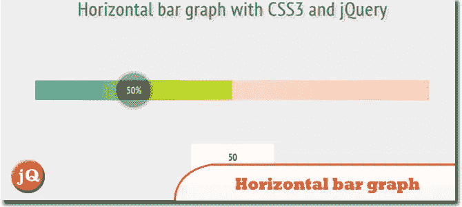](http://www.jscraft.net/experiments/horizontal-bar-graph-with-css3-and-jquery.html) 
[来源](http://www.jscraft.net/experiments/horizontal-bar-graph-with-css3-and-jquery.html) [演示](http://www.jscraft.net/demo/experiment/bargraph/)

## 19.SeuratJS:raphal 插件，用于漂亮的点画动画

一个 JavaScript 库，扩展了 Raphaë，允许使用最少的代码创建生动的动画和像素化的艺术作品。它通过从您选择的图像中提取颜色数据，并用 SVG 中填充的图元重建原始图像来实现这一点。
[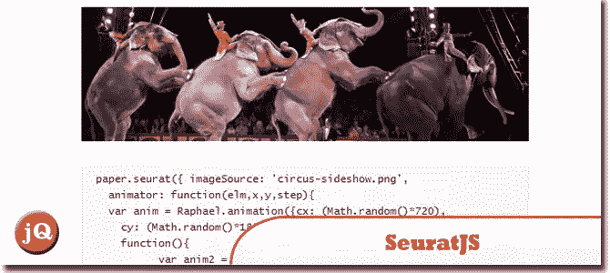](http://seuratjs.com/) 
[源+演示](http://seuratjs.com/)

## 20.JSTween:jQuery 的 JavaScript 动画库

从头开始设计的速度和精度，使它能够处理更多的同步动画，同时保持丝滑流畅的帧速率。JSTween 中的动画是通过触发 play()方法来启动的。
[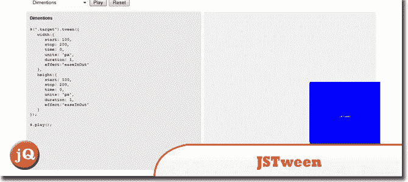](http://www.jstween.org/) 
[源+演示](http://www.jstween.org/)

## 分享这篇文章