# 20 个以动物符号为特色的标志设计

> 原文：<https://www.sitepoint.com/20-logo-designs-featuring-animal-symbols/>

标志设计可以大致分为三类:

1.  仅文本
2.  文本和符号
3.  仅符号

这个帖子是一个小型的标志展示，分为第二类和第三类，有问题的标志是动物。

所以，废话不多说，为了你的观赏乐趣和设计灵感，这里有一些鲜为人知的和一些众所周知的标志设计。

金丝雀

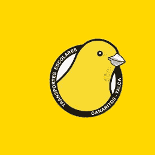

[象皮果](http://www.thisisnido.com/)

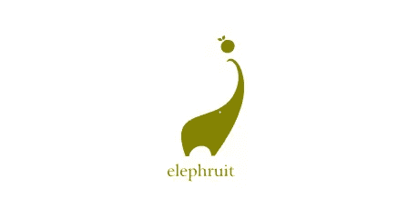

加托·皮坎特的卷毛猫

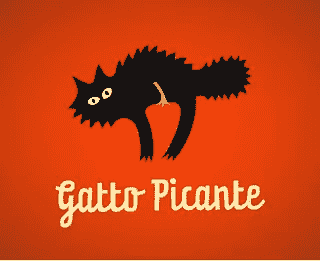

[狼](http://logopond.com/gallery/detail/21646)

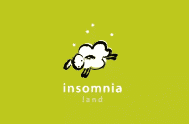

独角兽是一种*种*的动物…

[狂野的塞尔维亚](http://logopond.com/gallery/detail/15402)

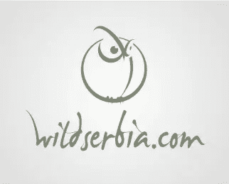

[沙利文会计](http://logopond.com/gallery/detail/75339)

[创意工作室](http://agdesigns.org/)

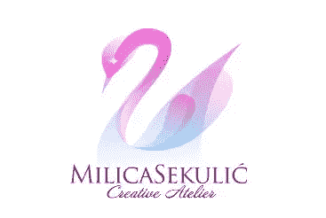

埃尔拉科

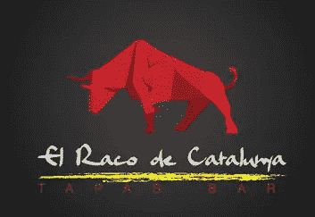

**著名标志**

这里还有一些我们很多人都相当熟悉的动物标识。

美洲狮

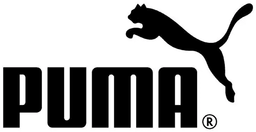

与彪马标志并非完全不同的是，捷豹标志多年来经历了一些微妙的变化。

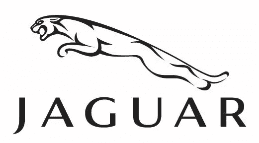

另一家汽车制造商，法拉利著名的跃马。我的下一辆车。

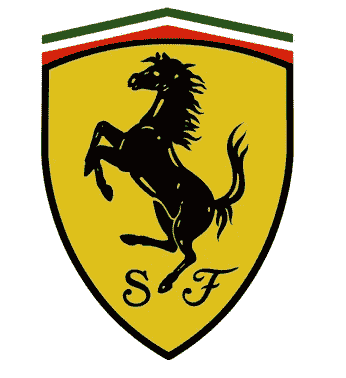

火狐浏览器

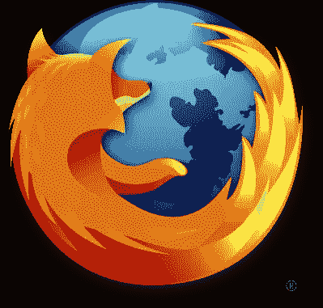

"骑行前先打蜡"用蜡。

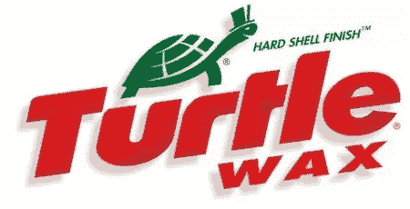

HMV 的标志和今天的小狗尼珀，以及这一切是如何开始的。

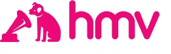 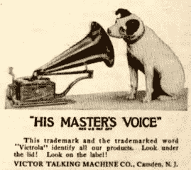

戴着漂亮奶酪耳环的笑牛。

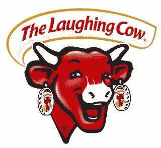

Art Paul 创作的花花公子兔女郎。

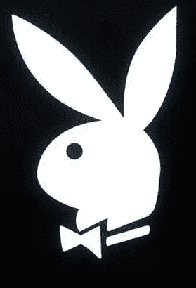

自 1944 年以来，以袋鼠为特色的澳航标志一直以这样或那样的形式存在，2007 年由 [Hulsbosch](https://www.hulsbosch.com.au/) 重新设计。

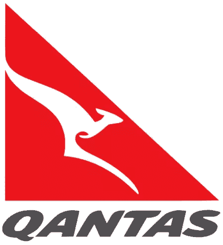

最后是我最喜欢的标志之一，美丽的世界野生动物基金会和大熊猫。

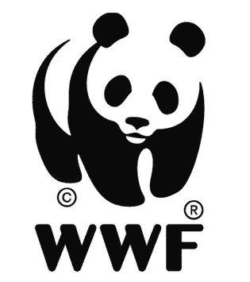

毫无疑问，我错过了许多著名的动物标志，请随意补充。你最近有没有看到什么好看的以动物为特色的新标识？

## 分享这篇文章