# 每个设计师都需要的 20 个精彩的 Photoshop 教程

> 原文：<https://www.sitepoint.com/20-stunning-photoshop-tutorials-every-designer-needs/>

Photoshop 教程到处都是，但是好的 Photoshop 教程可能很难找到。设计师经常很难找到足够的时间来设计他们办公桌上的许多项目，这意味着他们通常没有足够的时间来搜索优秀的教程来提高他们的技能。以下集合的目标是提供 20 个值得你花时间学习的教程的捷径。不过，继续探索，让我知道你喜欢的其他人！

这个综述从美丽有趣的东西开始。然而，如果第一个教程超出了你的理解范围，就跳到第十六个，学习一些基本的照片编辑技术，这应该是任何人的锦囊妙计。

[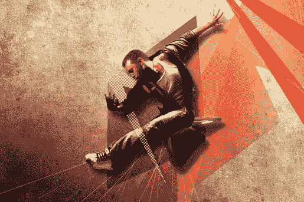](http://www.adobetutorialz.com/articles/30970758/1/how-to-use-texture-effects-to-create-beautiful-compositions-photoshop-cs5)

我对任何我欣赏的图像的第一反应是:“我做不到。”这个教程就是要把这个回答变成“我能”这里展示的一些简单的特效可以让你创造出一些令人惊叹的图片。

[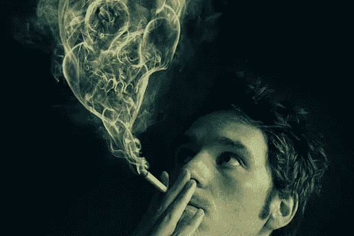](http://psd.tutsplus.com/tutorials/photo-effects-tutorials/manipulate-smoke-to-create-hyper-real-images/)

烟雾中的形象效应是另一个超出我能力范围的效应。这个教程不是为心脏虚弱的人准备的，但是如果效果是你想要的，这是找到它的最好地方。你不仅可以把它应用到吸烟上。

[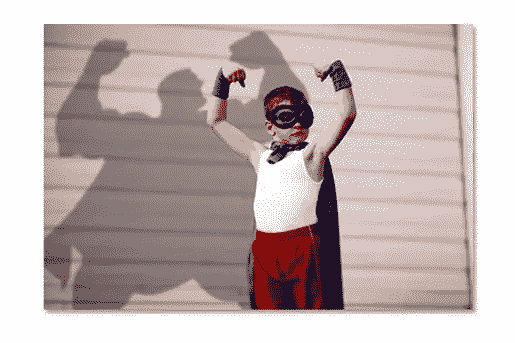](http://www.photoshopessentials.com/photo-effects/story-shadows/)

为什么这么简单的一个效果会被记为第三？因为这让我开心。我想投下这个阴影。很简单，但是很有效。

[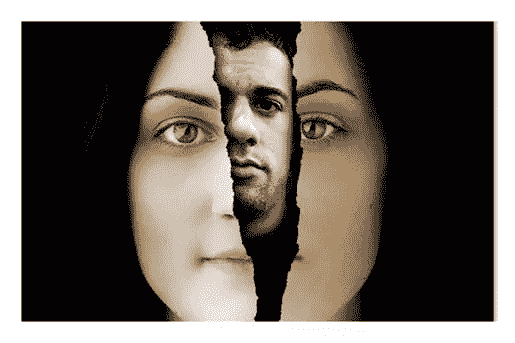](http://www.photoshopessentials.com/photo-effects/tear-photo/page-5.php)

我实话实说。我不太喜欢所用的图片。然而，他们是如何实现撕裂效果的，这是一个很好的技巧。跳到第五页，了解他们的解决方案。

[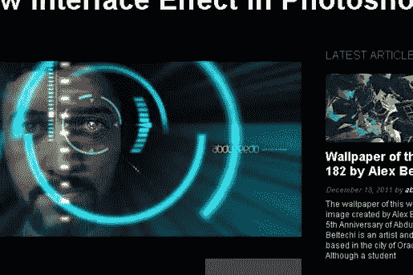](http://abduzeedo.com/ironman-view-interface-effect-photoshop)

简单易行，令人印象深刻。让任何人穿上钢铁侠的衣服。

[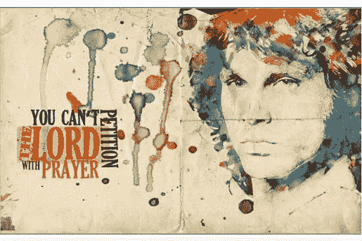](http://10steps.sg/photoshop/creating-an-abstract-watercolor-wallpaper/)

你不需要非常努力就能做出一些令人惊叹的水彩画肖像。抓取一些纹理和最喜欢的图片，并得到合成！

[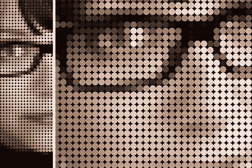](http://www.photoshopessentials.com/photo-effects/color-dots/)

任何人都可以使用 Photoshop 内置的工具将图像像素化。本教程更进一步，让它在需要的时候看起来有意图和尖锐。

[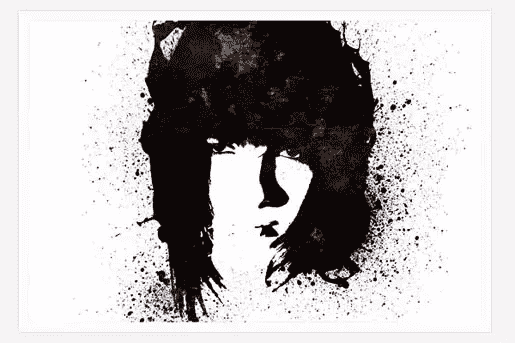](http://wegraphics.net/blog/tutorials/photoshop/how-to-design-a-grunge-styled-portrait-in-photoshop/)

垃圾音乐。这么粗糙的东西怎么会这么好看？

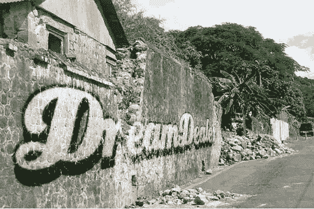

涂鸦是艺术。它通常也是违法的。保持法律的好的一面，用本教程中的几个技巧做出漂亮的东西。

[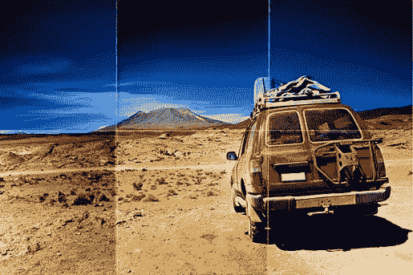](http://www.photoshopessentials.com/photo-effects/folds-creases/)

看到这个效果就喜欢上了。当我看到光是折痕就花了多少功夫，我就知道为什么了。像大多数事情一样，细节让它如此神奇。

[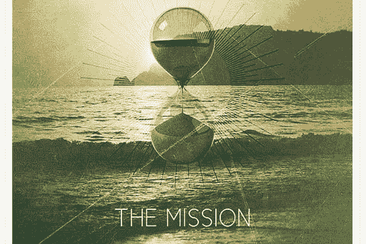](http://wegraphics.net/blog/tutorials/photoshop/design-an-indie-rock-cd-cover-in-photoshop/)

让任何简单的图片更加吸引人:独立版。

[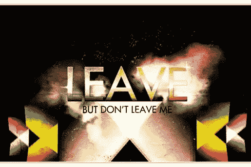](http://www.gomediazine.com/tutorials/80s-style-design-photoshop/)

有成百上千的优秀的文字教程，但并不是所有的都达到了这种细节层次和多层纹理。

[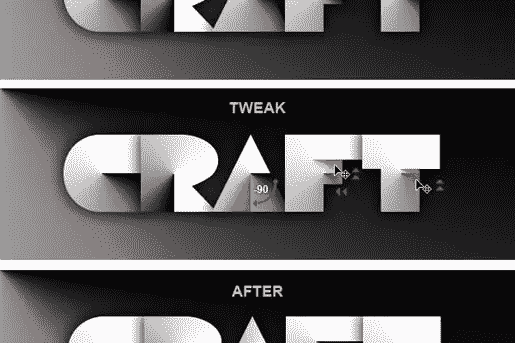](http://www.photoshoproadmap.com/Photoshop-blog/2008/10/31/papercraft-text-effect/)

我是折叠真纸的爱好者。也就是说，这个图像在虚拟世界中做得很好。

[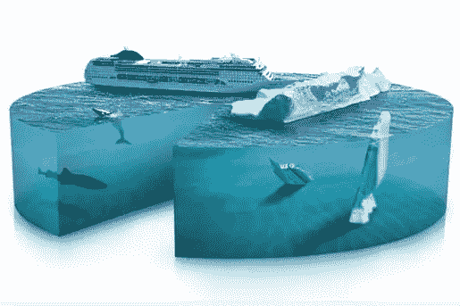](http://photoshoptutorials.ws/photoshop-tutorials/photo-manipulation/piece-of-the-artic-pie-chart-photo-manipulation.html)

这看起来不错。浏览一下教程，你就会明白为什么了。Jayan Saputra 对细节和解释的关注使其成为必备。

[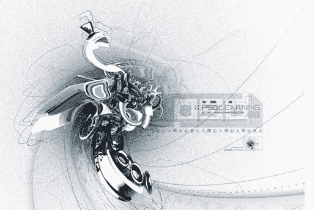](http://psdlearning.com/2008/09/creating-an-abstract-3d-design/)

这个教程看起来令人生畏。实际上很简单:如何从图像中制作线条图形。最后五个不是一种情况。学好它们并经常使用它们。

[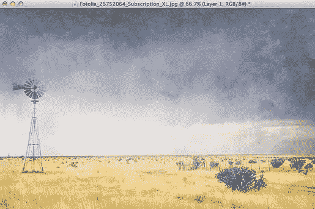](http://www.photoshopessentials.com/photo-effects/blend-textures-with-photos/)

不难学，但是很少有一点点质感都帮不上的形象。

[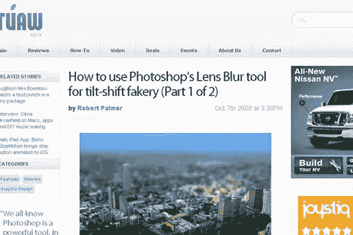](http://www.tuaw.com/2008/10/07/how-to-use-photoshops-lens-blur-tool-for-tilt-shift-fakery-par/)

这很有趣。有无数的倾斜移位编辑教程，这一个是清晰的，写得很好，这是值得的。

[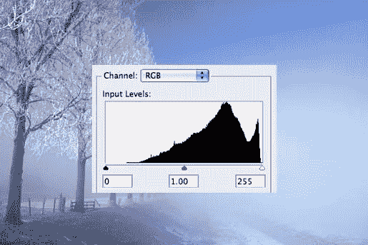](http://www.photoshopessentials.com/photo-editing/histogram/)

这不是教程。那它为什么会在这里？把我们从丢失图像数据的诅咒中拯救出来。

[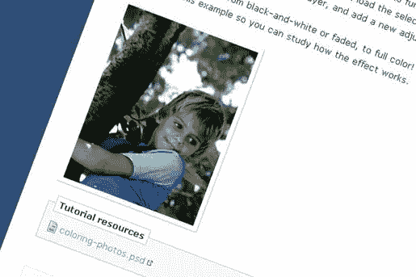](http://www.absolutecross.com/tutorials/photoshop/coloring-photos)

给黑白照片上色既简单又有用。小贴士:保持你的深色皮肤！

[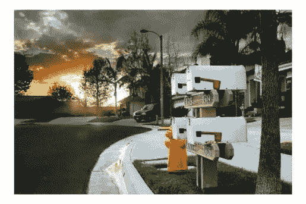](http://photodoto.com/exposure-blending-tutorial/)

我把最好的留到了最后。如果你不知道“高动态范围”是什么意思，那么这是给你的。

## 分享这篇文章