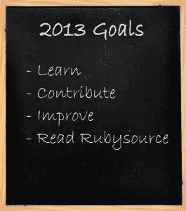

# 2013 年 Rubylutions

> 原文：<https://www.sitepoint.com/2013-rubylutions/>

在 Rubysource，我们喜欢有些及时的文章，所以没有一篇关于 Ruby Resolutions(或者，如果你愿意(我不会)Rubylutions)的文章，我们不可能让新的一年来来去去。我意识到它晚了几个星期，所以第一个解决方案可能是“让你及时的文章更及时。”

去年我做了一篇类似的文章[，但是今年会有所不同。我决定在 Rubysource 对我们的作家群进行投票。我询问了他们所有人的 Ruby 分辨率，正如你可能想象的那样，回答是无数的。](https://www.sitepoint.com/rubylutions-for-2012/)

由于有相当多的回复，我尝试将这些决议分为以下几类:

*   贡献:这个类别是关于在 Ruby 社区中做一些事情。例如写作、教学或参加会议/聚会。
*   **学习**:我们这一行最大的好处就是学习的机会无穷无尽。
*   重建/改进:这个类别处理我们在 Ruby 生活中想要改进的事情。
*   你在书呆子之外的生活很重要。培养它。

好吧，我们走。

## 贡献

回馈 Ruby 社区非常容易。如果你已经决定这样做，这里有一些建议。

### 写宝石

[Thiago Jackiw](https://www.sitepoint.com/author/tjackiw/) 鼓励你今年写一部新的宝石:

> [据 RubyGems](http://www.rubygems.org/stats) 统计，目前有超过***49000 颗宝石*** 可用，至今共下载超过 ***十亿颗宝石*** 。令人印象深刻！
> 作为新年的决心，或者更好的，为了新的一年，为什么不写一颗宝石来回馈社会呢？很多时候——至少对我来说——一个宝石诞生于对现有解决方案的失望，或者当没有解决方案可用时的新想法。无论你的动机是什么，让我们开始新的旅程吧！

Gems 是我们社区的脊梁，写一个 gem 会让你参与进来，强迫你学习。如果你对创建和发布一个宝石不熟悉，Thiago 将在未来几周发表一篇文章解释整个过程。

谁知道呢，你可能会想到下一个`acts_as_state_machine`。

### 发布博客

戴夫·肯尼迪决心写更多，你也可以。无论你是选择创建自己的博客还是加入一群作家(*咳嗽*我们[总是在 Rubysource 寻找新的作家](https://www.sitepoint.com/write-for-us/)，写博客让你真正学到一门学科。也增强了你的沟通能力，开启了一段对话。动手吧。

### 在当地的 Ruby 聚会上发言

几乎到处都有当地的 Ruby 团体。戴夫·肯尼迪和 T2·达伦·琼斯都鼓励你找一个并提出一个话题。你害怕站在人群面前吗？更有理由这么做。如果你没有本地小组，那么就在 Vimeo 上录制一段关于 put in 的演讲。这让我想到…

### 制作截屏

你看电影吗？我知道。他们摇滚，我认为花时间让他们摇滚的人。达伦·琼斯决心今年做几个。我自己也做过一两个，可以告诉你，它们比你想象的难多了。然而，努力是值得的，这是一项很好的技能。

### 教

我的一个决心是尝试把我的一些书呆子知识教给我的孩子和他们的朋友。因此，我将 Arduino 带进我女儿的班级，我们将制作一些东西。希望能传授一些关于电，知识，点燃火花。达伦·琼斯也想教孩子们辛纳屈，我认为这是个好主意。让我们早点开始下一代的书呆子吧！

### 写一本书

Andy Hawthorne 今年想写一本关于铁路的书:

> 我知道这是一个崇高的目标。但是我想写一本书，目标读者是像我这样的非程序员，他们有一些 web 开发经验，并且想进入 Rails。

写一本书是一项艰巨的任务，但它会让你成为这方面公认的专家。它还为社区提供了学习资源，我们不能拥有太多这样的资源。

### 结对程序

乔纳森·杰克逊和 T2 都认为我们应该多结对编程。如果你从来没有配对过，你绝对需要这个技能。你会看到另一个人的工作流程，你会学到一种不同的方法来接近 Ruby，你会从中得到乐趣。结对可能是你升级所能做的最重要的事情。乔纳森说:

> 与一个我从未合作过的人搭档让我想到了一些多年来为我固化的工作流程。我一直在做一些兼职项目，我将开始寻找更多的机会。

这里这里。

### 修复开源项目中的一个问题

我想我每年的一个决心就是更多地进入开源领域。今年， [Rashmi Yadav](https://www.sitepoint.com/author/ryadev) ，决定只修复一个开源项目的一个问题。我喜欢她说话的方式:

> 当你修复任何问题或错误。这让你感到快乐，你会获得自信，你是这个社区的一部分。我会为开源社区做更多的贡献。

Ahmd Refat 将更深入地挖掘 Rails 代码库，以“了解更多关于它是如何工作的，并且如果可能的话，至少在文档中做出贡献。”这两个建议都有简单的行动，让贡献听起来很容易(事实就是如此！)从小处着手，突然间你就成了核心贡献者。

## 学问

还有一些时候，你需要为自己学习一些东西。
[Thiago Jackiw](https://www.sitepoint.com/author/tjackiw/) 鼓励你在今年学习新的东西:

> 知识就是力量，我们学到的东西会伴随我们直到最后。让我们在 2013 年学习一些新的东西，可以是新的编程语言，新的口语，新的爱好，或者任何你感兴趣的东西。重要的是“保持饥饿”——***永远不满足，永远推自己。***
> 今年你打算重点学习什么？以下是我们的作者正在解决的问题:

### 学习一门新语言

这几乎总是一个好主意。戴夫·肯尼迪将专注于学习围棋，而[达伦·琼斯](https://www.sitepoint.com/author/djones)和我已经开始关注 Rust。老实说，我的动机是，我只是偶然发现了史蒂夫·克拉布尼克的伟大网站，并被吸引住了。今年我还想专注于函数式编程，我已经开始关注第八光博客上的[鲍勃大叔的 FP 基础系列](http://blog.8thlight.com/tags/functional-programming.html)。

如果你对学习一门新的编程语言感兴趣，Thiago 将会发表两篇文章，从 Rubyist 的角度探索两种不同的语言:go 和 Rust。

### 观看截屏

达伦·琼斯(他很有决心)要去看无与伦比的狂热格林的 [RubyTapas](http://devblog.avdi.org/rubytapas/) 。还有[销毁所有软件](https://www.destroyallsoftware.com/screencasts)，希望观看。其中一个新的截屏是 [MetaCasts.tv](http://metacasts.tv/) ，它得到了很好的评论。

以上都是付费系列，但也有很多免费的截屏。去 [Confreaks](http://www.confreaks.com/) 或者，当然，去 [RailsCasts](http://railscasts.com) 。相信我，关于 Ruby 录制的东西比你一年看的还多。

### 看书。或者 4。

Rashmi Yadav 今年将会阅读四本 Ruby 书籍:

1.  实用的面向对象设计
2.  [元编程](http://www.amazon.com/Metaprogramming-Ruby-Program-Like-Pros/dp/1934356476)
3.  thoughtbot 的 Ruby Science
4.  [显微镜下的红宝石](http://patshaughnessy.net/ruby-under-a-microscope)作者[帕特·沙乌格内西](https://www.sitepoint.com/author/pshaughnessy)

当然，我们鼓励你看看我们的 [Jump Start 系列](https://www.sitepoint.com/premium/library)，包括我们自己的[达伦·琼斯](https://www.sitepoint.com/author/djones)即将发布的 Jump Start Sinatra。

### 去 Ruby 外面

当然，Ruby 很棒，有很多东西要学，但是在这片快乐的土地之外还有很多东西。今年，我们的一些旅行者会对这里感到好奇。

[达伦·琼斯](https://www.sitepoint.com/author/djones)将提高他的“前端”技能:

> 学习响应式设计并使用 Sass 构建某种引导程序/框架，学习如何使用 JQuery mobile 并使用 Backbone 加快速度

虽然这可以放在“学习一门新语言”的标题下，但是对于我们大多数人来说，javascript 可能不是一门新语言。这里的想法是深入研究，成为你已经知道的语言的专家。

### 待在 Ruby 里面

Andy Hawthorne 为这个问题带来了一个非常有趣的视角，我想:学习 Ruby。

> 这听起来有点疯狂，因为如果我们为 Ruby Source 写文章，你会认为我们已经了解 Ruby 了！事实是，我(像我怀疑的许多人一样)是通过 Rails 和 Sinatra 来到 Ruby 的。我想对 Ruby 本身更有信心。

## 重建/改善

我们都有令人尴尬的代码。它是在我们编程进化的历史上很久以前写的，它是脆弱的、耦合的、僵硬的、乏味的。该代码与您现在编写的代码之间的改进是显而易见的。然而，即使你现在变得更好，你也必须不断进步。以下是一些方法:

### 重建你的网站

多年来，我为我们在 ASP.NET 的家人做了一个网站。这是定制的，有一个管理区，很糟糕。它死了，我转到了一个 Rails 站点，这个站点也是定制的，很糟糕。今年，我要搬到哲基尔，而且(希望)不会太糟糕。达伦·琼斯也计划在云端努力重建他的[卡片。](http://cardsinthecloud.com/)

关键是，重建一些东西是一种变得更好和挠痒痒的简单方法。哦，这永远不够好…:)

### 测试模式

[Dhaviat Pandya](https://www.sitepoint.com/author/dpandya) 决定“进行更多的功能测试”Dhaviat 最近正在开发一个没有功能测试的复杂应用程序。至少可以说，这证明是令人沮丧的。

> 因此，为了修复一个 bug，我只是继续前进，改变了一些控制器渲染代码，然后嘣！一切都开始分崩离析，而且，由于我错过了编写应用程序流程的功能测试，我花了大量的时间来找出我到底哪里出错了。

测试是拯救未来自我的简单方法，下定决心去做吧。

### 保留一份学习清单

帕特·沙乌格内西希望以自己的方式提高自己。他决心:

> 有条理地记录我所学的东西，并把它付诸实践。我每天在阅读各种书籍时都会遇到有趣、伟大、聪明、创新的想法。但是通常发生的情况是，我不把它们写在任何地方，它们最终会左耳进右耳出…或者它们会从我的 Twitter/RSS 时间轴上掉下来。2013 年，我希望将我每周遇到的想法或技术列成一个清单，然后每个月花一天或至少几个小时，尝试其中一项。有点像“学习清单”

我喜欢那个。

## 其余的

除非你从编程的椅子上站起来，走出去，否则你这一年不会成功。

### 改掉坏习惯

戴夫·肯尼迪打算戒烟。

### 开始一个好习惯

戴夫还打算多读书，重点学习更多商业知识，磨练自己的“软技能”

### 祝你好运，让你不舒服

乔纳森·杰克逊建议你通过学习和尝试新事物来“变得不自在”。无论是新的红宝石还是新的编程技术，或者不要在你的薯条上加盐，做一些事情来测试你自己的界限。

2013 年对 Ruby 来说将是重要的一年。我决心享受它。

## 分享这篇文章