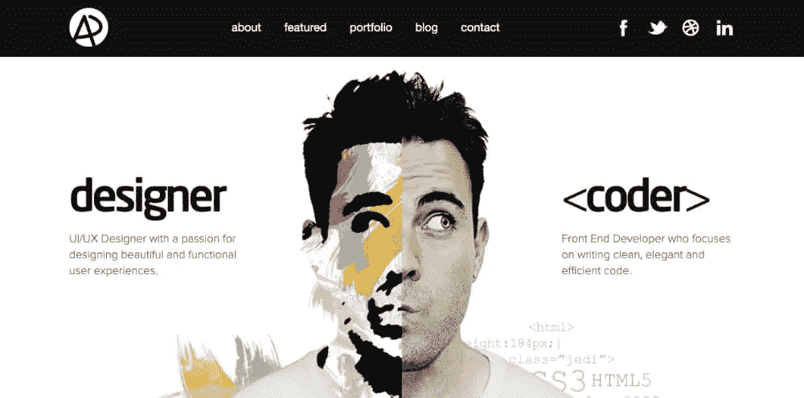

# 成为成功的网站开发者的 21 个步骤

> 原文：<https://www.sitepoint.com/21-steps-to-becoming-a-successful-web-developer/>

随着 web 开发行业的蓬勃发展，许多人都在问这个问题:我如何成为一名 web 开发人员？我认为这个问题问得不对。应该是:我如何成为一名*成功的*网站开发者？

这是一个很重要的问题，因为世界上有这么多人是 web 开发人员，但是他们中有多少人是成功的呢？

我这篇文章的目标是让你具备从人群中脱颖而出的心态、知识和技能，并在你的 web 开发生涯中取得成功——无论是在公司还是为自己从事自由职业。

这篇文章是为有抱负的 web 开发人员和正在努力突破“平庸之境”的 web 开发人员准备的。

这 21 个步骤将帮助你在网络开发和其他领域取得成功。

## 1.这是你真正热爱的事情吗？

“激情”是一个如此常用的词，以至于它的实际意思被扭曲了。它实际上意味着“一种强烈的、几乎无法控制的情绪。”

激情不是被动的:它是一种行动的追求。大多数人讨厌他们朝九晚五的工作，但很少有人做他们热爱并充满激情的工作。

问自己这三个问题很重要:

1.  创建网站和网络应用的想法让我兴奋吗？
2.  对我来说，这是一个令人兴奋的职业吗？
3.  成为一名 web 开发人员符合我自己(和我的家人)想要的生活方式吗？

如果你对以上问题的回答是肯定的，那么你就走上了成为一名网站开发者的正确道路。

## 2.你的“为什么”是什么

这是问自己的最重要的问题之一。你为什么想成为一名(成功的)网站开发者？

*   做出改变，改变他人的生活？
*   给别人建项目？
*   来构建自己的项目？
*   赚取丰厚的收入？

我的一个“为什么”是授权和装备他人，让他们在整体生活中做出积极的改变，这样他们就可以为他人做同样的事情。

当你累了、心烦意乱、心烦意乱或没有动力时，如果你真的想完成它，你的“为什么”会让你行动起来。

## 3.你对什么感兴趣？

你更喜欢逻辑和解决问题还是设计和视觉？

如果你喜欢逻辑和解决问题，你会喜欢后端 web 开发。

如果你喜欢设计和视觉，你会喜欢前端 web 开发。

后端编程是你在网站上看不到的一切。想象一下，在世界某个地方有一个服务器(一个大硬盘，里面有网站的所有信息),处理所有的网站数据，然后发送到浏览器。

前端编程就是你在一个网站上可以看到、点击、互动的一切。

也许你更喜欢[两个](https://www.sitepoint.com/full-stack-developer/)？

## 4.创建一个行动计划

一旦你弄清楚什么是你感兴趣的，什么是你喜欢做的，就该做计划了。

你有多少时间可以学习？你愿意在学习上投资多少？

创建一个适合你的计划。它可能看起来像这样:

> 我每天只有 2 个小时学习。我的预算不到 500 美元，我对前端 web 开发感兴趣。

在对学习内容和学习地点做了一些研究之后，大纲应该是这样的:

*   第一个月:学习 HTML 和 CSS
*   第 2 个月:学习引导和设计基础
*   第三个月:使用 HTML、CSS 和 Bootstrap 创建网站
*   第四个月:学习 JavaScript
*   第 5 个月:学习更高级的 JavaScript
*   第 6 个月:使用 HTML、CSS 和 JavaScript 创建网站
*   第 7 个月:专注于创建个人投资组合网站和建立个人品牌
*   第八个月:接触企业和组织，为他们创建网站(免费获取经验)
*   第 9 个月:集中精力提高知识，看看你需要做什么
*   第 10 个月:必须有至少五个投资组合的客户网站
*   第 11 个月:学习自由职业基础和商业要点
*   第 12 个月:接触潜在客户，推广你的工作，获得付费客户或申请工作。

*请注意，这只是用于说明目的的一般指南，而不是最终的行动计划。*

## 5.行动

如果你想做一些伟大的事情，它伴随着妥协和牺牲。

如果你想成为一名成功的网络开发人员或自由职业者，并且你在抱怨你没有时间，那么看看你每天/每周/每月的例行工作，看看你可以去掉什么来腾出更多的时间，这样你就可以学习更多，发展你的技能并应用你所知道的。

我在生活中消除的最大干扰之一就是看电视:我已经“不看电视”2 年多了，感觉棒极了！

我不是唯一一个这么做的奇怪的人。赛斯·戈丁，我们这个时代最伟大的营销者和思想领袖之一，也是不要浪费时间看电视的大力倡导者。

你有多想要你的“为什么”？不要拖延或找借口。*行动*去做吧！

## 6.纪律胜过动力

动力总是好的，但也可能是暂时的。当你不想做任何事情或者当你对继续下去不感兴趣时，纪律会让你行动起来。

## 7.社会化媒体

当务之急是建立你的在线形象，而社交媒体是一个发展的途径。

确保你在 LinkedIn、Twitter、Instagram 和脸书上有个人资料。

## 8.创建作品集网站

你的作品集就是你的在线简历。

我总是说展示你所做的比告诉人们你能做什么更重要。

三个优秀的投资组合示例是:

**[罗比莱昂纳迪](http://www.rleonardi.com/interactive-resume/)**

**[【Adam danaway】](http://www.adhamdannaway.com/)**

**[丹尼斯·钱德勒](http://www.denisechandler.com/)**

看上面这三个网站。他们在某些阶段是初学者，但看看他们今天是如何展示他们的工作和专业知识的。

如果你的投资组合足够好，客户和/或潜在雇主就会来找你。建立一个好的项目/网站列表——即使你不得不免费工作一段时间。

## 9.为开源项目做贡献

为开源项目做贡献表明了很多事情，比如:

*   对你所做的事情充满热情
*   团队建设技能
*   你的技能。

最棒的是，如果你真的做得很好，你可以在社区中得到认可——这也提高了你的整体可信度。

jQuery 的创始人 John Resig 说过一句有趣的话:

> 说到招聘，我会随时选择 GitHub 提交日志，而不是简历。

以下是为开源项目做贡献的五个地方:

1.  [GitHub](https://github.com/open-source) (在 GitHub 上为初学者阅读[这篇文章](https://www.sitepoint.com/screencast-difference-git-github/))
2.  [freeCodeCamp](https://github.com/freeCodeCamp/how-to-contribute-to-open-source)
3.  [自动](https://github.com/Automattic)
4.  [角度](https://angular.io/contribute.html)
5.  [出发](https://golang.org/project/)

## 10.你够固执吗？

为什么固执？

Web 开发人员在开发过程中经常面临挑战。如果你的代码中有一个错误，或者没有按照你的计划进行，不要在找不到解决方案的情况下继续前进，也不要偷工减料。要*固执*想清楚。

尽管你可能要花更长的时间才能弄明白，但你在这方面固执己见所学到的东西会一直伴随着你，因此你在未来的项目中会更有效率和效果。

## 11.聪明工作

> 给我六个小时砍树，我会用前四个小时磨利斧头。

亚伯拉罕·林肯的名言深深影响了我。专注于编码或经营自由职业者业务的技术层面是如此容易，以至于人们常常忽略了更好更快的做事方式。

成功的开发人员聪明地工作，并取得更好的结果。

## 12.这不只是你知道多少的问题

> 我知道的编程语言比你多，所以我会更成功。

关键不在于你**知道多少**，而在于你**用你知道的做什么**。

如果是面试，最了解的人总是会得到工作，对吗？

如果你生活在“现实世界”，我们都知道这与事实相去甚远。保证你得到这份工作(或者得到一个自由客户)的不仅仅是技能，还有许多其他因素。

## 13.增长

任何行业的专家总是在学习提高他们的知识和技能。随着网络的发展，不断学习变得更加重要。

如果你在 20 年前学习了 C++，并且没有跟上新版本的步伐，那么你的知识在今天几乎是不相关的。

无论你的经验水平如何，都要保持相关性，并不断学习。

## 14.经验

你更愿意雇佣谁？

*   一位 35 岁的商业教练，刚刚以优异的成绩完成了他/她的 MBA 课程，或者
*   一个 30 岁的商业教练，高中辍学，没有任何证书，但有经营三家数百万美元企业的经验，并卖掉其中两家获利？

经验胜过理论。不要只是说“我可以构建[在此插入东西]”:这是每个普通 web 开发人员都会做的事情。展示你所做的事情。

## 15.定价

一旦你开始变得更加自信，积累了更多的经验，你就需要为你的服务定价更好。

这可以成就你，也可以毁掉你。你喜欢年薪 5 万美元还是 9 万美元？花 500 美元或 5000 美元创建网站怎么样？

如果我卖给你一瓶酒，我告诉你我有两瓶，一瓶标价 5 美元，另一瓶标价 55 美元，你可能会认为 5 美元的那瓶有问题，不是吗？

同样的定价原则也适用于您的服务。

虽然这主要适用于自由职业者，但这个原则同样适用于协商你的薪水。

## 16.生产力

在 1.5 个小时内保持高度集中，没有分心，远比 4 个小时被信息、YouTube 或有趣的 gif 分心，中间还有一些工作要好得多。

尽可能排除一切干扰，在高度集中的时间框架内保持高效。

看看[番茄工作法](https://www.focusboosterapp.com/the-pomodoro-technique)就知道了。

## 17.技能

将自己局限于仅仅学习“X”编程语言并不是正确的方法。

为了增加你成功的机会，学习其他技能也很重要，比如基本的营销、谈判、沟通和社交技能。

看看最成功的开发人员:他们是全面发展的、有才华的个人，他们不仅仅专注于编码。

## 18.与他人在线互动

加入编码社区、脸书小组、Twitter 聊天和其他平台，不要害怕问(“愚蠢的”)问题。

在 Stack Overflow、Reddit、Quora 和博客上提问和回答问题。

## 19.参加聚会和社交活动

这就是走出去与他人联系的地方。

我是一个非常内向的人。说真的。人们叫我寄居蟹。猜猜我会在团体环境中的什么位置？是的，在角落里…

如果你是一个内向的人(像我一样)，你需要意识到，在某些时候，你需要走出你的舒适区，与他人交往。

使用 [Meetup](https://www.meetup.com/topics/web-development/) 等服务查看您附近的 Meetup。

PS。不要只参加开发者聚会和活动。如果你是自由职业者，也去参加商务活动。毕竟，开发人员雇佣其他开发人员的频率有多高？

## 20.人格分裂

你需要像网站访问者和企业所有者一样思考。

作为网站访问者，你需要思考:在我访问这个网站的每个阶段，我脑子里都在想些什么？我得到我来这里想要的答案了吗？这个网站满足我的需求吗？我信任这家企业吗？等等。

作为网站的“所有者”，你需要思考:我的网站是否回答了我的网站访问者此刻正在思考的问题和疑问？我能做些什么来回答他们的问题？我可以在我的网站上做些什么来说服网站访问者执行我希望他们采取的行动？

## 21.永不放弃

成功的人经常失败，但他们有一个不可否认的特点，那就是他们从不放弃，并找到新的更好的做事方法。

有时候，让你远离成功或失败的唯一因素就是继续下去的意愿。

永远不要放弃你的梦想、抱负和目标。

## 结论

永远不要认为你不能做某事并取得成功。如果你需要一个信任你的人，我需要！

我希望这篇短文对你产生了积极的影响。我很乐意在下面的评论中听到你的意见。

## 分享这篇文章