# 22 个鬼魅的万圣节灵感恐怖设计

> 原文：<https://www.sitepoint.com/22-spooky-halloween-inspired-horror-designs/>

绝大多数设计项目都是为了热情、友好和吸引顾客，这就是为什么一些设计师喜欢工作节奏的急剧变化，以及展示他们典型项目中很少用到的创造力和技能的机会。

这并不是说黑暗、怪异的设计没有吸引力。事实上，它们可能是最吸引人的设计之一，因为它们会引发强烈的、发自内心的恐惧和迷恋。有数以百万计的温暖、友好的设计在争夺注意力，如此之多，以至于它们可以融合在一起，产生麻木的效果，培养观察者的冷漠。但是，一个扭曲的，不祥的设计可以——因为缺乏更好的词——*以这样一种令人愉快的，精致的方式震撼观众。*

今天，我精心挑选了 22 个恐怖设计，让你感到不安、畏缩和畏缩。如果你敢，请继续下面的步骤。

[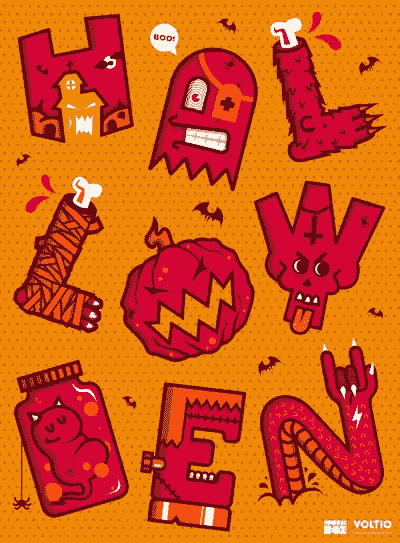](http://society6.com/Voltio/Happy-Halloween-cJf?utm_source=CMblog&utm_medium=link&utm_campaign=HalloweenInspiration)

惊魂夜
[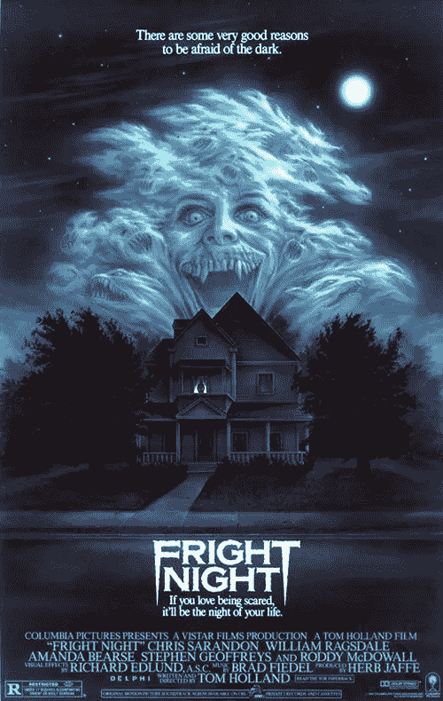](http://www.imdb.com/title/tt0089175/)

Joshua stockner[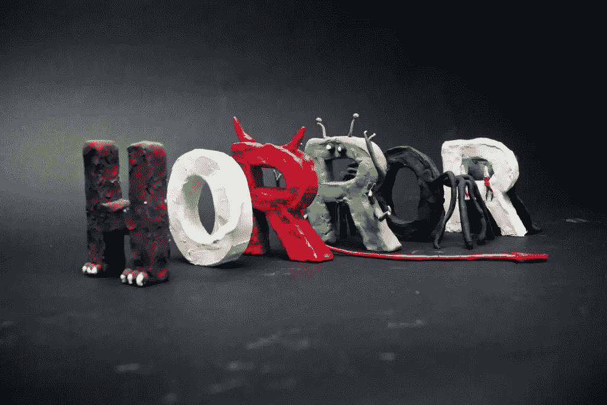](http://gdc1joshuastocker.wordpress.com/tag/typography/http://gdc1joshuastocker.wordpress.com/tag/typography/)

约纳坦加泰罗尼亚语
[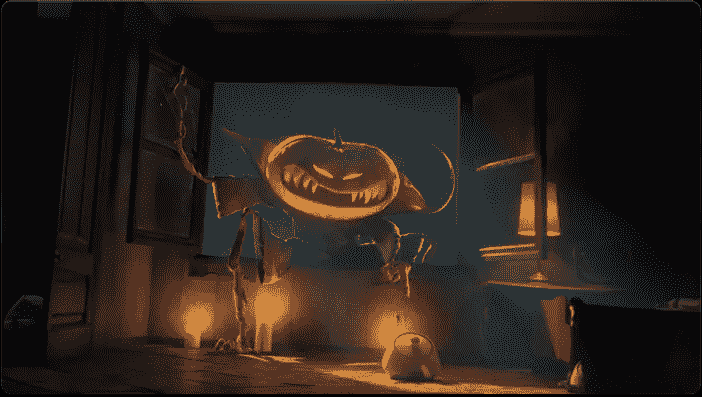](http://www.behance.net/gallery/Halloween/390046)

X-Catman
[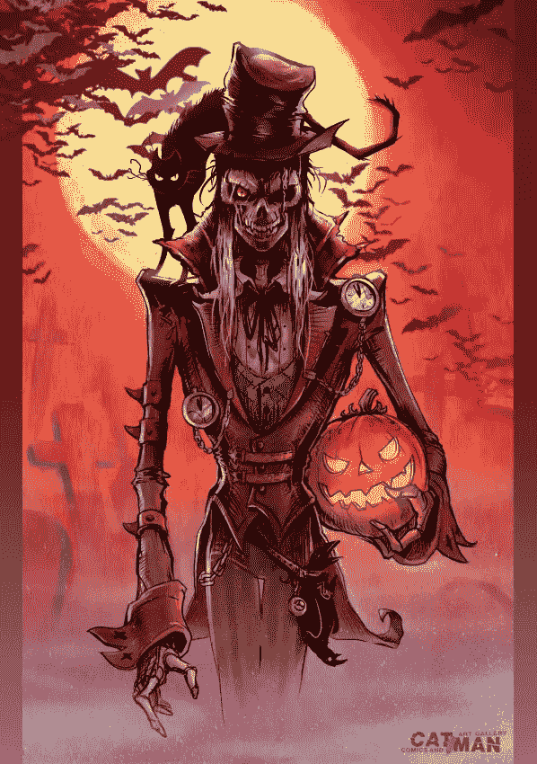](http://x-catman.deviantart.com/art/Halloween-2008-102191531?q=boost%3Apopular%20halloween&qo=21)

安德烈·德·弗雷塔斯
[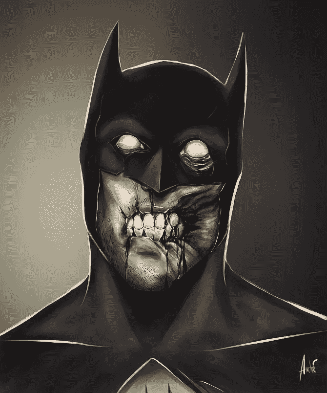](http://andredefreitas.com/Zombie-Portraits)

戴安娜
[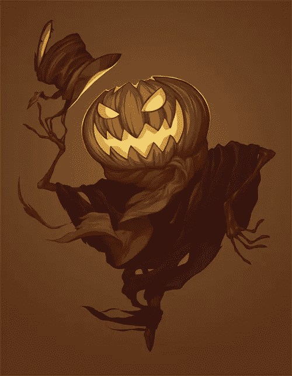](http://www.behance.net/gallery/Halloween-series-of-illustrations/3014573?utm_source=CMblog&utm_medium=link&utm_campaign=HalloweenInspiration)

德州电锯杀人狂

西门断奶

莉安娜·克罗桑
[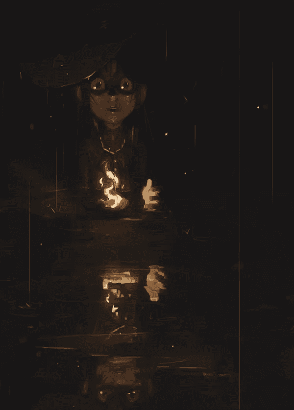](http://www.behance.net/gallery/Happy-Halloween-Tutorial/11194041)

Serhat Ozalp
[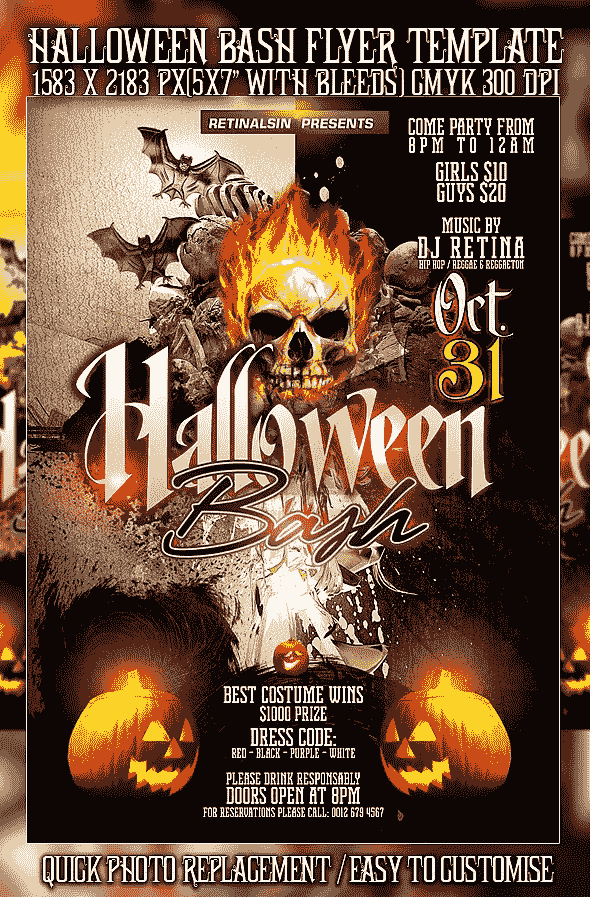](http://www.behance.net/gallery/PSD-Halloween-Bash-Flyer/5503603)

马特·莱恩
[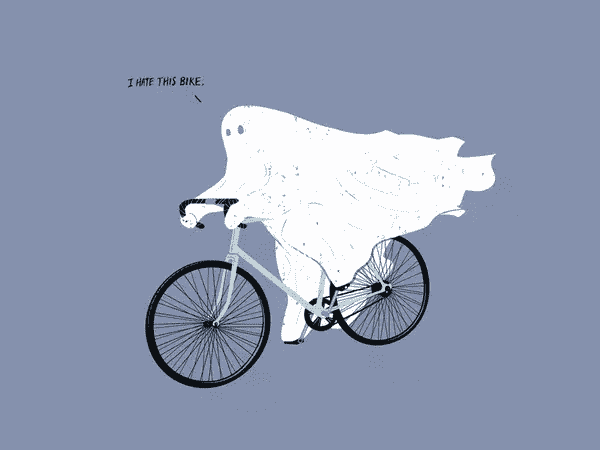](http://society6.com/product/Negative-Ghostrider_Print)

拉多万 [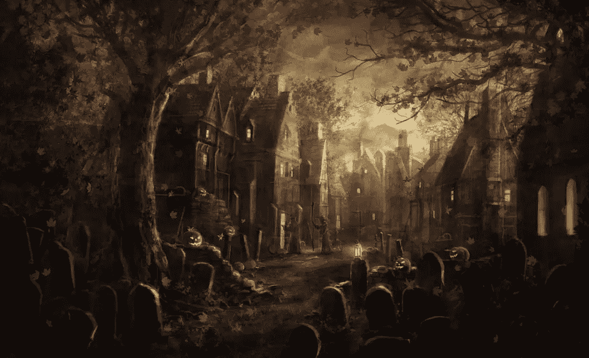](http://radojavor.deviantart.com/art/Trick-or-treat-42212833)

百合花
[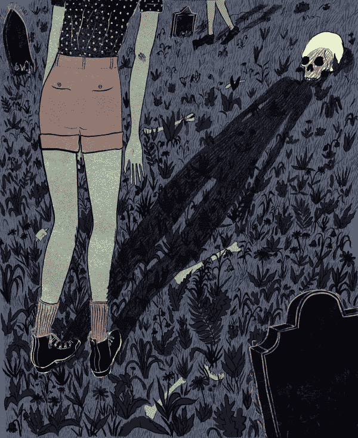](http://www.behance.net/gallery/Bad-Omens/8992265)

lukas break
t1、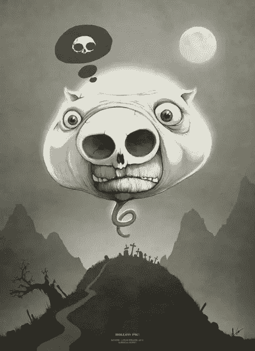T3

仁齐
[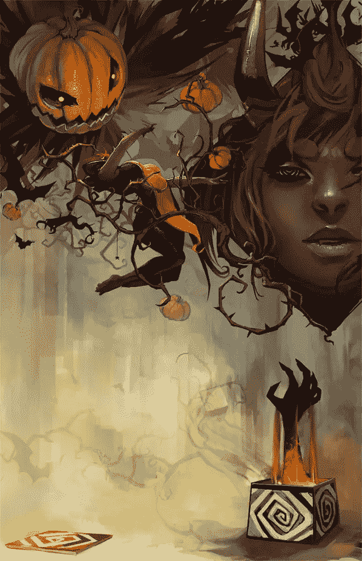](http://jenzee.deviantart.com/art/Gaia-Halloween-Storybook-Pg-7-141684404)

亚尼夫·卡马克
[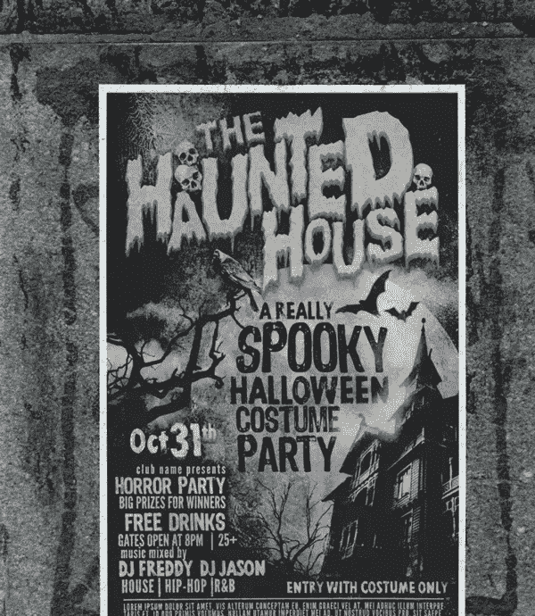](http://www.behance.net/gallery/The-Haunted-House/10930055)

万圣节
[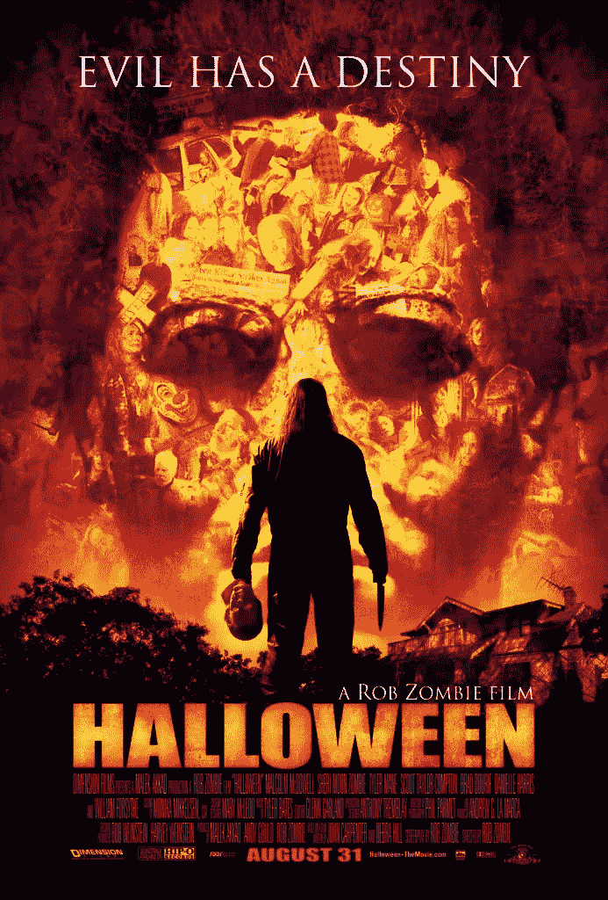](http://www.imdb.com/title/tt0373883/?ref_=nv_sr_2)

Jerry8448
[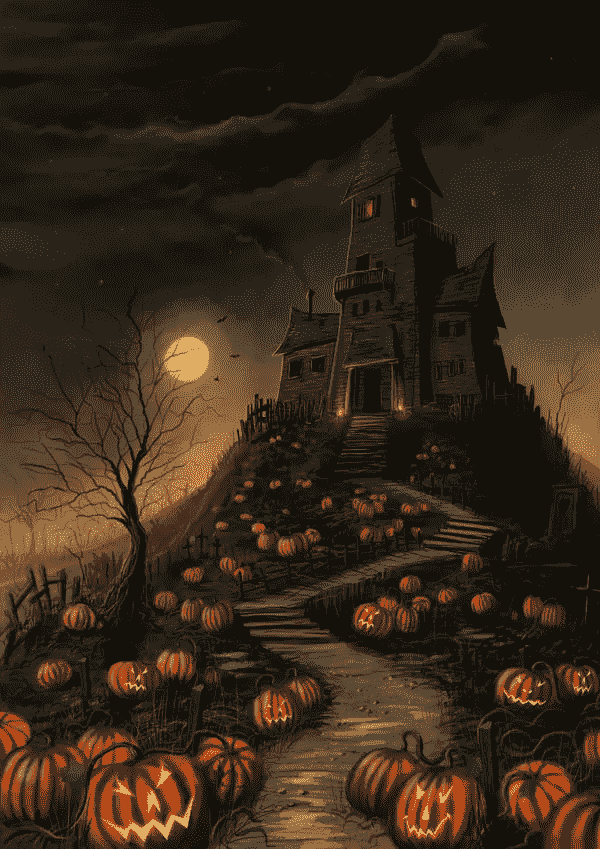](http://jerry8448.deviantart.com/art/Halloween-Mansion-180831986?q=boost%3Apopular+halloween+2010&qo=48)

巴尼帕特森
[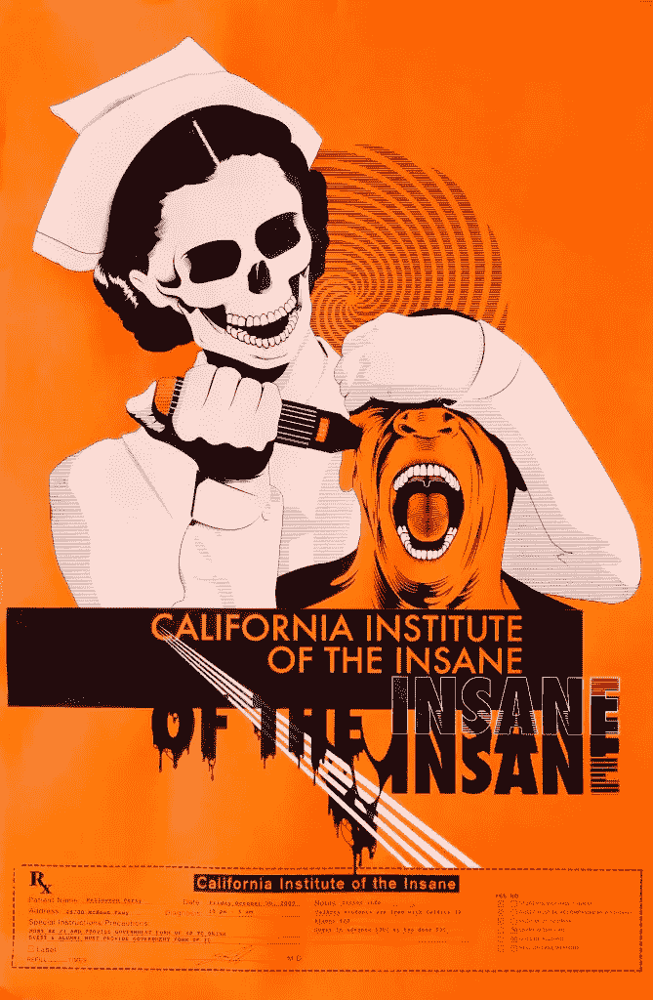](http://barneypatterson.wordpress.com/graphic-design/)

果冻立方工作室
[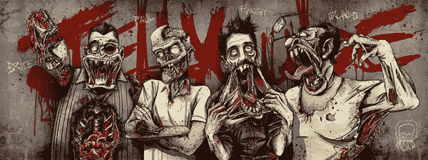](http://www.behance.net/gallery/Halloween-2012-card/5792595)

斯文·绍尔
[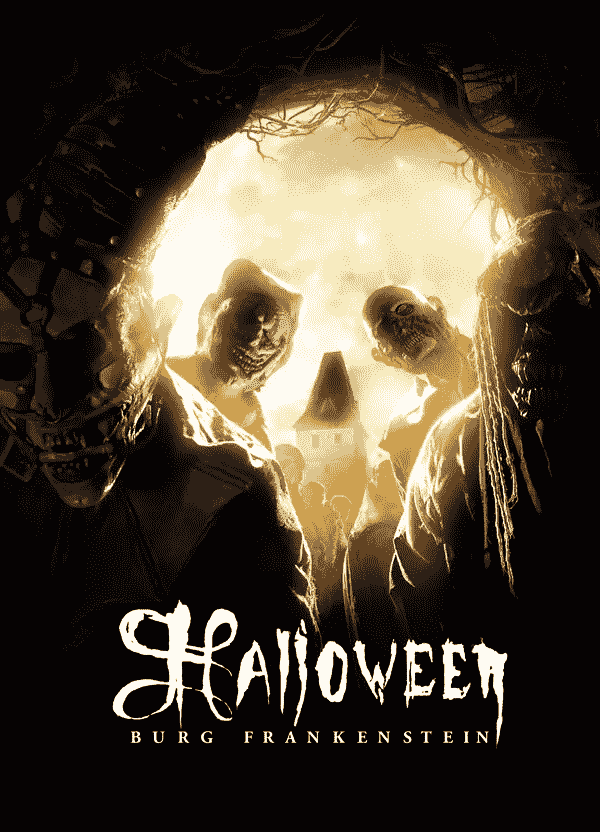](http://www.behance.net/gallery/ART-OF-HORROR/315895)

你曾经接受过万圣节或恐怖灵感设计的任务吗？列表中有没有你最喜欢的或者你想分享的其他设计？

## 分享这篇文章