# 2017 年让你大吃一惊的 25 场设计大会

> 原文：<https://www.sitepoint.com/25-design-conferences-that-will-blow-your-mind-in-2017/>

个人和职业发展的关键是自我发展和终身学习。参观并参与任何相关的活动，如会议、培训、会面或峰会，都是一个很好的方式。

随着用户体验和以用户为中心的设计在最近的技术产品开发中占据中心位置，不仅是 UX 的专家，行业中的每个人都应该跟上该领域的最新进展。

以下是 2017 年必去的 UX &设计大会的清单。

### 四月

## 城市中的 UX:牛津

*   **地点**:英国牛津
*   **日期**:4 月 20-21 日
*   **费用和门票** : 1 日票–216(265 美元)，2 日票–420(516 美元)，工作坊门票–480(590 美元)，工作坊& 2 日会议门票–810(995 美元)。所有价格有效期至 3 月 10 日。

城市中的 UX 是在英国的许多地方举行的 UX 社区的实际活动。该活动将在牛津举行，来自英国顶尖大学的设计专业人士和学者将讲述 UX，分享实践经验、案例研究和教程。主讲人是第一资本的设计管理负责人克里斯汀·斯金纳。

**更多信息** : [官网](http://uxinthecity.net/2017/oxford/) / [推特](https://twitter.com/uxcityox)

## 生成会议 2017

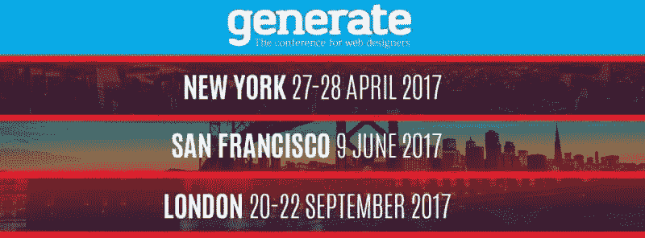

*   **地点**:美国纽约市
*   **日期**:4 月 27-28 日
*   **费用和门票**:375 美元-会议通行证；499 美元-车间通行证；749 美元-会议+研讨会门票。

对于网页设计师来说，Generate Conference 是一个不容错过的活动，它在多个地点举行，包括纽约(4 月 27 日至 28 日)、旧金山(6 月 9 日)和伦敦(9 月 20 日至 22 日)。第一个活动将持续 2 天，由世界级行业专家亲自动手举办研讨会和讲座。

**更多信息** : [官网](https://www.generateconf.com/) / [FB](https://www.facebook.com/netmag) / [推特](https://twitter.com/netmag)

### 五月

## UX 沉浸式:互动

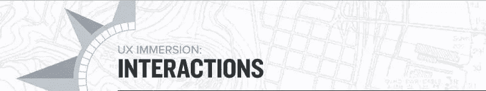

*   **地点**:美国波特兰
*   **日期**:5 月 1 日-3 日
*   **费用和门票【1,975 美元(优惠 4 月 6 日截止)。**

该活动围绕交互设计的新技术和新方法展开。专题讲座将包括诸如小屏幕企业设计、动画制作指南、设计思维、精益 UX 和制图体验等主题。

**更多信息** : [官网](https://uxi.uie.com/)

## 设计如何生活

*   **地点**:美国芝加哥
*   **日期**:5 月 2 日至 6 日
*   **费用和门票**:895 美元(一日通票)——1925 美元(大通票)。价格有效期至 3 月 21 日。团体和学生可享受特别优惠。

HOW Design Live 大会是面向创意专业人士的最大年度活动之一。每年，它聚集了来自世界各地的约 4000 名设计、商业和技术专业人士，分享经验，提高技能，并预览会场上展示的新工具。该活动有 80 多场会议，13 位主题演讲人，以及众多研讨会和大师班，为培养您的创造力、提高专业技能、探索新工具和产品以及建立联系提供了无尽的机会。

**更多信息** : [官网](http://howdesignlive.com/) / [FB](https://www.facebook.com/events/1210668588973333/) / [推特](https://twitter.com/HOWdesign_live)

## UX 伦敦

*   **地点**:英国伦敦
*   **日期**:5 月 24-26 日
*   **费用和门票**:一日票 425 英镑(522 美元)(标准价 4 月 3 日到期)，三日票 1125 英镑(1383 美元)。

这个为期三天的会议将重点关注数字产品设计，服务设计的基础，探索设计和 UX 的新兴趋势，并研究新的平台和互动模式。主要发言人包括来自谷歌、Capital One、优步和耐克的设计专家，以及一些独立的专业人士和作家。

**更多信息** : [官网](http://2017.uxlondon.com/) / [推特](https://twitter.com/uxlondon)

## TYPO 柏林 2017

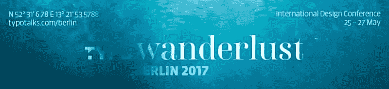

*   **地点**:德国柏林
*   **日期**:5 月 25-27 日
*   **费用和门票**:649 欧元(689 美元)

欧洲最大最成功的设计盛会。为期 3 天的会议涵盖了广泛的主题，包括印刷，平面设计，数字媒体，技术，文化，娱乐和商业。今年的 TYPO Berlin 将举办 60 多场演讲、各种研讨会、采访和来自 60 多位演讲者的讨论。

**更多信息**:官网/ [FB](https://www.facebook.com/TYPO.Berlin/) / [推特](https://twitter.com/typoBER)

### 六月

## 洛杉矶 Awwwards 会议

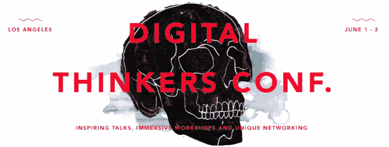

*   **地点**:美国洛杉矶
*   **日期**:6 月 1 日-2 日
*   **费用和门票**:475-550 美元

由 Awwwards 举办的是一个数字思考者会议，是网页设计灵感的主要来源。会议将关注一系列热门话题:UX/用户界面设计、虚拟现实、符号学和可穿戴设备。该活动将由领先的行业影响者进行 20 场鼓舞人心的演讲；包括 Behance 的创始人 Matias Corea，谷歌网络虚拟现实的 UX 负责人 Josh Carpenter，以及 YouTube、谷歌和 Digg 的前 UX 设计师 Marc Hemeon。

**更多信息** : [官网](https://conference.awwwards.com/los-angeles-2017/) / [FB](https://www.facebook.com/awwwards) / [推特](https://twitter.com/awwwards)

## UXPA 2017 国际会议

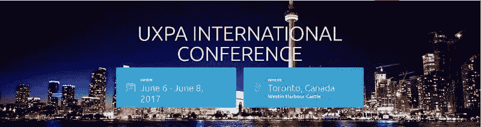

*   **地点**:加拿大多伦多
*   **日期**:6 月 6 日至 8 日
*   **费用及门票【1,900 美元-1900 美元(会员早鸟票)；1000-2000 美元(非会员的早鸟票)。提供学生特价和单日票，**

UXPA 2017 国际会议被认为是全球最具影响力的用户体验年度盛会之一。该活动提供可选的会前课程以及为期三天的会议，由来自微软、脸书和 IBM 的行业专家进行主题演讲。

**更多信息** : [官网](http://www.uxpa2017.org/) / [FB](https://www.facebook.com/uxpaInt/) / [推特](https://twitter.com/UXPA_Int)

## 企业 UX 2017

*   **地点**:美国旧金山
*   **日期**:6 月 7 日至 9 日
*   **费用和门票**:仅会议-1，595 美元(早鸟价格-1，395 美元)，会议+研讨会-2，290 美元(早鸟价格-1，990 美元)。早鸟优惠将于 3 月 12 日到期。

该会议不是讨论基本的 UX 主题，而是讨论为大型组织设计大规模、复杂的用户体验的问题。提供惠普、太平洋煤气电力和 SAP 等公司的灵感和成功案例。该活动将对中高级 UX 从业者有益。

**更多信息** : [官网](https://2017.enterpriseux.net/) / [FB](https://www.facebook.com/enterpriseuxconference) / [推特](https://twitter.com/enterpriseux)

## 99U 会议

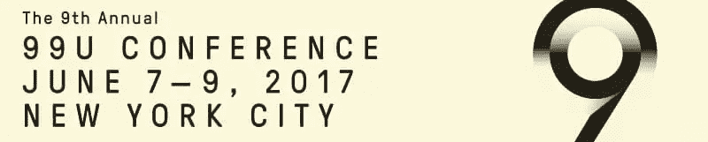

*   **地点**:美国纽约市
*   **日期**:6 月 7 日至 9 日
*   **费用和门票**:999-2999 美元(顾客门票)。

99U 大会是一年一度的活动，由行业领导者和设计从业者举办启发性的讲座和研讨会。今年，大会将邀请许多国际演讲者，包括来自 Instagram、Airbnb 和 Adobe 的设计专家。

**更多信息** : [官网](http://conference.99u.com/) / [FB](https://www.facebook.com/99U/) / [推特](https://twitter.com/99u)

## 欧洲战略航空公司

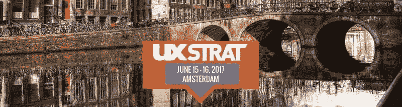

*   **地点**:荷兰阿姆斯特丹
*   **日期**:6 月 15-16 日
*   **费用和门票**:795 欧元(840 美元)

UX 战略展是一系列关注 UX、CX 以及产品和服务设计的活动。该会议在欧洲(阿姆斯特丹，6 月 15-16 日)和美国(博尔德，科罗拉多州，9 月 18-20 日)举行，聚集了行业领袖和设计从业者，分享他们关于如何创新、进行设计研究、分析复杂数据、组建团队以及向高管推销想法和愿景的经验和真实案例。

**更多信息** : [官网](https://uxstrat.com/) / [推特](https://twitter.com/uxstrat)

### 七月

## Inspirefest 2017

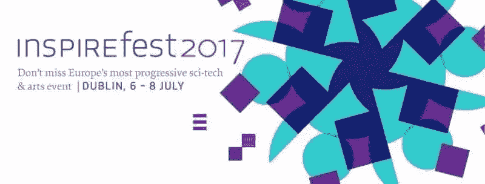

*   地点:爱尔兰都柏林
*   **日期**:7 月 6 日-8 日
*   **费用和门票**:早鸟票——295 欧元(311 美元)，普通票——395 欧元(417 美元)。提供团体和学术优惠。

Inspirefest 是一个致力于技术、科学、设计和艺术的国际盛会。会议的特色是一系列鼓舞人心的演讲和讨论，来自科学、技术和创新领域的领先专家，包括来自、诺基亚、Mashable 和 Intercom 的代表。

**更多信息** : [官网](http://inspirefest.com/) / [FB](https://www.facebook.com/inspirefesthq) / [推特](https://twitter.com/InspirefestHQ)

## 2017 体验设计国际会议

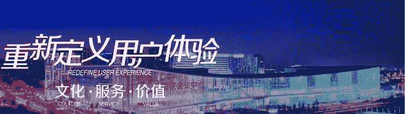

*   **地点**:中国北京
*   **日期**:7 月 12 日至 16 日
*   **费用和门票**:3500(约 30 美元)–20000(约 175 美元)。3 月 31 日前可享受特别优惠。

本次会议由 IXDC 主办，是 UX 和设计领域全球最具影响力的活动之一。它致力于用户体验、设计策略及其在商业中的角色等主题。大会有超过 5，000 名与会者，13 场主题演讲，37 场峰会和 96 场研讨会，由一些最杰出的行业影响者举办，绝对是不容错过的。

**更多信息** : [官网](http://ixdc.org/2017/index.php)

## 2017 年设计与内容大会

*   **地点**:加拿大温哥华
*   **日期**:7 月 17-19 日
*   **费用和门票**:早鸟优惠——795 美元——1195 美元(3 月 31 日截止)；标准价——895 美元——1295 美元(6 月 24 日到期)；后期——995 美元——1445 美元(7 月 17 日到期)。

该会议汇集了设计专业人士和内容战略家，以“塑造网络的未来”。来自**脸书**、**微软**、 **Buzzfeed** 和**纽约时报**的一些杰出演讲人将出席此次活动，该活动将提供一整天的研讨会、两天的讲座和多项附加活动，以促进与会者之间的交流。

**更多信息** : [官网](https://designcontentconf.com) / [FB](https://www.facebook.com/designcontentconf) / [推特](https://twitter.com/dcontentconf)

### 八月

## 2017 年 UX 周

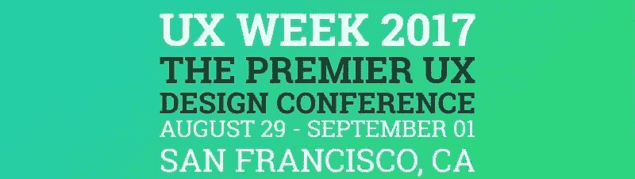

*   **地点**:美国旧金山
*   **日期**:8 月 29 日-9 月 1 日
*   **费用和门票**:早鸟价——2395 美元(3 月 31 日截止)，正价——2795 美元。

该活动由来自“自适应路径:第一资本”的服务设计专家组织。今年，UX 周会议将第 15 次迎来来自世界各地的设计专业人士。完整的议程仍未公布。

**更多信息** : [官网](http://uxweek.com/) / [推特](https://twitter.com/uxweek)

## 澳大利亚 2017

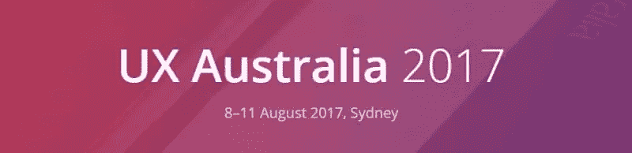

*   **地点**:澳大利亚悉尼
*   **日期**:8 月 8 日-11 日
*   **费用和门票**:600 美元(研讨会)–800 美元(主要会议)。价格有效期至 6 月 30 日(门票数量有限)。

澳大利亚 UX 是一个为期 4 天的会议:2 天的实践研讨会和 2 天的演示和案例研究，重点是用户体验设计。议程和演讲者仍未公布，因为组织者在 3 月 17 日之前接受演示提案。

**更多信息** : [官网](http://www.uxaustralia.com.au/conferences/uxaustralia-2017/) / [FB](https://www.facebook.com/uxaustraliaconference) / [推特](https://twitter.com/uxaustralia)

### 九月

## 设计问题

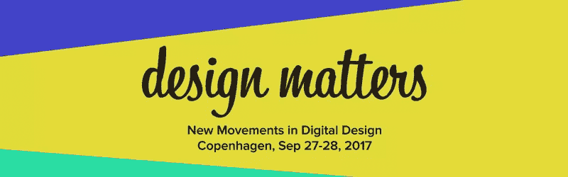

*   **地点**:丹麦哥本哈根
*   **日期**:9 月 27-28 日
*   **费用和门票**:DKK 5995 英镑(约合 900 美元)。

大会将欢迎来自世界各地的设计从业者，包括来自优步、Spotify、Instagram、Zendesk 和网飞的行业思想领袖。今年，大会的主题将是:对话式用户界面，传播产品设计 DNA，拥抱失败！逆潮流而动。

**更多信息** : [官网](https://designmatters.io/) / [FB](https://www.facebook.com/designmattersdk/) / [推特](https://twitter.com/designmattersdk)

## EuroIA 2017

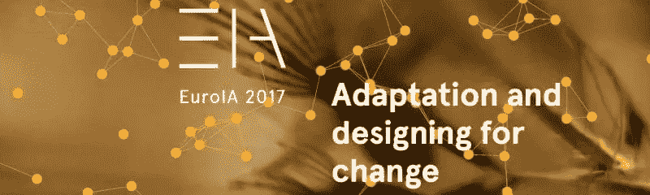

*   **地点**:瑞典斯德哥尔摩
*   **日期**:9 月 28-30 日
*   **费用和门票**:4 月份公开。

EuroIA 是欧洲领先的信息架构(IA)和用户体验(UX)会议。该活动展示了:信息建筑和 UX 设计的最佳实践、真实案例研究和成熟方法。今年的主题是，“适应和设计的变化。”演讲者和计划将于四月份公布。

**更多信息** : [官网](http://euroia.org/) / [FB](https://www.facebook.com/EuroIA/) / [推特](https://twitter.com/euroia)

### 十月

## 2017 年世界可用性大会

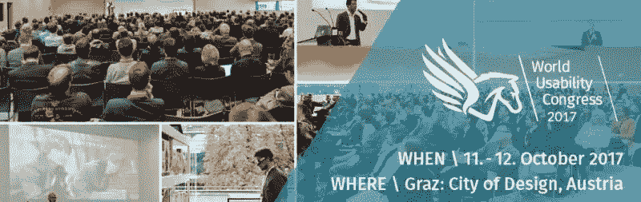

*   地点:奥地利格拉茨
*   **日期**:10 月 10 日-12 日
*   **费用和门票**:420-2622 欧元(444-2776 美元)。早鸟优惠将于 6 月 30 日到期。

此次大会是一次独一无二的盛会，因为它对可用性、UX 和客户体验(CX)采取了面向应用、经济和全面的方法。今年的主题包括 UX 管理、汽车和航空、电子商务、虚拟和增强现实。主讲人包括来自英特尔、欧特克、优步、沃尔玛实验室和宝马的顶尖专家。

**更多信息** : [官网](http://www.worldusabilitycongress.com/) / [FB](https://www.facebook.com/worldusabilitycongress) / [推特](https://twitter.com/worlduxcongress)

## AIGA 设计会议

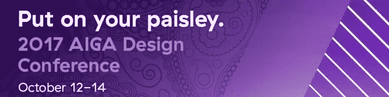

*   **地点**:美国明尼阿波利斯
*   **日期**:10 月 12 日-14 日
*   **费用和门票**:900 美元(会员折扣价)–1250 美元(非会员)。早鸟优惠 5 月 10 日截止。

该会议由美国图形艺术协会(AIGA)主办，是历史最悠久、规模最大的设计专业会员组织，对每个设计专业人士来说都是一件大事。该会议有 100 多名演讲者和数千名与会者，为交流和激发灵感提供了无尽的机会。

**更多信息** : [官网](http://www.aiga.org/2017conference)

### 十一月

## 伦敦移动 UX

*   **地点**:英国伦敦
*   **日期**:11 月 24 日
*   **费用和门票** : 200 英镑(244 美元)——早鸟票；250 英镑(305 美元)——普通入场券。提供特殊团体折扣。

该会议主要关注移动 UX 和移动应用程序设计最佳实践，为期一天，将涉及物联网、VR/AR、人工智能和聊天机器人等问题。节目和演讲者仍未公布。

**更多信息** : [官网](https://mobileuxlondon.com/muxl2017/) / [FB](https://www.facebook.com/mobileuxlondon) / [推特](https://twitter.com/mobileuxlondon)

## 卡努斯

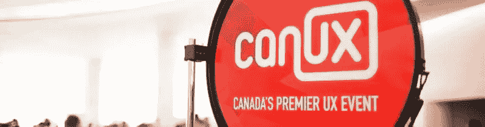

*   地点:加拿大渥太华
*   **日期**:11 月 3 日-5 日
*   **费用和门票**:预售票——269 加元(200 美元)，普通票——359 加元(267 美元)，决赛票——449 加元(335 美元)。

CanUX 是加拿大历史最悠久、规模最大的年度 UX 活动，包括为期三天的会议、研讨会和演示。它专注于现代体验设计趋势，对于那些想学习和分享他们关于 UX 和设计的专业知识的人来说会很有趣。该计划即将公布。BBC 用户体验架构创意总监丹·拉姆斯登是确定的发言人之一。

**更多信息** : [官网](http://canux.io/) / [FB](https://www.facebook.com/canuxconf/) / [推特](https://twitter.com/canuxconf)

### 十二月

## 达拉斯数字峰会

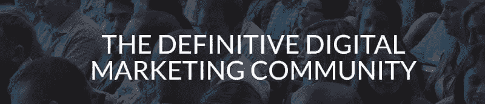

*   **地点**:美国达拉斯
*   **日期**:12 月 5 日至 6 日
*   **费用和门票**:245-645 美元

数字峰会是一个数字营销社区和会议系列，每年在美国一些主要城市举行。该活动涉及多个主题，包括内容、移动 UX 设计和策略。虽然今年的计划和演讲人仍未公布，但该活动通常会有许多行业思想领袖和远见卓识，包括史蒂夫·沃兹尼亚克和来自谷歌、脸书、微软、Pinterest、思科和雅虎的其他领先专家。

**更多信息** : [官网](http://digitalsummit.com/) / [FB](https://www.facebook.com/events/1700457523599873/)

## 丹佛之外的一个事件

*   地点:美国丹佛
*   **日期**:12 月 11 日-13 日
*   **费用和门票【1,390 美元(早鸟价格将于 10 月 9 日截止)**

除此之外的活动(AEA)是一系列专注于数字设计、UX 等的活动。今年在丹佛举办的活动是一个特别版会议，这意味着将有更多的发言人(18 人而不是 12 人)，分享更多的观点和见解。该计划尚未公布，但已经有一个确认的发言人名单，包括《GV》的设计合作伙伴丹尼尔·布尔卡和谷歌的产品总监卢克·乌鲁布莱夫斯基。

**更多信息** : [官网](https://aneventapart.com/event/denver-2017) / [FB](https://www.facebook.com/An.Event.Apart) / [推特](https://twitter.com/aneventapart)

这些是 2017 年必去的 UX 设计会议和活动。显然，这份清单还远远不够完整。我们试图包括最有趣或最重要的事件，以便您可以选择符合您口味的东西，并提前计划您的旅行。

## 分享这篇文章