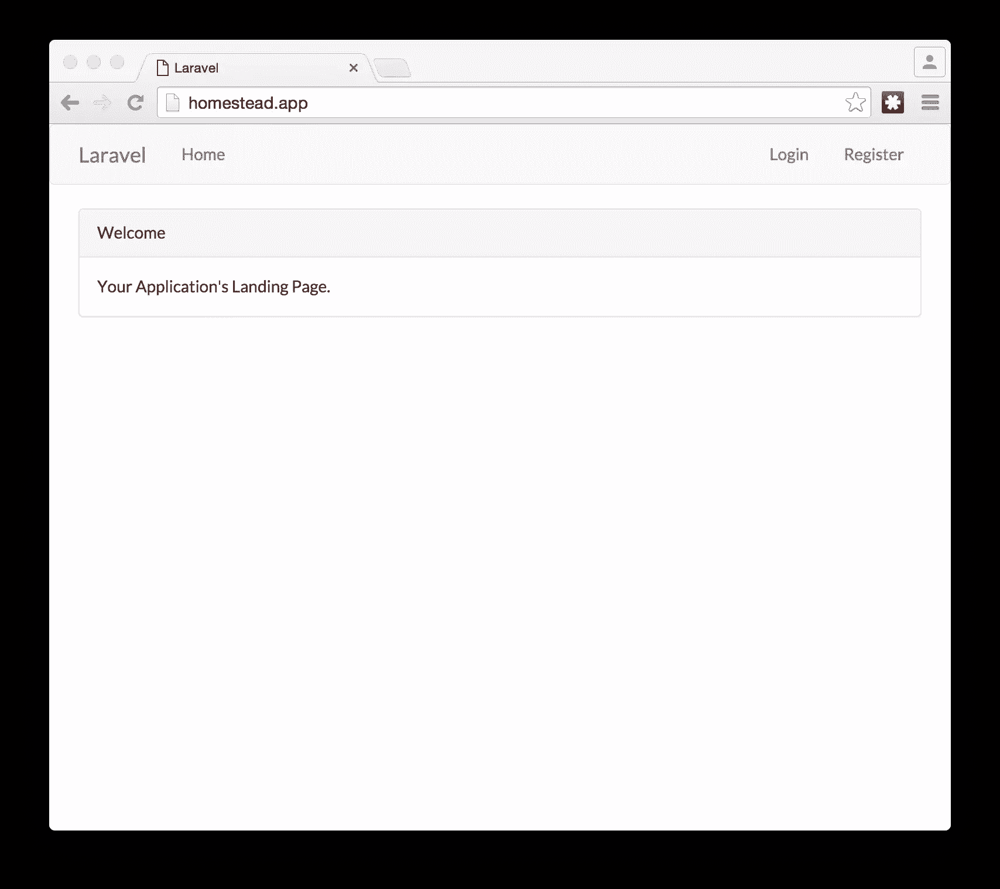
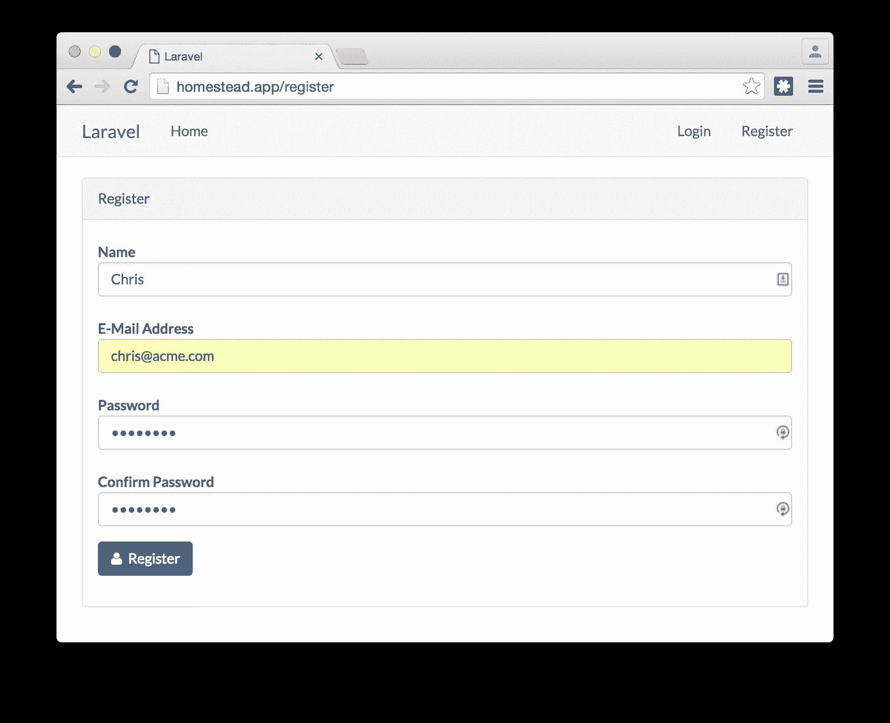
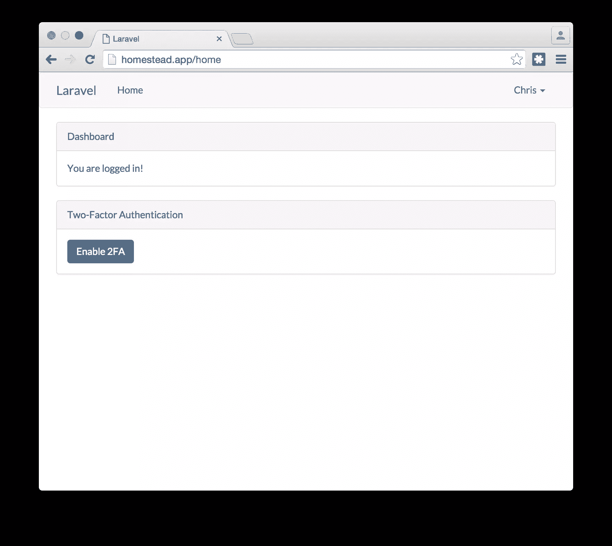
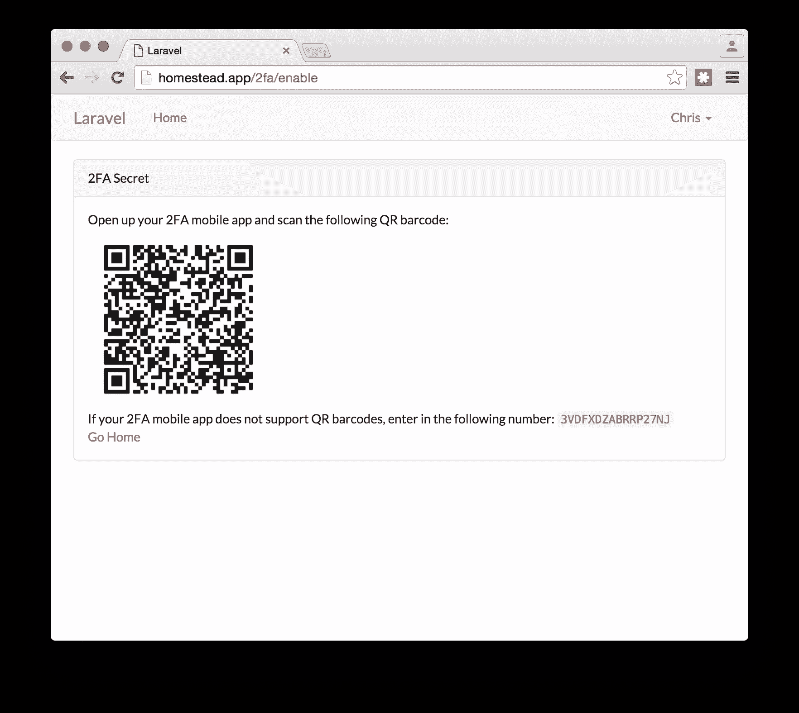
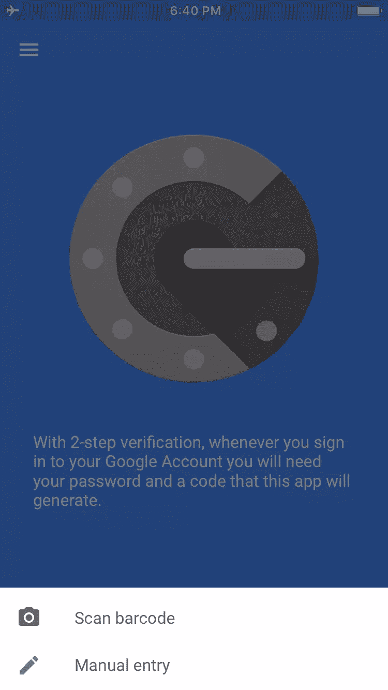
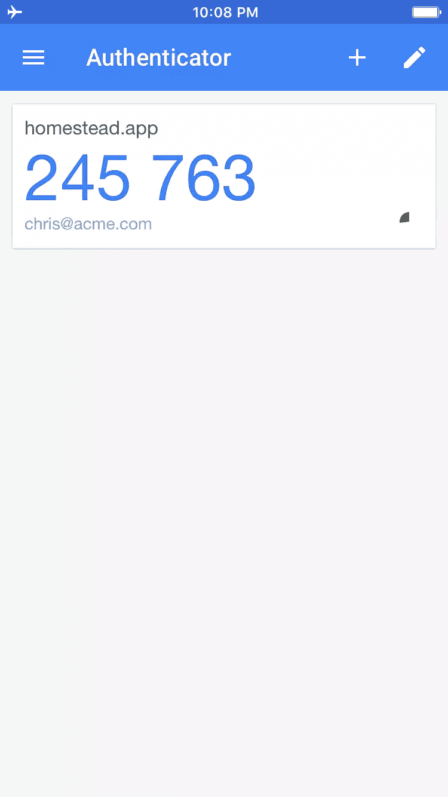
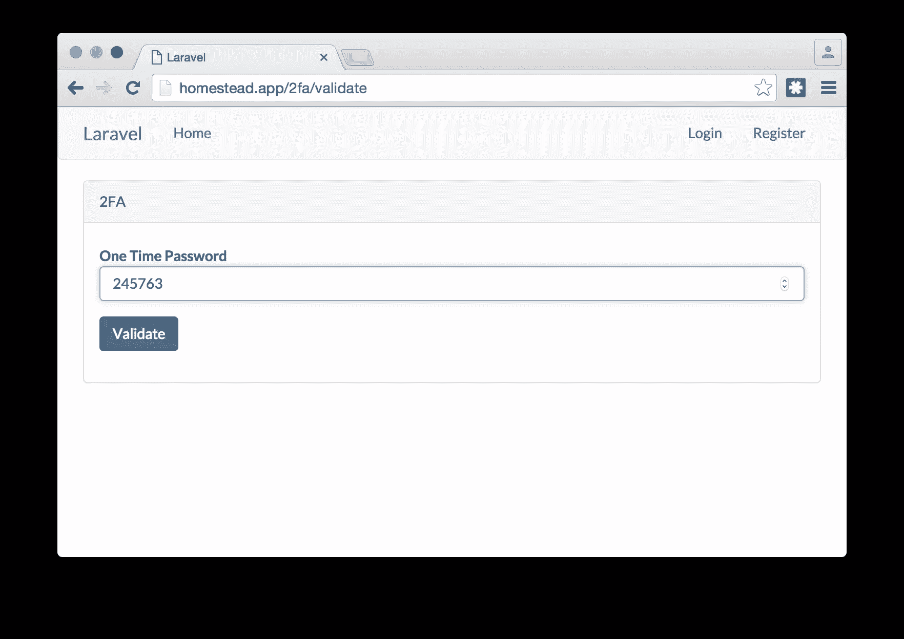
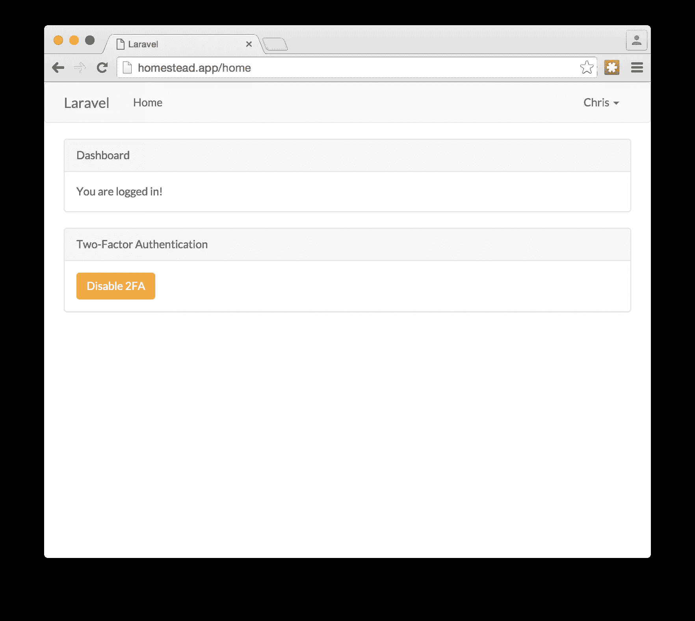
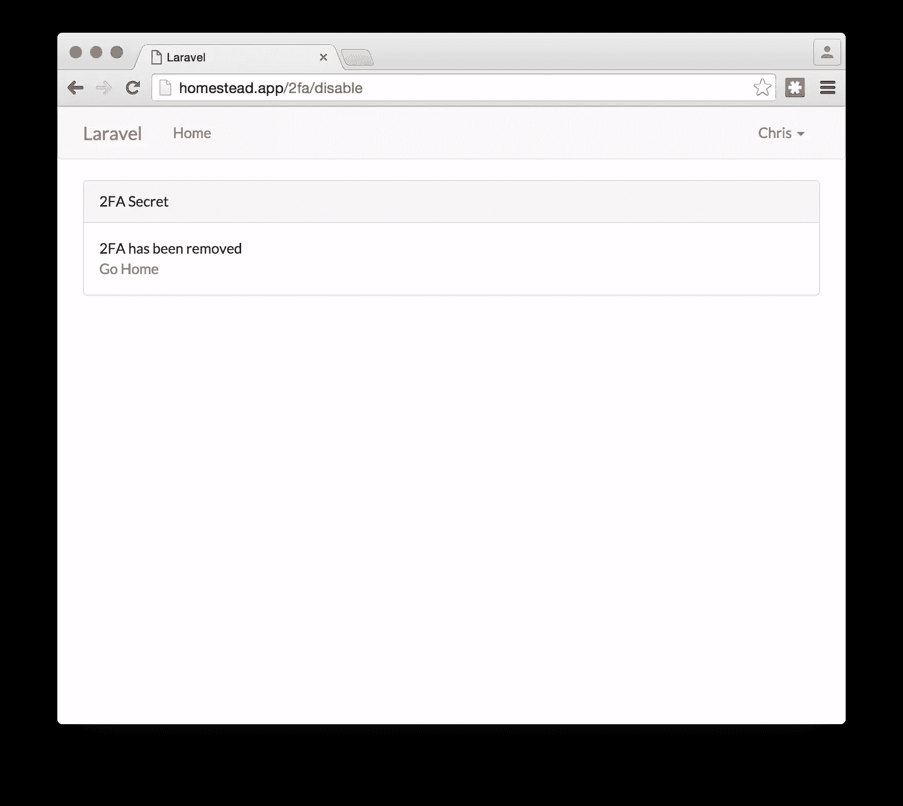

# 2FA in Laravel，带谷歌认证器–确保安全！

> 原文：<https://www.sitepoint.com/2fa-in-laravel-with-google-authenticator-get-secure/>

*这篇文章由[贾德·比塔尔](https://github.com/jadb)、[尼克拉斯·凯勒](https://github.com/kelunik)、[马尔科·皮维塔](https://github.com/Ocramius)和[安东尼·钱伯斯](https://github.com/Antnee)进行了[同行评审](https://www.sitepoint.com/introduction-to-sitepoints-peer-review/)。感谢 SitePoint 的所有同行评审员使 SitePoint 的内容尽可能做到最好！*


攻击者可以通过多种方式获取用户的密码。它可能通过[社会工程](https://en.wikipedia.org/wiki/Social_engineering_(security))、[密钥记录](https://en.wikipedia.org/wiki/Keystroke_logging)或其他一些邪恶的手段发生。密码本身不足以保护用户的帐户不被泄露，特别是如果攻击者以某种方式拥有他们的凭证。

为了克服这个严重的缺点，双因素身份验证(2FA)的概念应运而生。密码是一个因素，但不足以对用户进行身份验证。这个概念是，用户必须使用他们拥有的东西(第一个因素)和他们知道的东西(第二个因素)来进行身份验证。密码是用户知道的东西。对于“他们有的东西”部分，很多东西都可以用。一些解决方案使用生物识别技术，如指纹、声音模式识别或虹膜扫描。这些是相对昂贵的解决方案。其他第二因素身份验证方法包括一次性密码(OTP)。这些是在设备上生成的密码，只需使用一次即可。通常有两种类型的 OTPs 基于计数器和基于时间。使用 2FA 比仅使用用户名和密码要好，因为攻击者很难获得密码和第二个因子。

在本教程中，我们将使用 Laravel 和 Google Authenticator 来演示如何在 webapp 中实现 2FA。Google Authenticator 只是基于时间的一次性密码(TOTP)算法的一个实现， [RFC 6238](https://tools.ietf.org/html/rfc6238) 。这一行业标准在许多不同的 2FA 解决方案中使用。Google Authenticator 相对于市场上的其他一些 2FA 解决方案有一些优势。将应用程序下载到智能手机后，您可以离线使用它。许多其他 2FA 解决方案需要以某种方式连接；他们发送短信或推送通知，甚至用录音信息给智能手机打电话。这对于那些电话与外界隔绝的用户来说并不好，比如在一栋大楼地下室的办公室里。

TOTP 的工作原理是服务器生成一个密钥。然后将这个密钥传递给用户。密钥与当前的 Unix 时间戳结合使用，使用基于密钥哈希消息认证码(HMAC)的算法生成一个六位数。这个六位数是一次性密码。它每 30 秒改变一次。

## 设置

### 农场

本文假设安装了 Laravel Homestead。没有必要使用它，但是如果您使用不同的环境并需要 PHP 7，命令可能会略有不同。如果您不熟悉 Homestead，并希望获得与本文类似的结果，请访问[这篇展示如何设置 Homestead 的](https://www.sitepoint.com/quick-tip-get-homestead-vagrant-vm-running/) SitePoint 文章。

### 设计者

创建一个新的 Laravel 项目。

```
composer create-project --prefer-dist laravel/laravel Project 
```

确保转到项目文件夹

```
cd Project 
```

有一个 Laravel 包，其中包含了 Google Authenticator 的 PHP 版本。我们将在这个项目中使用它。首先，我们将包括 Antonio Carlos Ribeiro 使用 Composer 的 Laravel 包。我们还将安装一个库，在常量时间内进行 Base32 编码。

```
composer require pragmarx/google2fa
composer require paragonie/constant_time_encoding 
```

Composer 安装完软件包后，我们现在必须告诉 Laravel 关于它的信息。打开`config/app.php`并将`PragmaRX\Google2FA\Vendor\Laravel\ServiceProvider::class,`添加到`providers`数组中。另外，将`'Google2FA' => PragmaRX\Google2FA\Vendor\Laravel\Facade::class,`添加到`aliases`数组中。

### 脚手架

Laravel 包括脚手架来创建基本用户注册、登录等所需的所有控制器、视图和路径。我们将使用 auth 脚手架来快速构建登录和注册屏幕。

```
php artisan make:auth 
```

我们将修改一些自动生成的代码，以添加双因素身份验证。

### 数据库和模型

我们需要在用户记录中存储用于创建一次性密码的密钥。为此，为所需的新数据库列创建一个迁移。

```
php artisan make:migration add_google2fa_secret_to_users 
```

打开位于`database/migrations`文件夹中新创建的迁移文件。它将被命名为类似于`2016_01_06_152631_add_google2fa_secret_to_users.php`的东西。用下面的代码替换文件的内容:

```
<?php

use Illuminate\Database\Schema\Blueprint;
use Illuminate\Database\Migrations\Migration;

class AddGoogle2faSecretToUsers extends Migration
{
    /**
     * Run the migrations.
     *
     * @return void
     */
    public function up()
    {
        Schema::table('users', function ($table) {
            $table->string('google2fa_secret')->nullable();
        });
    }

    /**
     * Reverse the migrations.
     *
     * @return void
     */
    public function down()
    {
        Schema::table('users', function ($table) {
            $table->dropColumn('google2fa_secret');
        });
    }
} 
```

当迁移运行时，列`google2fa_secret`被添加到用户表中。当迁移回滚时，该列将从表中删除。

接下来，我们将运行迁移来设置数据库表。

```
php artisan migrate 
```

既然列`google2fa_secret`已经被添加到了`users`表中，我们应该更新`App\User`模型，使其更加安全。默认情况下，如果程序将数据从`App\User`的实例转换成 JSON，那么`google2fa_secret`列的内容将成为 JSON 对象的一部分。我们将阻止这一行动。打开`App\User`模型`app/User.php`，将数组元素`google2fa_secret`作为字符串添加到`hidden`属性中。

### 路线

打开 web routes 文件`routes/web.php`并在底部添加以下路由:

```
Route::get('/2fa/enable', 'Google2FAController@enableTwoFactor');
Route::get('/2fa/disable', 'Google2FAController@disableTwoFactor');
Route::get('/2fa/validate', 'Auth\AuthController@getValidateToken');
Route::post('/2fa/validate', ['middleware' => 'throttle:5', 'uses' => 'Auth\AuthController@postValidateToken']); 
```

我们添加的路线做各种事情。

当用户转到`/2fa/enable`时，它将创建 2FA 密钥，并提供如何配置其设备以使用它的说明。当用户进入`/2fa/disable`时，它将从用户的帐户中删除 2FA 密钥，这样他们就可以登录，而不必提供一次性密码。在用户用他们的用户名和密码认证后，如果他们设置了 2FA 密钥，他们将通过 HTTP GET 重定向到`/2fa/validate`。此路线显示了一个表单，用户可以在其中输入一次性密码。当用户提交表单时，它通过 HTTP POST 到达`/2fa/validate`。这个路由确保用户传递的一次性密码是有效的。该路线还使用了`throttle`的 Laravel 中间件。如果攻击者有您的密码，就可以很容易地自动检查 6 位数字令牌的所有组合。限制设置为每分钟最多 5 个请求。Laravel 的节流中间件是基于 IP 地址的。本文只是向您展示了节流的概念，并没有针对分布式暴力攻击提供保护。在生产实现中，考虑基于用户进行节流。

### 控制器

我们将创建一个新的控制器来为用户启用和禁用 2FA 支持:

```
php artisan make:controller Google2FAController 
```

打开新的控制器`Google2FAController`，用下面的代码替换内容:

```
<?php

namespace App\Http\Controllers;

use Crypt;
use Google2FA;
use Illuminate\Http\Request;
use App\Http\Controllers\Controller;
use Illuminate\Foundation\Validation\ValidatesRequests;
use \ParagonIE\ConstantTime\Base32;

class Google2FAController extends Controller
{
    use ValidatesRequests;

    /**
     * Create a new authentication controller instance.
     *
     * @return void
     */
    public function __construct()
    {
        $this->middleware('web');
    }

    /**
     *
     * @param \Illuminate\Http\Request $request
     * @return \Illuminate\Http\Response
     */
    public function enableTwoFactor(Request $request)
    {
        //generate new secret
        $secret = $this->generateSecret();

        //get user
        $user = $request->user();

        //encrypt and then save secret
        $user->google2fa_secret = Crypt::encrypt($secret);
        $user->save();

        //generate image for QR barcode
        $imageDataUri = Google2FA::getQRCodeInline(
            $request->getHttpHost(),
            $user->email,
            $secret,
            200
        );

        return view('2fa/enableTwoFactor', ['image' => $imageDataUri,
            'secret' => $secret]);
    }

    /**
     *
     * @param \Illuminate\Http\Request $request
     * @return \Illuminate\Http\Response
     */
    public function disableTwoFactor(Request $request)
    {
        $user = $request->user();

        //make secret column blank
        $user->google2fa_secret = null;
        $user->save();

        return view('2fa/disableTwoFactor');
    }

    /**
     * Generate a secret key in Base32 format
     *
     * @return string
     */
    private function generateSecret()
    {
        $randomBytes = random_bytes(10);

        return Base32::encodeUpper($randomBytes) 
    }
} 
```

当用户想要设置 2FA 时，执行`enableTwoFactor()`方法。首先，它生成一个新的密钥。不幸的是，目前 2FA 库中的密钥生成函数没有使用[加密安全的 PRNG](https://en.wikipedia.org/wiki/Cryptographically_secure_pseudorandom_number_generator) ，所以我们使用`random_bytes()`函数为我们的密钥创建字节，并进行 Base32 编码。然后，该方法将密钥的加密版本存储到 users 表中。

接下来，生成一个 200x200px 的 QR 条形码图像，其中包含 Google Authenticator 移动应用程序所需的密钥和其他元数据。这张图片是用数据 URI T2 方案编码的，所以我们可以把它嵌入到网页中。接下来，加载`enableTwoFactor`视图以文本形式显示 QR 条形码和密钥，以防他们使用不能读取 QR 条形码的 RFC 6238 兼容应用。

当用户想要禁用 2FA 时，调用`disableTwoFactor()`方法。它将一个`null`值放入数据库中作为密钥，然后显示一个视图，说明 2FA 已经被禁用。

现在，我们将对 Auth 控制器进行一些修改。打开`app/Http/Controllers/Auth/AuthController.php`，将以下代码行放在`use`部分的顶部附近:

```
use Cache;
use Illuminate\Http\Request;
use Illuminate\Support\Facades\Auth;
use Illuminate\Contracts\Auth\Authenticatable;
use App\Http\Requests\ValidateSecretRequest; 
```

在用户认证之后，认证控制器查看是否有一个`authenticated()`方法。如果是，控制器执行该方法。默认情况下，搭建不会创建`authenticated()`方法。我们将创建这个方法，并使用它来提示已经设置了 2FA 密钥的用户输入一次性密码。在同一个`AuthController`类中，添加以下方法:

```
 /**
     * Send the post-authentication response.
     *
     * @param  \Illuminate\Http\Request $request
     * @param  \Illuminate\Contracts\Auth\Authenticatable $user
     * @return \Illuminate\Http\Response
     */
    private function authenticated(Request $request, Authenticatable $user)
    {
        if ($user->google2fa_secret) {
            Auth::logout();

            $request->session()->put('2fa:user:id', $user->id);

            return redirect('2fa/validate');
        }

        return redirect()->intended($this->redirectTo);
    } 
```

如果用户已经设置了 2FA，该方法会注销用户，将他们的用户 id 保存到会话中，并将他们重定向到可以输入一次性密码的页面。如果用户没有设置 2FA，它会将他们重定向到主页，而不注销他们。

`getValidateToken()`方法显示用户可以输入一次性密码的页面。在`AuthController`类中，添加这个方法:

```
 /**
     *
     * @return \Illuminate\Http\Response
     */
    public function getValidateToken()
    {
        if (session('2fa:user:id')) {
            return view('2fa/validate');
        }

        return redirect('login');
    } 
```

如果具有用户 id 的会话不存在，用户将被重定向到登录页面。如果在进程中设置了用户 id，则显示视图。

一旦用户单击一次性密码页面上的“Validate”按钮，请求就会被路由到`postValidateToken()`方法。将以下代码添加到`AuthController`类中:

```
 /**
     *
     * @param  App\Http\Requests\ValidateSecretRequest $request
     * @return \Illuminate\Http\Response
     */
    public function postValidateToken(ValidateSecretRequest $request)
    {
        //get user id and create cache key
        $userId = $request->session()->pull('2fa:user:id');
        $key    = $userId . ':' . $request->totp;

        //use cache to store token to blacklist
        Cache::add($key, true, 4);

        //login and redirect user
        Auth::loginUsingId($userId);

        return redirect()->intended($this->redirectTo);
    } 
```

在这个方法运行之前，验证是通过`ValidateSecretRequest`表单请求类完成的。如果验证失败，则不执行`postValidateToken()`方法。验证后，一次性密码将被添加到黑名单中，持续 4 分钟。这样做是因为 2FA 库允许 4 分钟前的代码有效，我们不希望用户在这段时间内重用代码。接下来，用户登录到系统并被重定向到主页。

最后，确保在`AuthController`类中，`redirectTo`属性被设置为`/home`。用户登录后会被重定向到主页`/home`而不是欢迎页面`/`。

### 表单请求

要创建新的表单请求类，请执行以下命令:

```
php artisan make:request ValidateSecretRequest 
```

打开`app/Http/Requests/ValidateSecretRequest.php`，用下面的代码替换内容:

```
<?php

namespace App\Http\Requests;

use Cache;
use Crypt;
use Google2FA;
use App\User;
use App\Http\Requests\Request;
use Illuminate\Validation\Factory as ValidatonFactory;

class ValidateSecretRequest extends Request
{
    /**
     *
     * @var \App\User
     */
    private $user;

    /**
     * Create a new FormRequest instance.
     *
     * @param \Illuminate\Validation\Factory $factory
     * @return void
     */
    public function __construct(ValidatonFactory $factory)
    {
        $factory->extend(
            'valid_token',
            function ($attribute, $value, $parameters, $validator) {
                $secret = Crypt::decrypt($this->user->google2fa_secret);

                return Google2FA::verifyKey($secret, $value);
            },
            'Not a valid token'
        );

        $factory->extend(
            'used_token',
            function ($attribute, $value, $parameters, $validator) {
                $key = $this->user->id . ':' . $value;

                return !Cache::has($key);
            },
            'Cannot reuse token'
        );
    }

    /**
     * Determine if the user is authorized to make this request.
     *
     * @return bool
     */
    public function authorize()
    {
        try {
            $this->user = User::findOrFail(
                session('2fa:user:id')
            );
        } catch (Exception $exc) {
            return false;
        }

        return true;
    }

    /**
     * Get the validation rules that apply to the request.
     *
     * @return array
     */
    public function rules()
    {
        return [
            'totp' => 'bail|required|digits:6|valid_token|used_token',
        ];
    }
} 
```

在这个文件中，我们做了三件事:

1.  设置两个自定义验证器规则
2.  确保用户有权执行此请求
3.  定义此请求的验证规则。

在类构造函数中，我们设置了自定义验证器规则。第一个规则确保用户提供了有效的 TOTP 令牌。第二个规则确保用户没有提交黑名单上的令牌。通常，自定义验证器规则用于许多不同的请求，因此在`AppServiceProvider`类中定义。但是，由于这些规则只在一个请求中使用，我们把它放在这个类的构造函数中。

`authorize()`方法检查并查看它是否可以根据会话中存储的用户 id 获得用户记录。如果这不起作用，则该请求不被认为是授权的。

`rules()`方法定义了验证规则。规则规定，令牌不能为空，必须是六位数字，必须有效，并且不在用户的黑名单上。

### 视图

在主页上，我们需要添加一个允许用户启用或禁用 2FA 的部分。打开`resources/views/home.blade.php`并在最后一个结束`div`标签之前添加以下代码:

```
 <div class="row">
        <div class="col-md-10 col-md-offset-1">
            <div class="panel panel-default">
                <div class="panel-heading">Two-Factor Authentication</div>

                <div class="panel-body">
                    @if (Auth::user()->google2fa_secret)
                    <a href="{{ url('2fa/disable') }}" class="btn btn-warning">Disable 2FA</a>
                    @else
                    <a href="{{ url('2fa/enable') }}" class="btn btn-primary">Enable 2FA</a>
                    @endif
                </div>
            </div>
        </div>
    </div> 
```

当用户没有设置`google2fa_secret`字段时，会显示一个按钮，允许用户启用 2FA。当`google2fa_secret`字段被设置时，会显示一个按钮，允许他们禁用 2FA。

对于这个项目，我们将创建一些新的视图。我们将把它们放在它们自己的目录中。在`views`文件夹中创建目录`2fa`:

```
mkdir resources/views/2fa 
```

让我们创建一个页面，显示密钥以及如何配置用户的 2FA 设备的说明。在新创建的`resources/views/2fa`文件夹中创建视图文件`enableTwoFactor.blade.php`，并将以下内容放入其中:

```
@extends('layouts.app')

@section('content')
<div class="container spark-screen">
    <div class="row">
        <div class="col-md-10 col-md-offset-1">
            <div class="panel panel-default">
                <div class="panel-heading">2FA Secret Key</div>

                <div class="panel-body">
                    Open up your 2FA mobile app and scan the following QR barcode:
                    <br />
                    

                    <br />
                    If your 2FA mobile app does not support QR barcodes, 
                    enter in the following number: <code>{{ $secret }}</code>
                    <br /><br />
                    <a href="{{ url('/home') }}">Go Home</a>
                </div>
            </div>
        </div>
    </div>
</div>
@endsection 
```

如果用户决定禁用 2FA，创建一个页面让他们知道它已经被禁用。在`resources/views/2fa`文件夹中创建一个名为`disableTwoFactor.blade.php`的文件，并将以下代码放入其中:

```
@extends('layouts.app')

@section('content')
<div class="container spark-screen">
    <div class="row">
        <div class="col-md-10 col-md-offset-1">
            <div class="panel panel-default">
                <div class="panel-heading">2FA Secret Key</div>

                <div class="panel-body">
                    2FA has been removed
                    <br /><br />
                    <a href="{{ url('/home') }}">Go Home</a>
                </div>
            </div>
        </div>
    </div>    
</div>
@endsection 
```

在用户使用他们的电子邮件和密码进行身份验证后，我们需要一个页面，用户可以在其中输入从他们的 2FA 设备生成的一次性密码。在`resources/views/2fa`文件夹中创建一个名为`validate.blade.php`的新文件，并将以下视图代码放入其中:

```
@extends('layouts.app')

@section('content')
<div class="container spark-screen">
    <div class="row">
        <div class="col-md-8 col-md-offset-2">
            <div class="panel panel-default">
                <div class="panel-heading">2FA</div>

                <div class="panel-body">
                    <form class="form-horizontal" role="form" method="POST" action="/2fa/validate">
                        {!! csrf_field() !!}

                        <div class="form-group{{ $errors->has('totp') ? ' has-error' : '' }}">
                            <label class="col-md-4 control-label">One-Time Password</label>

                            <div class="col-md-6">
                                <input type="number" class="form-control" name="totp">

                                @if ($errors->has('totp'))
                                <span class="help-block">
                                    <strong>{{ $errors->first('totp') }}</strong>
                                </span>
                                @endif
                            </div>
                        </div>

                        <div class="form-group">
                            <div class="col-md-6 col-md-offset-4">
                                <button type="submit" class="btn btn-primary">
                                    <i class="fa fa-btn fa-mobile"></i>Validate
                                </button>
                            </div>
                        </div>
                    </form>
                </div>
            </div>
        </div>
    </div>
</div>
@endsection 
```

## 测试它

我们现在应该已经准备好了让这个例子工作的所有部分。

您可以使用任何 RFC 6238 兼容的程序，但是要跟随本教程，请使用 Google Authenticator。首先，去[苹果 iTunes 应用商店](https://itunes.apple.com/us/app/google-authenticator/id388497605?mt=8)或者[谷歌 Play 商店](https://play.google.com/store/apps/details?id=com.google.android.apps.authenticator2&hl=en)下载应用。

接下来在 [http://homestead.app](http://homestead.app) 打开 app 的登陆页面。您应该会看到一个欢迎页面。在右上角，有一个注册链接。点击它并注册一个新帐户。





一旦你注册了一个新帐户，你应该会自动登录并重定向到主页。在此页面上，您应该会看到一个讨论双因素身份验证及其启用的部分。点击按钮启用 2FA。



在屏幕上，您应该会看到一个 QR 条形码。这是应用程序生成的密钥，您需要将其加载到您的 2FA 移动应用程序中。



打开 Google Authenticator 应用程序，点击屏幕底部的添加按钮。它会问你是要扫描条形码还是手动输入密钥。选择第一个选项。



将手机举到电脑屏幕前扫描条形码。扫描 QR 条形码后，一次性密码列表中应该会有一个新条目。

接下来，注销 webapp，然后重新登录。这一次，在您使用您的电子邮件和密码后，您应该会看到一个要求输入一次性密码的屏幕。

确保 Google Authenticator 应用程序已打开，并将当前显示的数字放入网页并提交值。





之后，你应该通过认证，并被引导到主页。

如果你想禁用 2FA，你可以在主页上点击底部的“禁用 2FA”。



会有一个确认页面，说 2FA 已经禁用。



现在，您无需一次性密码即可登录。

## 结论

默认情况下，登录过程和 TOTP 设置过程不会通过 HTTPS 进行。在生产环境中，确保它发生在 HTTPS 上空。

在本文中，我们看到了向身份验证过程添加一次性密码如何使登录更加安全。接下来，我们在 Laravel 中构建了一个应用程序，它使用 Google Authenticator 的实现来执行 2FA。

如果你想看完整的例子，它位于 [Github](https://github.com/sitepoint-editors/google-laravel-2fa) 上。

## 分享这篇文章