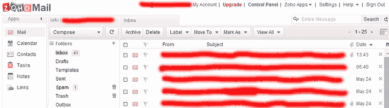
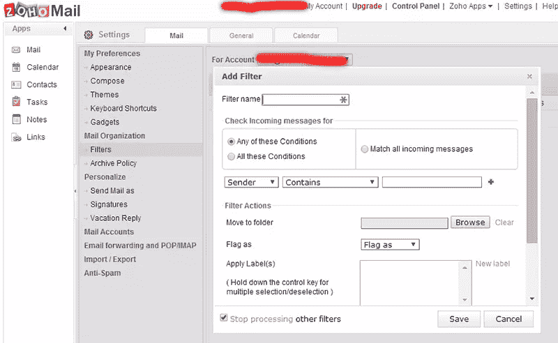
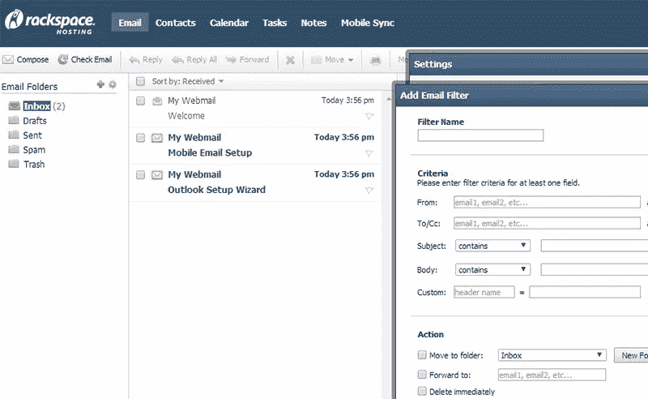
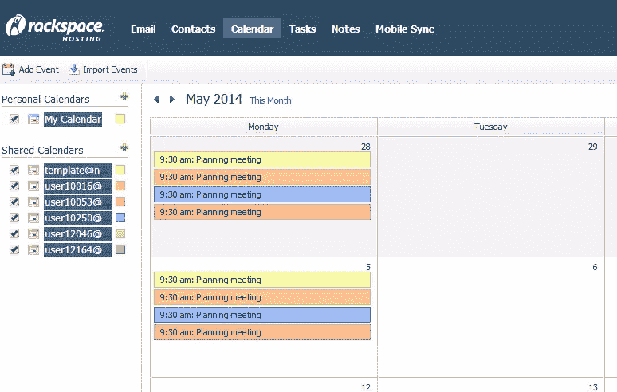
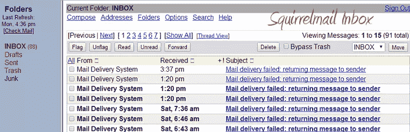

# 3 个伟大的 Gmail 替代品

> 原文：<https://www.sitepoint.com/3-great-gmail-alternatives/>

## 介绍

Gmail 可能是最受欢迎的电子邮件服务之一。但是它有一些主要的缺点:最明显的是网络邮件客户端在你的邮件周围显示有针对性的广告。更重要的是，你不能使用自己的域名，除非你愿意每年支付 49.95 美元。

我喜欢 Gmail 的一点是它在手机上设置起来非常简单。不管是 iPhone，还是 Android(咄)。只需点击手机上的 Gmail 图标，几秒钟内你就可以开始工作了。您还可以使用 Gmail 日历在所有设备上同步您的约会。

它还有一个优秀的垃圾邮件过滤器，允许 POP 和 IMAP 访问，有大量的过滤选项(包括可怕的标签)和非常稳定的连接。

但这一切并不能弥补你不能使用自己的自定义域的事实。任何专业公司都不应该使用“mycompany@gmail.com”电子邮件地址。但是 $ 一年 49，95 是一笔不小的数目，尤其是当你使用多个电子邮件地址的时候(因为是的，这个价格是每个账户的！).

因此，让我们来看看一些 Gmail 的替代品。最好是免费或低价，并明确允许自定义域。IMAP 访问应该是标准的，网络邮件也是如此。如果你能使用集成日历就更好了。

Outlook.com 曾经是 Gmail 的一个很好的替代品:没有广告，几乎无限的存储空间和电子邮件账户都有自己的域名。但他们取消了自定义域名服务，转而支持他们的付费 Office365 产品。

经过几十个电子邮件提供商的努力，我最终选择了 Zoho Mail(唯一的免费选择)、Rackspace Email 和普通的传统主机。事实证明，免费/低价和定制域名的结合是罕见的。

## 免费的替代品: [Zoho Mail](https://www.zoho.com/mail/)

让我先说，如果你不打算需要超过 10 个用户帐户(或者 25 个，如果你推荐 3 个其他客户)，Zoho Mail 将是你最好的选择。

我就是喜欢 Zoho 应用。我以前看过他们的 [CRM](https://www.sitepoint.com/top-5-crm-tools-freelancers-small-businesses/) 和[会计](https://www.sitepoint.com/top-5-accounting-tools-freelancers-small-businesses/)产品，它们都有相同的商业模式:大量的功能和慷慨的免费计划，甚至更多的(相当便宜的)付费账户功能。

Zoho Mail 为每个账户配备了 5 GB 的存储空间，提供了集成的日历、任务和笔记应用程序，甚至还配备了 5 GB 的共享文档存储空间。它有一个网络邮件界面，没什么特别的，但是很容易使用一些基本的设置。您还必须指定一个管理员帐户，您可以使用它来选择一些整体设置。

您可以使用 IMAP 和 POP，使用基于电子邮件地址、内容或优先级以及无限电子邮件别名的过滤器。

设置很简单，只需将你的 MX 记录指向 Zoho Mail，添加一个 SPF 记录，就大功告成了。Zoho 甚至检查你是否做得正确，所以没有邮件丢失。然后，您只需在您的设备上填写他们的 POP 或 IMAP 服务器详细信息

它唯一的缺点是垃圾邮件过滤器。我在很多客户上使用 Zoho，但是仍然有大量的垃圾邮件进来。你不能改变滤镜本身的任何东西(比如提高阈值)。你唯一的选择是将域名列入黑名单，这是一项乏味且无用的任务。

他们免费计划的功能集非常广泛，足以满足小型企业和自由职业者的需求。它甚至附带了支持，以及优秀的支持文档。

基本上，升级的唯一原因是当您需要超过 25 个用户帐户或更多存储时。虽然每个用户每月 2.50 美元，但与大多数付费服务提供商相比还是很便宜。

## 付费选择: [RackSpace 电子邮件](http://www.rackspace.com/email-hosting/webmail/)

说到托管电子邮件，RackSpace 不会是你想到的第一家甚至第二家公司。但是他们开发了一个相当不错的 Gmail 替代品。它不是免费的，但也没有你想象的那么贵。

RackSpace 电子邮件的价格为每个用户每月 2 美元，并配有 25 GB 的存储空间。但说实话，这并不是什么特别的功能。

特别的是他们的 24x7x365 支持，特别是因为您可以通过电话或聊天获得即时响应。他们提供 100%的正常运行时间保证(相比之下，Gmail 的正常运行时间为 99.9%)，这至少可以确保尽最大努力让你的电子邮件不断到来。

RackSpace Email 提供 POP 和 IMAP 访问，并提供一个简单的网络邮件界面(你也可以称之为易于使用)。它提供了与 Zoho 邮件相同的过滤选项。没什么特别的，但它能完成任务。

真正令人惊讶的是联系人和日历屏幕。如果您不介意使用网络邮件，您可以访问共享的日历和联系人。

共享日历在托管电子邮件提供商中并不常见，但如果您正在管理一个销售或支持团队，需要跟进线索或票证，那么共享日历非常重要。

这些功能，加上出色的可靠性和支持，使 RackSpace 电子邮件成为一个很好的选择。如果你真的想去，你甚至可以以每月 10 美元的价格获得虚拟交换。但是普通的电子邮件产品对我们大多数人来说是有用的。

## 自己动手的选择:好的虚拟主机

当提到托管电子邮件地址时，大多数人会想到常规的虚拟主机。但是现在有了一些非常先进的网络邮件客户端，你几乎可以每月花几美元来构建你自己的 Gmail 替代品。在大多数情况下，你可以使用尽可能多的域名和电子邮件地址。

虽然大多数托管公司在其默认软件包中提供 POP、IMAP 和 webmail，但这并不意味着你可以在任何你想去的地方注册。

事实是，许多托管公司并不真的喜欢托管电子邮件，因为如果你吸引了错误的客户，你的 IP 地址很容易被贴上垃圾邮件的标签。

安全(首选 SSL)或非安全 IMAP/POP 访问与基本或高级 webmail 客户端之间也有区别。

所以你必须做一些研究。但是当你这样做的时候，你会发现一些非常有趣的选项。

例如，对于一个客户端，我想使用服务器端过滤电子邮件。虽然这看起来很容易(大多数托管电子邮件提供商都提供)，但对于最流行的网络邮件应用程序来说，情况并非如此。

像 Horde 和 Squirrelmail 这样流行的网络邮件客户端需要一个插件来完成这项任务。这意味着网络主机必须支持它，而大多数主机都不支持。

这似乎是一个微不足道的功能。但是如果这是你的客户正在寻找的，你可能最终会把整个域名转移到另一个提供商，如果你当前的提供商不支持它的话。

唯一的缺点是大多数网络邮件客户端不提供任何类型的日历功能。其中一些提供了插件，但是你的主机必须支持它。

我想说的是，在签约之前，你需要确保你得到了你需要的东西。但是当你这么做的时候，我希望你同意我的观点，使用常规的虚拟主机是一个非常好的 Gmail 替代品，而且成本非常低。

## 结论

通过这篇文章，我想向你展示三种非常不同的 Gmail 选择。Zoho Mail 似乎是最显而易见的一个，如果你只需要几个账户，它可能是最好的选择。

RackSpace 电子邮件是一个非常划算的选择。RackSpace 在支持和可靠性方面享有良好的声誉，其定价也极具竞争力。

通过使用常规的虚拟主机自己做是一个非常可行和便宜的选择，只要你使用一个像样的主机公司。确保你先做好调查。

请在评论中告诉我你更喜欢哪个选项，或者你认为什么是最好的 Gmail 替代选项。

## 分享这篇文章