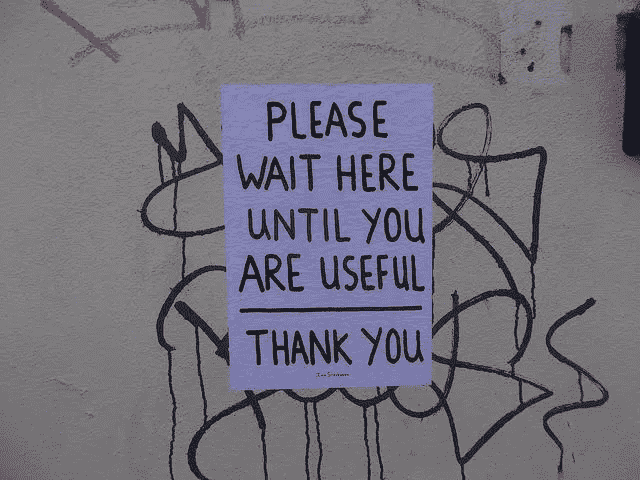
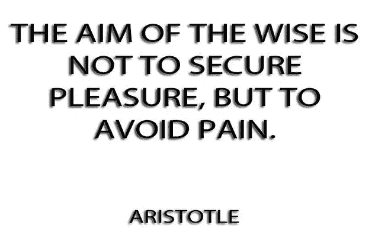
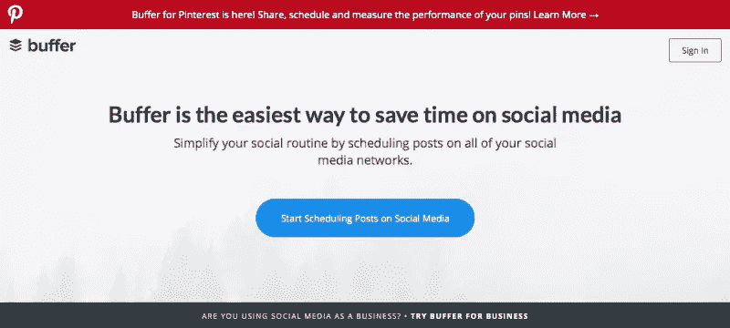
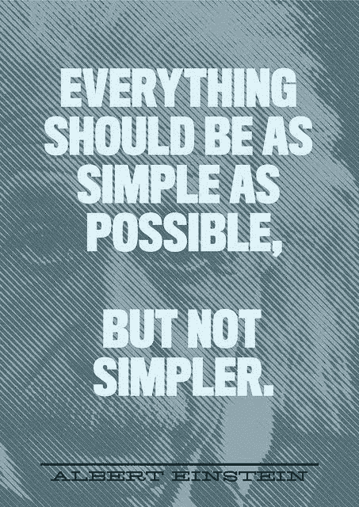
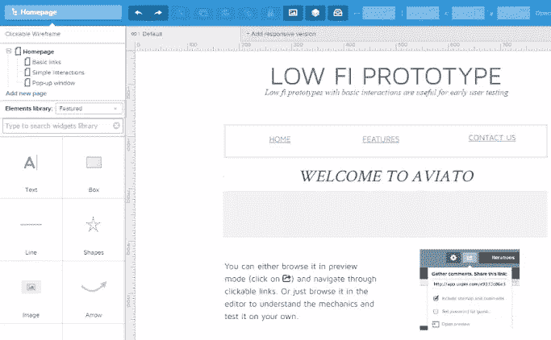
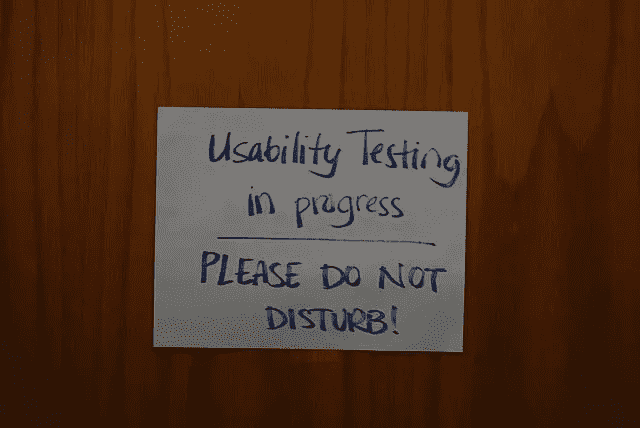
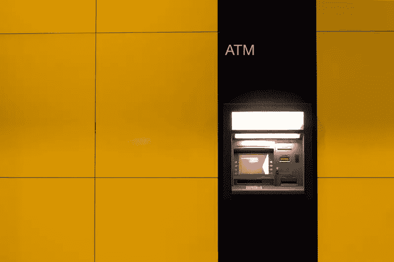
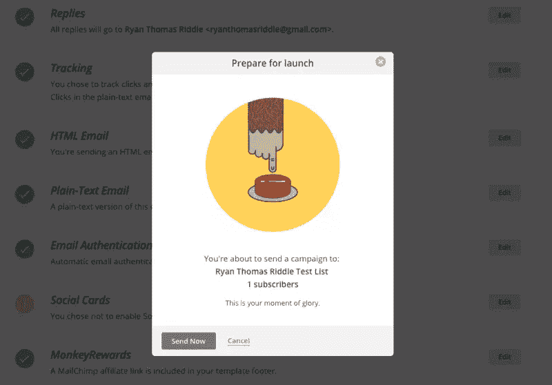
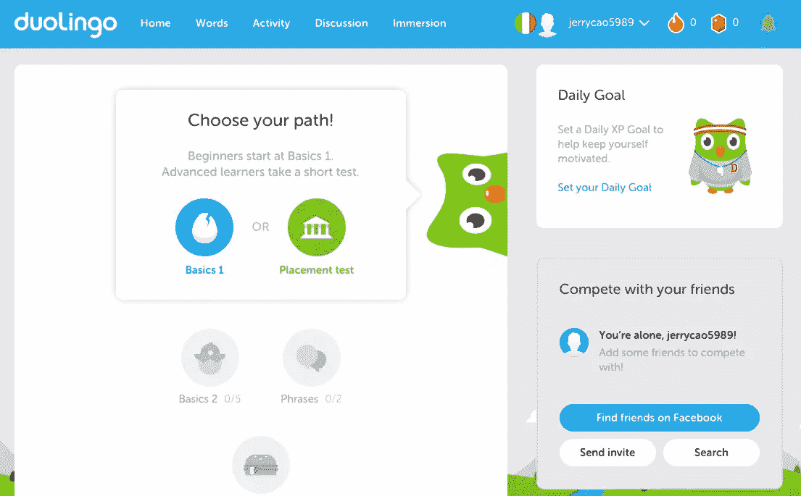
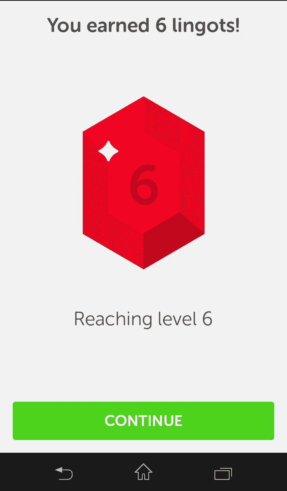

# 成功产品设计的三个“不可协商性”

> 原文：<https://www.sitepoint.com/3-non-negotiables-successful-product-design/>

每个成功的产品都有它们…你的产品有吗？下面我们将产品设计的实践归结为三个基本组成部分。

有用、实用、有趣。

# 1.*有用吗*？

如果我们必须从这三个特征中选择一个最重要的，那就是这个。

首先，产品必须有用。如果一个产品没有用，其他一切都无关紧要，因为没有人会需要它。

图片来源:“[在这里等着，直到你有用](https://www.flickr.com/photos/londonmatt/5764025335/)马特·布朗。[知识共享](https://creativecommons.org/licenses/by/2.0/legalcode)

显然，可用性和可享受性也很重要…只是没有*和*重要。事实上，[密执安大学的一项研究](http://deepblue.lib.umich.edu/bitstream/handle/2027.42/30954/0000626.pdf)不仅证实了这一点，还给出一个数字。有用性是可用性的 1.5 倍。

现在我们知道了 UX 最重要的特质是什么，让我们来谈谈如何实现它。

## 取悦痛苦原则

一个普遍的心理学理论认为许多生物的行为只有两个原因:

1.  得到快乐
2.  避免痛苦

马上，一个有用的产品要么让用户感觉良好，要么解决他们生活中的某种问题。

乔恩·伯格斯通和小比尔·墨菲在为《快公司》撰写的一篇文章中更进一步。他们推荐一种产品，如果更有用的话，可以让用户“避免痛苦”。

好的产品让用户的生活更轻松。历史上最成功的产品要么提供了别人没有提供的有用服务，要么提供了竞争对手缺乏的有用功能。解决一个问题向用户展示了更多的价值，而不仅仅是使用起来有趣(尽管两者都很重要，我们将在后面解释)。

图片来源:“[智者的目标……](https://www.flickr.com/photos/quoteseverlasting/9423117353/)”永恒引用。[知识共享](https://creativecommons.org/licenses/by/2.0/legalcode)。

你怎么知道你的用户有什么问题？答案很简单— [客户开发](http://www.startuplessonslearned.com/2008/11/what-is-customer-development.html)。访谈、调查、日记研究、分析、A/B 测试等。揭示用户的紧迫问题是与你的产品有关的，还是与你的产品无关的，以及他们解决这些问题的偏好是什么。

一旦你对如何帮助用户避免痛苦有了一个坚实的想法，你总是可以用 MVP 来验证你的假设。

## 最小可行产品

在推出完整产品之前，用一个 [MVP](http://www.uxbooth.com/articles/putting-the-vp-into-mvp/) (最小可行产品)进行试水。这是你的产品最基本的版本(*最小*，仍然显示出它的价值(*可行*)。在完成产品之前发布一个 MVP 会让你得到一些重要的反馈，你可以在最终发布之前实施这些反馈，并且表明你的产品想法是否真的有用。

[MVP 可以有不同的形式和形状](http://thenextweb.com/dd/2014/11/12/15-ways-test-minimum-viable-product/)，但这里有三个最好的:

*   **发起一场筹款活动** —在我们的免费电子书 [UX 创业设计](https://www.uxpin.com/knowledge.html)中，我们解释了筹款是如何作为测试你的产品有多有价值的一种手段，并让你从一开始就与支持者保持直接联系。

*   **创建一个登陆页面**–一个单独的带有电子邮件表单的登陆页面可以在网站发布前建立一个早期的基础。运行一些广告( [Adwords](https://www.google.com/adwords/) )来产生兴趣，然后检查流量或电子邮件的统计如何。

*   **《绿野仙踪》产品**——假装直到你成功。鞋类零售商 Zappos 的联合创始人 Nick Swinmurn 亲自去商店购买用户选择的鞋子，然后发货。这需要奉献和努力，但这是一个廉价和低技术含量的方法来测试他的想法。

图片来源:[缓冲](https://buffer.com/)

一个很好的组合是 [Buffer](https://buffer.com/) ，它从模仿主页的登陆页面开始，围绕着使用产品的行动号召。CTA 是假的，并把用户带到一个道歉页面，解释说他们仍在对它进行“最后的润色”。然而，他们收集了“早期天使”的电子邮件，并确定有足够多的人愿意使用它。

因此，他们验证了他们的产品想法确实有用。

# 2.是*功能性*吗？

一旦你有了一个有用的产品想法，你最好确保它是可行的。“功能性”描述了产品实现其目的的能力。用另一个词来说，可用性。

图片来源:“[简单 2](https://www.flickr.com/photos/bjornmeansbear/5010984974/) ”克里斯蒂安·比约纳德。[知识共享](https://creativecommons.org/licenses/by-sa/2.0/legalcode)

根据尼尔森诺曼集团的 UX 专家的说法，可用性有五个因素:

*   **效率—** 用户完成任务的难易程度。

*   **错误—** 用户或界面犯了多少错误。

*   **可学性—** 用户学会如何使用它的速度。

*   **可记忆性—** 用户在不在时记得如何使用它。

*   **满意度—** 用户喜欢使用它的程度。

因为这些需求是非常技术性的，所以可以用技术方法来处理。我们发现下面的三步法是最有效和可重复的。

## Wireframe

线框化设计可以让你在更容易修改的时候，在进入更复杂的可用性和视觉决策之前，尽早固化结构和导航。把它们想象成你设计的骨架，真正的肉在后面。

如果你碰巧使用像 [UXPin](https://www.uxpin.com/) 这样的协作设计应用，你甚至可以通过拖放来添加交互。这将把你的线框图变成低保真度的原型，所以你可以马上开始对真实用户进行可用性测试。

## 测试原型

任何保真的可行原型都可以提供你需要的答案，使你的设计适合你的目标用户。测试在进行方式上有所不同，但它们应该总是涉及至少五个用户。

图片来源:“[可用性测试正在进行中](https://www.flickr.com/photos/roebot/2964156413/)亚伦·富尔克森。[知识共享](https://creativecommons.org/licenses/by-sa/2.0/legalcode)。

测试产生定性或定量数据，但最好两者都有。记录量化的细节，如时间、点击量、访问了哪些页面等。而且还能引出用户在使用系统时感觉如何的定性反馈。测试后的访谈或调查会有所帮助，让用户在测试中大声说出他们的想法也是如此。

## 重复测试，直到准备就绪

立即实现一个测试的结果，然后测试下一个迭代。在整个设计过程中一遍又一遍地重复这个循环，以确保你的产品符合用户的需求。

# 3.是不是*过瘾*？

人类并不是我们自认为的理性生物。

UX 先锋 Don Norman 解释道:情绪是我们做决定的重要因素，经常超越逻辑。其背后的科学是我们“直觉”的进化发展——在生死关头，我们根本没有时间列出利弊清单。

图片来源:[兆瓦 86](https://www.flickr.com/photos/32317927@N07/3403076282/) 。[知识共享](https://creativecommons.org/licenses/by-sa/2.0/)

其他研究也支持这一点。克洛斯正明和香织·柏村证明了用户认为有趣的产品更有用。研究人员测试了两台自动取款机，一台全新，另一台破旧，但可用性相同。用户认为美观的功能更好。

事实上很简单:当用户玩得开心时，他们就放松了。当他们放松时，他们的大脑工作更顺畅。当用户玩得开心时，像学习和回忆——甚至是运动技能——这样的精神活动会表现得更好。

**制造享受**

不幸的是，设计一个令人愉快的产品并不像理解它为什么重要那么简单。不同的用户类型响应不同的触发器。

最容易的起点是视觉。审美与享受密切相关。，但同样没有一个包治百病的视觉风格，每个人都会喜欢。至少，保持你的图片干净和高质量。

惊喜也与快乐联系在一起。用户喜欢复活节彩蛋，就像可发现的微交互一样。

游戏化功能，如奖励系统或解锁选项，也可以增加乐趣——但要小心。正如在 [UX 游戏化重新定义](https://studio.uxpin.com/ebooks/ux-gamification-redefined/)中所解释的，这些策略可能会产生相反的效果，并惹恼用户，除非它被嵌入到现有的行为模式中。

照片致谢 **:** [MailChimp](http://mailchimp.com/)

而且别忘了你文案的语气也可以娱乐。一个恰当的笑话或可爱的措辞可以让你的用户微笑，甚至缓解紧张的行为，就像上面的 [MailChimp](http://mailchimp.com/) 。

## 行动中的 3 种特质

要了解这三种特质，让我们看看语言学习网站 [Duolingo](https://www.duolingo.com/) 。

图片来源:[多林戈](https://www.duolingo.com/)T3 

**有用的**。大多数人都想学习一门新的语言，所以让学习变得“简单”和有趣的服务肯定是有用的。因为它是免费的，并且应用了一个类似游戏的教学系统，这是一个比筛选教科书更有用的选择。

**功能**。Duolingo 如此受欢迎是因为它实际上兑现了自己的承诺。教学方法是健全的，界面控制易于学习，理解和记忆。内容以针对每个用户定制的速度交付。

图片来源:[灵歌](http://www.lingholic.com/wp-content/uploads/2014/05/Earning-lingots-on-Duolingo.png)

**过瘾**。同样有效的教学方法也使得 Duolingo 使用起来很有趣。学习是通过有趣的游戏完成的，用户可以获得一个货币系统来购买额外的功能。美学也是例外，平滑的平面设计图像和一个有趣的猫头鹰吉祥物。

## 延伸阅读

要了解更多我们在本文中讨论的要点，请浏览我们的免费设计电子书库。这篇文章只是对这些精心设计的主题的概述。

具体来说，看看上面讨论的主题的电子书:

*   [交互设计最佳实践](https://studio.uxpin.com/ebooks/interaction-design-best-practices-tangibles/) —我们最受欢迎的电子书系列之一，涵盖了交互设计的细微差别和实用建议。[第 1 卷](https://studio.uxpin.com/ebooks/interaction-design-best-practices-tangibles/)涵盖视觉层次、文案、负空间等方面；[第 2 卷](https://studio.uxpin.com/ebooks/interaction-design-best-practices-intangibles/)涵盖了动画、响应时间和用户行为等主题。

*   可用性测试指南——你需要知道的关于可用性和用户测试的一切，包括可用的不同类型的测试，以及如何进行测试的建议。

*   [UX 设计流程最佳实践](https://studio.uxpin.com/ebooks/ux-design-process-documentation-best-practices/) —一本 100 多页的指南，介绍整个 UX 设计流程，从开始到结束，包含专家指点和最有用文档的指南。

## 分享这篇文章