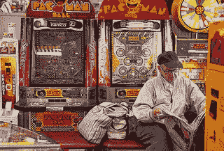
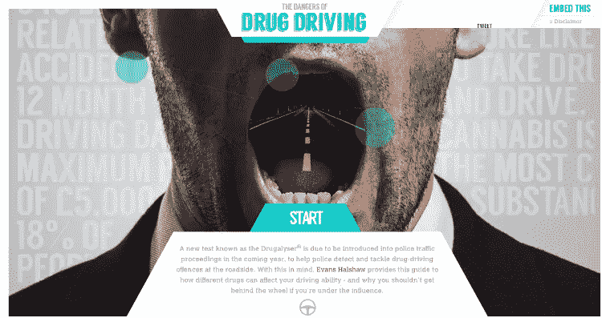
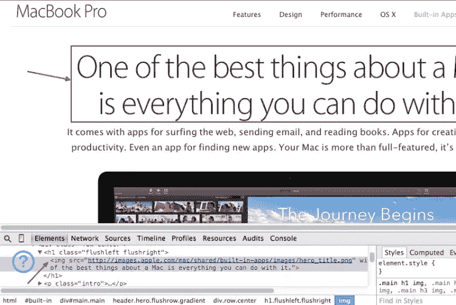

# 3 旧的和过时的 UX 模式(以及如何修复它们)

> 原文：<https://www.sitepoint.com/3-outdated-ux-patterns/>

摄影:R·施菲尔德

在我最近的一篇文章中，[汉堡包图标的演变](https://www.sitepoint.com/evolution-hamburger-icon-pattern/)我们讨论了这种常用模式的历史，以及谁在使用它，为什么。

事实上，最近在 [UX 圈子](https://www.sitepoint.com/challenge-re-imagining-hamburger-icon/ "Challenge: Re-Imagining the Hamburger Icon")中有许多[讨论](https://community.sitepoint.com/t/ux-challenge-re-thinking-the-hamburger-icon/97847/27 "SitePoint Community discussion on Hamburger Icons")已经提出了汉堡图标的反直觉本质和几个案例中的问题。

在这篇文章中，我认为我们应该关注 2014 年非常常见的三种*其他*UX 模式。每一个都是如此的普遍和单调，以至于我们在使用它们的时候可能都不会想太多。

但是也许我们应该。

如果你读过我的文章，你会知道 UX 模式的有效性取决于很多因素，没有科学公式可以告诉你选择“x”是完全正确还是错误。你是唯一能够真正判断它是否符合你的观众需求的人，你将做出最后的决定。

然而，如果不被质疑，即使是广受质疑的 UX 模式，在它们本应成为历史注脚之后，也往往会持续很久。

我们要研究的 UX 模式是:

*   #### Large background image

*   #### Text as image

*   #### giant menu

此外，为了帮助您继续前进，我将为您提供这三种(我相信)过时的设计模式的一些替代方案。

## 1.大型背景图像

近年来，全景背景图片已经成为一个非常热门的网页设计趋势，它们已经接近陈词滥调了。你不需要走很远就能找到几十个[创造性的例子](http://www.jenslehmann.com/#/ambassador)，它们漂亮地展示了这项技术。网络上仍然充斥着[迷人的登陆页面](http://www.evanshalshaw.com/more/effects-of-drug-driving)、大型作品集，在某些情况下，甚至传统的[企业网站](http://www.starbucks.com/)也使用专门的全屏背景照片让用户眼花缭乱。

http://www.evanshalshaw.com/more/effects-of-drug-driving

尽管有些图片在网站上给人留下了非常深刻的视觉冲击，但你通常需要考虑这种做法的替代方案，尤其是对于拥有重要移动受众的网站。

即使老话“一张图片胜过千言万语”是正确的，并且通过图像传达的信息比书面数据更容易记住，开发者也应该注意如何以及何时将这一原则应用到网页设计中。

一个你不能低估的关键因素是，这些巨大的、视网膜就绪的背景通常等同于巨大的、消耗带宽的文件大小。这反过来会对加载时间产生巨大影响，直接影响用户体验。

由于这些背景图片通常是关于设置视觉基调或情绪的，而不是传达所需的信息，它们给页面增加了大量的重量，却没有给用户带来多少好处。

屏幕一般小于 1024px 的用户是绝对看不到背景图的。小屏幕根本没有显示内容和背景图像的屏幕空间。他们基本上压制了成千上万的像素，然后扔掉！

### 有什么选择？

您可以考虑使用两种替代方案:

*   [上下文感知图像尺寸](http://filamentgroup.com/lab/responsive-images-experimenting-with-context-aware-image-sizing.html)，其目标是“为响应性布局提供优化的上下文图像尺寸，这些布局在不同分辨率下利用了显著不同的图像尺寸”
*   [Interchange](http://foundation.zurb.com/docs/components/interchange.html) 允许您根据用户的浏览器在响应站点上动态加载内容，因此您可以针对合适的用例选择小型、中型和大型图像。

#### 综上

大图片有可能会失去你的客户/读者，否则他们会访问你的网站。设身处地为用户着想，想象他们对你的网站的体验(尤其是在移动设备上浏览)。

测试你的页面加载时间，最后，决定采用最适合你的读者的方式。

## 文本作为图像

我怀疑许多人可能在阅读这篇文章时会想"*老实说，真的还有人这么做吗？*”。你可能会感到惊讶。

图像中的文字仍然是苹果的一个特色

Apple.com 已经在整个场地使用这项技术很多年了。在他们的 [Mac Mini](http://www.apple.com/mac-mini/) 、 [MacBook Air](http://www.apple.com/macbook-air/) 和 [MacBook Pro](http://www.apple.com/macbook-pro/built-in-apps-retina/) 页面中，你仍然会发现图像文本被广泛使用。事实上，你甚至会在他们的[全新 iPhone 6 产品页面](http://www.apple.com/iphone/ "Image Replacement")上找到大量的例子。

谁说 IR 死了？

当然，有很多很好的理由来避免在图像中嵌入文本。

对于调整屏幕/图像大小的用户来说，基于图像的文本表现不佳——这种行为在今天的多尺寸设备中比我们 5 年前想象的要常见得多。

其次，我们知道图像中嵌入的文本使得文本本身在默认情况下对屏幕阅读器不可访问。有变通办法，但我们正在给自 20 世纪 90 年代初以来一直完美运行的东西增加脆弱的复杂性。

第三，图像在视网膜上看起来很糟糕，除非你单独优化每一张。更新和文本编辑的固有灵活性要小得多，即使是最小的编辑也需要生成全新的资产。

最后但并非最不重要的一点是，当页面上的内容都被困在图像中时，搜索引擎很难索引和理解页面上的内容。尽管谷歌很聪明，但你经常从图像搜索中得到的疯狂结果证实了计算机解读图像有多难。

所以，如果你真的需要在你的项目中使用一个带有文本的图像，记得总是给你的图像添加一个描述性的`alt`属性，除非它们纯粹是用于装饰目的。此外，当使用图像作为链接时，输入链接位置的描述。

### 有什么选择？

基于图像的文本最常用于设计者希望更多地控制排版呈现方式的时候。

你应该考虑使用**网络字体**的可能性，而不是采用文本作为图像的方法。这些是字体文件，我们可以应用于网站中的任何文本，包括由内容管理系统(如 WordPress)生成的文本。

各种设备都可以访问文本，搜索引擎可以读取和索引文本。网络上有很多非常棒的适合你的免费字体。有许多不同种类的网页字体，你可以考虑。最著名的有:

*   [谷歌字体](https://www.google.com/fonts)
*   [MyFonts.com](http://www.myfonts.com/)
*   [排版](http://www.typography.com/cloud/welcome/)
*   [字体松鼠](http://www.fontsquirrel.com/tools/webfont-generator)
*   [型式](https://typekit.com/)

知道为什么苹果不相信这种方法会很有趣

## 巨型菜单

几年前，Craig Buckler 写了一篇关于巨型下拉菜单现象的文章,这是一种在网页设计中流行的趋势。

巨型菜单通常用在大型网站上，这些网站有许多潜在的目标页面供用户导航。

巨型菜单不仅仅使用单向下拉菜单，而是打开一个扩展区域，提供更多选项。虽然巨型菜单可以让用户更容易地通过更少的点击进入网站，但这种大量的选项也可能会淹没一些访问者。

### 有什么选择？

巨型菜单有很大的潜力，与其用其他种类的菜单代替它们，不如花时间改进它们的结构。

您可以采用以下一些良好实践来完成这项任务:

*   使用指示器显示交互性(加号、减号、向下箭头)。
*   使用瞬时过渡。
*   尽可能以最好的方式管理宽度和对齐方式(例如添加额外的填充以使用户不会出错)。
*   不要使用不寻常的过渡或意想不到的效果，以免惹恼用户。
*   不要让菜单过于拥挤，让用户不知所措。

#### 综上

首先，测试你的菜单在触摸屏设备上的导航可用性是非常重要的。一个包含精心设计的交互、结构良好的信息架构、一致性和出色的用户界面的大菜单可以在很多方面让公司和用户受益。

然而，你必须确保它不会给他们带来额外的挫折(例如，意外的悬停交互)或通过减慢他们的航行来阻碍他们。

## 结论

在本文中，您发现了一些常用设计模式的替代方案。用户关心这些元素是如何影响的，你的目标应该是在任何连接速度下，用任何合理的设备使他们的交互变得容易和愉快。

专注于如何获得尽可能好的体验，不断尝试，直到找到合适的解决方案。

## 分享这篇文章