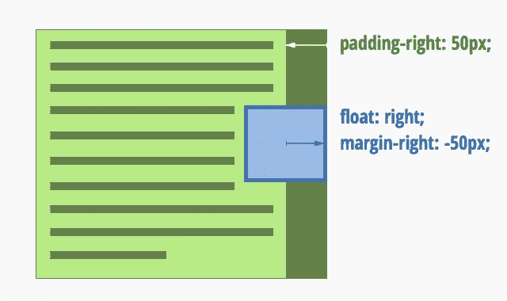

# 关于 CSS 没有人知道的 3 件事

> 原文：<https://www.sitepoint.com/3-things-almost-one-knows-css/>

以为自己懂 CSS？如果我过去六个月在网上提供的一个免费 CSS 测试的结果可以继续下去的话，许多有经验的开发人员并不像他们想象的那样了解 CSS。在迄今为止参加测试的 3000 多人中，平均得分仅为 55%。

但是，平均水平本身并不那么有趣。我更好奇人们在哪些问题上犯了错误。对于这篇文章，我计算了一下数据，并把注意力集中在三个人们得分特别低的问题上。我会给你讲解每个问题，给你看大多数人选择的答案，并解释正确的答案。

可以肯定地说，如果你在读完这篇文章后[自己参加考试](https://sitthetest.com/tests)，你将拥有不公平的优势！

## 问题 1:如何最好地设置`line-height`

对于经常处理文本样式的人来说，第一个问题应该很简单:

> 您希望网站上的文本默认为双倍行距。以下哪个`line-height`值是实现这一目标的最佳方式？
> 
> *   `200%`
> *   `2em`
> *   `2`
> *   `double`

有四个答案可供选择，你会认为 25%的人会凭运气得到正确的答案，只有 31%的人答对了！花一分钟时间为自己选择一个答案，然后继续读下去。

首先，`double`是一条红鲱鱼。`line-height`接受的唯一关键字值是`normal`。我很高兴地说，只有 9%的人上当了。不过，剩下的三个答案都很受欢迎。

大多数人选择的答案是`2em` (39%的人选择了这个)。实际上，`2em`肯定会为它所应用的元素提供双倍行距的文本；但是`200%`也会，只有 21%的人喜欢*那个*的回答！要么是 em 比百分比更流行，要么是人们并不真正理解它们。

不过，正确答案是`2`。

这是很久以前灌输给我的教训，当时我刚开始学习 CSS。**总是指定`line-height`为无单位数**；这样，指定不同`font-size`的后代元素将继承*的那个数字*，而不是一个固定的行高。

假设页面的默认`font-size`为`12pt`，但它也包含一个标题，标题的`font-size`为`24pt`。如果您将正文的`line-height`设置为`2em`(或`200%`)，那么您将在文档中的任何地方获得精确的`24pt`(两倍于正文的`font-size`)行高——即使在标题中也是如此。因此标题将是单倍行距，而不是双倍行距！

相反，将`line-height`设置为`2`会告诉浏览器保持字体大小/行高的比例，即使字体大小发生变化。正文的行高将是`24pt`，但是对于标题的`24pt`字体，行高将自动增加到`48pt`。

## 问题 2:如何让元素重叠

这个问题有点棘手。它需要一些 CSS 布局经常需要的“卑鄙手段”的经验:

> 下列哪个 CSS 属性，单独使用会导致 HTML 元素重叠？
> 
> *   `z-index`
> *   `margin`
> *   `overflow`
> *   `background`

找到答案了吗？好吧，我们开始吧。

又一次，有一个容易消除的选项:`background`。除了 2%的考生都避开了它，因为他们知道它控制背景颜色和图像。

不幸的是，大多数人直接进入了`z-index`。整整 46%的人接受了这个观点。我猜是因为没有人真正了解`z-index`是怎么工作的。事实上，设置`z-index`属性本身对*没有任何影响*；您还需要为`z-index`设置一个元素的`position`属性来做任何事情。简而言之，`z-index`让您控制*与*重叠的元素的堆叠顺序，但是它们首先需要重叠。MDN 有一篇名为“理解 CSS z-index”的非常好的文章，值得一读，了解更多细节。

如果你用过的话，应该也很容易消除。它控制不适合某个大小的框的内容的行为:是否被截断，是否溢出框的边缘，等等。同样，这取决于盒子的大小受到其他属性的约束；本身不会造成重叠。尽管如此，仍有 22%的人认为有可能。

这就给我们留下了正确答案`margin`。只有 30%的人得到了它。你可能想知道在地球上一个在元素之间创造距离*的属性怎么会导致它们重叠。如果你做过任何现实世界的 CSS 布局，答案应该是显而易见的:**负边距使东西重叠。***

为了演示这一点，创建一个包含两个`div`元素的页面。将第二个`div`上的`margin-top`设置为负测量值，例如`-100px`。嘭！第二个`div`现在覆盖了第一个`div`底部的一百个像素。

实际上，您几乎不会故意这样重叠块，但是负边距对于将 HTML 元素压缩到它们通常不去的地方非常有用。我经常使用它们将左浮动或右浮动的元素推入其父框的填充区域。

对于网页设计历史爱好者来说，在 2005 年，负边距的重叠元素使得三栏页面布局成为可能，比如所谓的[一个真正的布局](http://positioniseverything.net/articles/onetruelayout/)(以及后来的[圣杯布局](http://alistapart.com/article/holygrail))。

## 问题 3:伪元素 vs 伪类

我承认，最后这个问题有点卑鄙。但是只有 23%的考生能够正确回答(这比概率还糟糕！)，这显然触及了一个困惑点:

> 使用伪元素可以最好地实现以下哪种效果？
> 
> *   当用户将鼠标悬停在超链接上时，给超链接添加阴影。
> *   当复选框被选中时，以不同的颜色显示复选框的标签。
> *   给表格的偶数行和奇数行不同的背景颜色。
> *   在灵活的页面布局中，以粗体文本显示段落的第一行。

这些选择中的三个是你用伪*类*获得的效果；只有一个涉及伪元素。你能看出区别吗？

一个**伪类**是一个特定的状态，在其中一个实际的 HTML 元素可以找到它自己。可以把它想象成一个*虚拟*类，在特定条件下由浏览器自动应用于元素。

一个**伪元素**是文档的一部分，即使它不是一个实际的 HTML 元素，CSS 也允许您对其进行样式化。它就像一个*虚拟* HTML 元素——即使它周围没有实际的 HTML 标签，你也可以对其进行设计。

记住这一区别，让我们浏览一下选项:

### 当用户将鼠标悬停在超链接上时，给超链接添加阴影。

超链接是一个实际的 HTML 元素。仅在特定情况下(当鼠标在它上面时)对它应用样式意味着我们在使用一个伪类。在这种情况下，您将使用的伪类是`:hover`。

22%的考生认为这是一个伪元素。

### 当复选框被选中时，以不同的颜色显示复选框的标签。

同样，`label`是一个真实的 HTML 元素，而不是虚拟的。当一个复选框被选中时，浏览器对它应用`:checked`伪类。然后你可以在你的选择器中使用它来设计复选框的样式，甚至是它旁边的`label`(例如，使用带有`+`的相邻兄弟选择器)。

20%的考生认为这是一个伪元素。

### 给表格的偶数行和奇数行不同的背景颜色。

这是一个真正愚弄人的方法，但是我们再次讨论将样式应用于实际的 HTML 元素(在本例中是`tr`元素)。一个`tr`在其父元素的子元素集合中是偶数还是奇数，这是另一种可以与伪类匹配的情况。

在这种情况下，偶数元素的伪类是`:nth-child(even)`(或`:nth-child(2n)`),奇数元素的伪类是`:nth-child(odd)`(或`:nth-child(2n+1)`)。

我猜这只是因为`:nth-child`和伪元素听起来都像是很难理解的 CSS 特性，但是有整整 36%的考生选择了伪元素。

### 在灵活的页面布局中，以粗体文本显示段落的第一行。

这当然是正确的答案。到目前为止，希望区别已经很明显了。在一个灵活的页面布局中，你不能看着一个页面的 HTML 代码说“那个元素只包含段落文本的第一行”。浏览器根据段落的宽度自动换行，这在灵活的页面布局中是无法控制的。

`:first-line`是一个伪元素，允许您将样式应用于块中文本的第一行，而不管第一行在哪里换行。

如果你在想“好吧，当然，这些都有道理，但是拜托——*没有人*知道伪元素和伪类之间的区别”，那么 W3C 同意你的观点。在 [CSS3 选择器规范](http://dev.w3.org/csswg/selectors-3/#pseudo-elements)中，为了区分两者，它改变了语法，使得伪元素选择器使用两个冒号(`::first-line`)，而伪类仍然使用一个冒号(`:hover`)。当然，为了向后兼容，浏览器必须支持两个版本。

所以，就像我说的:便宜行事。但是，如果你像我一样是一个 CSS 极客，我想你会从你的伪类中知道你的伪元素。

## 你表现如何？

这就是:测试中的三个难题。如果你自信地回答了其中一个问题，你做得很好。有两个吗？一点也不差。如果这三个你都有，我很想收到你的来信！特别是现在我已经给出了这些问题的答案，我真的可以用一些想法来解决更棘手的 CSS 问题。把它们贴在评论里！

如果你喜欢这些问题，也许你会想尝试一下测试的其余部分。请放心，其他问题比这些问题*简单多了*…大部分！

## 分享这篇文章