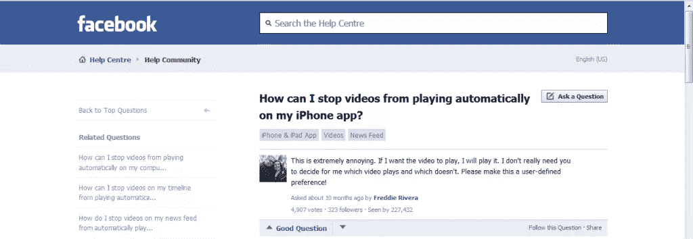

# 让你的应用程序不那么烦人的 3 个技巧

> 原文：<https://www.sitepoint.com/3-tips-make-apps-less-annoying/>

互联网包含了无穷无尽的信息，其可能性也是无穷无尽的。你可以找到问题的答案，了解你喜欢的东西，交流，购物等等。

在网上冲浪或使用移动应用程序时，有多少次你会因为意想不到的事件或事情而感到烦恼？当你在执行任务中面临太多障碍时，你有多少次感到沮丧或紧张？这种情况在我身上发生过好几次。

在这篇文章中，我想和你分享网站和应用程序常犯的三个错误，以及这些错误如何影响用户的满意度(至少是我的满意度)。

## 请让我玩吧！

我们要讨论的第一个例子来自游戏领域。网络游戏是一项受所有年龄段的人喜爱的流行活动。一些网络游戏是通过访问一个网站来玩的，但现在，由于移动设备的进步，人们也可以在他们的移动设备上享受游戏。

让我们假设你想在你的智能手机上玩你最喜欢的足球游戏。第一次打开时，游戏会询问你是想使用社交网络登录，例如脸书，还是开始玩游戏，如下所示(抱歉，截图是意大利语)。

游戏加载后，您(用户)会看到这条消息:

> 脸书登录为您提供了许多优势，例如管理同一个团队，并在不同的设备上与朋友一起玩。您想现在登录脸书吗？

然后，你可以选择是登录还是开始玩。

就我个人而言，除非绝对必要，否则我不喜欢透露我的个人数据。假设你分享了我的观点，点击了*“留下我玩”*，你就期望游戏已经注册了你的选择，不会再问了。

*错误的假设！*这个游戏(很多人喜欢它)会在你每次运行应用程序时询问你是否想登录脸书。更糟糕的是，这个问题没法回避。**讨厌，是不是？**

这个例子是最常见的烦恼之一，但对我们大多数人来说，这并不是你可能遇到的最糟糕的问题。

## 请不要阻止我！

现在，想象一下，你正在搜索你下一个假期要去的城镇的照片集。你会发现一个非常棒的网站，里面有很多社区上传的视频和图片。

你想快速浏览你选择的城市的全部收藏，但是当你点击链接时，一个意想不到的建议出现了。

它的目的是*帮助*你有更好的体验，因为它已经检测到你正在使用移动设备，并邀请你下载他们的移动应用程序。

结果是你不能快速直接地得到你需要的东西。**这就烦了**。

许多服务和公司都追随这一趋势，一个真实的例子是 LinkedIn，它是最著名的职业网络之一。

不久前，我在查看收件箱时，收到了一份时事通讯，其中包含了 LinkedIn 上最近最热门讨论的一些链接。因为我想阅读这些，我点击了链接，等待页面加载。

由于我没有登录我的 LinkedIn 帐户，所以系统提示我登录或注册。我点击了登录，但没有允许我输入我的电子邮件和密码，而是提示我下载移动应用程序(带有一个非常小的移动版本网站的链接)。

你可以假设这不仅是极大的时间损失，而且再一次，**烦人的**！

## 请让我选择！

我想提到的最后一个例子与历史上最著名的社交网络有关，*脸书*。我要讨论的功能并不是一个新功能，我相信你知道马克·扎克伯格的团队推出的最糟糕的功能之一。我说的是视频自动播放。

脸书去年 12 月推出了自动播放视频和视频广告。新功能可以在桌面和移动设备上自动播放没有声音的视频，只要它们出现在您的新闻订阅源中。如果你继续滚动，它们就会暂停，并从屏幕上消失。如果您点击视频，它将以全屏模式播放，并带有声音。

当脸书首次确认自动播放视频时，它说不会有退出设置。如果你对观看视频不感兴趣，它建议你滚动浏览。有很多用户觉得这个功能真的很烦人(包括我自己)，你可以从[脸书帮助中心社区](https://www.facebook.com/help/community/question/?id=10201362620400626)发起的许多讨论中看到，它受到了高度批评。

然而，最著名的在线视频分享服务公司 Instagram(被脸书收购)也犯了同样的错误。

如果你在移动设备上打开你的脸书时间线或 Instagram 账户，有人发布了一个视频，它会自动加载并播放，即使你不想看它。如果你处在一个需要安静的环境中，这可能会特别烦人。

最近，脸书给了它的用户一个选择，如果他们想利用这个*功能*的*优势*。如果他们不想播放视频，或者只在 Wi-Fi 上播放，他们可以更改默认设置。

这里有一个坏消息。你必须在你使用的每台设备上分别关闭视频。事实上，如果你选择退出桌面版脸书，你的偏好不会被带到你的 iPhone 或 Android 设备上。你必须访问每个设备上的设置页面来进行更改，这也是**让**用户感到恼火的地方！

允许人们对其新功能进行投票，让他们控制自己想看的内容和方式，这将符合公司的利益，因为每个人都会有不同的看法。我个人认为，最好的方法是考虑用户的体验和需求。在这种情况下，脸书本可以避免所有的批评，只要它征求用户的反馈。

## 结论

在这篇文章中，我讨论了让用户烦恼的事件或特性，以我的拙见，这些事件或特性会让用户的体验更糟。用户体验应该是开发者首先关注的事情之一。每一个选择都应该考虑用户的反馈、建议和批评。如果目的是让用户更快乐或更专注于网站/应用程序提供的服务，为什么要引入让他们讨厌并让他们离开的功能呢？

新特性应该总是被测试(A/B 测试是你的朋友)。其次，**“保持简单”**的规则是有效的，用户想要满足一个需求，他们越早实现目标越好。

不要让他们感到不满足，最重要的是，不要用无用的功能来烦扰他们或浪费他们的时间。

## 分享这篇文章