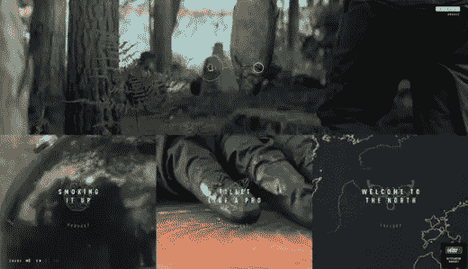
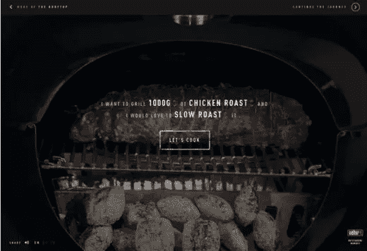
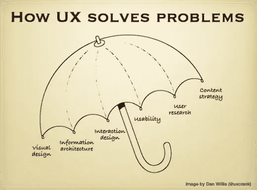
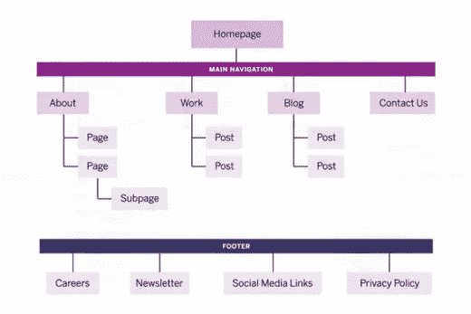
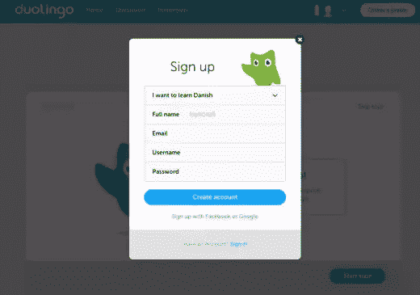
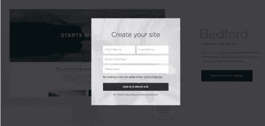

# 扼杀你设计的 3 个 UX 错误

> 原文：<https://www.sitepoint.com/3-ux-mistakes-kill-design/>

 <object data="https://www.sitepoint.com/wp-content/uploads/2015/12/1449448639killing-your-design-linked-xml.svg" type="image/svg+xml">UX 设计当然不容易，但客户和利益相关者的高期望有时表明并非如此。决策者并不总是了解设计过程，他们把设计师视为无所不知、无所不能的天才。

但是不要有压力。

从我在 [UXPin](https://www.uxpin.com/) 与设计团队的对话中，我们注意到了一些每个设计师都应该警惕避免的常见陷阱。

让我们来探讨每个错误和解决方案，让你保持敏锐。

## 错误 1:为自己设计

当你在一个创造性的领域工作时，你倾向于形成强烈的观点，并通过你个人偏好的视角来看待你的工作。但重要的是要记住，你只是一种类型的用户。

设计师从来都不是目标用户。

有效的 UX 设计师将他们自己的个人喜好从设计中分离出来。他们明白，他们是在为思维和行为方式与他们不同的用户设计——UX 设计师的技能可以用他们对自己以外的个性的同情程度来衡量。

当然，把你的需求和用户的需求分开并不总是容易的。设计师对他们的创作有一种近乎父母般的责任感，偏爱有利于他们目标的设计选择，而不是产品的目标。

但是你的责任是对用户(和利益相关者)，而不是你的自我。

让我们来看看 Weber Grills 设计的[烧烤文化](http://www.bbqcultures.com/en_GB/)网站的设计选择。UX 的每一项决策都致力于一个非常具体的目标用户:喜欢户外运动的中年人(可能是男性)。

图片来源:[烧烤文化](http://www.bbqcultures.com/en_GB/)

图片来源:[烧烤文化](http://www.bbqcultures.com/en_GB/)

大胆丰富的色彩、高清图像和清晰的介绍视频——配以男性化的画外音——都对户外运动者和周末战士有吸引力。该网站甚至用一个交互式滑块来模拟打开的兴奋感。mad-libs 风格的形式也迎合了用户的自我——而不是设计师的。

如果你仍然无法从 UX 中删除“U ”,遵循这些快速提示，直接来自 [Web UI 最佳实践](http://studio.uxpin.com/ebooks/web-ui-design-best-practices/):

1.  人物角色是你想象中最好的朋友。创建用户角色可以让您用正确的目标用户代替您自己。人物角色建立在真实用户数据的基础上，并被赋予一个虚构的个性，帮助设计者想象真实的人会如何使用网站。在每个主要的设计决策中，问问你自己你的角色想要什么，而不是你想要什么。
2.  [用户旅程](http://uxmastery.com/how-to-create-a-customer-journey-map/)可以进一步描绘出人物角色可能如何与你的网站互动。
3.  确定用户界面最难的方面，然后根据用户的旅程用线框标出这些部分。
4.  进行可用性测试，以更好地了解你的用户想要什么，并创建更可靠的人物角色。例如，A/B 测试确定用户对颜色、按钮、文本、图像等的偏好。如果项目足够大，和用户一起进行一些[实地调研](http://www.uie.com/articles/field_studies/)。

### 有用的资源

*   [UX 设计流程免费指南&文档](http://studio.uxpin.com/ebooks/guide-to-ux-design-process-and-documentation/)
*   [创建人物角色](http://www.uxbooth.com/articles/creating-personas/)
*   [免费体验地图指南](http://mappingexperiences.com/)

## 错误 2:混淆了 UX 和用户界面

混淆 UX 和用户界面是一个常见的，甚至可以理解的错误，但它仍然会给你的设计带来灾难性的后果。混淆是因为它们是相互关联的，但当你仔细观察时，它们是两个完全不同的学科。

用户体验(UX)就是:用户在使用产品时的感受。当用户快速而毫不费力地完成一个动作时所感到的满足感就是 UX。用户界面(UI)是系统本身，是用户与之交互的元素。用于完成订单的按钮和点击是 UI。

用户界面有助于创建 UX。

与绘画的类比很有帮助:UI 是颜料、颜色和笔触；UX 是观众看到戴珍珠耳环的女孩时的感觉。

图片来源:[你好埃里克](http://www.helloerik.com/ux-is-not-ui)

如上图所示，UX 需要掌握许多不同的学科。这就是为什么一个产品可以有一个很好的用户界面，但却有一个很差的 UX，而一个好的 UX 需要一个好的用户界面。

如上所述，可用性测试让你走上正轨。问正确的问题——关于用户的感受——关注整体体验而不是技术要点。

不要为设计的[点滴而内疚。](https://blog.intercom.io/the-dribbblisation-of-design/)

当谈到 UX 或用户界面设计时，首先从内容开始。经过一些初步的用户研究，创建一个交互式的网站地图，实际点击到您的网页。无论你是使用 Keynote 还是像我们的一样的[数字原型工具，总是从网站地图开始，这样你就可以衡量整个体验的流程。](http://www.uxpin.com/)

图片来源:[UXPin](https://www.uxpin.com/)via[Barrel NY](http://www.barrelny.com/)

正如你在上面从纽约设计机构[看到的，站点地图记录了你站点的信息架构。一旦你创建了这个页面，确保你允许每个“分支”点击到页面本身的线框或原型。](http://www.barrelny.com/)

当我们重新设计我们自己的 [UXPin](https://www.uxpin.com/) 原型工具时，我们相应地对工作进行了优先排序:

1.  内容结构
2.  交互设计
3.  视觉设计

内容是用户真正关心的，所以这个过程把 UX 放在第一位，让 UI 去适应。

### 有用的资源

*   [为了更好的 UX，首先设计内容](https://gathercontent.com/blog/designing-content-first-for-a-better-ux)
*   [不是 UI vs UX，是 UI](http://designmodo.com/ux-ui/)[UX](http://designmodo.com/ux-ui/)
*   [免费电子书:网络用户界面设计最佳实践](http://studio.uxpin.com/ebooks/web-ui-design-best-practices/)

## 错误 3:让用户思考

根据先前的研究，从科学的角度来说，人们就是懒惰。

正如史蒂夫·克鲁格在[别让我思考](http://www.amazon.com/Dont-Make-Me-Think-Usability/dp/0321344758)中著名指出的那样，用户希望尽可能少思考，迎合他们的懒惰是设计师的职责。一个成功的 UX 将摩擦降到最低。

就像[交互设计最佳实践](http://www.uxpin.com/interaction-design-best-practices-intangibles.html)推荐的那样，你需要删除任何不必要的步骤、点击和输入。

[图片来源:多林哥报名表](https://www.duolingo.com/register%24target_language=da)

例如，Duolingo 只要求提供陈述账户所需的必要数据，仅此而已。输入年龄或性别，虽然对设计者有帮助，但只是用户不想采取的另一个步骤。

这也不仅仅是猜测:一项对虚拟景观进行的研究证明过多的表单域实际上阻碍了注册。这是一个严重的 UX 错误，直接损害了你的转化率。Expedia 提供了更多的证据——通过从表单中删除一个字段(公司名称),他们[增加了高达 1200 万美元的销售额。](http://www.zdnet.com/article/expedia-on-how-one-extra-data-field-can-cost-12m/)

图片来源:[Squarespace](http://www.squarespace.com/templates/?q=bedford)

同样，解决方案在于用户测试。您可以定量地确定目标用户的思维阈值，揭示表单中页面、点击和字段的完美数量。这些数字会因你的产品和用户类型而异——没有神奇的数字，所以像 [A/B 测试](https://www.formstack.com/features/a-b-testing)这样的测试是最可靠的方法。

请记住，除了您的用户偏好之外，还有其他方面需要考虑。销售团队需要更多的线索信息，否则外部广告需求可能会引起摩擦。取得平衡的唯一方法是测试。

### 有用的资源

*   [设计用户流的简写](https://signalvnoise.com/posts/1926-a-shorthand-for-designing-ui-flows)
*   [如何用好的设计减少摩擦](http://thenextweb.com/dd/2015/03/08/how-to-reduce-friction-with-good-design/)
*   [免费电子书:UX 设计流程最佳实践](http://studio.uxpin.com/ebooks/ux-design-process-documentation-best-practices/)

### 更多提示和建议

不幸的是，这不是 UX 设计师可能犯的唯一三个错误。这篇文章只是略述了可能出错的地方。

在结束之前，这里有一些额外的快速提示，让您的状态返回到 digital genius:

*   **保持简单，愚蠢**–极简主义和平面设计如此受欢迎是因为它们去除了所有不能直接帮助用户参与内容的东西——这是无摩擦设计的极致。
*   **Mobile-first Navigation** – Build your navigation with a [mobile-first](http://www.slideshare.net/pob1970/mobile-first-lukew) philosophy, that is, design your mobile (or smallest device) site first, and then scale up. This lets you nail down the essential elements at the start, then add others when more room becomes available at bigger screen sizes.

    确保可点击区域周围有足够的填充，这样它们就不会侵占周围的区域。更重要的是，设计每一页，就好像这是用户第一次使用你的网站。一个“迷失的旅行者”的设计思想确保你的网站总是提供清晰的方向(用户的当前位置)以及简单的导航(旅程的下一步)。

*   **心理技巧**——你必须了解你的用户才能帮助他们。UX 设计中涉及了很多心理学，因为它更注重感觉。你的设计必须培养信任感，激发情感等等，所以请仔细阅读诸如[色彩心理学](http://thenextweb.com/dd/2015/04/07/how-to-create-the-right-emotions-with-color-in-web-design/)、[设计中的个性](http://alistapart.com/article/personality-in-design)以及[交互设计中的诱惑艺术](http://sarasoueidan.com/blog/lessons-from-seductive-interaction-design-book/)等主题。

如果你以前犯过这些错误，不要烦恼。我之所以列出它们，是因为它们很常见，尤其是对于像 UX 设计这样难以驾驭的学科。当有疑问时，问问你自己用户会怎么做(人物角色在这方面有帮助)，然后慢慢回到业务目标。

商业目标可能会决定目的地，但是用户的体验必须始终引领这艘船。

如果你想学习更多有用的技术，请查看免费指南【2015 年& 2016 年趋势的网页设计书籍。该电子书将 166 个例子分解成实用技巧，同时列出了 100 个免费资源。

## 分享这篇文章</object>