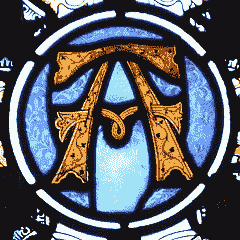
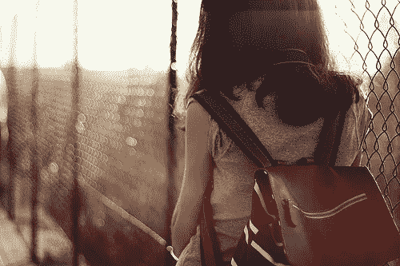
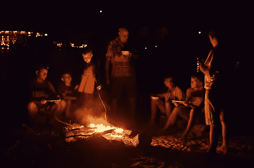
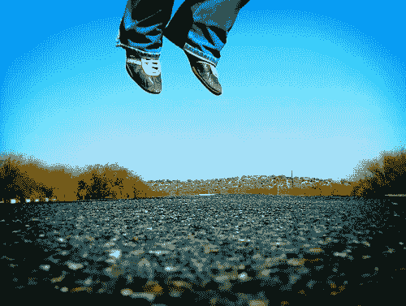
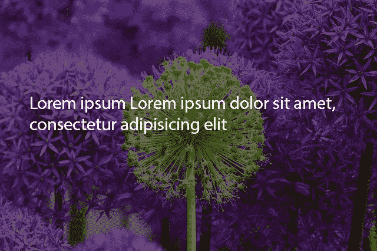
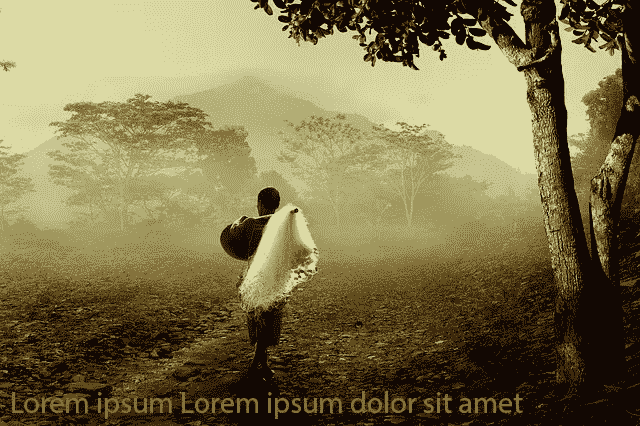
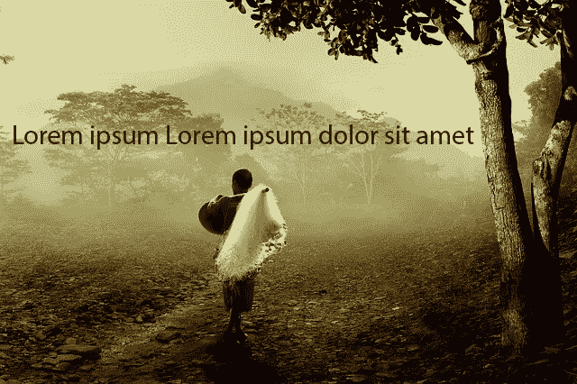
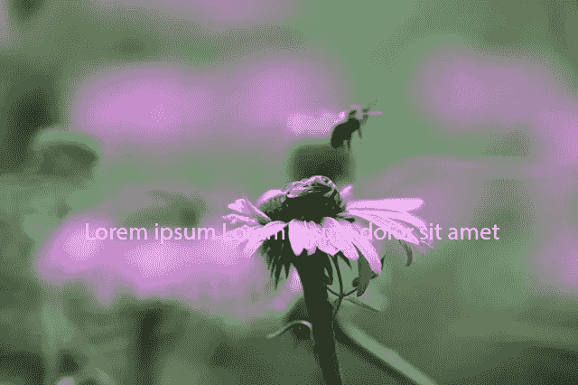
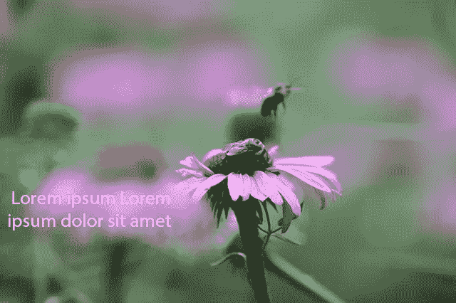

# 结合文本和图像的 3 种方式

> 原文：<https://www.sitepoint.com/3-ways-combine-text-images/>

摄影:利奥·雷诺兹

近年来，全景背景图片在网页设计中变得非常流行。

网络上充满了令人印象深刻的例子，很好地说明了这种技术:引人注目的登录页面，奢华的投资组合网站，甚至越来越多的大公司使用宏伟的全屏背景照片来投射宏伟和敬畏的感觉。

## 一图抵一千……？

尽管研究表明，通过图像传达的信息比书面数据更容易记住(并且在大脑的不同部分)，但开发人员需要注意如何以及何时将这一原则应用到网页设计中。

不要低估这些巨大的视网膜就绪背景对加载时间以及用户体验的影响。由于这些背景图片通常是关于设置视觉基调或情绪，而不是传达所需的信息，它们往往会增加页面的重量，对用户没有太大的好处。

根据最近的 Web Performance Today 报告:

交易过程中 2 秒钟的延迟会导致高达 87%的购物车放弃率

*资料来源:WebPerformanceToday.com

这是对你的底线的潜在巨大打击，相当于装饰性的繁荣。

尽管有些图片在网站上给人留下了非常深刻的视觉冲击，但你通常需要考虑这种做法的替代方案，尤其是对于拥有重要移动受众的网站。

一个好的第一要诀是使用少量精心选择的词语来描述你的产品或服务，并结合有吸引力的和深刻的图像。如果更具体的图像能更充分地传达你的目标，避免选择普通的图像。

关注图片的情感唤起和文字背景，尤其是当它与你的文本想要传达的信息的基调相关时。

### 选择大幅面/全景图像的技巧

当寻找大幅面图像时，要注意选择压缩效果好的照片。这与主题关系不大，更多的是与照片的特征、取景和造型有关。您的映像可能至少需要具备以下特征之一:

*   很多黑暗/阴影
*   大面积镜头模糊
*   有限的颜色变化
*   大面积的平面颜色(如天空、水、油漆等)

下面是一些结合了这些品质的图片的例子。尽管每张照片都唤起了一种独特的情绪和基调，但每张照片的视觉细节都低得惊人，非常适合重度压缩。

**模糊或聚焦模糊的图像**

这张照片有一种奇妙的梦幻感，朦胧感只会增加魅力，同时有助于压缩。

相片信用:gioiadeantoniis

**夜拍**

大面积的黑暗一般压缩得很好。这张照片大部分是阴影，但温暖和色彩引发了我们许多人对营地、烧烤和篝火的回忆。我们的大脑填充了这个图像中的细节。

图片来源:behang

**平色**

这张照片中有细节区域，几乎一半的图像是相当平坦的蓝天区域，非常适合压缩。

图片来源:达姆扎

每一个例子都有另一个好的方面——每一个都包含空白空间，几乎暗示了放置重叠文本的位置。

所以，现在我们已经对选择什么样的图像有了一些想法，我们可以专注于以最有效的方式组合文本和图像的最佳方式。通常，这不仅仅是我们选择什么文本的问题，而是我们将它放在哪里以及如何放置的问题。

## 1.让我们来玩玩颜色和对比

即使使用较暗的图像和较亮的文本，或者用滤镜或叠加使这些图像变暗，对你来说似乎是一个相对明显的解决方案，但这种做法并没有被广泛采用。许多设计师仍然会犯这样的错误:把颜色并置在一起，不能保证足够的对比度。

如果你想确保颜色和亮度对比良好，你必须记住:

*   努力检查你是否能立即看到字体。相反，你的对比是关闭的。
*   对比不限于暗 VS 亮；互补色也提供了自然的对比。你可以使用免费的在线服务，如[颜色选择器](http://www.colorpicker.com/)来找出互补色，只要插入你选择的代码。
*   您可以使用滤镜来控制图像的对比度和亮度。亮度和对比度会影响照片的整体色调，改变亮度会使图像变亮或变暗。如果图像完全对焦，通常最快的解决方法是创建一个较暗的覆盖(CSS)或编辑图像。在 Photoshop 中调整亮度和对比度是你能做的最简单的事情之一。你可以找到大量的[教程](http://99designs.com/designer-blog/2013/12/02/how-to-use-adobes-adjustment-layers-photoshop-cs6/)和[视频](http://www.youtube.com/watch?v=uVqksEZx5hg)，它们解释了如何达到一个好的结果。

也就是说，在这个例子中，你可以看到阅读花上的文字有多困难。文字的白色和花朵的最浅阴影之间的对比使得眼睛无法轻易地分辨出字体。结果显然不好。

现在看看当我们使图像稍微变暗时，清晰度提高了多少。CSS 过滤器允许你在新的浏览器中动态完成这个效果，但是 [Louis Lazaris 在这里展示了一个方法](http://www.impressivewebs.com/image-tint-blend-css/ "Impressivewebs.com: Image Tint With CSS")，它甚至在旧的浏览器上也能很好地工作。

## 2.让我们改变大小和位置

除了颜色之外，您的图像的对比度相对于覆盖的文本也可以得到改善。事实上，文本的大小和位置有助于提高文本本身的可读性。让我们来看看同样的文本在同样的背景上的不同定位是如何瞬间提高其可读性的。

在第一张图片中，位置(当然，除了糟糕的颜色选择)影响了图片的渲染。

颜色——可能与底色过于相似——和文本在底部的位置，这两个选择对用户的眼睛有负面影响。

将文本从图像的底部移动到顶部，会使文本可读性更好，更容易和更容易访问。

## 3.让我们考虑深度以提高可读性

第三个你应该记住的因素是景深。我们已经谈到了选择带有模糊区域的照片图像的文件压缩优势。选择这些图像也将为您的文本提供更平滑、更易读的背景。

这些模糊的图像区域会给你一个普通区域的“平均”颜色，所以只要确保与你的文本颜色有足够的对比度。

在第一个屏幕截图中，您可以看到文本被放置在图像的焦点部分。实际上并没有预期的效果。

当我们把文本放在稍微偏左的位置，在非焦点区域，这是一个多么好的改进啊。这让我们可以在不影响形象的情况下强调信息。

做了一些例子，给你三个最后的提示:

*   用一个单一的、强有力的焦点来挑选图像。
*   不要忘记**清晰度**在图像中的重要性。如果图像是为了唤起情感，而不是“讲述故事”,并且不太关注细节，那么可以在不损失图像效果的情况下应用大量的叠加或滤镜。
*   想想文字相对于图像的焦点出现在哪里:是在图像后面，还是在前景中，还是在构图中有自己独特的位置？

## 结论

正如我们之前说过的，不要错误地认为你可以简单地将文本设置在一个标准位置，并期望它与任何图像看起来都是正确的。如果我们想标准化我们的文字定位，我们也必须标准化我们照片的构成。

考虑到我们想要添加的图片、我们想要用户阅读的文本以及我们想要传达的信息，我们需要研究可能的最佳解决方案。

记住:先学习，后胜利。

## 分享这篇文章