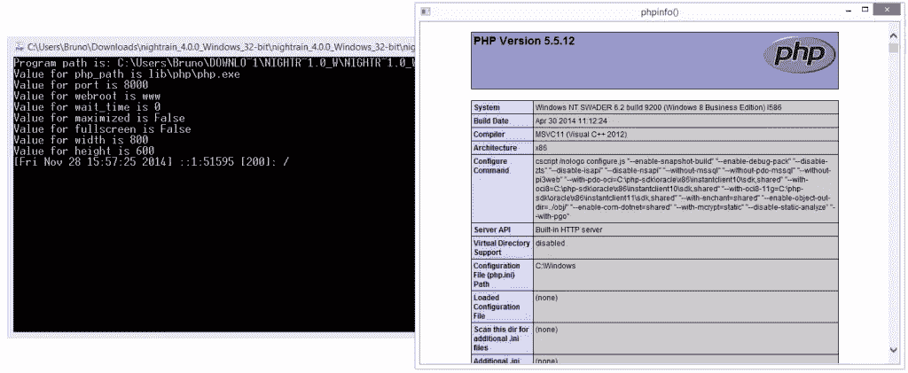
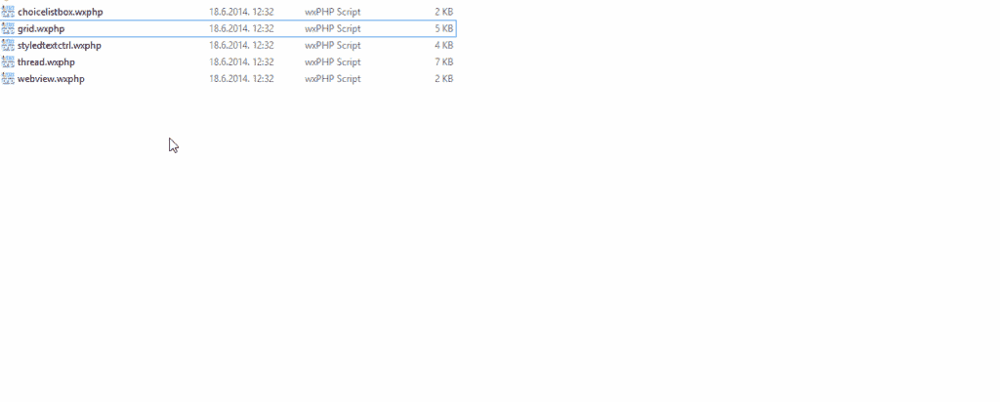
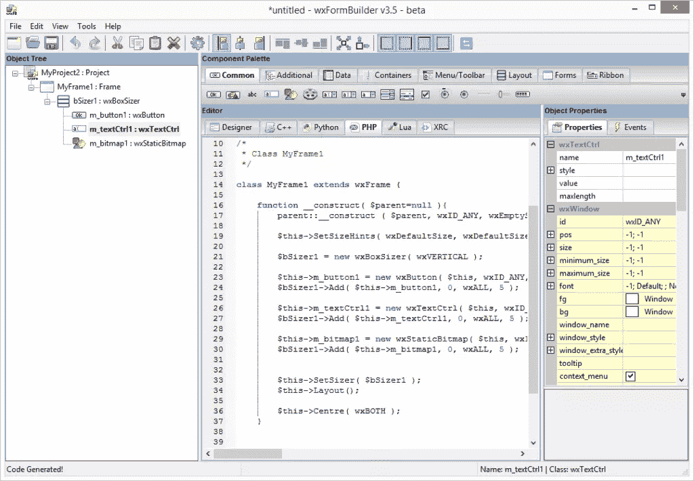

# 用 PHP 开发跨平台桌面应用的 3 种方法

> 原文：<https://www.sitepoint.com/3-ways-develop-cross-platform-desktop-apps-php/>

PHP 作为跨平台桌面 app 开发语言？亵渎！尽管如此，这是可能的。

几年前，那些对将 PHP 引入桌面感兴趣的人所拥有的一切都是现在早已废弃的 GTK PHP。从那时起，新的球员出现了，虽然让我们先回答“为什么”。

## 为什么？


为什么有人会为桌面开发跨平台的 PHP 应用程序？为什么不选择一些实际上可以绑定到操作系统的低级 API 的东西，比如 Adobe AIR？为什么不选择一些过时、臃肿但可靠的东西，比如 Java？为什么不把它做成 Chrome 应用，如果你需要原生支持，就用原生客户端？见鬼，如果你想要一种脚本语言，为什么不选择 Python 呢？一切都可以，只要我们避免将服务器与整个系统捆绑在一起，对吗？

我能不假思索地想到几个牵强的场景:

1.  你需要在简单的语法和良好的结构之间找到一个很好的中间地带，那就是 PHP，而且你也懒得去学习像 ActionScript 这样的新语言
2.  你在一家拥有高度计算机盲的公司中运行它，并且迫使他们为你的公司应用程序使用好的浏览器的唯一方法是将它嵌入到你交付的应用程序中。它仍然是一个网络应用程序，但在一个无头浏览器中打开！
3.  您希望避免为自己的个人应用程序支付托管费用，并且您喜欢将它放在 u 盘上随身携带。您只需插入并运行它，您的应用就在那里了——使用与以前相同的 SQLite DB。如果你需要在线同步，你只需点击一个按钮，就可以将整个数据库导出发送到 Dropbox 或其他类似的服务，这样就可以确保你是唯一一个可以访问你的“网络应用”的人，即使没有你的电脑。
4.  你不需要低级的操作系统 API 访问——你只是想做一个基于浏览器的游戏，或者一个助手应用，或者类似简单的东西。PHP 非常适合这一点，而且你已经知道这门语言了。

这些场景可能看起来像是在抓救命稻草，事实上，我真的想不出一个没有可行替代方案的真实、实际的理由来做这件事。不过，很高兴知道这是可能的。让我们看看怎么做。

## 1.夜雨

Nightrain 是一套预打包的 PHP 托管先决条件，目前由 PHP 5.5.x 提供支持。这是一个用 Python 编写的打包程序，它使用 PHP 的内部服务器来托管你的应用程序，从而避免 Apache 和 Nginx，并最大限度地减少配置诡计。然而，这也意味着一些更高级的方面是不可用的，你只能在非常初级的应用中使用它。

另一个大缺点是，在 Windows 上，首先启动命令提示符，然后是“应用程序”。如果你想使用这个应用程序，命令窗口必须保持打开，这可能会让上面场景 2)中技术不熟练的人有点困惑。



更何况你默认只能运行一个 nightrain app，因为它实际上是在 8000 端口上启动一个服务器，然后让“偷偷”打开的无头浏览器访问`localhost:8000`。如果要启动几个不同的 nightrain apps，需要在`settings.ini`中更改端口。这也意味着，只要在你的主机浏览器中访问`localhost:8000`，你就会看到同样的应用程序。

Nightrain 与大多数现成的 PHP 应用程序/框架兼容，只要你将数据库改为 SQLite(这是所使用的),并为一些缺失的扩展调整捆绑的`php.ini`(如果有的话)。MySQL 没有捆绑在一起，将其与常规堆栈一起安装不是一件简单的事情。让应用程序将 SQLite 数据上行发送到您用于集中式数据库的服务器是非常简单的，因此在运行应用程序的系统上只使用 SQLite 在某种程度上是合理的。

到目前为止，该应用程序最大的缺点是它使用 WX 小部件来驱动无头浏览器，在 Windows 上，这似乎可以归结为 IE7。改变它似乎是可能的，通过 WXPython，正如在上面链接的问题中提到的，但是还没有尝试过。人们只能希望浏览器对象将很快更新为更有用的东西——直到那时，直到所有其他关键缺陷都得到解决，我甚至无法想象 Nightrain 的用途。

## 2.WXPHP

> wxPHP 代表“wxWidgets for PHP ”,是一个 PHP 扩展，它封装了 wxWidgets 库，允许编写多平台桌面应用程序，这些应用程序利用不同平台上可用的本地图形组件。–*维基百科*

你将 [wxPHP](http://wxphp.org) 作为一个独立的程序安装，然后通过简单地双击它们来支持`.wxphp`文件的执行。

[](https://www.sitepoint.com/wp-content/uploads/2014/11/141719622901.gif)

这意味着您的应用程序仅仅是文件，您可以轻松地将它们分发到任何地方。您可以像往常一样将代码组织到文件和类中，并分发文件夹。主`.wxphp`文件可以包含这些其他资源。

该安装附带了几个示例，包括一个初始化 WebView 并在 wx 框架中加载 wxPHP 网站的示例。需要注意的一点是，使用 wxPHP，你不会像在网络上那样开发网站。换句话说，你不开发线下网站，而是把各种 wx 小部件串起来。因此，这个库有一点学习曲线，你可能会缺少你可能习惯的 HTML5 特性，或者 web 开发的简单性。有一些内部 PHP 服务器运行和服务请求的概念证明，但那是实验性的和复杂的，并且再次暴露了`localhost`，就像 Nightrain 一样。

wxPHP 还附带了一个可爱的表单构建工具，它可以帮助你通过所见即所得编辑器自动生成你的 wxPHP 应用程序所需的 PHP 代码。




在你认为 wx 微不足道之前，人们已经在它上面开发了不仅仅是基本的应用程序。例如，这里有一个带远程调试的 [PHP 编辑器和一个插件 API](https://github.com/AndrewRose/Grease) 。

如果你对 PHP 桌面开发很认真，与 Nightrain 相比，wxPHP 是更好的选择，尽管 Nightrain 允许你为 GUI 编写很好的 HTML。

这里 wx 最大的一个优势就是一旦安装，所有的`.wxphp`文件都可以点击鼠标运行。没有额外的安装，没有尴尬的控制台窗口。对于技术文盲来说，这是一个天赐良机——你可以通过一封简单的电子邮件在公司内部轻松分发该应用程序，更新过程就像覆盖一个文件一样简单。

## 3.TideSDK

与上面两个相比，TideSDK 有一个稍微不同的方法。你安装一个 SDK 就能开发应用，每个平台都有一定的先决条件。TideSDK 实际上是更名后的 Titanium 桌面项目。Titanium 仍然专注于移动，放弃了桌面版本，桌面版本被一些开源的人接管，并将其命名为 TideSDK。

一旦按照[入门指南](http://tidesdk.multipart.net/docs/user-dev/generated/#!/guide/getting_started)进行了安装，一旦我们有了 TideSDK 开发人员应用程序(一个帮助应用程序，它将指导我们将应用程序捆绑到一个可分发的包中)，我们就可以开始开发了。您使用 Tide(通过助手应用程序或命令行)构建的应用程序既可以作为纯可执行程序分发，也可以作为可安装包分发，获得完整的“应用程序”待遇，包括嵌入的安装过程，使它们可以通过 Windows 上的添加/删除程序或其他操作系统上的软件包管理器卸载。

> 应用程序资源与 WebKit 客户端和熟悉且广泛的 API 结合使用。API 是有特权的，它提供文件系统访问，允许您读取和管理文件。还提供了 API 来创建本地数据库并与之交互。网络 API 允许创建客户端和服务器，或者在更低的层次上与 HTTP 接口。还可以打开到其他服务的套接字连接。

通常，TideSDK 使用 HTML、CSS 和 JS 来呈现应用程序，但它也支持 Python、Ruby 和 PHP 等脚本语言。渲染背后的引擎是 WebKit，这意味着它启动起来会有点慢，但它将支持最新的 web 技术。

> TideSDK 的核心是编译到 WebKit 组件中的对象桥。该桥允许其他脚本语言——python、php 或 ruby——使用 DOM 中的脚本标签在 HTML 页面上运行，就像 JavaScript 一样。也可以直接打电话。py，。rb 或者。应用程序中的 php 文件。

PHP 是通过向清单文件添加一个模块语句来激活的，如下所示:

```
#appname:HelloWorld  #appid:com.tidesdk.helloworld  #publisher:Software in the Public Interest (SPI) Inc  #image:default_app_logo.png  #url:http//tidesdk.org  #guid:845e9c3c-c9ff-4ad4-afdf-9638092f044f  #desc:Sample Hello World application  #type:desktop runtime:1.3.1-beta
app:1.3.1-beta
codec:1.3.1-beta
database:1.3.1-beta
filesystem:1.3.1-beta
media:1.3.1-beta
monkey:1.3.1-beta
network:1.3.1-beta
platform:1.3.1-beta
process:1.3.1-beta
ui:1.3.1-beta
worker:1.3.1-beta
php:1.3.1-beta
```

请注意，使用脚本语言的脚本模块会导致应用程序的安装和运行时性能显著下降。

有趣的是，TideSDK 提供了一个对象桥，当你在应用程序中使用 PHP 时，可以无缝地将数据从 JS 转换到 PHP，或者从 PHP 转换回来。你可以在这里阅读更多[，不过详细的 TideSDK 教程马上就要来了。](http://tidesdk.multipart.net/docs/user-dev/generated/#!/guide/using_php)

使用 TideSDK 开发 PHP 桌面应用程序有几个主要缺点:

1.  PHP 开发工作流程严重缺乏文档记录，极易出现错误，但几乎不可能调试。
2.  捆绑的 PHP 版本非常过时——在撰写本文时是 5.3.X 版。虽然通过 SDK 安装目录中的`/modules`文件夹将其替换为最新版本相对容易，但这是一个额外的麻烦，并且缺少许多现代 PHP 功能，这些功能在桌面应用程序开发中可能会派上用场，更不用说内置服务器了，它在这里也可能会有一个深奥的用例。
3.  有一个学习曲线。DOM API 与您在 web 开发中可能习惯的不同。为了在屏幕上显示某些内容，你需要调用`$document->write()`而不是`echo`。这是一个很小的区别，但是没有很好的记录，可能会让你出错。
4.  到目前为止，最大的缺点是编译。你通过构建一个应用程序得到的包是绑定到你构建它的平台上的。要为多种环境构建应用程序，您需要具备这些多种环境。Windows/Linux 的差异很容易用虚拟机解决(虽然如果你的主机是 Windows，而你有 Linux 虚拟机，这比其他方式更容易解决)，但祝你好运，为 OS X 编译它，除非你也有一个 OS X 设备。

TideSDK 是一个不错的选择，但是它远不可用。对于 HTML/CSS/JS 交付来说，它会做得很好，但是对于 PHP，我相信 wxPHP 仍然是您的最佳选择。

## 其他选项

也有其他的选择，但至少可以说它们是乏味的。

*   PHPDesktop 类似于 Nightrain，但仅限 Windows。另一方面，它与 Mongoose 服务器捆绑在一起，因此可以执行并行请求。它还运行 Chrome，这意味着它的渲染/打开速度很慢，但支持最新的网络技术。不过，它的 Windows 独占性使它没有资格进入这个多平台解决方案列表。

*   web binder 和 [PHP GTK](http://gtk.php.net/) 都严重过时，可能不应该使用。除此之外，Webinder 只适用于 Windows。

## 结论

虽然为桌面构建 PHP 应用程序的原因因用例而异，并且通常不容易证明，但我相信，如果您需要的话，知道选项就在那里是很好的。

你用 PHP 开发过桌面应用吗？如果是这样，请让我知道为什么以及你使用了哪种技术——我绝对希望你写下你的经历。知道其他选择吗？请在评论中告诉我！

## 分享这篇文章