# 基于大幅照片的 30 个超棒的网站设计

> 原文：<https://www.sitepoint.com/30-awesome-website-designs-based-large-photographs/>

网页设计趋势的变化比你的咖啡冷却的时间还要快。开玩笑的。

在某个地方，有人总是努力创造新的设计趋势。使用大尺寸摄影是 mclellanjacobs.com 2013 年出现的趋势之一。大幅照片不仅提供了良好的对比，而且其信息清晰而有吸引力。

## 为什么是大幅照片？

它为眼睛提供了愉快的视觉体验，而[引人注目的摄影](https://www.sitepoint.com/dramatize-portrait-photography/)具有难以匹敌的影响力。我们不应该忘记一个科学事实，即我们的大脑处理图像的速度比阅读文本快 6 万倍。

有影响力的图片对于制作一个生动且令人难忘的网站来说非常重要。当你有效地使用大幅照片时，照片会把网站变成一个简单但美丽的网页设计。你应该记住的一件事是，使用大照片会使你的网站视觉拥挤，所以要确保其他元素补充图像。

## 处理大型照片网站时要避免的 3 个常见错误

1.  不同尺寸的较量:分辨率是一个与各种设计都相关的术语，但在使用更大的照片时，理解它变得完全必要。你必须用不同的分辨率进行测试，并考虑不同浏览器的宽度。
2.  **加载时间:**使用高分辨率、高质量的大型照片会增加文件大小。这将大大增加你的加载时间。使用 Firebug 或类似的插件来获得关于如何优化你的网站的提示。
3.  **错误的格式:**由于格式选择不当，您可能会面临加载问题。选择 web 标准格式，如 JPEG、PNG 和 GIF，以避免较长的加载时间。

## 网站

请注意，单击下面的每个图像将在新的选项卡或窗口中打开目标网站。

[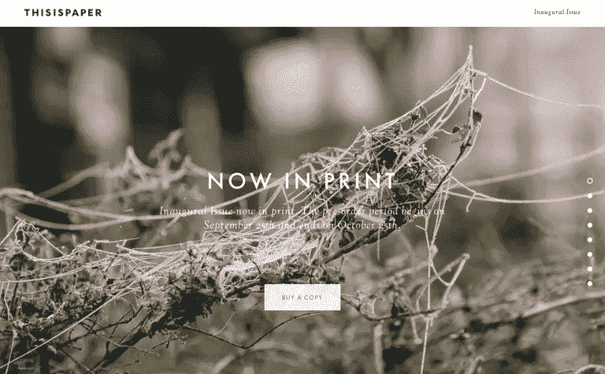](http://read.thisispaper.com) 幻灯片为网站提供了更多的灵活性。

[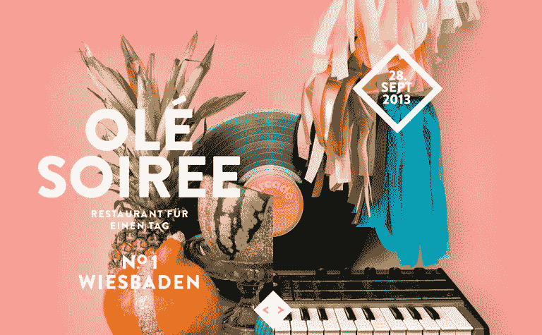](http://olesoiree.de) 
乍一看，你只会看到一个照片背景，但当你使用提供的滑块时，你实际上是在产生两个照片背景的组合。网站上充斥着 CSS 和 jQuery。

[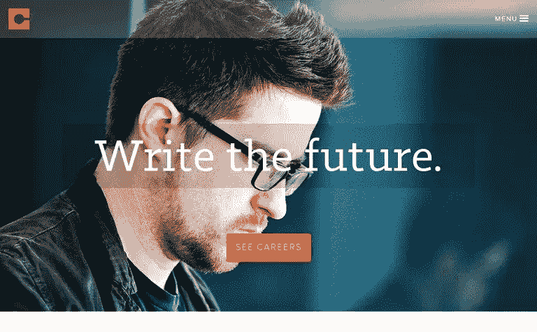](http://code42.com) 
Code24 不仅使用固定时间间隔后滑动的多张照片，还为菜单提供了空间。他们将标语写在半透明的矩形上，完美地运用了颜色，使文字完全可见。

Falve 是一个多页面的网站，除了一个图片滑块和一个简洁的菜单之外，它的登陆页面上什么也没有。这可能是为了给照片提供更多的空间。

[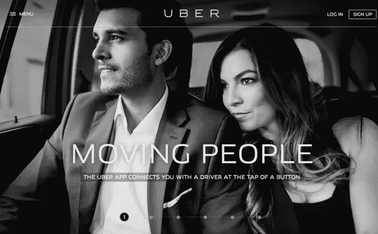](http://uber.com) 
优步巧妙地运用了大幅照片，每个元素都与设计相得益彰。在这里，你还可以看到多张时尚的照片，同时也代表了他们的产品。

[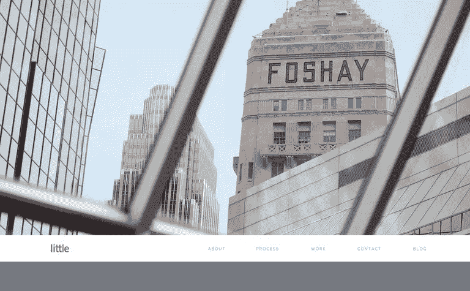](http://littleco.com)
Little 是一家位于明尼阿波利斯的品牌设计公司，它使用了一张顶部带有品牌名称的建筑照片。这种类型的大型照片将机构和客户的关系带到了一个新的水平，并反映了机构的积极态度。

Mah Ze Dahr 面包店是另一个单页网站，和他们的标语一样有创意。在主页上，你会在每张幻灯片上看到一些漂亮的线条。每滚动一次，背景照片就会改变。你会注意到这里没有主页链接——徽标扮演了主页链接的角色。

[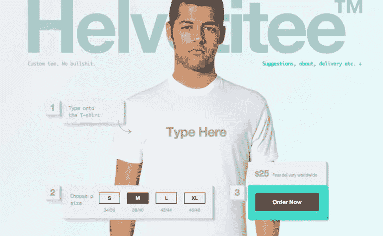](http://helvetitee.com) 
创造力处于最佳状态。到目前为止，你已经看到了具有大背景的网站，这里是定制球座设计 web 应用程序，它为你提供了设计球座、选择尺寸和直接从登录页面下订单的自由。

为了避免可见性问题，大卡特尔在空白区域使用了他们的导航，不像其他网站把导航放在照片上。有一点是肯定的，所有大型照片网站都在照片上使用了一些文字。确保字体非凡但不花哨。

[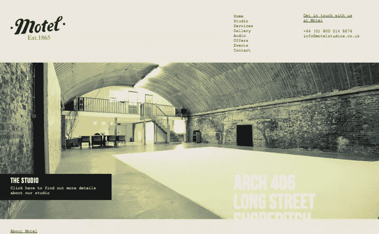](http://motelstudios.co.uk) 
收录这个的目的是向你展示，当你使用古怪的时尚字体时，一个伟大的网站会变得多么糟糕。尽管该网站恰当地利用了这张照片，但字体似乎不均匀，或者至少不是我们在正规网站上看到的那样。

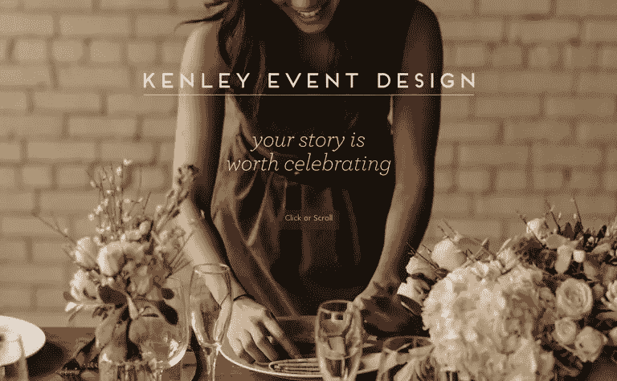
这里 Kenley 的事件设计已经使用了照片的焦点。因为他们是一家专注于服务的策划公司。当你点击 scroll 的时候，CSS 发挥了它的魔力，使网站更有吸引力。

[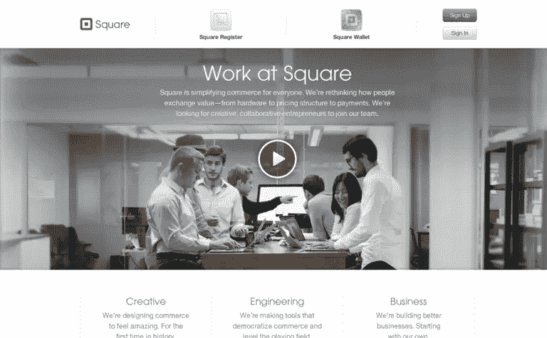](http://squareup.com/careers) 
广场网站是创意设计:值得列入这份名单。每滚动一次，你都会从照片中得到一些新的东西，给网站带来好心情。

[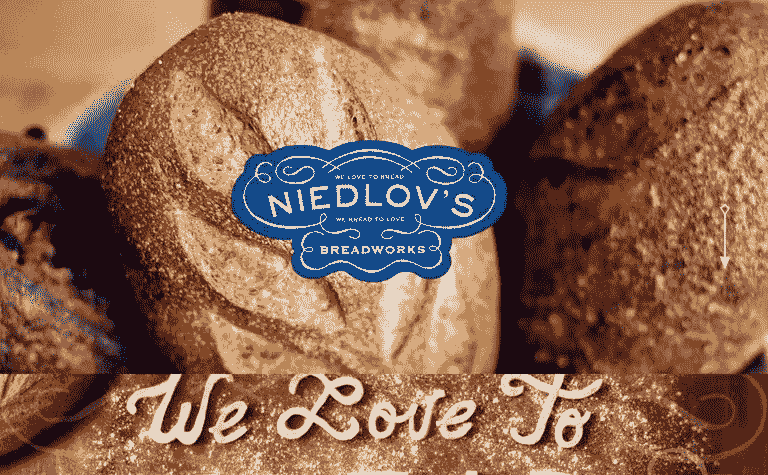](http://niedlovs.com) 
尼德洛夫的 Breadworks 是一个没有导航菜单的单一网站。导航菜单被箭头取代。在箭头的帮助下，你可以上下滚动。

[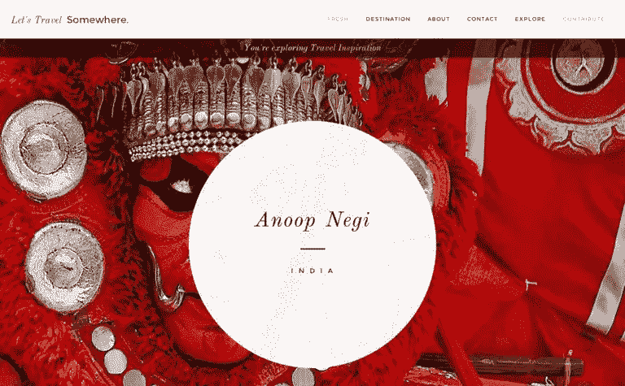](http://letstravelsomewhere.com)
Let ' s Travel something 是一个响应式的旅游灵感博客，以其高质量的大型摄影背景吸引访客。每张照片都非常适合你的浏览器窗口。所以记得让你的网站也有反应。

[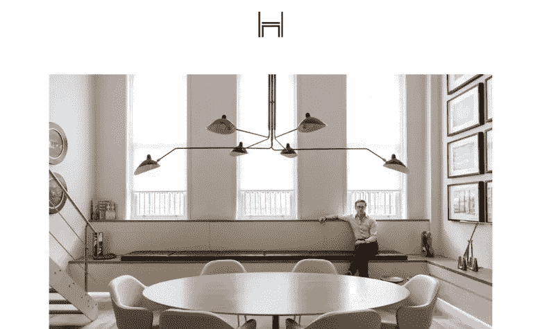](http://danielhopwood.com) 
丹尼尔霍普伍德是一个单页网站，在照片底部有一个导航栏。虽然这不寻常，但它非常适合这个网站。

[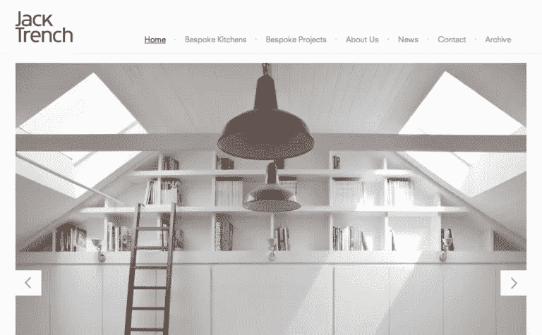](http://jacktrench.co.uk) 
杰克·特伦奇的网站设置很有趣。设计师完美地专注于向观众展示什么。所以大照片的另一个好处是，你可以专注于展示什么和什么值得展示。

[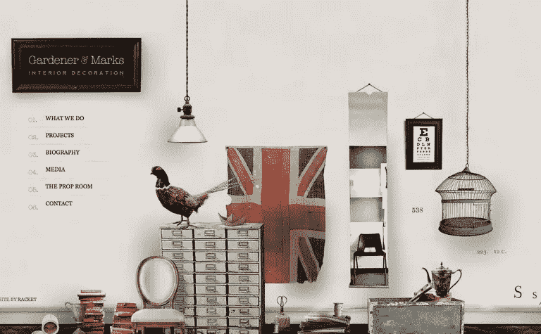](http://gardenerandmarks.com.au) 
作为他们提供室内装饰的背景暗示了这一点。乍一看，这个标志就像墙上的一块木板。菜单摆放得很好。

[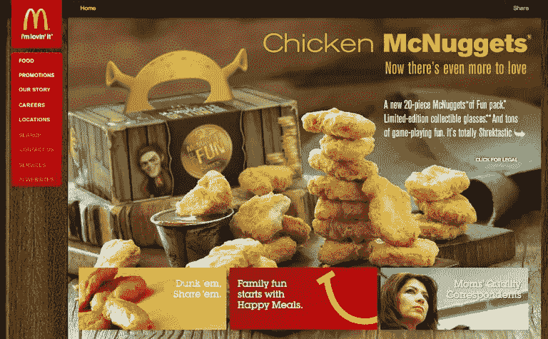](http://mcdonalds.com) 
大幅照片的用途之一是大声宣传新产品或服务。在这种情况下，麦当劳完美地推广了它的新食品。因此，这是一种设计师可以创造性地使用的技术。

[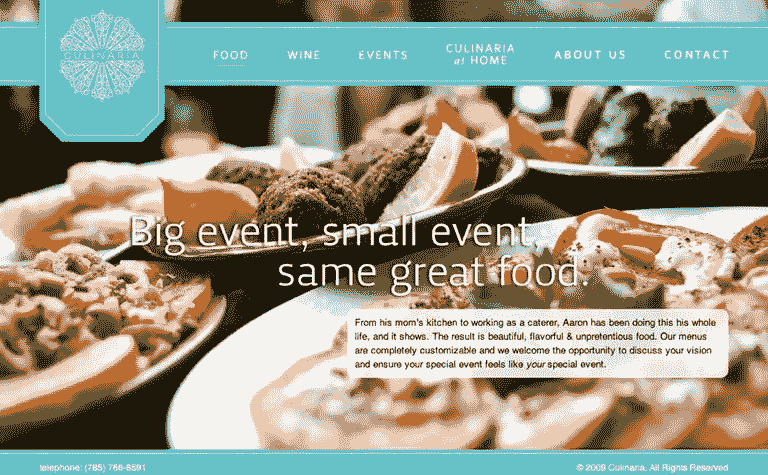](http://culinariafoodandwine.com) 
摄影最常见于美食、旅行、个人作品集等。保留一张令人垂涎的照片真的为食品行业加分。这样的整体设计会对想设计美食网站的设计师有所启发。

Acquavella 画廊不仅展示了一幅吸引人的美丽照片，其简洁的外观和字体风格也与之相得益彰。这是一个很好的灵感设计师谁正在寻找设计组合和画廊网站。

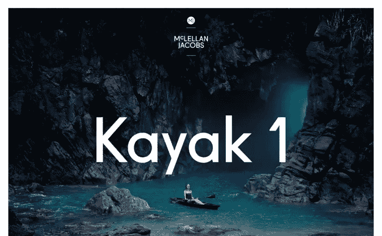
麦克勒朗·雅各布斯销售皮划艇(一种小型单人艇)，为了吸引顾客，他们利用大幅照片展示他们的产品，并配以最可爱的自然背景，让你感受到产品的魅力。

MailChimp 是一家电子邮件营销服务公司，它创造性地使用了大背景，因此值得留下来阅读他们的年度报告。该网站详细讲述了他们去年的活动。故事从一张有文字的大照片开始，当你读完报告后，最后一张照片会说谢谢。因此，在这里我们了解到，如果我们有效地和创造性地使用大型照片背景，那么我们可以把它带到另一个水平。

Bonjour 的 multipage 网站树立了用照片创作作品的最佳典范。枕头按照从大到小的顺序摆放，尺寸标签在上面。它还具有一个规模(在右侧)，使网站更值得信赖。

[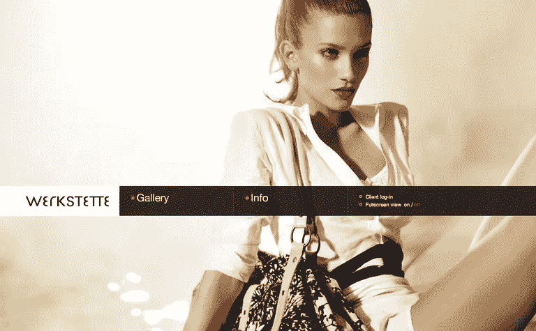](http://werkstette.dk) 
我爱上了 Werkstette。他们将每种效果与导航栏完美地结合在一起。再来说说半透明的导航条，完美的定位在中央。导航栏右侧有一个以全屏模式查看网站的选项(以前没遇到过这个)。不仅如此，当你点击画廊时，导航条会向下移动，几分之一秒后，它会自动隐藏。

[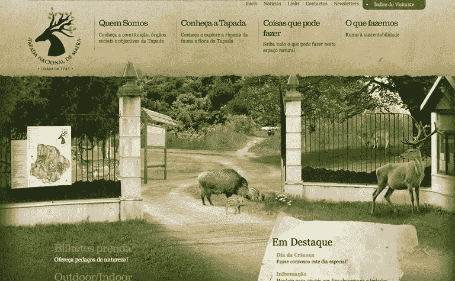](http://tapadademafra.pt) 
塔帕达·德·马弗拉展示了一张葡萄牙公园入口的照片，这张照片真的很吸引人。没有什么比在登录页面上显示公园入口或公园的主要位置更能吸引游客了。

[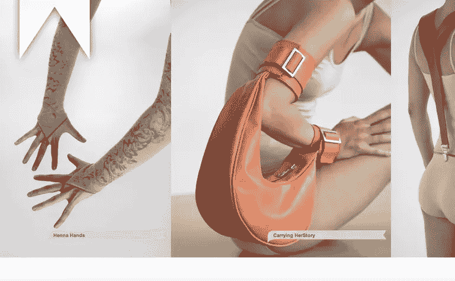](http://marlousderoode.nl) 
没有必要在登录页面上只显示一张大照片。在这种风格下，你不仅可以展示不同的产品，还可以从不同的角度展示产品。Marlous de Roode 通过从不同角度展示时尚配饰来证明这一点，从不同侧面为您提供完整的产品视觉范围。

[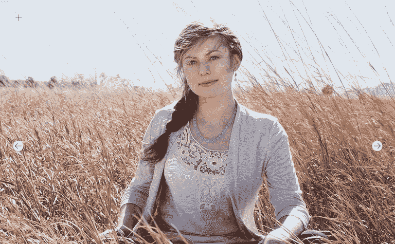](http://luladesigns.com) 对于那些寻找展示系列的人来说，Lula design 是一个完美的例子。

使用大幅照片是一回事，但当你在照片中融入更多的想法时，它对用户来说会变得更有用、更具信息性。当您将鼠标放在任何图像上时，您将获得一些附加信息。

[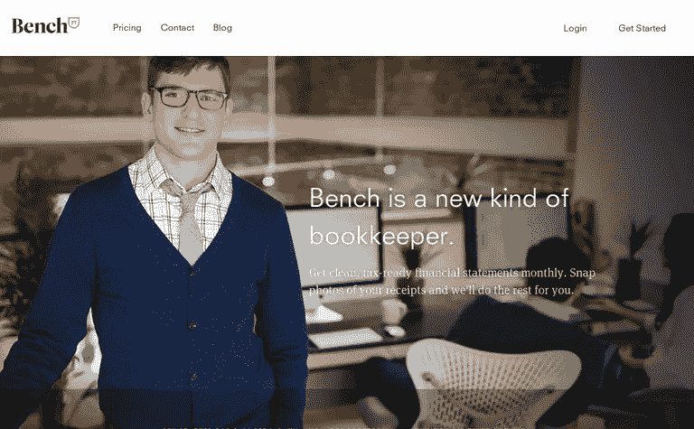](http://bench.co) 
在这里，Bench.co 用他们的办公工作站跟在一个专业人员后面。当你登陆他们的网站时，你会看到一个透明的菜单，完美地使用了字体。当你向下滚动时，菜单会变得不透明并粘在页面上。在这里，设计师有效地利用了导航。

[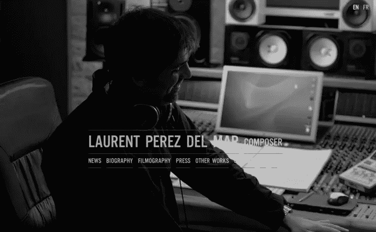](http://laurentperezdelmar.com) 
这是一个带有透明导航菜单的单页网站。为了给网站带来个人和专业的感觉，Laurent 使用了他办公室的照片作为背景。他完美地将导航菜单放在了页面的中央，就像导航栏一样，通常在大照片中要么在顶部，要么在中间。

## SEO 呢？

关于内容是否为王的争论从未停止过，每个人都有自己的观点。我们不能从这些争论中得出任何结论。但是我们不能排除文字内容对网站来说比照片更重要。文字内容是你网站的氧气。

达拉斯 Weber Shandwick 的高级数字经理 Colin Alsheimer 建议你的网站至少使用 300 个搜索友好词。我也建议你永远不要在你的网站上使用 Flash 做幻灯片，因为这是过时的技术，搜索引擎蜘蛛很难抓取和索引。去找 jQuery 和 CSS 吧，它们比 Flash 有很多优势。

## 结论

这种流行趋势背后的原因是设计师可以发挥照片的深度、焦点和对比度。它不仅为网站营造了良好的氛围，还提供了与网站定位的相关性。随着设计师对动画和视频的不断尝试，这种趋势越来越广泛。我建议你只使用高质量的照片，否则你的网站很快就会瘫痪。

我希望你在这篇文章中发现了一些新的东西。让我知道你对使用大幅照片作为网站背景的看法。

## 分享这篇文章