# 30 个创意丰富的网页设计

> 原文：<https://www.sitepoint.com/30-creative-colorful-web-designs/>

我喜欢颜色！事实上，一个网站吸引我逗留一段时间的方式之一就是富有创造性的多彩设计。一些网站充满了各种对比色，另一些网站有令人惊叹的充满鲜艳色彩的照片，还有一些网站只有一些帮助吸引眼球的颜色。

下面的网站使用各种各样的颜色设计技术来创造这种惊人的效果，但都有一个共同的主题:以某种方式巧妙地使用颜色，真正使设计独特的吸引力。所以，看看吧，一定要让我知道哪些是你最喜欢的，为什么！

* * *

### 拥抱怪物

[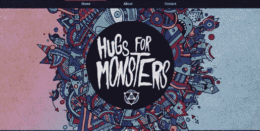](http://hugsformonsters.com/)

有点偏暗的颜色，这一张完美地融合了黑暗怪物主题和一些非常丰富多彩的插图。

* * *

### 费尔贝利营

[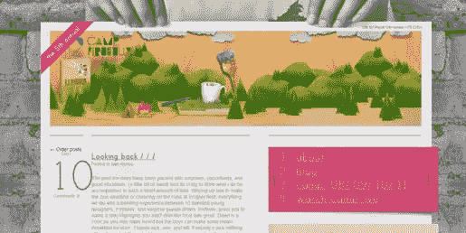](http://campfirebelly.com/)

明亮的插图在暗淡的灰色背景中非常突出。

* * *

### 恐怖女孩

[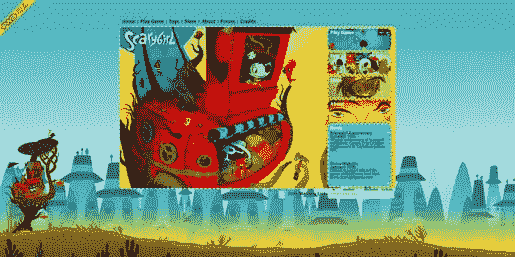](http://www.scarygirl.com/)

这一个几乎是太多颜色的边界，但是设计师不知何故走那条完美的线并且混合颜色非常好。

* * *

### 阿迪达斯互动

[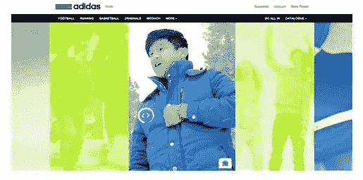](http://live.acneproduction.com/adidas_neo_fw12/)

在当前没有被观看的视频上使用彩色覆盖是多么聪明啊，而不仅仅是一种无聊的灰色！

* * *

### 百威啤酒

[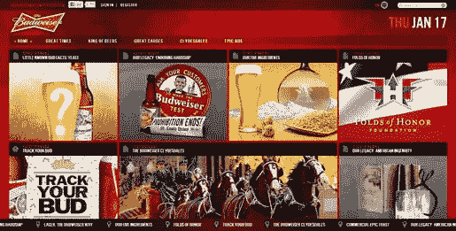](http://www.budweiser.com/en/us/)

鲜红色与棕色、灰色和黄色形成鲜明对比——我不知道是想唱圣诞颂歌还是用百威啤酒吃披萨！

* * *

### 纸杯蛋糕小姐

[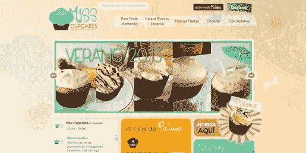](http://www.misscupcakes.pe/)

这个网站上各种各样的淡色和别致的纸杯蛋糕很配，主图片周围的霓虹灯字体和笔画非常突出。

* * *

### Jubble 泡沫茶

[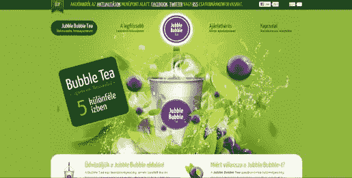](http://www.jubblebubbletea.hu/)

一个创造性的，丰富多彩的插画一个创造性的茶，简单的背景与繁忙的插画形成了一个很好的对比。

* * *

### 可口可乐北极熊

[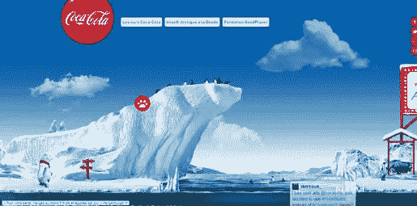](http://coca-cola.fr/ours/)

哇！令人惊叹的、生动的蓝天和海水与可口可乐的红色和白色北极熊形成了鲜明的对比。

* * *

### 方位摄影

[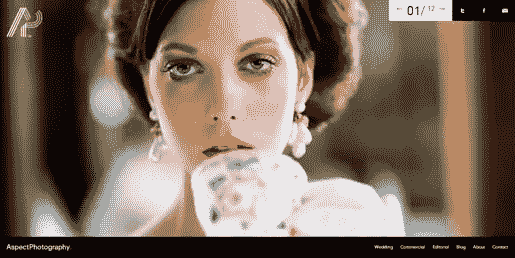](http://www.aspectphotography.net/)

浏览这个网站，你会看到所有的特色照片都有令人惊叹的色彩。

* * *

### 红猴子

这幅不同寻常的插图中的色彩有助于激发想象力。

* * *

### 在下面

[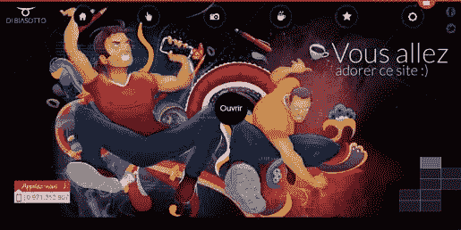](http://www.dibiasotto.com/)

类似 grafitti 的插图从黑色背景中弹出，使颜色看起来几乎像霓虹灯。

* * *

### Yield 设计公司野餐包

[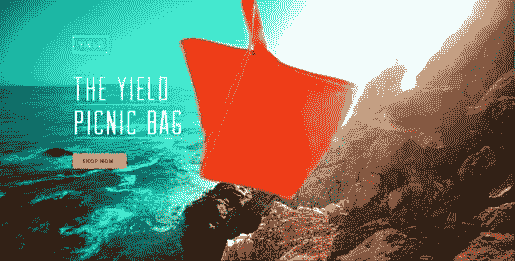](http://www.yielddesign.co/)

青绿色、黄色、橙色、棕色——所有的颜色都很好地融合在一起。

* * *

### 《罗摩衍那》

[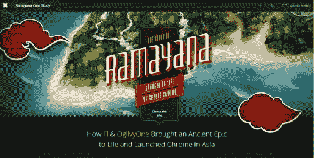](http://www.f-i.com/google/ramayana/)

岛上的绿色植物在令人惊叹的展示中脱颖而出，红色的图形是一个不错的点缀。

* * *

### 安德烈·戈罗霍夫

[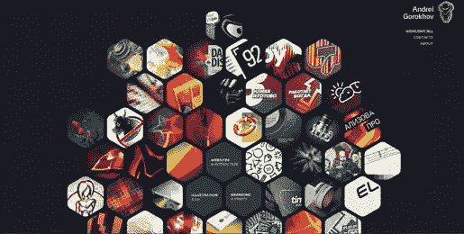](http://gorohov.name/#)

不同颜色的蜂窝形状的图像在黑暗的背景下非常显眼。

* * *

### 请给我奶酪游戏

鲜艳的蓝色、粉色和黄色帮助 3D 图形跃然纸上。

* * *

### 毛骨悚然的可爱

[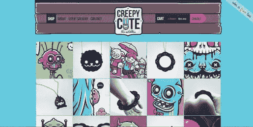](http://www.creepycute.com/)

这个设计巧妙地反映了这个网站的名字，用少女色彩的蜡笔画出令人毛骨悚然的图像。

* * *

### 丹尼尔·西特克

[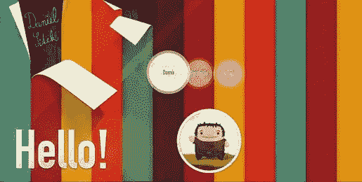](http://danielsitek.cz/)

鲜艳的颜色太抢眼了！我喜欢一些条纹从背景上脱落的样子。

* * *

### 格诺什

[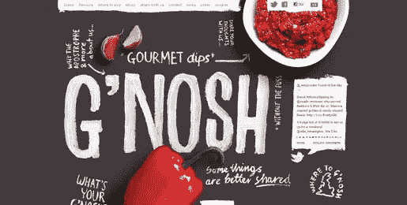](http://www.gnosh.co.uk/)

这是一个很好的例子，说明一点颜色就能很好地吸引眼球。摆放整齐、色彩鲜艳的食物让你想继续向下滚动页面。

* * *

### 黑色太阳相信

[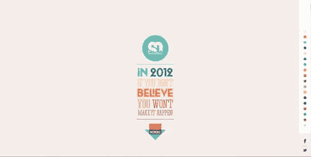](http://www.soleilnoir.net/believein/#/start)

[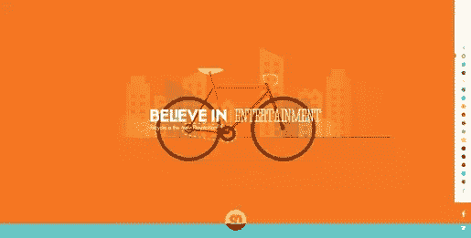](http://www.soleilnoir.net/believein/#/start)

这是我遇到的最丰富多彩和最有趣的网站之一，这个网站用不同的颜色来表示每一句“相信…”的引用。

* * *

### 邦戈漫画

[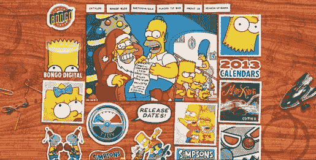](http://www.bongocomics.com/)

明亮的明信片和贴纸样的漫画在棕色的木制背景下非常显眼——这是避免大量图像造成混乱的好方法。

* * *

### 加油小曼加油！

[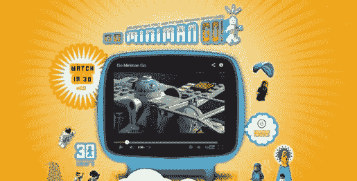](http://www.gominimango.com/)

明亮的阳光将我们的注意力集中在屏幕上，标题的排版非常完美，红色和白色字母周围有蓝色的轮廓。

* * *

### 打

[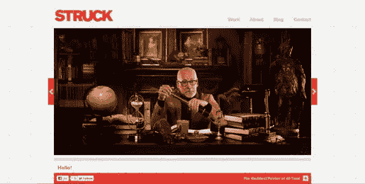](http://struck.com/)

另一个没有太多颜色的网站，但是红色的高光把你的注意力吸引到屏幕的重要部分——你是否也注意到每张照片中都有一丝红色？

* * *

### Marie Catrib’s

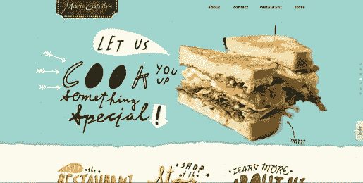

我以前在网站综述中使用过这个网站——它是我一直以来最喜欢的网站之一，有着浅蓝色的背景和生动的彩色照片。折叠下方的彩色字体标题也很吸引人。

* * *

### Pieoneers

[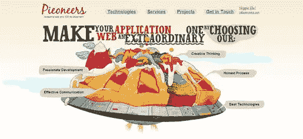](http://www.pieoneers.com/)

我的另一个最爱，这个网站不仅把馅饼变成了一个漂浮的技术，而且颜色也很鲜艳！

* * *

### 兄弟竞争酒

[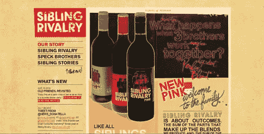](http://www.siblingrivalrywine.ca/)

这是一个有趣的设计，巧妙地包含了两种冲突的颜色——红色和粉色——不知何故让它们看起来很配。

* * *

### 彪马生物网

[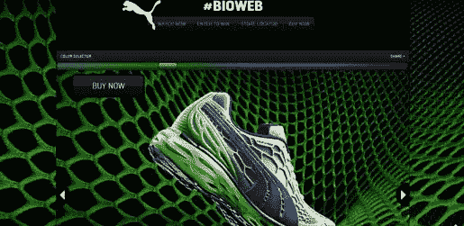](http://bioweb.puma.com/)

注意到颜色滑块了吗？我有太多的乐趣沿着不同的颜色滑动，看着鞋子和网站改变颜色。

* * *

### 阿列克谢·布加

[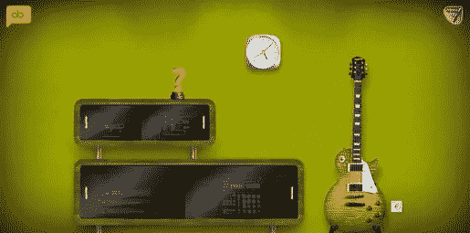](http://www.alexbuga.com/v9/#welcome)

通常我讨厌这种绿色，但这位设计师用渐变和不同深浅的棕色来淡化它，使它看起来，嗯，相当吸引人。

* * *

### 巴哈尔. com Ahoy Jano

[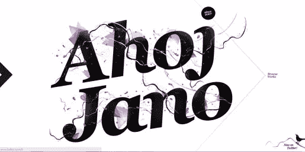](http://www.balhar.com/)

这个网站使用一种颜色的图形，用最小的外观来说话。

* * *

### Haafe 和 Haph

[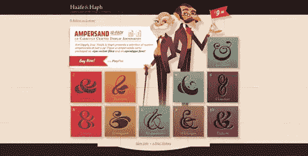](http://www.haafe.com/)

人物服装上的色调不知何故与所有不同的和号背景完美地融合在一起。微妙的背景也将这一切联系在一起——同时非常复杂和有趣！

* * *

### 佛罗里达繁荣

[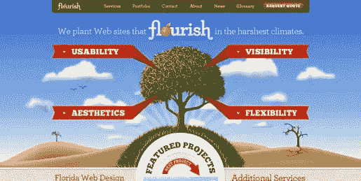](http://www.floridaflourish.com/)

图形的明亮颜色(以及红色丝带)构成了一个非常美学的设计(我不得不忽略一个事实，他们大写了“网站”这个词，并将其分成两个独立的单词)。

* * *

你最喜欢哪个，为什么？你认为色彩是决定设计成败的有力工具，还是更像是画龙点睛之笔？

## 分享这篇文章